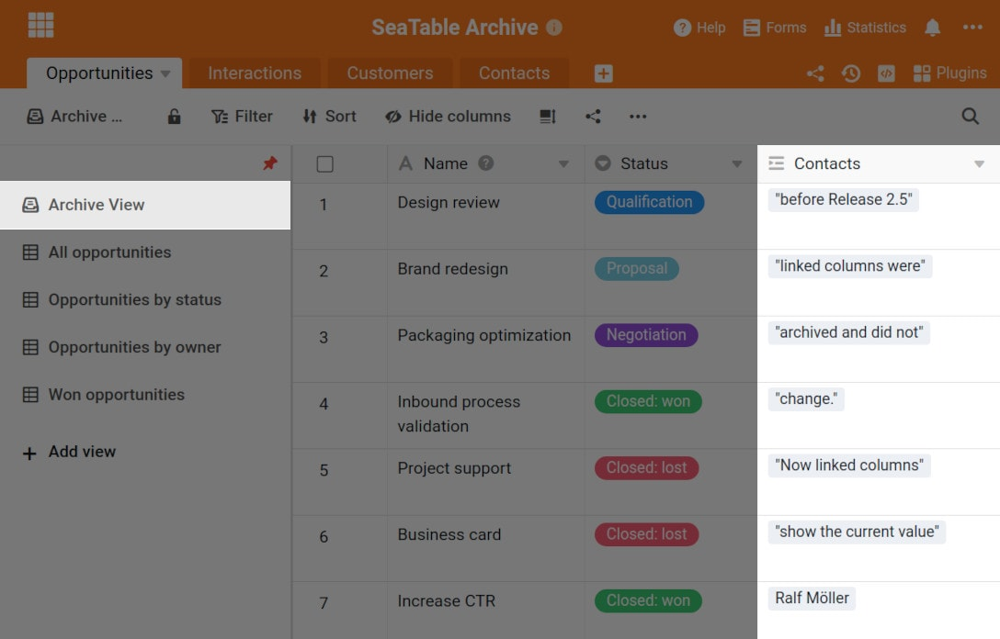
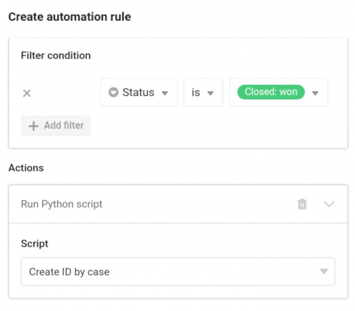
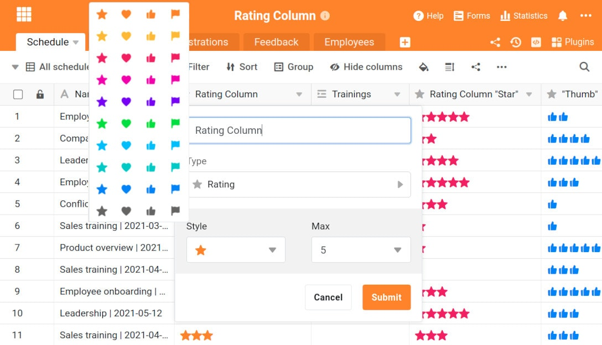

La version 2.5 de SeaTable est arrivée ! La nouvelle image Docker a déjà été mise à disposition sur Docker Hub à la fin de la semaine dernière et ce matin, SeaTable Cloud a été mis à jour avec la dernière version. Cette nouvelle version améliore encore de nombreuses fonctions de SeaTable ! La fonction d'archivage, dont les fonctionnalités s'élargissent, est recommandée pour un nombre croissant de cas d'utilisation, les fonctions de traitement des données disponibles sont plus flexibles et les automatisations intégrées ainsi que la colonne de notation offrent de nouvelles options. Il convient également de mentionner que les colonnes de type lien et formule de lien sont désormais entièrement prises en charge dans les vues externes. Lisez la suite pour en savoir plus sur ces nouveautés. Comme toujours, vous trouverez la liste complète des modifications dans le [changelog de SeaTable]().

## Fonction d'archivage révisée

Depuis l'introduction de l'archive en tant que fonction bêta dans la [version 2.3](), nos développeurs ont travaillé sans relâche pour que la fonction d'archive soit prête à être utilisée en production. Nous n'avons pas encore atteint cet objectif avec la version 2.5, mais la nouvelle version représente un pas de géant dans cette direction.

La fonction d'archivage prend désormais en charge les 24 colonnes, y compris les trois types de colonnes : formule, lien et formule pour lien. L'absence d'accès en écriture aux données d'archives reste une limitation dans SeaTable 2.5, mais ces trois colonnes sont des cas particuliers : Les valeurs dans les deux colonnes Formule sont calculées dynamiquement, en fonction de la spécification de la formule. Si une formule est modifiée, les valeurs dans les lignes archivées sont recalculées. Si l'utilisateur modifie la colonne de référence dans une formule pour les liens, les données archivées reflètent cette modification. Il en va de même pour la colonne des liens. Un changement de la colonne d'affichage s'effectue de la même manière dans l'ensemble des données, archives comprises. De cette manière, les données archivées restent comparables aux données non archivées.

SeaTable 2.5 ajoute également une fonction d'impression pour les vues d'archives et permet désormais de masquer des colonnes individuelles dans une telle vue. Une fonction de recherche et une fonction d'exportation Excel ont déjà été implémentées dans [SeaTable 2.4]().

## Opérations de traitement des données optimisées

Les opérations de traitement des données de SeaTable sont souvent nécessaires pour la migration des applications Excel vers SeaTable. Dans SeaTable 2.5, deux opérations ont été améliorées.

L'opération Comparer et relier crée automatiquement des liens entre des lignes similaires dans deux tableaux. Elle permet de convertir des tableaux Excel en une base de données relationnelle en un clin d'œil. La nouveauté de SeaTable 2.5 est la prise en charge de tous les principaux types de colonnes (y compris les colonnes à sélection simple) pour la définition de la règle de comparaison. En outre, l'opération offre désormais une plus grande flexibilité dans le cas où les tableaux sont déjà liés deux fois. Dans ce cas, l'utilisateur est invité à sélectionner les colonnes dans lesquelles les liens doivent être ajoutés via un menu déroulant.

L'opération Calculer les valeurs cumulées calcule des totaux interlignes pour les colonnes de données numériques - une fonction standard dans Excel. L'opération est disponible depuis l'introduction de la fonction de traitement des données dans [SeaTable 2.1](), mais elle a été adaptée en fonction des commentaires des utilisateurs. Concrètement, la gestion de la toute première colonne a été critiquée. Maintenant que l'opération a été retravaillée, elle additionne uniquement les données de la colonne source et écrit les résultats dans la colonne des résultats.

## Nouveaux automatismes et déclencheurs

> **SeaTable prend désormais en charge quatre plates-formes d'automatisation des processus**:  
> L'automatisation a été l'un des thèmes principaux de ces dernières semaines et de ces derniers mois. Nous sommes fiers d'annoncer que SeaTable est désormais disponible sur quatre plateformes d'intégration : [Zapier](https://zapier.com/apps/seatable/integrations), sur laquelle SeaTable est déjà présent depuis début 2021, mais aussi [Integromat](https://www.integromat.com/en/integrations/seatable), [n8n](https://n8n.io/integrations/seatable/) et [Locoia](https://www.locoia.com/connector/seatable-integration), qui permettent désormais de construire des workflows sophistiqués.

Malgré toute l'attention portée aux [intégrations]() externes, nous n'avons pas perdu de vue les propres automatisations de SeaTable. La nouveauté centrale est l'action Exécuter un script Python. Elle peut être déclenchée par les déclencheurs "Nouvelle ligne", "Les entrées remplissent une certaine condition après la modification" et "Exécuter périodiquement". L'exécution automatisée de scripts Python pour une seule ligne ou pour tout un ensemble de données en utilisant un jeu de règles clair est presque un super pouvoir !

L'action existante "Verrouiller la ligne" reçoit le nouvel événement déclencheur "Exécuter périodiquement pour les lignes qui remplissent une certaine condition". En combinaison avec les deux autres déclencheurs "Nouvelle ligne" et "Les entrées remplissent certaines conditions après la modification", l'utilisateur dispose désormais d'un contrôle optimal sur le blocage automatique des lignes.

Enfin, les deux événements planifiés "Exécuter périodiquement" et "Exécuter périodiquement pour les lignes qui remplissent une certaine condition" ont reçu une option d'exécution manuelle. Il est ainsi possible de tester confortablement les automatisations avec ces déclencheurs.

## Plus d'options pour la colonne de notation

Nous aimons tous avoir un grand choix ! La nouvelle colonne de classement répond exactement à cette envie de "plus". Dans SeaTable, la colonne de notation propose désormais quatre styles. En plus de l'étoile comme icône par défaut, on peut désormais choisir le cœur, le pouce levé ou le drapeau comme icône. Il n'est plus nécessaire non plus que l'icône soit orange.

La nouvelle colonne de cotation n'est pas seulement une question d'esthétique, mais aussi de commodité. Comme pour les autres colonnes numériques, SeaTable calcule désormais des valeurs agrégées - minimum, maximum, moyenne et somme - pour les colonnes de cotation situées en bas du tableau. Dans les vues groupées, SeaTable calcule également des valeurs agrégées pour chaque groupe.

Enfin, la colonne de notation a été optimisée pour une utilisation sur des appareils mobiles. Elles peuvent être créées sans problème sur un téléphone portable avec la dernière version. Dans le passé, SeaTable refusait d'effectuer cette opération. En outre, les icônes de la colonne de notation ont été légèrement agrandies, ce qui rend leur utilisation plus confortable sur les petits écrans.

Un autre développement pour la colonne de notation n'a malheureusement pas pu être intégré dans la version 2.5. Voici donc une annonce : À partir de la version 2.6 de SeaTable, les colonnes de notation pourront également avoir une valeur par défaut.

## Nouvelles améliorations

La nouvelle fonction countitems compte les éléments dans les types de colonnes qui peuvent contenir plusieurs valeurs. Il s'agit notamment des types de colonnes Fichier, Image, Employé et Sélection multiple. Elle est l'équivalent de la fonction "countlinks" pour les éléments non liés.

La fonction d'exportation et d'importation d'Excel a été retravaillée à plusieurs endroits. L'exportation de colonnes de formules fonctionne désormais sans problème avec SeaTable 2.5, même si des colonnes utilisées dans la formule sont cachées. Une autre nouveauté est que les nouvelles données peuvent être importées indifféremment à partir de fichiers CSV ou XLSX et que de nouveaux tableaux peuvent être créés à partir de fichiers XLSX. Les utilisateurs qui transfèrent des données de SeaTable vers Excel seront heureux d'apprendre que la routine d'exportation gère désormais correctement les champs à sélection multiple.

Une option de réglage a été ajoutée aux paramètres du plug-in Galerie. Le bouton "Afficher les noms des colonnes" permet d'afficher ou de masquer les en-têtes au-dessus des valeurs des colonnes. Même si cela n'est pas nécessaire dans de nombreux cas, cela évite la confusion dans les cas où des colonnes du même type se trouvent directement l'une sous l'autre.
