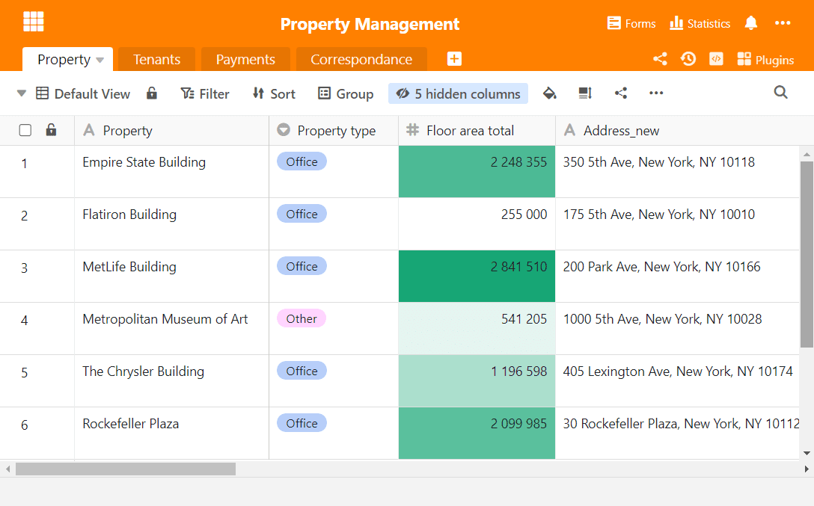
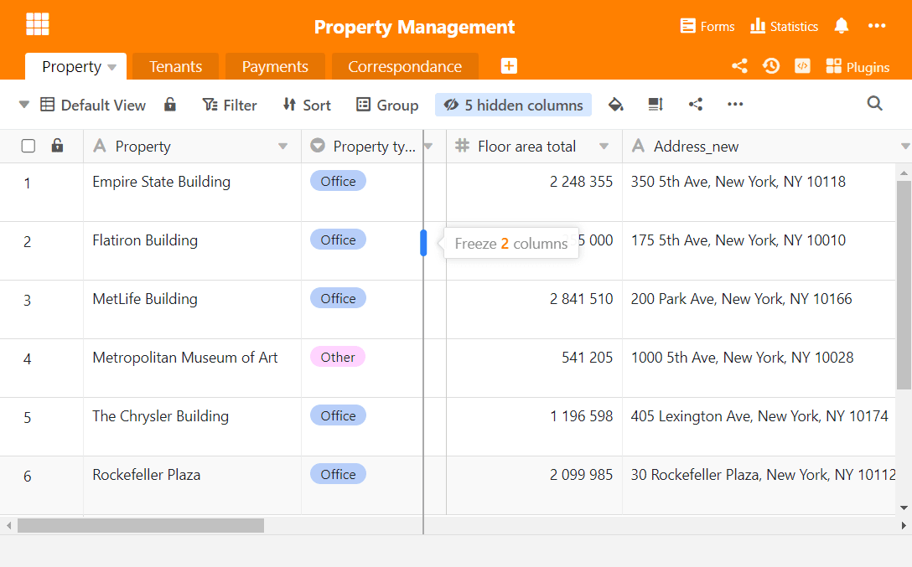
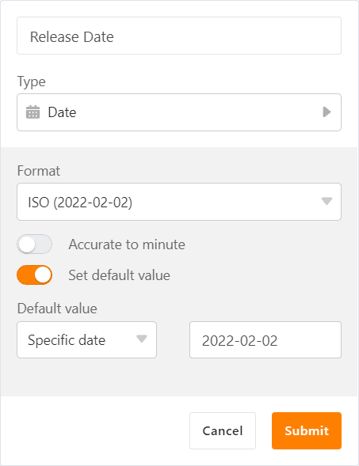

This morning, [SeaTable Cloud](https://cloud.seatable.io) was updated to version 2.7. This means that all Cloud users can now also enjoy the new functions and improvements of the new version, which has already been available for download for self-hosters on Docker Hub for a few days. The table editor benefited most from the version change: the conditional cell formatting, the new data processing operation "Calculate Ranking", the extended column fixing and the default value function for date columns offer a lot of new functionality. Outside the table editor, the password-protected bases are an important improvement. All changes can be found - as always - in the [SeaTable changelog](https://seatable.io/en/docs/changelog/version-2-7/).

## Conditional formatting for columns

Anyone who works regularly with [Excel]() knows the conditional formatting function. With version 2.7, this function is now also available in SeaTable. With conditional formatting, you format or colour cells depending on their value (or the absence of such a value) and can thus carry out visual data structuring and data analysis.

For all columns, SeaTable offers rule-based conditional formatting. A rule is the description of a hypothetical content of a cell (e.g. value > 50 or date after 31.12.2021) and a formatting instruction. If the rule is fulfilled, the cell is formatted according to the instruction. Cleverly chosen rules can, among other things, make statistical outliers or unusual values easily recognisable. Of course, you can also define several rules per column to map demanding requirements.

If a column has numerical cell values, SeaTable offers formatting by values in addition to rule-based formatting. This conditional formatting colours the cells with a colour gradient. Large values are coloured with the upper end of the gradient, small values with the lower end. This makes the magnitude of a cell value clear at a glance.

## Sequence of values

If you not only want to display the order of magnitude of the cell values in a column, but also need the ranking of the values, then the new data processing operation Calculate ranking is exactly what you need! It calculates the ranking and writes the result in a separate column. The largest value gets the ranking 1. If two or more cell values have the same amount, then all cells get the same ranking and one or more subsequent ranking positions are skipped. The operation works for columns with numeric contents, but also for the column types date, duration and rating.

## Freezing columns

In tables with many columns, there is often the problem that the first columns disappear from the display when scrolling to the right. Until now, the first column could be fixed and thus permanently displayed even in large tables. This function shows a more flexible side in the new release: Starting with version 2.7, additional columns can be fixed on the left. This way, even when navigating in large tables, you know which entry you are in.

To fix several columns, simply use the mouse: Move the mouse pointer to the vertical line separating the row numbering from the first column. Now drag the mouse to the right to set the number of fixed columns. If you want to remove the column fixation, move the mouse pointer to the frame between the last fixed column and its following column and drag the line all the way back to the left.

## Default values for the date column

Repeatedly requested, now fulfilled: After the text, number and single-selection columns, SeaTable 2.7 also gives the date column a standard value function. With it, you automatically add a static or dynamic date value to new entries.

The SeaTable 2.7 release date, February 2, 2022, is an example of a static date value. Dynamic date values establish a relative reference and change over time. In addition to the current date ("Today"), x days before or after the current date is also a dynamic date value. From now on, both can be mapped in the date column with the standard value function. In combination with the date functions of the formula column, virtually any date values can thus be automatically generated for new entries, which in turn can be used for automations.

## Password-protected bases

For bases with confidential data, many customers want advanced access protection. SeaTable 2.7 now offers such a protection with the optional password protection for bases. Only after entering the password the base is accessed and the data is displayed. The password protection can be set up and removed by owners for their own bases as well as by group administrators for bases of the group.

Password-protected bases can be shared with other users. Of course, they must also enter the password when calling up the base. The same applies when copying a password-protected base. The additional access protection does not come at the price of reduced flexibility.

## ... and much more

Like most new versions, SeaTable 2.7 contains more features worth mentioning than can fit in these release notes. Therefore, here is an overview of further improvements:

When linking entries, the link assistant in SeaTable 2.7 offers a better search function. When entering several search terms separated by spaces, SeaTable searches in all columns of the linked table. Specifically: If you are looking for a certain entry on a certain date, simply enter the date and, separated by spaces, another property of the entry you are looking for. The assistant then only displays the corresponding entries and you are spared a lot of manual search work. Until now, SeaTable searched for the entry as a whole in a column.

Web forms can now be embellished with a cover image or color scheme. Together with a faded-in logo, you can build handsome and customized forms. (This feature is reserved for Enterprise subscribers).

Team administrators can now enforce 2-factor authentication for their team members and also deactivate it individually. The team administrator can thus react individually to increased security requirements and more easily defuse situations in which users have lost their second factor.

Until now, links from deleted and then restored rows remained lost. With version 2.7, links are also created again when a row is restored.

The archive function introduced with [version 2.3]() has taken further steps towards productive use: entries can now be deleted from the archive and entries can also be edited. (Links, however, cannot yet be created or changed).
