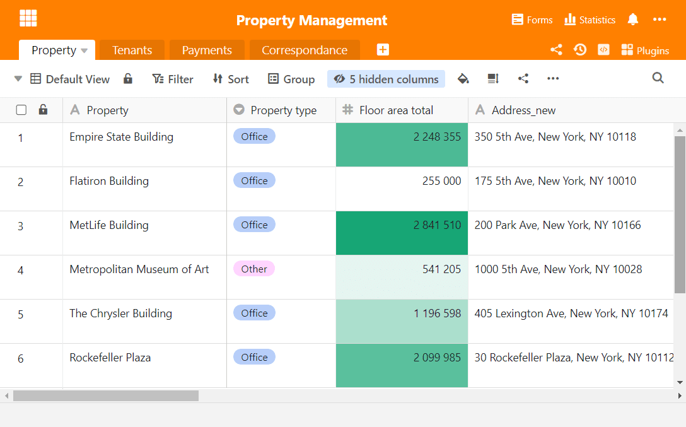
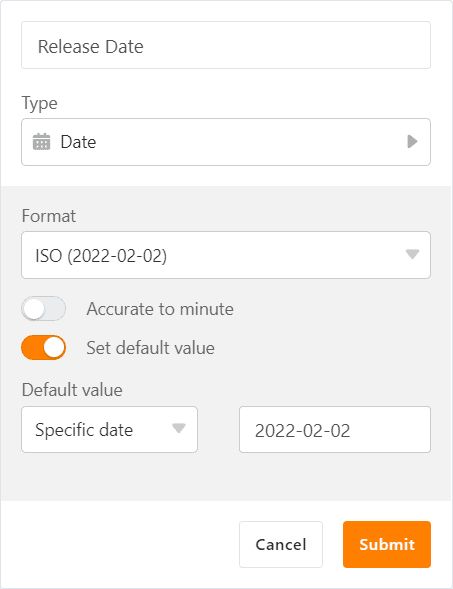

Ce matin, [SeaTable Cloud](https://cloud.seatable.io) a été mis à jour à la version 2.7. Ainsi, tous les utilisateurs de Cloud peuvent désormais profiter des nouvelles fonctions et améliorations de la nouvelle version, qui est déjà disponible depuis quelques jours en téléchargement pour les auto-hébergeurs sur Docker Hub. C'est l'éditeur de tableaux qui a le plus profité de ce changement de version : le formatage conditionnel des cellules, la nouvelle opération de traitement des données "Calculer le classement", la fixation avancée des colonnes et la fonction de valeur par défaut pour les colonnes de dates offrent une foule de nouvelles fonctionnalités. En dehors de l'éditeur de tableaux, les bases protégées par mot de passe constituent une amélioration importante. Toutes les modifications sont - comme toujours - disponibles dans le [changelog de SeaTable](https://seatable.io/fr/docs/changelog/version-2-7/).

## Mise en forme conditionnelle des colonnes

Ceux qui travaillent régulièrement avec [Excel]() connaissent la fonction de mise en forme conditionnelle. Celle-ci fait désormais son entrée dans SeaTable avec la version 2.7. La mise en forme conditionnelle permet de formater ou de colorier des cellules en fonction de leur valeur (ou de l'absence de valeur), ce qui permet de structurer visuellement les données et de les analyser.

Pour toutes les colonnes, SeaTable propose une mise en forme conditionnelle basée sur des règles. Une règle est la description d'un contenu hypothétique d'une cellule (par exemple, valeur > 50 ou date postérieure au 31/12/2021) ainsi qu'une instruction de formatage. Si la règle est respectée, la cellule est formatée conformément à l'instruction. Des règles judicieusement choisies permettent entre autres de repérer facilement les valeurs statistiques aberrantes ou inhabituelles. Il est bien sûr possible de définir plusieurs règles par colonne afin de répondre à des exigences plus pointues.

Si une colonne a des valeurs de cellules numériques, SeaTable propose un formatage par valeurs en plus du formatage basé sur des règles. Cette mise en forme conditionnelle colore les cellules avec un dégradé de couleurs. Les grandes valeurs sont colorées avec l'extrémité supérieure du dégradé, les petites valeurs avec l'extrémité inférieure. Cela permet de voir d'un coup d'œil l'ordre de grandeur d'une valeur de cellule.

## Ordre des valeurs

Si vous ne souhaitez pas seulement afficher l'ordre de grandeur des valeurs des cellules d'une colonne, mais que vous avez également besoin du classement des valeurs, la nouvelle opération de traitement des données Calculer le classement est faite pour vous ! Elle calcule le classement et écrit le résultat dans une colonne séparée. La valeur la plus élevée obtient le rang 1. Si deux ou plusieurs valeurs de cellule ont le même montant, toutes les cellules obtiennent le même rang et une ou plusieurs positions de rang suivantes sont ignorées. L'opération fonctionne pour les colonnes à contenu numérique, mais aussi pour les types de colonnes Date, Durée et Rating.

## Fixation des colonnes

Dans les tableaux comportant de nombreuses colonnes, le problème se pose souvent que les premières colonnes disparaissent de l'affichage lorsque l'on fait défiler vers la droite. Jusqu'à présent, il était possible de fixer la première colonne et de l'afficher en permanence, même dans les grands tableaux. Dans la nouvelle version, cette fonction est plus flexible : à partir de la version 2.7, il est possible de fixer d'autres colonnes à gauche. Ainsi, même en naviguant dans de grands tableaux, on sait dans quelle entrée on se trouve.

Pour fixer plusieurs colonnes, il suffit d'utiliser la souris : placez le curseur de la souris sur la ligne verticale qui sépare la numérotation des lignes de la première colonne. Faites ensuite glisser la souris vers la droite pour définir le nombre de colonnes fixées. Si vous souhaitez annuler la fixation des colonnes, déplacez le curseur de la souris sur le cadre entre la dernière colonne fixée et la suivante et tirez la ligne vers la gauche.

## Valeurs par défaut pour la colonne des dates

Demandée à plusieurs reprises, désormais satisfaite : Après les colonnes de texte, de chiffres et de sélection simple, SeaTable 2.7 ajoute une fonction de valeur par défaut à la colonne de date. Elle permet d'ajouter automatiquement une valeur de date statique ou dynamique aux nouvelles entrées.

La date de sortie de SeaTable 2.7, le 2 février 2022, est un exemple de valeur de date statique. Les valeurs de date dynamiques établissent une référence relative et changent au fil du temps. Outre la date actuelle ("aujourd'hui"), x jours avant ou après la date actuelle sont également des valeurs de date dynamiques. Les deux peuvent dès à présent être représentées dans la colonne des dates à l'aide de la fonction de valeur standard. En combinaison avec les fonctions de date de la colonne des formules, il est ainsi possible de générer automatiquement des valeurs de date quasi quelconques pour de nouvelles entrées, qui peuvent à leur tour être utilisées pour des automatisations.

## Bases protégées par mot de passe

Pour les bases contenant des données confidentielles, de nombreux clients souhaitent une protection d'accès étendue. SeaTable 2.7 propose dès à présent une telle protection grâce à l'option de protection des bases par mot de passe. Seule la saisie du mot de passe permet d'accéder à la base et d'afficher les données. La protection par mot de passe peut être mise en place par les propriétaires pour leurs propres bases et par les administrateurs de groupe pour les bases du groupe, et peut également être supprimée.

Les bases protégées par un mot de passe peuvent être partagées avec d'autres utilisateurs. Bien entendu, ces derniers doivent également saisir le mot de passe lors de l'appel de la base. Il en va de même pour la copie d'une base protégée par un mot de passe. La protection d'accès supplémentaire ne se paie donc pas par une réduction de la flexibilité.

## ... et bien plus encore

Comme la plupart des nouvelles versions, la Release 2.7 contient plus de fonctions qui méritent d'être mentionnées que les Release Notes ne peuvent en contenir dans une longueur acceptable. Voici donc un aperçu des autres nouveautés :

Lors de la liaison d'entrées, l'assistant de liaison de SeaTable 2.7 offre une meilleure fonction de recherche. Lorsque vous saisissez plusieurs termes de recherche séparés par des espaces, SeaTable effectue une recherche dans toutes les colonnes du tableau lié. Concrètement, si vous recherchez une entrée spécifique à une date précise, il vous suffit de saisir la date et, en la séparant par un espace, une autre propriété de l'entrée recherchée. L'assistant n'affichera alors que les entrées correspondantes et vous épargnera beaucoup de travail de recherche manuelle. Jusqu'à présent, SeaTable recherchait l'entrée dans son ensemble dans une colonne.

Les formulaires web peuvent désormais être embellis par une image de couverture ou un schéma de couleurs. En ajoutant un logo, il est possible de créer des formulaires attrayants et personnalisés. (Cette fonction est réservée aux abonnés d'Enterprise).

Les administrateurs d'équipe peuvent dès à présent forcer l'authentification à deux facteurs pour les membres de leur équipe et également la désactiver individuellement. L'administrateur d'équipe peut ainsi réagir individuellement à des exigences de sécurité accrues et désamorcer plus facilement les situations dans lesquelles les utilisateurs ont perdu leur deuxième facteur.

Jusqu'à présent, les raccourcis des lignes supprimées puis restaurées étaient perdus. Avec la version 2.7, les liens sont également recréés lors de la restauration d'une ligne.

La fonction d'archivage introduite dans la [version 2.3]() a fait de nouveaux pas en direction d'une utilisation productive : il est désormais possible de supprimer des entrées de l'archive et également de modifier des entrées. (Les liens ne peuvent cependant pas encore être créés ou modifiés).
