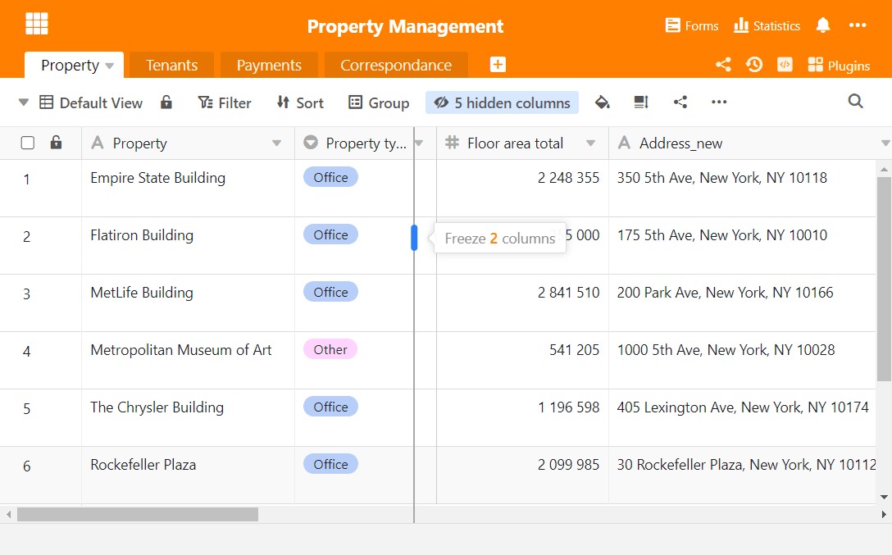
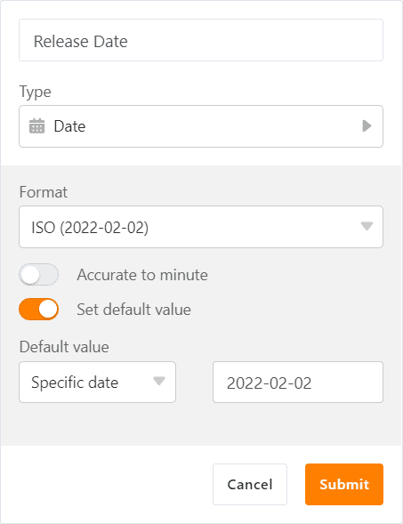

Сегодня утром [SeaTable Cloud](https://cloud.seatable.io) был обновлен до версии 2.7. Это означает, что все пользователи Cloud теперь также могут воспользоваться новыми функциями и улучшениями новой версии, которая уже несколько дней доступна для загрузки для самостоятельных хостеров на Docker Hub. Больше всего от изменения версии выиграл табличный редактор: условное форматирование ячеек, новая операция обработки данных "Вычислить ранжирование", расширенная фиксация столбцов и функция значения по умолчанию для столбцов даты предлагают много новых функциональных возможностей. За пределами редактора таблиц важным улучшением являются базы, защищенные паролем. Все изменения можно найти - как всегда - в [журнале изменений SeaTable]().

## Условное форматирование для столбцов

Каждый, кто регулярно работает с [Excel](), знает функцию условного форматирования. С версии 2.7 эта функция теперь доступна и в SeaTable. С помощью условного форматирования вы форматируете или окрашиваете ячейки в зависимости от их значения (или отсутствия такого значения) и таким образом можете осуществлять визуальное структурирование данных и их анализ.

Для всех столбцов SeaTable предлагает условное форматирование на основе правил. Правило - это описание гипотетического содержимого ячейки (например, значение > 50 или дата после 31.12.2021) и инструкция по форматированию. Если правило выполнено, ячейка форматируется в соответствии с инструкцией. Умело подобранные правила могут, помимо прочего, сделать легко узнаваемыми статистические выбросы или необычные значения. Конечно, вы также можете определить несколько правил для каждой колонки, чтобы отобразить сложные требования.

Если столбец имеет числовые значения ячеек, SeaTable предлагает форматирование по значениям в дополнение к форматированию на основе правил. Это условное форматирование окрашивает ячейки цветовым градиентом. Большие значения окрашиваются в верхний конец градиента, маленькие - в нижний. Это позволяет с первого взгляда понять величину значения ячейки.

## Последовательность значений

Если вам нужно не только отобразить порядок величины значений ячеек в столбце, но и проранжировать значения, то новая операция обработки данных Calculate ranking - это именно то, что вам нужно! Он рассчитывает рейтинг и записывает результат в отдельную колонку. Наибольшее значение получает ранг 1. Если два или более значений ячеек имеют одинаковую сумму, то все ячейки получают одинаковый ранг, а одна или несколько последующих позиций ранжирования пропускаются. Операция работает для столбцов с числовым содержимым, а также для столбцов типа дата, длительность и рейтинг.

## Крепление колонн

В таблицах с большим количеством столбцов часто возникает проблема, когда первые столбцы исчезают с экрана при прокрутке вправо. До сих пор первый столбец можно было зафиксировать и таким образом постоянно отображать даже в больших таблицах. В новом релизе эта функция показывает себя с более гибкой стороны: начиная с версии 2.7, дополнительные колонки могут быть закреплены слева. Таким образом, даже при навигации в больших таблицах вы будете знать, в какой записи находитесь.

Чтобы зафиксировать несколько столбцов, просто воспользуйтесь мышью: подведите указатель мыши к вертикальной линии, отделяющей нумерацию строк от первого столбца. Теперь перетащите мышь вправо, чтобы установить количество фиксированных колонок. Если вы хотите убрать фиксацию столбцов, переместите указатель мыши на рамку между последним зафиксированным столбцом и следующим за ним столбцом и перетащите линию до конца влево.

## Значения по умолчанию для столбца даты

Неоднократно просили, теперь выполнено: После столбцов с текстом, числами и одиночным выбором, SeaTable 2.7 также предоставляет столбцу даты стандартную функцию значения. С его помощью вы автоматически добавляете статическое или динамическое значение даты к новым записям.

Дата выхода SeaTable 2.7, 2 февраля 2022 года, является примером статического значения даты. Динамические значения даты устанавливают относительную ссылку и изменяются с течением времени. Помимо текущей даты ("Сегодня"), динамическим значением даты также является число x дней до или после текущей даты. Оба эти значения могут быть отображены в столбце даты с помощью стандартной функции value. Таким образом, в сочетании с функциями даты в колонке формул можно автоматически генерировать практически любые значения даты для новых записей, что, в свою очередь, может быть использовано для автоматизации.

## Базы, защищенные паролем

Для баз с конфиденциальными данными многим клиентам требуется расширенная защита доступа. SeaTable 2.7 теперь предлагает такую защиту с помощью дополнительной защиты баз паролем. Только после ввода пароля будет получен доступ к базе и отображены данные. Защита паролем может быть установлена и снята владельцами для своих собственных баз и администраторами групп для баз группы.

Базы, защищенные паролем, могут быть доступны другим пользователям. Разумеется, они также должны ввести пароль при вызове базы. То же самое относится и к копированию базы, защищенной паролем. За дополнительную защиту доступа не приходится платить снижением гибкости.

## ... и многое другое

Как и большинство новых версий, Release 2.7 снова содержит больше функций, заслуживающих упоминания, чем можно перечислить в Примечаниях к выпуску в приемлемом объеме. Поэтому здесь представлен обзор дальнейших инноваций:

При связывании записей помощник ссылок в SeaTable 2.7 предлагает более удобную функцию поиска. При вводе нескольких поисковых терминов, разделенных пробелами, SeaTable выполняет поиск во всех столбцах связанной таблицы. В частности: Если вы ищете определенную запись на определенную дату, просто введите дату и, разделяя пробелами, другое свойство записи, которую вы ищете. После этого помощник отображает только соответствующие записи, и вы избавляетесь от ручного поиска. До сих пор SeaTable искал запись целиком в столбце.

Веб-формы теперь можно украсить изображением обложки или цветовой гаммой. Вместе со вставленным логотипом можно создавать привлекательные и индивидуальные формы. (Эта функция зарезервирована для абонентов Enterprise).

Администраторы команд теперь могут применять двухфакторную аутентификацию для членов своей команды, а также деактивировать ее индивидуально. Таким образом, администратор группы может индивидуально реагировать на повышенные требования безопасности и легче разряжать ситуации, в которых пользователи потеряли второй фактор.

До сих пор ссылки из удаленных, а затем восстановленных строк оставались потерянными. В версии 2.7 ссылки также создаются заново при восстановлении строки.

Функция архива, появившаяся в [версии 2.3](), сделала еще один шаг к продуктивному использованию: теперь записи можно удалять из архива, а также редактировать. (Ссылки, однако, пока не могут быть созданы или изменены).
