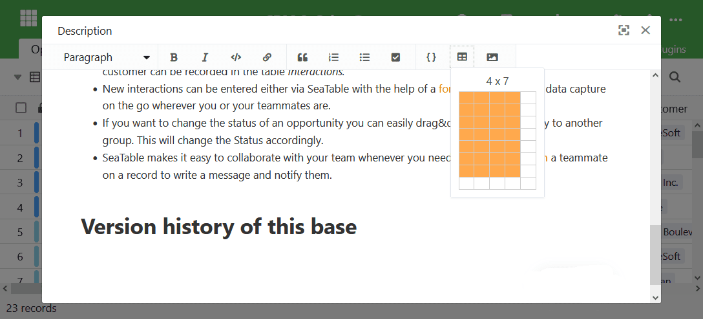
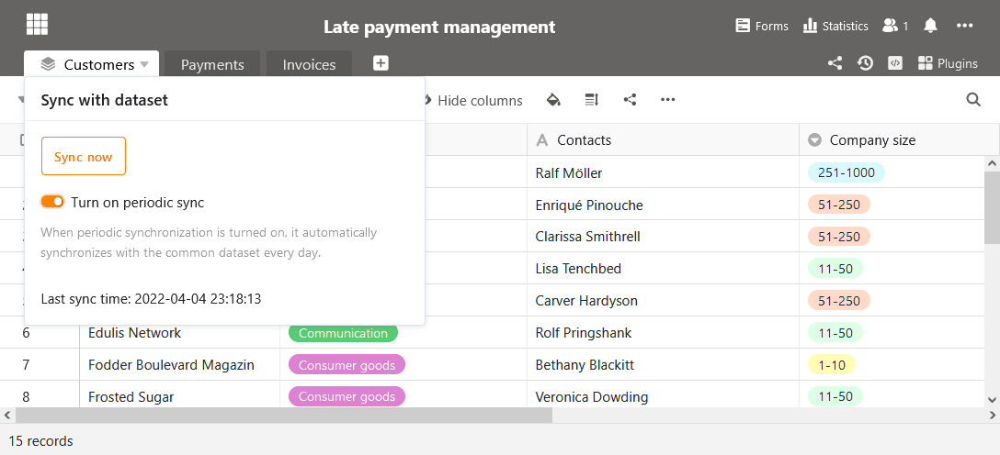
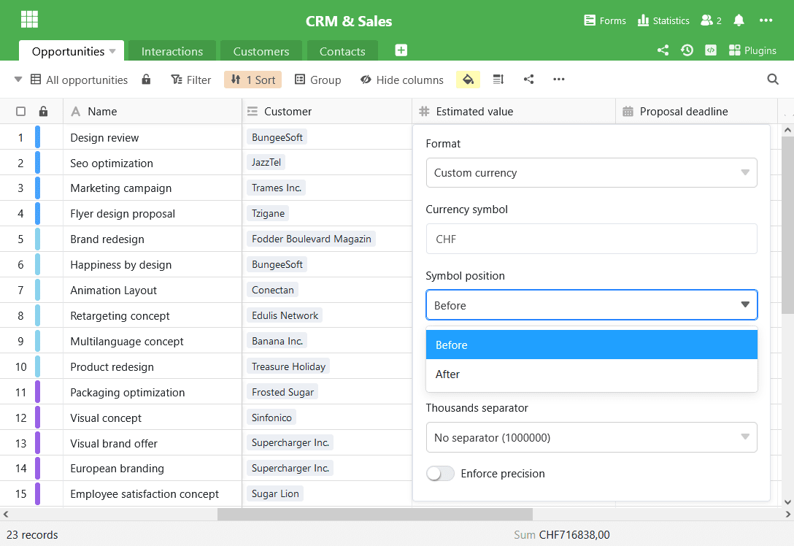

Early builds of SeaTable 2.8 have been available for download from [Docker](https://hub.docker.com/r/seatable/seatable-enterprise/tags) Hub for a few days now. The final build has been available for download since April 1. With today's update to SeaTable 2.8, we are pleased to make its many new features and improvements available in SeaTable Cloud as well. New features include a color-customizable title band and display of all active users in a base, column descriptions, and an improved formatted text editor. In addition, shared records can now be automatically synchronized and renamed. And these are just the highlights, which we present in more detail in these release notes. The complete list of changes can be found - as always - in the [changelog]().

## Coloured title ribbon

The colour and shape of the base icons on the homepage can already be adapted to individual wishes since [version 1.2.]() However, the icon colour had no effect on the colour of the title band in Base. The title band remained orange.

In the new version we have eliminated this functional gap. The colour of the title band is now based on the colour of the base icon. You think the bright blue from the screenshot is chic? Well, go for it!

## Transparent collaboration

Every change you make in a SeaTable Base is immediately transmitted to all active users in the Base. As soon as you confirm an entry, your co-editors see the change on the screen. We call this real-time collaboration.

But who are the other users who are active in Base? SeaTable 2.8 provides a clear answer to this question. A click on the user icon at the top right of the table editor opens the list of current users. When a user is added to a table or a colleague stops working, the list is updated immediately. Real-time collaboration!

## Simple description of columns

If you work together on tables in a team, then fill-in instructions prevent the incorrect entry of data: What should be entered in a column? In which unit should the data be recorded? How should categories be interpreted? Who can answer queries?

The column descriptions introduced in SeaTable 2.8 are intended for exactly this kind of information. In the table descriptions, additional information can be entered that does not fit into the column heading or should be contained there. If a description is entered for a column, an info icon is displayed in the column header. Moving the mouse over it displays the description in full length.

## Formatted help text in web forms

Help texts in [web forms]() have the same motivation as column descriptions: They allow a more precise and frustration-free processing of the forms. In addition, information obligations (keyword DSGVO) can be fulfilled in them.

New in SeaTable 2.8 is the possibility to format the help texts and to insert pictures and tables. This makes it possible to present longer texts more clearly or to replace many words with a few images. The help texts are edited via SeaTable's revised editor for formatted text.

## Convenient editor for formatted text

The editor for formatted text is not only used in web forms. It is also used in columns with formatted text and in descriptions for bases. With the version change, the editor has undergone three improvements:

Tables can be inserted in the desired dimensions in no time thanks to a new wizard. This opens with a click on the "Insert table" button. Now drag the table to the desired dimension and click again. The table with the selected proportions will then be inserted at the cursor position. Until now, SeaTable always inserted new tables as 2×2 tables, which then required clicks and manual addition of more rows and columns.  

Navigation in tables is also easier from now on. As of SeaTable 2.8, the editor supports navigation with TAB and SHIFT + TAB. According to the general convention, the cursor jumps to the next cell with TAB; SHIFT + TAB lets the editor jump to the previous cell.

Finally, the editor in SeaTable 2.8 also offers a better image preview. For one thing, you can now scroll through all the images embedded in the formatted text in the preview. Secondly, you can now easily increase and decrease the zoom factor in the preview.

## Automatic synchronisation of shared data sets

A shared record is a view of a table that is released for one or more groups with read rights. Authorised groups can import the data set into their own bases. This gives them access to the data in the dataset without the sharing group losing sovereignty over its data.

Until now, the data in an imported common data set could only be updated manually. In the current version, the synchronisation of the data can optionally also take place automatically. If automatic synchronisation is active, the data set is updated every 24 hours after the last sync run. If the data in the source table has changed, then these changes are transferred to the imported table by the synchronisation.

## More improvements

There are numerous other improvements that deserve a mention. Here are the most important of them.

The formula column knows two new formulas: Small() and Large() find the x-smallest or x-largest value in a column. (More in the [formula reference]().)

For columns and groupings, the median can now be calculated in addition to the sum, the average and the extreme values.

In the page design plug-in, the font size in tables for linked rowscan be adjusted. The line break in such tables has also been improved.

In addition to the decimal places and the currency symbol, the position of the latter can now be freely determined in a user-defined currency column.  

