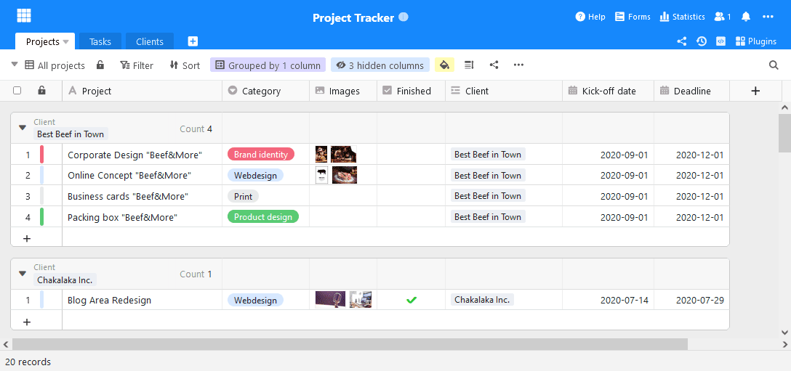
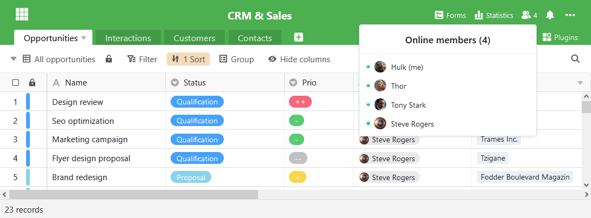
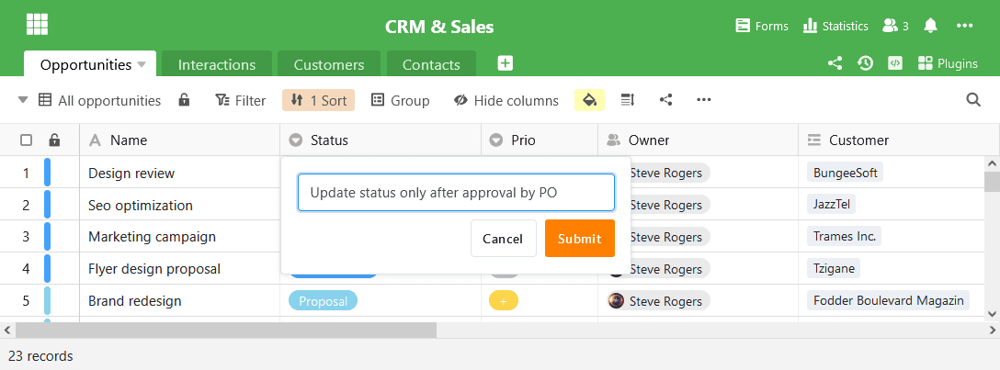
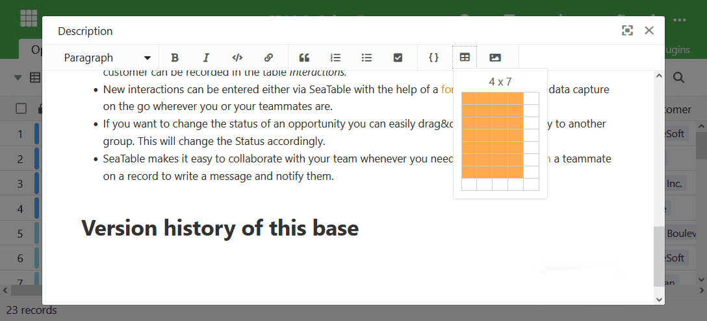
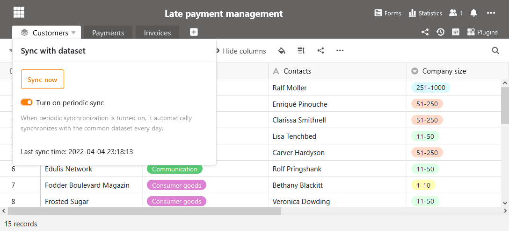

Las primeras versiones de SeaTable 2.8 están disponibles para su descarga en [Docker](https://hub.docker.com/r/seatable/seatable-enterprise/tags) Hub desde hace varios días. La versión final está disponible para su descarga desde el 1 de abril. Con la actualización de hoy a SeaTable 2.8, nos complace hacer que sus numerosas nuevas funciones y mejoras estén disponibles también en SeaTable Cloud. Las nuevas características incluyen una banda de título personalizable en color y la visualización de todos los usuarios activos en una base, descripciones de columnas y un editor mejorado para el texto formateado. Además, los registros compartidos pueden ahora sincronizarse y renombrarse automáticamente. Y estos son sólo los aspectos más destacados que presentamos con más detalle en estas notas de la versión. La lista completa de cambios se encuentra, como siempre, en el [registro de cambios](?lang=auto).

## Cinta de color para el título

El color y la forma de los iconos base de la página de inicio ya pueden adaptarse a los deseos individuales desde [la versión 1.2.]() Sin embargo, el color del icono no afectaba al color de la banda del título en Base. La banda del título siguió siendo naranja.

En la nueva versión hemos eliminado este vacío funcional. El color de la banda del título se basa ahora en el color del icono base. ¿Crees que el azul brillante de la captura de pantalla es elegante? Pues bien, ¡a por ello!

## Colaboración transparente

Cada cambio que realice en una Base SeaTable se transmite inmediatamente a todos los usuarios activos en la Base. En cuanto confirme una entrada, sus coeditores verán el cambio en la pantalla. Lo llamamos colaboración en tiempo real.

Pero, ¿quiénes son los otros usuarios que están activos en la Base? SeaTable 2.8 ofrece una respuesta clara a esta pregunta. Un clic en el icono del usuario en la parte superior derecha del editor de la tabla abre la lista de usuarios actuales. Cuando se añade un usuario a una mesa o un compañero deja de trabajar, la lista se actualiza inmediatamente. Colaboración en tiempo real

## Descripción sencilla de las columnas

Si se trabaja en equipo en las tablas, las instrucciones de cumplimentación evitan la introducción de datos incorrectos: ¿Qué debe introducirse en una columna? ¿En qué unidad deben registrarse los datos? ¿Cómo deben interpretarse las categorías? ¿Quién puede responder a las preguntas?

Las descripciones de las columnas introducidas en SeaTable 2.8 están pensadas exactamente para este tipo de información. En las descripciones de las tablas se puede introducir información adicional que no cabe en el encabezamiento de la columna o que debería figurar en ella. Si se introduce una descripción para una columna, se muestra un icono de información en la cabecera de la columna. Al pasar el ratón por encima, se muestra la descripción en toda su extensión.

## Texto de ayuda con formato en los formularios web

Los textos de ayuda en [los formularios]() web tienen la misma motivación que las descripciones de las columnas: Permiten un tratamiento más preciso y sin frustraciones de los formularios. Además, en ellos se pueden cumplir las obligaciones de información (palabra clave DSGVO).

La novedad de SeaTable 2.8 es la posibilidad de formatear los textos de ayuda y de insertar imágenes y tablas. Esto permite presentar textos más largos con mayor claridad o sustituir muchas palabras por unas pocas imágenes. Los textos de ayuda se editan a través del editor revisado de SeaTable para texto formateado.

## Práctico editor de texto formateado

El editor de texto formateado no sólo se utiliza en los formularios web. También se utiliza en las columnas con texto formateado y en las descripciones de las bases. Con el cambio de versión, el editor ha experimentado tres mejoras:

Las tablas pueden insertarse en las dimensiones deseadas en un abrir y cerrar de ojos gracias a un nuevo asistente. Se abre haciendo clic en el botón "Insertar tabla". Ahora arrastre la tabla a la dimensión deseada y haga clic de nuevo. La tabla con las proporciones seleccionadas se inserta entonces en la posición del cursor. Hasta ahora, SeaTable siempre insertaba nuevas tablas como tablas 2×2, lo que requería hacer clic y añadir manualmente más filas y columnas.  

La navegación en las tablas también es más fácil a partir de ahora. A partir de SeaTable 2.8, el editor soporta la navegación con TAB y SHIFT + TAB. Según la convención general, el cursor salta a la siguiente celda con TAB; SHIFT + TAB permite al editor saltar a la celda anterior.

Por último, el editor de SeaTable 2.8 también ofrece una mejor vista previa de las imágenes. Por un lado, ahora puede desplazarse por todas las imágenes incrustadas en el texto formateado en la vista previa. En segundo lugar, ahora puedes aumentar y disminuir fácilmente el factor de zoom en la vista previa.

## Sincronización automática de conjuntos de datos compartidos

Un registro compartido es una vista de una tabla que se libera para uno o varios grupos con derechos de lectura. Los grupos autorizados pueden importar el conjunto de datos a sus propias bases. Esto les da acceso a los datos del conjunto de datos sin que el grupo que los comparte pierda la soberanía sobre sus datos.

Anteriormente, los datos de un conjunto de datos comunes importados sólo podían actualizarse manualmente. En la versión actual, la sincronización de los datos puede realizarse opcionalmente de forma automática. Si la sincronización automática está activada, el conjunto de datos se actualiza cada 24 horas después de la última ejecución de la sincronización. Si los datos de la tabla de origen han cambiado, estos cambios se transfieren a la tabla importada mediante la sincronización.

## Más mejoras

Hay muchas otras mejoras que merecen ser mencionadas. Aquí están los más importantes.

La columna de fórmulas conoce dos nuevas fórmulas: Small() y Large() encuentran el valor x-más pequeño o x-más grande de una columna. (Más en la [referencia de la fórmula]().

Para las columnas y agrupaciones, ahora se puede calcular la mediana además de la suma, la media y los valores extremos.

En el plug-in de diseño de páginas, se puede ajustar el tamaño de la fuente en las tablas para las líneas enlazadas. También se ha mejorado el salto de línea en dichas tablas.

Además de los decimales y el símbolo de la moneda, ahora se puede determinar libremente la posición de este último en una columna de moneda definida por el usuario.  

