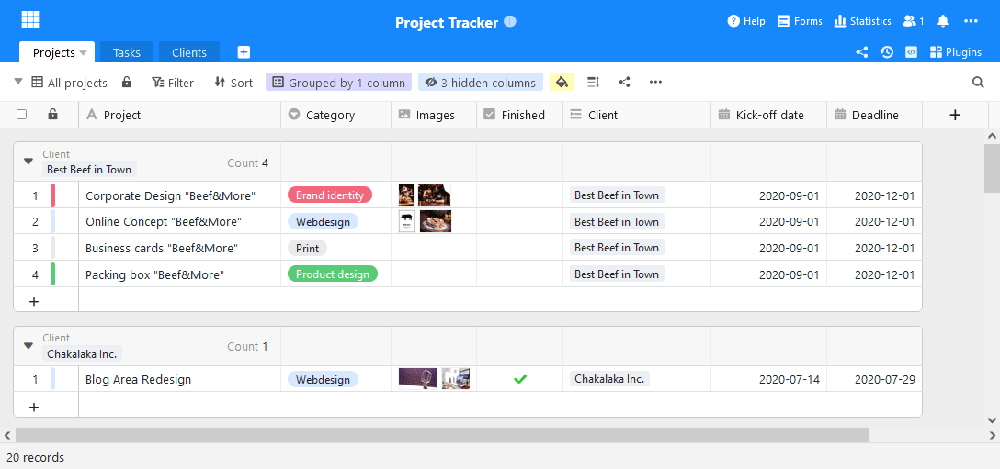
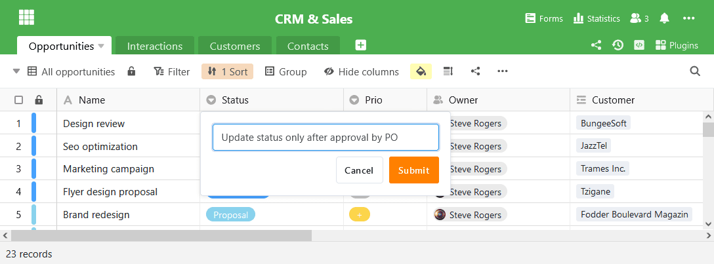

As primeiras construções da SeaTable 2.8 estão disponíveis para download em [Docker](https://hub.docker.com/r/seatable/seatable-enterprise/tags) Hub há vários dias. A construção final está disponível para download desde 1 de Abril. Com a actualização de hoje do SeaTable 2.8, temos o prazer de disponibilizar as suas numerosas novas funções e melhorias também no SeaTable Cloud. As novas características incluem uma banda de título a cores personalizável e a exibição de todos os utilizadores activos numa base, descrições de colunas e um editor melhorado para texto formatado. Além disso, os registos partilhados podem agora ser automaticamente sincronizados e renomeados. E estes são apenas os destaques que apresentamos com mais detalhe nestas notas de lançamento. A lista completa de alterações pode ser encontrada - como sempre - no [changelog]().

## Fita de título colorida

A cor e a forma dos ícones de base na página inicial já podem ser adaptadas aos desejos individuais desde a [versão 1.2](). No entanto, a cor do ícone não teve qualquer efeito sobre a cor da banda título na Base. A faixa de título permaneceu laranja.

Na nova versão, eliminámos esta lacuna funcional. A cor da banda de título baseia-se agora na cor do ícone de base. Acha que o azul brilhante da imagem do ecrã é chique? Bem, avance!

## Colaboração transparente

Cada alteração que fizer numa Base SeaTable é imediatamente transmitida a todos os utilizadores activos na Base. Assim que confirmar uma entrada, os seus co-editores vêem a alteração no ecrã. Chamamos a isto colaboração em tempo real.

Mas quem são os outros utilizadores que estão activos na Base? SeaTable 2.8 fornece uma resposta clara a esta pergunta. Um clique no ícone do utilizador no canto superior direito do editor de tabelas abre a lista de utilizadores actuais. Quando um utilizador é adicionado a uma tabela ou um colega deixa de trabalhar, a lista é imediatamente actualizada. Colaboração em tempo real!

## Descrição simples das colunas

Se trabalharem juntos em tabelas numa equipa, então as instruções de preenchimento previnem a introdução incorrecta de dados: O que deve ser introduzido numa coluna? Em que unidade devem ser registados os dados? Como devem ser interpretadas as categorias? Quem pode responder às perguntas?

As descrições das colunas introduzidas no SeaTable 2.8 destinam-se exactamente a este tipo de informação. Nas descrições do quadro, podem ser introduzidas informações adicionais que não cabem no título da coluna ou que aí devem ser contidas. Se for introduzida uma descrição para uma coluna, é exibido um ícone de informação no cabeçalho da coluna. Movendo o rato sobre ele mostra a descrição em todo o seu comprimento.

## Texto de ajuda formatado em formulários web

Os textos de ajuda em [formulários web]() têm a mesma motivação que as descrições de colunas: Permitem um processamento mais preciso e sem frustrações dos formulários. Além disso, as obrigações de informação (palavra-chave DSGVO) podem ser cumpridas nelas.

Novidade no SeaTable 2.8 é a possibilidade de formatar os textos de ajuda e de inserir imagens e tabelas. Isto permite apresentar textos mais longos de forma mais clara ou substituir muitas palavras por algumas imagens. Os textos de ajuda são editados através do editor revisto do SeaTable para texto formatado.

## Editor conveniente para texto formatado

O editor de texto formatado não é utilizado apenas em formulários web. É também utilizado em colunas com texto formatado e em descrições de bases. Com a mudança de versão, o editor sofreu três melhorias:

As tabelas podem ser inseridas nas dimensões desejadas num instante, graças a um novo assistente. Este abre-se com um clique no botão "Inserir tabela". Agora, arraste a tabela para a dimensão pretendida e clique novamente. A tabela com as proporções seleccionadas é então inserida na posição do cursor. Até agora, o SeaTable inseria sempre novas tabelas como tabelas 2×2, o que exigia cliques e a adição manual de mais linhas e colunas.  

A navegação em tabelas é também mais fácil a partir de agora. A partir da SeaTable 2.8, o editor apoia a navegação com TAB e SHIFT + TAB. De acordo com a convenção geral, o cursor salta para a célula seguinte com TAB; SHIFT + TAB permite ao editor saltar para a célula anterior.

Finalmente, o editor em SeaTable 2.8 também oferece uma melhor pré-visualização da imagem. Por um lado, pode agora percorrer todas as imagens incorporadas no texto formatado na pré-visualização. Em segundo lugar, pode agora facilmente aumentar e diminuir o factor de zoom na pré-visualização.

## Sincronização automática de conjuntos de dados partilhados

Um registo partilhado é uma visão de uma tabela que é divulgada para um ou mais grupos com direitos de leitura. Os grupos autorizados podem importar o conjunto de dados para as suas próprias bases. Isto dá-lhes acesso aos dados do conjunto de dados sem que o grupo de partilha perca a soberania sobre os seus dados.

Até agora, os dados de um conjunto de dados comuns importados só podiam ser actualizados manualmente. Na versão actual, a sincronização dos dados também pode, opcionalmente, ter lugar automaticamente. Se a sincronização automática estiver activa, o conjunto de dados é actualizado de 24 em 24 horas após a última execução de sincronização. Se os dados na tabela de origem tiverem sido alterados, então estas alterações são transferidas para a tabela importada através da sincronização.

## Mais melhorias

Há muitas outras melhorias que merecem uma menção. Aqui estão os mais importantes.

A coluna da fórmula conhece duas novas fórmulas: Small() e Large() encontram o valor x-pequeno ou x-grande numa coluna. (Mais na [referência da fórmula]().

Para colunas e agrupamentos, a mediana pode agora ser calculada para além da soma, a média e os valores extremos.

No plug-in do desenho da página, o tamanho da fonte nas tabelas para linhas ligadas pode ser ajustado. A quebra de linha em tais tabelas também foi melhorada.

Para além das casas decimais e do símbolo da moeda, a posição desta última pode agora ser livremente determinada numa coluna de moeda definida pelo utilizador.  

