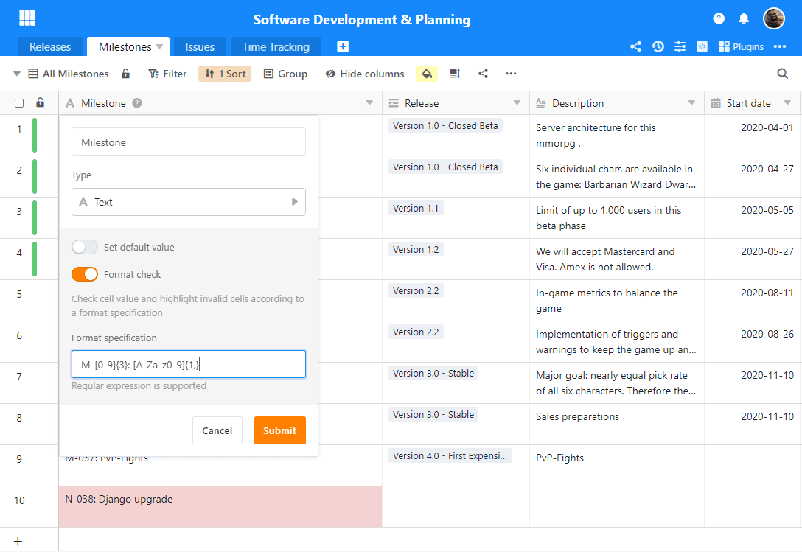
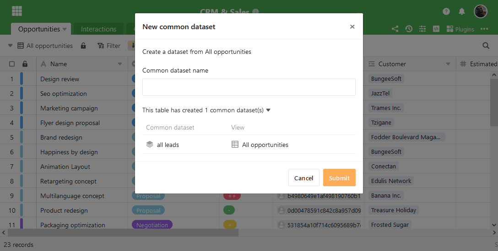

SeaTable 3.0 is here! The third major release of SeaTable offers online editing of Office documents, automatic data validation, more functions for shared data sets and a new server component for more efficient storage of bases. As always, the [changelog](https://seatable.io/docs/changelog/version-3-0/?lang=auto) provides information about the many other detailed improvements and bug fixes in the new version. The new functions are available immediately for [SeaTable Cloud users](https://cloud.seatable.io/). The image for SeaTable 3.0 was made available tonight on [Docker](https://hub.docker.com/r/seatable/seatable-enterprise/tags) Hub.  
In addition to the functional improvements in the SeaTable app, there is another new feature for SeaTable Cloud users: A new team management with extended functions and improved design makes the management of small and especially larger teams much easier. You can find out more about the new team management in the article [The new team management]().

## Automatic data validation

Strings of any type and length can be entered in text columns and thus offer great flexibility. Single and multiple selection columns are ideal for structuring data because of their predefined values. The new data validation function allows the advantages of text columns to be combined with those of selection columns.

If data validation is activated, SeaTable checks whether the entered cell value corresponds to the defined target format. If the input does not correspond to the target format, the cell is highlighted in red. In web forms, a non-compliant entry will result in an error message and the form cannot be submitted.

Das Zielformat wird in Form eines [regulären Ausdrucks](https://de.wikipedia.org/wiki/Regul%C3%A4rer_Ausdruck) definiert. Ein regulärer Ausdruck für eine Zahlenfolge mit genau 5 Stellen ist beispielsweise \[0-9\]{5}. Für reguläre Ausdrücke sprechen zwei Argumente: Sie sind eine weit verbreitete Methode und bieten ein Maximum an Flexibilität. Die Art der erlaubten Zeichen, die Länge, und auch die Syntax der Eingabe lässt sich mit regulären Ausdrücken präzise definieren.

Data validation is available in text columns in version 3.0. If a target format is added subsequently, all existing entries are also checked and the non-compliant values are marked as such. So nothing stands in the way of subsequently activating data validation in existing columns.

## Online editing of Office documents

SeaTable makes team collaboration interactive. A Base is shared with a few clicks and entries in a shared Base are immediately displayed to other users. Office files in a SeaTable Base are different. To edit the Word document, Excel spreadsheet or PowerPoint presentation, it must be downloaded first. The editing is then done offline. For other users, the changed document version is only available after the manual upload. This was a thorn in our side.

SeaTable 3.0 extends the real-time collaboration known from the table editor to Office documents. Documents can be edited directly in the browser and with several people at the same time. The co-authors' changes are displayed in real time, so you know exactly who is working on the document and where. Manual uploading is also no longer necessary. When the last user leaves the document, the current document status is automatically transferred back to SeaTable and stored in the file column as a new document version.

Editing an Office document from SeaTable could not be easier: A click on the Word, Excel or PowerPoint file opens the document in an editor in a new tab. Users who are currently editing the document are displayed in the upper right corner. Changes made by these users are executed directly in the displayed document and are indicated by a flag. Saving takes place automatically.

The editors used for online editing are from [ONLYOFFICE](https://onlyoffice.com). The editors of the ONLYOFFICE document server are characterised by a modern user interface and very good compatibility with Microsoft file formats. In addition, the document server, like SeaTable, can be self-hosted.

Online editing is available in all SeaTable Cloud subscriptions, including the free subscription. For on-premises operation of SeaTable, the ONLYOFFICE document server must be installed and configured. The setup instructions can be found in the [SeaTable Manual](https://manual.seatable.io/).

## Improved synchronisation of bases

The Shared Records feature allows you to synchronize data from one Base to one or more other Bases. They are especially useful when you want to make data available to other users for further processing and enrichment, but you cannot give these users access rights to the list you manage ("master list"). Version 3.0 includes several enhancements to simplify the creation, synchronization, and duplication of shared records.

As of SeaTable 3.0, the New Shared Record dialog displays shared records that have already been created. This avoids the multiple creation of common data sets.

In the new version, columns created by importing a common record are marked with a sync icon. This makes it easy to distinguish the columns that will be overwritten with the common data set during a re-sync from all other columns. The visual marking reduces the risk of unintentional data loss.

When duplicating a table with an imported common data set, only the data was duplicated until now. The link to the common data set was not given in the duplicated table, so that no renewed sync was possible. The duplication function has now been extended so that you can either transfer the link to the common data set to the new table to be created or discard it via a switch.

## Higher storage efficiency

The new SeaTable Server component dtable-storage-server will significantly reduce the storage requirements for storing bases, snapshots and backups of archived rows . The seaf-server component, which was previously responsible for this, will continue to play an important but reduced role.

Technically, the dtable-storage-server is a simple abstraction layer for different storage backends. As before, local storage and S3 object storage are supported. SeaTable thus offers attractive storage options for small, simple systems as well as for highly scalable setups.

With newly installed SeaTable servers, bases are automatically stored in the dtable-storage-server. Only the storage of images and files is still done by the seaf-server. The situation is different for existing systems. When upgrading a SeaTable Server 2.x, the dtable-storage-server is not automatically installed and configured. This has to be done manually; the procedure is described in the [SeaTable manual](https://manual.seatable.io/upgrade/extra-upgrade-notice/#30). A migration of the existing bases into the dtable-storage-server is recommended. For a small number of bases, the export into a DTABLE file and the re-import into a new base is the simplest procedure. With a larger number of bases, this process can also be automated via the API. However, migration is not necessary. SeaTable 3.0 can continue to load bases from the seaf-server.

## More improvements

In addition, there are numerous other improvements, the three most important of which we present here very briefly.

The menu structure in the Base header has been expanded and revised. The most obvious change is the avatar, which is now displayed at the top right, analogous to the homepage. In order to make room for the avatar, the three-dot button has been moved down one row . The menu behind this button has been revised. In keeping with their importance, the notification and automation rules, for example, have been removed from this menu. They now have their own icon in the upper right corner.

[DTABLE files](https://seatable.io/en/docs/handbuch/expertenwissen/dtable-dateiformat/?lang=auto), export files of bases, now also contain automation rules. The same applies to copying a base to another group. This saves unnecessary manual rework when transferring bases between groups and SeaTable servers.

The title column can now be selected in the Kanban plugin. The value of the title columns is at the top of the Kanban card, regardless of the sequence of the columns in the table.
