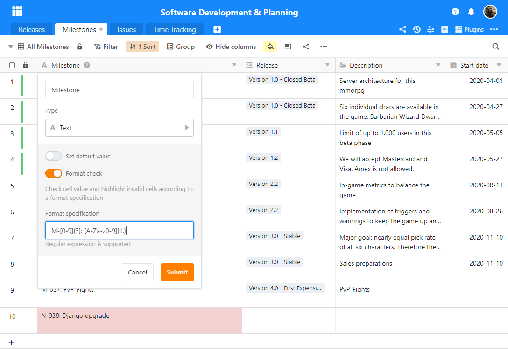
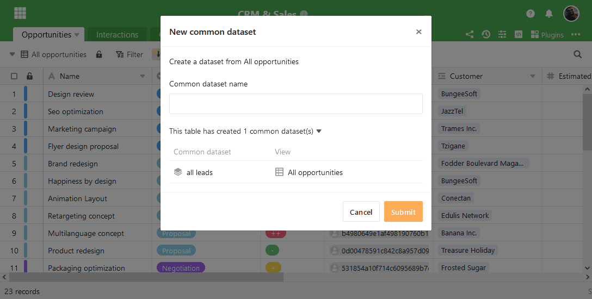
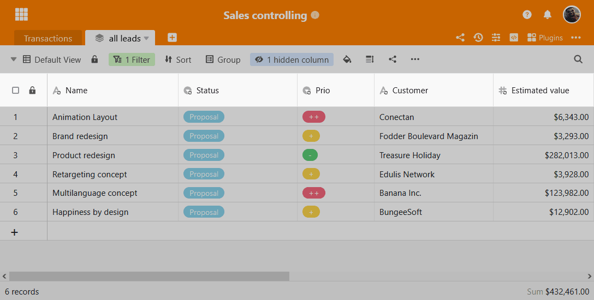

La version 3.0 de SeaTable est arrivée ! La troisième version majeure de SeaTable offre l'édition en ligne de documents Office, une validation automatique des données, davantage de fonctions pour les jeux de données partagés et un nouveau composant serveur pour un stockage plus efficace des bases. Comme toujours, le [changelog](?lang=auto) fournit des informations sur les nombreuses autres améliorations détaillées et corrections de bugs de la nouvelle version. [Les utilisateurs de SeaTable Cloud](https://cloud.seatable.io/) peuvent accéder aux nouvelles fonctions dès maintenant. L'image de SeaTable 3.0 a été mise à disposition cette nuit sur [Docker](https://hub.docker.com/r/seatable/seatable-enterprise/tags) Hub.  
Outre les améliorations fonctionnelles apportées à l'application SeaTable, les utilisateurs de SeaTable Cloud bénéficient d'une autre nouveauté : une nouvelle gestion d'équipe dotée de fonctions étendues et d'un design amélioré facilite considérablement la gestion des petites et surtout des grandes équipes. Pour en savoir plus sur la nouvelle gestion d'équipe, consultez l'article [La nouvelle gestion d'équipe]().

## Validation automatique des données

Les colonnes de texte permettent de saisir des chaînes de tout type et de toute longueur et offrent ainsi une grande flexibilité. Les colonnes à sélection simple et multiple sont idéales pour structurer les données grâce aux valeurs prédéfinies. La nouvelle fonction de validation des données permet de combiner les avantages des colonnes de texte avec ceux des colonnes de sélection.

Lorsque la validation des données est activée, SeaTable vérifie si la valeur de la cellule saisie correspond au format cible défini. Si la saisie ne correspond pas au format cible, la cellule est mise en évidence en rouge. Dans les formulaires web, une saisie non conforme entraîne un message d'erreur et le formulaire ne peut pas être soumis.

Das Zielformat wird in Form eines [regulären Ausdrucks](https://de.wikipedia.org/wiki/Regul%C3%A4rer_Ausdruck) definiert. Ein regulärer Ausdruck für eine Zahlenfolge mit genau 5 Stellen ist beispielsweise \[0-9\]{5}. Für reguläre Ausdrücke sprechen zwei Argumente: Sie sind eine weit verbreitete Methode und bieten ein Maximum an Flexibilität. Die Art der erlaubten Zeichen, die Länge, und auch die Syntax der Eingabe lässt sich mit regulären Ausdrücken präzise definieren.

Dans la version 3.0, la validation des données est disponible dans les colonnes de texte. Si un format cible est ajouté ultérieurement, toutes les entrées existantes sont également vérifiées et les valeurs non conformes sont marquées comme telles. Rien n'empêche donc d'activer ultérieurement la validation des données dans les colonnes existantes.

## Édition en ligne de documents Office

SeaTable rend la collaboration en équipe interactive. Une base est partagée en quelques clics et les entrées dans une base partagée sont immédiatement affichées aux autres utilisateurs. Il en va autrement des fichiers Office dans une base SeaTable. Pour modifier le document Word, la feuille de calcul Excel ou la présentation PowerPoint, il faut d'abord les télécharger. L'édition se fait ensuite hors ligne. Les autres utilisateurs ne peuvent accéder à la version modifiée du document qu'après l'avoir téléchargée manuellement. Cela nous dérangeait.

SeaTable 3.0 étend la collaboration en temps réel, telle qu'on la connaît dans l'éditeur de tableaux, aux documents Office. Il est possible de modifier des documents directement dans le navigateur et avec plusieurs personnes en même temps. Les modifications des coauteurs sont affichées en temps réel, ce qui permet de savoir exactement qui travaille sur le document et où. Il n'est plus nécessaire non plus de procéder à un téléchargement manuel. Lorsque le dernier utilisateur quitte le document, l'état actuel du document est automatiquement renvoyé à SeaTable et stocké dans la colonne des fichiers en tant que nouvelle version du document.

Modifier un document Office à partir de SeaTable ne pourrait pas être plus simple : un clic sur le fichier Word, Excel ou PowerPoint ouvre le document dans un éditeur dans un nouvel onglet. Les utilisateurs qui modifient actuellement le document sont affichés dans le coin supérieur droit. Les modifications de ces utilisateurs sont effectuées directement dans le document affiché et sont signalées par un petit drapeau. L'enregistrement se fait automatiquement.

Les éditeurs utilisés pour l'édition en ligne proviennent de [ONLYOFFICE](https://onlyoffice.com). Les éditeurs du serveur de documents ONLYOFFICE se distinguent par une interface utilisateur moderne et une très bonne compatibilité avec les formats de fichiers Microsoft. De plus, le serveur de documents, tout comme SeaTable, peut être auto-hébergé.

L'édition en ligne est disponible dans tous les abonnements SeaTable Cloud, y compris l'abonnement gratuit Free. Si SeaTable est utilisé sur site, le serveur de documents ONLYOFFICE doit être installé et configuré. Vous trouverez les instructions d'installation dans le [manuel SeaTable](https://manual.seatable.io/).

## Amélioration de la synchronisation des bases

Les enregistrements partagés permettent de synchroniser les données d'une base vers une ou plusieurs autres bases. Ils sont particulièrement utiles lorsque vous souhaitez mettre des données à la disposition d'autres utilisateurs à des fins de traitement et d'enrichissement, mais que vous ne pouvez pas donner à ces utilisateurs le droit d'accéder à la liste que vous gérez ("liste maîtresse"). La version 3.0 contient plusieurs améliorations visant à simplifier la création, la synchronisation et la duplication d'ensembles de données partagés.

À partir de la version 3.0 de SeaTable, la boîte de dialogue "Nouvel ensemble de données communes" affiche les ensembles de données communes déjà créés. Cela permet d'éviter de créer plusieurs fois des enregistrements communs.

Dans la nouvelle version, les colonnes créées par l'importation d'un ensemble de données commun sont marquées d'une icône de synchronisation. Il est ainsi facile de distinguer les colonnes qui seront écrasées par l'ensemble de données commun lors d'une re-synchronisation de toutes les autres colonnes. Le marquage visuel réduit le risque de perte involontaire de données.

Lors de la duplication d'une table avec un enregistrement commun importé, seules les données étaient jusqu'à présent dupliquées. Le lien avec l'enregistrement commun n'existait pas dans la table dupliquée, de sorte qu'une nouvelle synchronisation n'était pas possible. La fonction de duplication a maintenant été étendue de manière à ce que vous puissiez, à l'aide d'un bouton, soit reprendre le lien avec l'enregistrement commun dans la nouvelle table à créer, soit le rejeter.

## Meilleure efficacité de stockage

Le nouveau composant dtable-storage-server de SeaTable Server réduira considérablement les besoins en mémoire pour le stockage des bases, des snapshots et des sauvegardes de lignes archivées. Le composant seaf-server, qui s'en chargeait jusqu'à présent, continuera à jouer un rôle important mais réduit

D'un point de vue technique, le dtable-storage-server est une simple couche d'abstraction pour différents backends de stockage. Comme auparavant, le stockage local et le stockage d'objets S3 sont pris en charge. SeaTable offre ainsi des options de stockage attrayantes pour les petits systèmes simples comme pour les configurations hautement évolutives.

Pour les serveurs SeaTable nouvellement installés, le stockage des bases se fait automatiquement dans le dtable-storage-server. Seul le stockage des images et des fichiers continue d'être assuré par le seaf-server. La situation est différente pour les systèmes existants. Dans le cadre d'une mise à jour d'un serveur SeaTable 2.x, le dtable-storage-server n'est pas installé et configuré automatiquement. Cela doit être fait manuellement ; la procédure est décrite dans le [manuel SeaTable](https://manual.seatable.io/upgrade/extra-upgrade-notice/#30). Une migration des bases existantes vers le dtable-storage-server est recommandée. Si les bases sont peu nombreuses, la procédure la plus simple consiste à les exporter dans un fichier DTABLE et à les réimporter dans une nouvelle base. Si le nombre de bases est plus important, ce processus peut également être automatisé via l'API. Une migration n'est cependant pas nécessaire. SeaTable 3.0 peut continuer à charger des bases à partir du seaf-server.

## Nouvelles améliorations

Il existe en outre de nombreuses autres améliorations, dont nous présentons ici brièvement les trois plus importantes.

La structure du menu dans l'en-tête de la base a été élargie et remaniée. Le changement le plus évident est l'avatar, qui est désormais affiché en haut à droite, comme sur la page d'accueil. Pour faire de la place à l'avatar, le bouton à trois points a été déplacé d'une ligne vers le bas. Le menu qui se trouve derrière ce bouton a été remanié. Les règles de notification et d'automatisation, par exemple, ont été retirées de ce menu en raison de leur importance. Elles disposent désormais de leur propre icône dans le coin supérieur droit.

[Les fichiers DTABLE](), fichiers d'exportation de bases, contiennent désormais aussi des règles d'automatisation. Il en va de même pour la copie d'une base dans un autre groupe. Cela permet d'éviter des retouches manuelles inutiles lors du transfert de bases entre des groupes et des serveurs SeaTable.

Dans le plugin Kanban, il est maintenant possible de sélectionner la colonne de titre. La valeur de la colonne de titre se trouve en haut de la carte Kanban, indépendamment de la séquence des colonnes dans le tableau.
