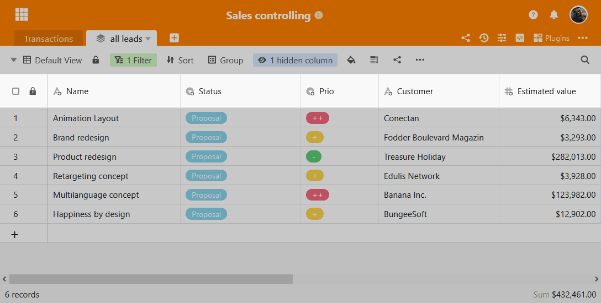

SeaTable 3.0 уже здесь! Третий основной выпуск SeaTable предлагает онлайн-редактирование документов Office, автоматическую проверку данных, больше функций для общих наборов данных и новый серверный компонент для более эффективного хранения баз. Как всегда, в [журнале изменений]() содержится информация о многих других подробных улучшениях и исправлениях ошибок в новой версии. Новые функции доступны сразу же для [пользователей SeaTable Cloud](https://cloud.seatable.io/). Образ для SeaTable 3.0 стал доступен сегодня вечером на сайте [Docker](https://hub.docker.com/r/seatable/seatable-enterprise/tags) Hub.  
Помимо функциональных улучшений в приложении SeaTable, есть еще одна новая функция для пользователей SeaTable Cloud: новое управление командой с расширенными функциями и улучшенным дизайном значительно упрощает управление небольшими и особенно большими командами. Подробнее о новом управлении командой вы можете узнать в статье [Новое управление командой]().

## Автоматическая проверка данных

В текстовые колонки можно вводить строки любого типа и длины, что обеспечивает большую гибкость. Колонки с одиночным и множественным выбором идеально подходят для структурирования данных благодаря своим предопределенным значениям. Новая функция проверки данных позволяет объединить преимущества текстовых колонок с преимуществами колонок выбора.

Если валидация данных активирована, SeaTable проверяет, соответствует ли введенное значение ячейки заданному целевому формату. Если входные данные не соответствуют целевому формату, ячейка выделяется красным цветом. В веб-формах запись, не соответствующая требованиям, приведет к появлению сообщения об ошибке, и форма не будет отправлена.

Целевой формат задается в виде [регулярного выражения](https://de.wikipedia.org/wiki/Regul%C3%A4rer_Ausdruck). Например, регулярное выражение для последовательности чисел, состоящей ровно из 5 цифр, имеет вид \[0-9\]{5}. Есть два аргумента в пользу регулярных выражений: они широко используются и обеспечивают максимальную гибкость. С помощью регулярных выражений можно точно определить тип разрешенных символов, длину, а также синтаксис входных данных.

В версии 3.0 валидация данных доступна в текстовых колонках. Если впоследствии добавляется целевой формат, все существующие записи также проверяются, а несоответствующие значения помечаются как таковые. Таким образом, ничто не мешает впоследствии активировать проверку данных в существующих колонках.

## Онлайн-редактирование документов Office

SeaTable делает совместную работу интерактивной. Общий доступ к базе осуществляется всего несколькими щелчками мыши, а записи в общей базе сразу же отображаются у других пользователей. Офисные файлы в базе SeaTable отличаются друг от друга. Чтобы отредактировать документ Word, таблицу Excel или презентацию PowerPoint, их необходимо сначала загрузить. Затем редактирование происходит в автономном режиме. Другие пользователи имеют доступ только к измененной версии документа после ручной загрузки. Это была заноза в нашей душе.

SeaTable 3.0 расширяет совместную работу в реальном времени, известную по табличному редактору, на документы Office. Документы можно редактировать прямо в браузере и одновременно с несколькими людьми. Изменения соавторов отображаются в режиме реального времени, поэтому вы точно знаете, кто и где работает над документом. Ручная загрузка также больше не требуется. Когда последний пользователь покидает документ, текущее состояние документа автоматически переносится обратно в SeaTable и сохраняется в колонке файлов как новая версия документа.

Редактирование документа Office из SeaTable не может быть проще: щелчок по файлу Word, Excel или PowerPoint открывает документ в редакторе на новой вкладке. Пользователи, которые в данный момент редактируют документ, отображаются в правом верхнем углу. Изменения, внесенные этими пользователями, выполняются непосредственно в отображаемом документе и обозначаются флагом. Сохранение происходит автоматически.

Для онлайн-редактирования используются редакторы от [ONLYOFFICE](https://onlyoffice.com). Редакторы сервера документов ONLYOFFICE характеризуются современным пользовательским интерфейсом и очень хорошей совместимостью с форматами файлов Microsoft. Кроме того, сервер документов, как и SeaTable, может быть размещен самостоятельно.

Онлайн-редактирование доступно во всех подписках SeaTable Cloud, включая бесплатную подписку. Для локальной работы SeaTable необходимо установить и настроить сервер документов ONLYOFFICE. Инструкции по настройке можно найти в [руководстве SeaTable](https://manual.seatable.io/).

## Улучшенная синхронизация баз

Функция Shared Records позволяет синхронизировать данные из одной базы с одной или несколькими другими базами. Они особенно полезны, если вы хотите предоставить данные другим пользователям для дальнейшей обработки и обогащения, но не можете предоставить им права доступа к списку, которым вы управляете ("мастер-лист"). Версия 3.0 содержит ряд усовершенствований, упрощающих создание, синхронизацию и дублирование общих записей.

Начиная с версии SeaTable 3.0, уже созданные наборы общих данных отображаются в диалоге "Новый набор общих данных". Это позволяет избежать многократного создания общих наборов данных.

В новой версии столбцы, созданные при импорте общей записи, отмечены значком синхронизации. Это позволяет легко отличить столбцы, которые будут перезаписаны общим набором данных во время повторной синхронизации, от всех остальных столбцов. Визуальная маркировка снижает риск непреднамеренной потери данных.

При дублировании таблицы с импортированным общим набором данных до сих пор дублировались только данные. В дублирующей таблице не была указана ссылка на общий набор данных, поэтому новая синхронизация была невозможна. Функция дублирования теперь расширена таким образом, что вы можете либо перенести ссылку на общий набор данных в новую создаваемую таблицу, либо отбросить ее с помощью переключателя.

## Более высокая эффективность хранения

Новый компонент SeaTable Server dtable-storage-server значительно снизит требования к памяти для хранения баз, моментальных снимков и резервных копий архивных строк. Компонент seaf-server, который ранее отвечал за это, будет продолжать играть важную, но уменьшенную роль

Технически, dtable-storage-server - это простой слой абстракции для различных бэкендов хранения данных. Как и раньше, поддерживается локальное хранилище и хранилище объектов S3. Таким образом, SeaTable предлагает привлекательные варианты хранения как для небольших, простых систем, так и для высокомасштабируемых установок.

На вновь установленных серверах SeaTable базы автоматически сохраняются в dtable-storage-server. Только хранение изображений и файлов по-прежнему осуществляется сервером seaf. Для существующих систем ситуация иная. При обновлении сервера SeaTable Server 2.x сервер dtable-storage-server не устанавливается и не настраивается автоматически. Это необходимо сделать вручную; процедура описана в [руководстве SeaTable](https://manual.seatable.io/upgrade/extra-upgrade-notice/#30). Рекомендуется миграция существующих баз в dtable-storage-server. Для небольшого количества баз экспорт в файл DTABLE и повторный импорт в новую базу является самой простой процедурой. При большем количестве баз этот процесс также можно автоматизировать через API. Однако миграция не является обязательной. SeaTable 3.0 может продолжать загружать базы с seaf-сервера.

## Дальнейшие усовершенствования

Кроме того, существует множество других усовершенствований, три наиболее важных из которых мы представляем здесь очень кратко.

Структура меню в заголовке Base была расширена и пересмотрена. Наиболее очевидным изменением является аватар, который теперь отображается в правом верхнем углу, по аналогии с главной страницей. Чтобы освободить место для аватара, кнопка с тремя точками была перемещена на одну строку вниз. Меню, расположенное за этой кнопкой, было пересмотрено. В соответствии с их важностью, например, правила уведомлений и автоматизации были удалены из этого меню. Теперь у них есть свой значок в правом верхнем углу.

[Файлы DTABLE](), файлы экспорта баз, теперь также содержат правила автоматизации. То же самое относится и к копированию базы в другую группу. Это избавляет от ненужной ручной работы при переносе баз между группами и серверами SeaTable.

Теперь столбец заголовка можно выбрать в плагине Kanban. Значение столбцов заголовка находится в верхней части карточки Канбан, независимо от последовательности столбцов в таблице.
