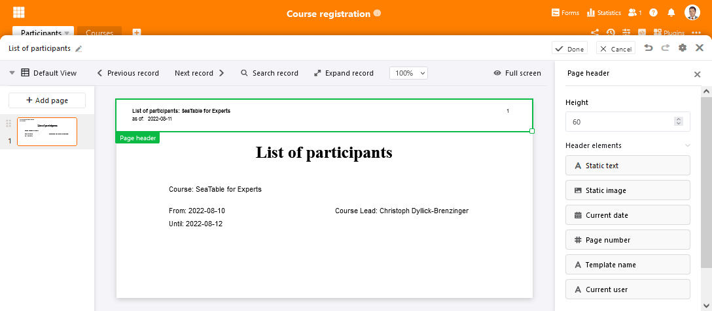
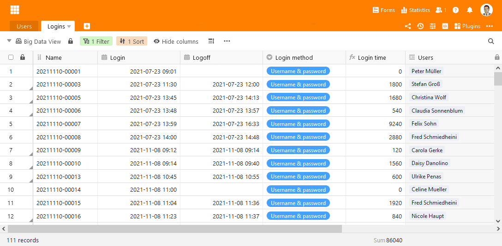

We are happy to introduce the latest version of SeaTable! The release is only a "minor" release, but it comes along quite big. The advanced page design plugin now offers more options to design and manage sophisticated templates. New features also allow for completely new usage scenarios. The Big Data Backend, which goes live with version 3.1, does the same. The Enterprise feature breaks SeaTable's previous limit of 100,000 rows per base, making SeaTable ready for larger tasks. Larger teams will be pleased with the ability to sort groups on the home page and categorize views in Bases. These highlights and a few other new features are presented here. The changelog contains the complete list of changes.

The new features are now available on [SeaTable Cloud](https://cloud.seatable.io/). The latest build of SeaTable 3.1 was installed this morning. Self-hosters can download SeaTable 3.1 from the well-known [Docker](https://hub.docker.com/r/seatable/seatable-enterprise) repository.

## Faster, More Beautiful Lists and Documents

Being packed with new functions, the page design plugin almost merits release notes of its own. What's new? A list print function, new dynamic fields including page header and footer, as well as a version history for every template. Not surprisingly, the sidebar has become considerably more button-rich in the edit mode (see image below) as a result. Last but not least, the templates in the plugin can now also be moved and sorted in the overview. But now everything in order.

The new list printing feature puts the contents of a view on paper or in a PDF document in no time at all with an attractive design. Simply drag the "All View Entries" element onto the template, resize the placeholder, format the table according to your preferences and add the remaining page elements such as document title, logo and date. SeaTable will then automatically take care of the table layout and pagination when printing if the rows of the selected view does not fit into the placeholder. SeaTable adds as many pages as necessary for this.

The dynamic fields introduced in this new release make it super easy to insert contextual information on a page. Specifically, the current date, the template used, the current user, and the page number can be added to a page with them. In terms of usage, dynamic fields are no different from static text fields. Simply drag the field onto the templates, position it correctly, and format it - SeaTable takes care of the rest.

The new page header and footers are an ideal complement for the dynamic elements. Elements placed in either get repeated on every page of the template, of course including the pages that the plugin automatically adds when printing lists. Page headers and footers are not reserved exclusively for dynamic elements. The two fields static text and static image can also be embedded to provide documents with meaningful meta information.

When trying out all these new features, you may happen to mess up your template leaving you wanting to restore the template's previous state. In this case, the page design's new versioning function is there for you. Every time you save the template, the plugin creates a snapshot that you can jump back to. If you don't like the changes made to your template, you can undo them with one click. When restoring a previous version, the current template is replaced by the previous version. Of course, SeaTable retains all other versions when restoring a snapshot, so no changes get lost.

Feel like checking out the new page design plugin? Go for it! The improvements are available in all SeaTable Cloud subscriptions as well as in SeaTable Server Developer and Enterprise Edition.

## Goodby row limit (Enterprise subscribers only)

If SeaTable's row limit of 100,000 rows per base has concerned you in the past, you now have one less thing to worry about! The new big data backend enables the storage of millions of rows in a SeaTable base. Not only does this place SeaTable way ahead of its immediate competitors, but it also pushes SeaTable into regions previously reserved for classic SQL databases. If you are looking for a database with REST API, built-in scripting support, automations and/or graphical frontend with real-time collaboration, look no further.

The previous size limit was necessary because SeaTable loads a base completely into memory when it is opened. This is a technical precondition for SeaTable's real time, online collaboration. With the activation of SeaTable's big data backend, this is no longer the case. When enabled, a base divides its data into two tiers: Records that are loaded automatically when a base is opened and records that are loaded only when explicitly called. This is the case, for example, when filtering or performing statistical analyses over the entire data set. When using only the automatically loaded data, the base's loading time and memory usage is unaffected even by millions of records in the big data storage.

"Tiering" a base's data entails enormous additional flexibility. Collaborative projects where team members work together in the web interface can be implemented just as much as data-intensive applications with automated data collection. Since the big data storage does not support online collaboration, i.e., changes to data are not pushed to other users but are only visible after they are retrieved again, this storage is particularly suitable for datasets on which there is no active work. This is the reason why, in SeaTable 2.3, the beta of the big data feature was presented as [archive function]().

The big data backend supports all column types. Rows can be modified and deleted, filtered and grouped. Records can also be moved back and forth between normal and big data storage. On the other hand, the editing options for records in the big data storage lag those in normal storage for technical reasons. Restrictions exist especially for sharing, automations and plugins: Views that include data from the big data backend cannot be shared. Also, only the statistics plugin can handle data sets in the big data storage. All other plugins and also automations can only operate on normal views. Big data records cannot be linked either. If this is required, then they must first be moved back to normal storage.

|                              | Normal view | Big Data View |
| ---------------------------- | ----------- | ------------- |
| Collaborative work           | ✓           |               |
| Support for all plugins      | ✓           |               |
| Support for all column types | ✓           | ✓             |
| Sorting                      | ✓           | ✓             |
| Filtering                    | ✓           | ✓             |
| Grouping                     | ✓           | ✓#            |
| Hide                         | ✓           | ✓             |
| Conditional formatting       | ✓           |               |
| Search                       | ✓           | ✓             |
| Search and replace           | ✓           |               |
| Data processing              | ✓           |               |
| Export to Excel              | ✓           | ✓             |
| Export to DTABLE             | ✓           |               |

\# This function will be available from SeaTable 3.2.

The Big Data memory must be activated in a Base via the settings. The transfer of data from the normal to the Big Data memory takes place via the "Archive view" function. The contents of the Big Data memory can be displayed in a Big Data view. Big Data views load data from the Big Data store in addition to the records in the normal store. Initially, the view loads only 1,000 rows from the Big Data store. These can be identified in the Table Editor by the gray triangle in the row number column. Using the context menu, such rows can be moved back to the normal memory. To view more Big Data rows , scroll past the end of the table or click "Load All" in the status bar.

## Better Management of Large Teams

For large teams with many users, the interface can get a bit messy. In bases, many views compete for attention. On the homepage, dozens of groups with just as many bases make it hard to focus.

In Bases, the new version now allows you to group views into folders and thus regain clarity. You create a folder in the same way as you create a view. You can then drag and drop views into the new folder. When the first folder is created, another folder "More views" is created, into which all existing views are sorted.

For more clarity to the homepage, groups can now be sorted in a custom order. Next to the group name in the navigation on the left, you will see the move icon already known from views. Use it to move important groups to the top and those you rarely use to the bottom. This way you have faster access to the bases that are really important. A function to minimize groups will be added in the future.

## And much more

Today's update includes even more improvements and new features, which we will only briefly describe below.

Buttons in the column type of the same name now support the sending of emails with attachments. Also, all required modifications in the backend to send formatted emails have been concluded. The option to send rich text emails will become available in one of the next releases.

Until recently, formatted text was the only column type that could not be filtered (apart from the button column type). With the empty / not-empty filter now introduced, this shortcoming is eliminated.

The calendar plugin now opens in full screen mode - like the other plugins - and thus offers a lot more screen space.

We also took another look at SeaTable's import and export functions with the objective to improve the reliability of SeaTable's Excel import. We have also included external apps in the DTABLE export, eliminating the need for manual rework when migrating bases.

Looking at the changelog, it is also noticeable that a lot of work is being put into the Universal App and the Workflow module. These will be released soon. Stay tuned!
