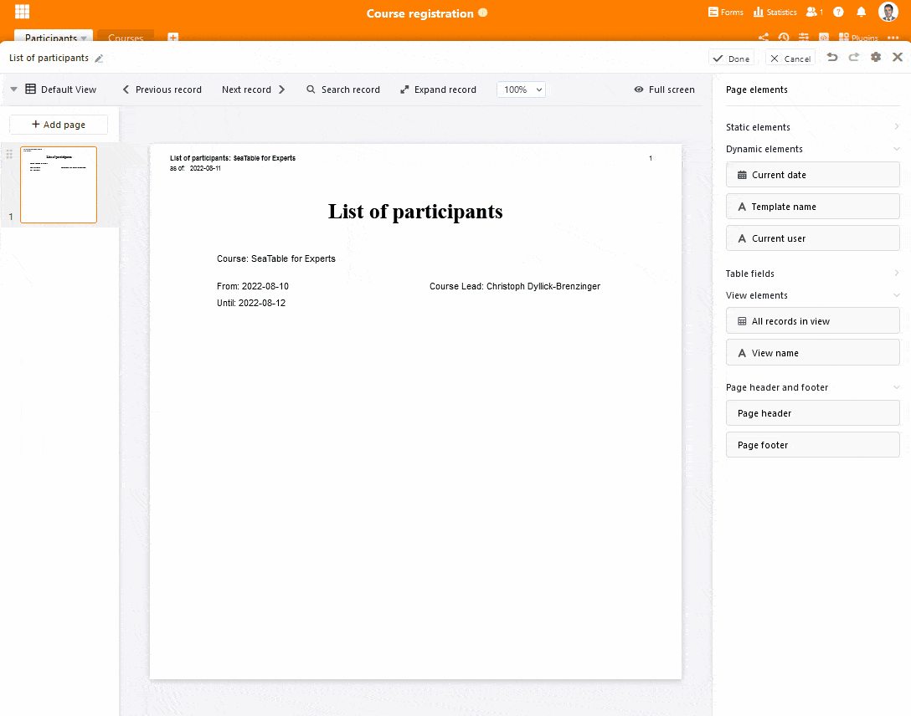
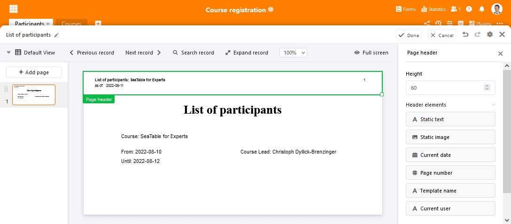
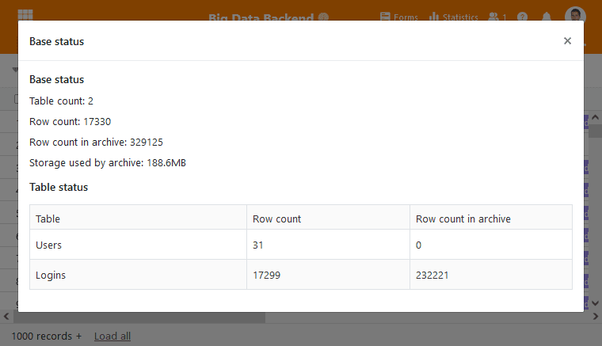
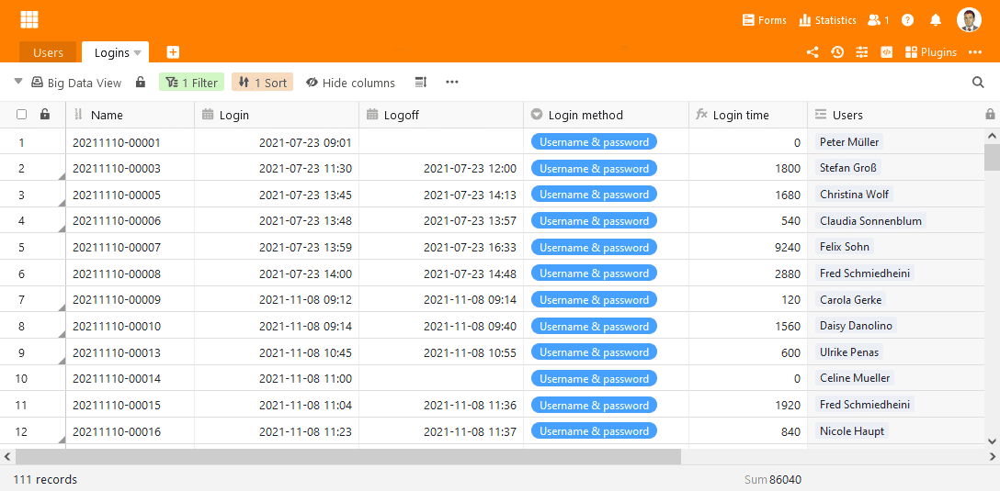
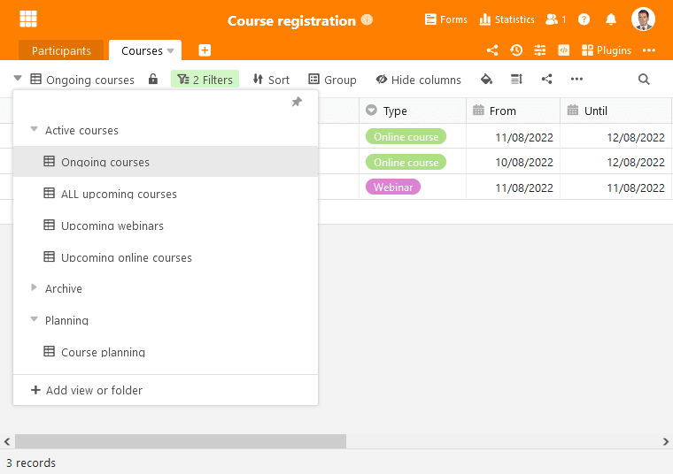

Nous sommes heureux de vous présenter la dernière version de SeaTable ! Bien qu'il ne s'agisse que d'une version "mineure", elle est très importante. Le plug-in de conception de pages étendu offre désormais plus d'options pour concevoir et gérer des modèles sophistiqués. De nouvelles fonctions permettent en outre de tout nouveaux scénarios d'utilisation. Il en va de même pour le Big Data Backend, qui atteint sa maturité productive avec la version 3.1. Cette fonctionnalité d'entreprise fait sauter la limite de 100 000 lignes par base de SeaTable et rend SeaTable prêt pour des tâches plus importantes. Les grandes équipes apprécieront la possibilité de trier les groupes sur la page d'accueil et de catégoriser les vues dans les bases. Nous vous présentons ici ces points forts et quelques autres nouveautés. Le changelog contient la liste complète des modifications.

Les nouvelles fonctionnalités sont disponibles dès maintenant sur [SeaTable Cloud](https://cloud.seatable.io/). La dernière version de SeaTable 3.1 a été installée ce matin. Les auto-hébergeurs peuvent télécharger SeaTable 3.1 depuis le fameux [dépôtDocker](https://hub.docker.com/r/seatable/seatable-enterprise) .

## Des listes et des documents plus rapides et plus beaux

Le plugin de conception de pages remanié pourrait faire l'objet d'une publication à part entière, tant il est rempli de nouvelles fonctions dans SeaTable 3.1. Il y a la fonction d'impression de listes, les champs dynamiques, y compris l'en-tête et le pied de page, ainsi que la fonction de versionnement. La barre latérale du mode d'édition s'est ainsi considérablement remplie (voir illustration ci-dessous). Ah et les modèles du plug-in peuvent désormais être déplacés et triés dans l'aperçu. Mais maintenant, tout dans l'ordre.

La nouvelle fonction d'impression de listes permet d'imprimer le contenu d'une vue sur papier ou dans un document PDF en un rien de temps et avec un design attrayant. Il suffit de faire glisser l'élément "Toutes les entrées de la vue" sur le modèle, de redimensionner l'espace réservé, de formater le tableau selon vos préférences et d'ajouter les autres éléments de la page comme le titre du document, le logo et la date. SeaTable s'occupe ensuite automatiquement de la mise en page du tableau et du saut de page lors de l'impression si les lignes de l'affichage choisi ne rentrent pas dans l'espace réservé. Pour cela, SeaTable complète autant de pages que nécessaire.

Les champs dynamiques permettent désormais d'insérer très facilement des informations contextuelles sur une page. Concrètement, il s'agit de la date du jour, du modèle utilisé, de l'utilisateur actuel et du numéro de page. En termes d'utilisation, les champs dynamiques ne se distinguent pas des champs de texte statiques. Les options de mise en forme sont également identiques. Il suffit de faire glisser le champ sur les modèles, de le positionner correctement et de le formater - SeaTable s'occupe du reste.

Les nouveaux en-têtes et pieds de page sont un complément idéal pour les éléments dynamiques. Les éléments qui y sont placés sont répétés sur chaque page, y compris bien sûr sur les pages que le plugin complète automatiquement lors de l'impression de listes. Et les éléments dynamiques ne sont pas les seuls à pouvoir être utilisés dans l'en-tête et le pied de page. Les deux champs de texte statique et d'image statique peuvent également être intégrés afin de doter les documents de méta-informations pertinentes.

En utilisant toutes ces nouveautés, il peut naturellement arriver que l'on confonde un peu son modèle et que l'on souhaite revenir à un état antérieur. La gestion des versions dont dispose le plugin de conception de pages avec cette version rend cela possible. Chaque fois que le modèle est enregistré, le plugin crée un instantané auquel vous pouvez revenir. Si les modifications apportées au modèle ne vous plaisent pas, elles peuvent être annulées en un seul clic. Lors de la restauration d'une version précédente, le modèle actuel est remplacé par la version précédente. Bien entendu, toutes les autres versions sont conservées.

Vous avez envie d'essayer le nouveau plugin de conception de pages ? Alors, allez-y ! Les améliorations sont disponibles dans tous les abonnements SeaTable Cloud et dans les éditions SeaTable Server Developer et Enterprise.

## Adieu limite de lignes (uniquement pour les abonnements Enterprise)

Si vous vous inquiétiez jusqu'à présent que la limite de 100 000 lignes par base de SeaTable puisse vous poser des problèmes dans un avenir proche, vous avez désormais un souci de moins. Grâce au nouveau backend Big Data, vous pouvez stocker des millions de lignes dans une base SeaTable. SeaTable offre ainsi non seulement une limite de lignes bien plus élevée que ses concurrents directs, mais s'aventure également dans des régions jusqu'ici réservées aux bases de données SQL classiques. Si vous cherchez une base de données avec API REST, support de script intégré, automatisation et/ou front-end graphique avec collaboration en temps réel, ne cherchez plus.

L'ancienne limite de taille était nécessaire car SeaTable devait charger entièrement une base dans la mémoire de travail pour travailler simultanément, ensemble dans une même base. Avec l'activation de la fonction Big Data, ce n'est plus le cas. La fonction Big Data divise les données dans une base : les jeux de données qui sont chargés automatiquement à l'ouverture d'une base et les jeux de données qui ne sont chargés qu'en cas de requête explicite - en français moderne on-demand -, par exemple lors d'un filtrage ou d'une analyse statistique sur tous les jeux de données. Si seules les données chargées automatiquement sont utilisées, même des millions d'enregistrements dans la mémoire des Big Data n'influencent pas les temps de chargement d'une base ou son besoin en mémoire.

Grâce à cette division des données en deux, l'utilisateur gagne une énorme flexibilité supplémentaire. Il est possible de mettre en œuvre des projets collaboratifs dans lesquels les membres de l'équipe travaillent dans l'interface web, tout comme des applications à forte intensité de données avec une saisie automatisée des données. Étant donné que les jeux de données dans le stockage de données volumineuses ne supportent pas la collaboration en ligne, c'est-à-dire que les modifications apportées aux données ne sont pas poussées vers d'autres utilisateurs, mais ne sont visibles qu'après une nouvelle consultation, ce stockage est particulièrement adapté aux jeux de données sur lesquels aucun travail actif n'est effectué. Cela explique également pourquoi la version bêta de la fonction Big Data de SeaTable 2.3 était encore [appelée Archives]().

Les enregistrements du Big Data Backend supportent tous les types de colonnes et peuvent être modifiés et supprimés, filtrés et regroupés. Les enregistrements peuvent également être déplacés entre le stockage normal et le stockage de données volumineuses. D'un autre côté, les possibilités de traitement des enregistrements Big Data restent, pour des raisons techniques, inférieures à celles du stockage normal. Il existe des restrictions notamment en ce qui concerne le partage, les automatisations et les plugins : les vues qui contiennent des données du Big Data Backend ne peuvent pas être partagées. De même, seul le plugin Statistiques peut traiter les jeux de données dans la mémoire Big Data. Tous les autres plugins ainsi que les automatisations ne peuvent utiliser que des vues normales. Les jeux de données Big Data ne peuvent pas non plus être liés. Si cela est nécessaire, ils doivent d'abord être déplacés dans la mémoire normale.

|                                               | Vue normale | Vue Big Data |
| --------------------------------------------- | ----------- | ------------ |
| Travail en collaboration                      | ✓ ;         |              |
| Support de tous les plugins                   | ✓ ;         |              |
| Prise en charge de tous les types de colonnes | ✓ ;         | ✓ ;          |
| Triage                                        | ✓ ;         | ✓ ;          |
| Filtrage                                      | ✓ ;         | ✓ ;          |
| Regroupement                                  | ✓ ;         | ✓ ;#         |
| Cacher                                        | ✓ ;         | ✓ ;          |
| Formatage conditionnel                        | ✓ ;         |              |
| Recherche                                     | ✓ ;         | ✓ ;          |
| Rechercher & remplacer                        | ✓ ;         |              |
| Traitement des données                        | ✓ ;         |              |
| Exportation vers Excel                        | ✓ ;         | ✓ ;          |
| Exportation vers DTABLE                       | ✓ ;         |              |

\# Cette fonction sera disponible à partir de la version 3.2 de SeaTable.

La mémoire Big Data doit être activée dans une base via les paramètres. Le transfert de données de la mémoire normale vers la mémoire Big Data s'effectue via la fonction "Archiver la vue". Le contenu de la mémoire Big Data peut être affiché dans une vue Big Data. Les vues Big Data chargent également des données de la mémoire Big Data en plus des enregistrements de la mémoire normale. Dans un premier temps, la vue ne charge que 1.000 lignes de la mémoire Big Data. Celles-ci sont reconnaissables dans l'éditeur de tableau au triangle gris dans la colonne des numéros de ligne. Le menu contextuel permet de déplacer ces lignes vers la mémoire normale. Pour afficher d'autres lignes Big Data, faites défiler le tableau au-delà de la fin ou cliquez sur "Charger tout" dans la barre d'état.

## Plus de clarté dans les grandes équipes

Pour les grandes équipes avec de nombreux utilisateurs, cela peut devenir un peu confus. Dans les bases, un grand nombre de vues se disputent l'attention et la page d'accueil rassemble des dizaines de groupes avec autant de bases, ce qui fait que l'on perd le focus sur l'essentiel.

Dans Bases, la nouvelle version permet désormais de regrouper les vues dans des dossiers et de retrouver ainsi une certaine clarté. Vous créez un dossier de la même manière qu'une vue. Vous pouvez ensuite déplacer des vues dans le nouveau dossier par glisser-déposer. Lors de la création du premier dossier, un autre dossier "Plus de vues" est créé, dans lequel toutes les vues existantes sont classées.

Afin d'apporter plus de clarté à la page d'accueil, SeaTable 3.1 permet désormais de classer les groupes dans l'ordre souhaité. L'icône de déplacement, déjà connue dans les vues, apparaît à côté du nom du groupe dans la navigation sur le côté gauche. Utilisez cette icône pour déplacer les groupes importants vers le haut et ceux que vous utilisez rarement vers le bas. Vous avez ainsi plus rapidement accès aux bases décisives. Nous ajouterons à l'avenir une fonction permettant de replier le groupe de manière à ce que les bases ne soient pas affichées.

## Et bien plus encore

Cette grande petite mise à jour comprend encore de nombreuses autres améliorations et nouveautés que nous ne présentons que brièvement ci-dessous.

Un bouton dans le type de colonne du même nom permet désormais d'envoyer des e-mails avec des pièces jointes. De même, tous les préparatifs ont été faits dans le backend pour pouvoir envoyer à l'avenir des e-mails formatés. Les travaux dans le frontend seront achevés dans une prochaine version.

Jusqu'à présent, le texte formaté était le seul type de colonne qui ne pouvait pas être filtré (à l'exception du type de colonne Bouton). L'introduction du filtre vide ou non vide permet de combler cette lacune.

Le plugin calendrier se présente désormais sur toute la largeur de l'écran, comme les autres plugins, et offre ainsi plus d'espace.

Nous avons également examiné une nouvelle fois les fonctions d'importation et d'exportation. L'objectif était d'améliorer encore l'importation Excel, ce qui, à notre avis, a bien fonctionné. Nous avons également inclus des apps externes dans l'exportation DTABLE, ce qui rend inutile une reconfiguration manuelle lors de la migration des bases.

En jetant un coup d'œil au changelog, on remarque également que beaucoup de travail a été effectué sur l'application universelle et le module de workflow. Ceux-ci seront publiés dans un avenir proche. On ne va donc pas s'ennuyer !
