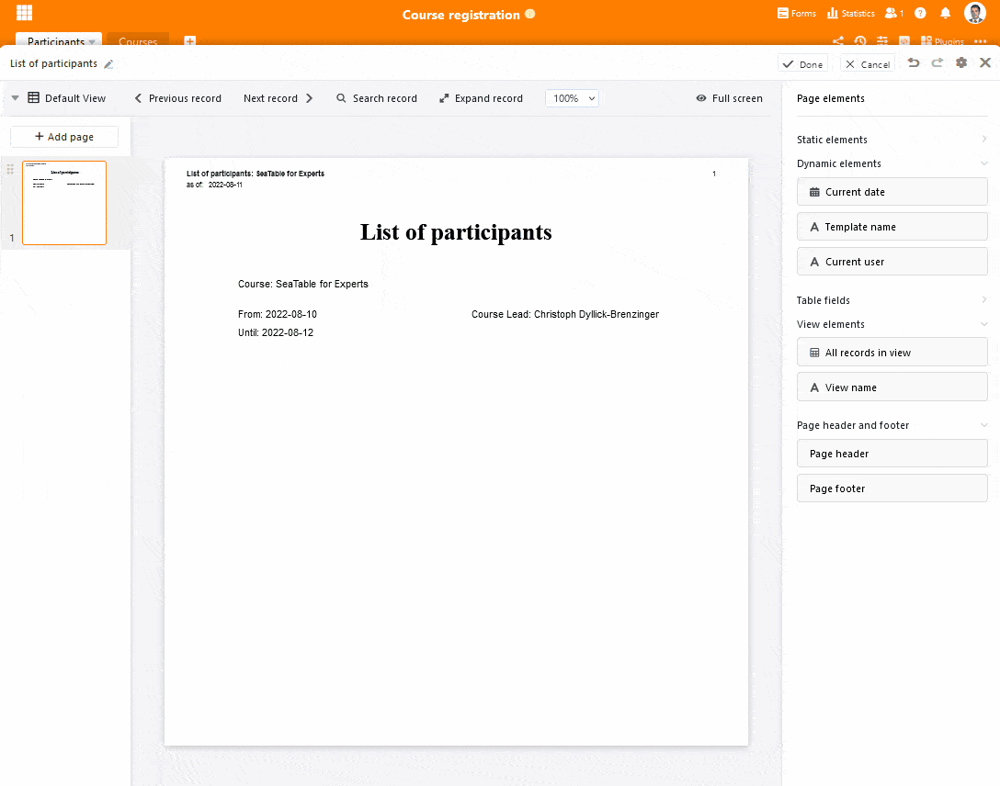

Temos o prazer de apresentar a última versão do SeaTable! O lançamento é apenas uma versão "menor", mas vem em grande estilo. O plugin de design de páginas alargado oferece agora mais opções para conceber e gerir modelos sofisticados. As novas funções também permitem cenários de aplicação completamente novos. O Big Data Backend, que está pronto para produção com a versão 3.1, faz o mesmo. A funcionalidade Enterprise excede o limite anterior do SeaTable de 100.000 linhas por base e torna o SeaTable pronto para tarefas maiores. As equipas maiores ficarão satisfeitas com a possibilidade de ordenar grupos na página inicial e de categorizar as vistas nas bases. Estes destaques e algumas outras novas funcionalidades são apresentados aqui. O registo de alterações contém a lista completa de alterações.

As novas funções estão agora disponíveis no [SeaTable Cloud](https://cloud.seatable.io/). A última construção da SeaTable 3.1 foi instalada esta manhã. Os auto-hospedeiros podem descarregar a SeaTable 3.1 a partir do conhecido [repositórioDocker](https://hub.docker.com/r/seatable/seatable-enterprise) .

## Listas e documentos mais rápidos e mais bonitos

Poder-se-ia dedicar uma publicação separada ao plugin de desenho de página revisto, tão repleto de novas funções que se apresenta no SeaTable 3.1. Há a função de impressão de lista, os campos dinâmicos incl. cabeçalho e rodapé, bem como a função de versionamento. A barra lateral em modo de edição foi significativamente preenchida (ver imagem abaixo). Ah, e os modelos no plug-in podem agora também ser movidos e classificados na visão geral. Mas agora tudo em ordem.

A nova função de impressão de listas coloca o conteúdo de uma vista em papel ou num documento PDF num instante, com um design atrativo. Basta arrastar o elemento "Todas as entradas da vista" para o modelo, ajustar o tamanho do marcador de posição, formatar a tabela de acordo com as suas preferências e adicionar os restantes elementos da página, como o título do documento, o logótipo e a data. O SeaTable trata automaticamente da disposição da tabela e da paginação durante a impressão, se as linhas da vista selecionada não couberem no espaço reservado. O SeaTable adiciona tantas páginas quantas as necessárias para o efeito.

Com os campos dinâmicos, a informação contextual pode agora ser facilmente inserida numa página. Especificamente, estes são a data actual, o modelo utilizado, o utilizador actual e o número de página. Em termos de utilização, os campos dinâmicos não diferem dos campos de texto estáticos. As opções de formatação são também idênticas. Basta arrastar o campo para os modelos, posicioná-lo correctamente e formatá-lo - SeaTable encarrega-se do resto.

Um complemento ideal para os elementos dinâmicos são os novos cabeçalhos e rodapés. Os elementos aí colocados são repetidos em cada página, incluindo, claro, nas páginas que o plugin adiciona automaticamente ao imprimir listas. E não só os elementos dinâmicos podem ser utilizados no cabeçalho e no rodapé. Os dois campos texto e imagem estática também podem ser incorporados para fornecer documentos com meta-informação significativa.

Ao utilizar todas estas inovações, é claro que pode acontecer que estrague um pouco o seu modelo e que queira voltar a um estado anterior. A versão que o plugin de desenho de página tem com esta versão torna exactamente isso possível. Cada vez que se guarda o modelo, o plugin cria um instantâneo para o qual se pode voltar a saltar. Se não gostar das alterações que fez ao modelo, elas podem ser desfeitas com um clique. Ao restaurar uma versão anterior, o modelo actual é substituído pela versão anterior. Naturalmente, todas as outras versões são mantidas.

Quer experimentar o novo plugin de desenho de página? Força nisso! As melhorias estão disponíveis em todas as assinaturas SeaTable Cloud e em SeaTable Server Developer e Enterprise Edition.

## Limite da linha Adieu (apenas para assinaturas de Empresas)

Se estava preocupado que o limite de 100.000 filas por base do SeaTable lhe pudesse causar problemas num futuro previsível, tem agora menos uma coisa com que se preocupar. Com o novo Big Data Backend, pode armazenar milhões de filas numa base SeaTable. Isto significa que o SeaTable não só oferece um limite de fila muito mais elevado do que os seus concorrentes imediatos, mas também empurra para regiões que anteriormente estavam reservadas para bases de dados SQL clássicas. Se procura uma base de dados com REST API, suporte de script integrado, automatizações e/ou frontend gráfico com colaboração em tempo real, então não procure mais.

A limitação de tamanho anterior era necessária porque o SeaTable tem de carregar uma base completamente na memória de trabalho a fim de trabalhar simultaneamente, juntos numa única base. Com a activação da função Big Data, este já não é o caso. A função Big Data divide os dados numa base: Conjuntos de dados que são automaticamente carregados quando uma base é aberta e conjuntos de dados que só são carregados quando explicitamente consultados, por exemplo, ao filtrar ou realizar uma análise estatística de todos os conjuntos de dados. Se apenas os dados carregados automaticamente forem utilizados, então mesmo milhões de registos de dados no armazenamento de Grandes Dados não influenciam os tempos de carregamento de uma base ou os seus requisitos de armazenamento.

Com esta bifurcação de dados, o utilizador, enquanto utilizador, ganha uma enorme flexibilidade adicional. Projectos colaborativos em que os membros da equipa trabalham na interface web podem ser implementados, bem como aplicações intensivas de dados com recolha automatizada de dados. Uma vez que os conjuntos de dados na loja Big Data não suportam a colaboração online, ou seja, as alterações aos dados não são empurradas para outros utilizadores mas apenas são visíveis após uma nova recuperação, esta loja é particularmente adequada para conjuntos de dados nos quais não está a decorrer qualquer trabalho activo. Isto também explica porque é que o beta da função Big Data em SeaTable 2.3 ainda aparecia sob o [nome Arquivo]().

Os conjuntos de dados no backend Big Data suportam todos os tipos de colunas e podem ser modificados e apagados, filtrados e agrupados. Os conjuntos de dados também podem ser movidos para trás e para a frente entre o armazenamento de dados normais e grandes. Por outro lado, as opções de edição dos conjuntos de dados Big Data são tecnicamente inferiores às do armazenamento normal. Existem restrições, especialmente no que diz respeito à partilha, automatizações e plug-ins: as opiniões que incluem dados do backend de Grandes Dados não podem ser partilhadas. Além disso, apenas o plugin de estatísticas pode tratar conjuntos de dados no grande armazém de dados. Todos os outros plugins e automatizações só podem utilizar vistas normais. Os grandes conjuntos de dados também não podem ser ligados. Se isto for necessário, devem ser primeiro movidos para a memória normal.

|                                      | Vista normal | Grande Vista de Dados |
| ------------------------------------ | ------------ | --------------------- |
| Trabalho colaborativo                | ✓            |                       |
| Apoio para todos os plugins          | ✓            |                       |
| Apoio para todos os tipos de colunas | ✓            | ✓                     |
| Ordenação                            | ✓            | ✓                     |
| Filtragem                            | ✓            | ✓                     |
| Agrupamento                          | ✓            | ✓#                    |
| Esconder                             | ✓            | ✓                     |
| Formatação condicional               | ✓            |                       |
| Pesquisa                             | ✓            | ✓                     |
| Pesquisa e Substituição              | ✓            |                       |
| Processamento de dados               | ✓            |                       |
| Exportar para Excel                  | ✓            | ✓                     |
| Exportar para DTABLE                 | ✓            |                       |

\# Esta função estará disponível no SeaTable 3.2.

O armazenamento de Big Data deve ser ativado numa Base através das definições. A transferência de dados da memória normal para a memória de Big Data é efectuada através da função "Vista de arquivo". O conteúdo da memória de Big Data pode ser visualizado numa vista de Big Data. As vistas Big Data carregam dados da memória Big Data para além dos conjuntos de dados da memória normal. Inicialmente, a vista só carrega 1.000 linhas da memória Big Data. Estas podem ser reconhecidas no editor de tabelas pelo triângulo cinzento na coluna do número da linha. Utilizando o menu de contexto, estas linhas podem ser movidas de volta para a memória normal. Para visualizar mais linhas do Big Data, desloque-se para além do fim da tabela ou clique em "Carregar tudo" na barra de estado.

## Mais visão geral em grandes equipas

Em grandes equipas com muitos utilizadores, pode tornar-se um pouco confuso. Nas bases, um grande número de pontos de vista competem por atenção e na homepage dezenas de grupos com o mesmo número de bases se reúnem, de modo que se perde o foco sobre o essencial.

Na nova versão do Bases, as vistas podem agora ser agrupadas em pastas para recuperar a clareza. Cria-se uma pasta da mesma forma que se cria uma vista. Pode então mover as vistas para a nova pasta utilizando a função arrastar e largar. Quando a primeira pasta é criada, é criada outra pasta "Mais vistas" na qual todas as vistas existentes são ordenadas.

Para trazer mais clareza à página inicial, o SeaTable 3.1 permite agora que os grupos sejam colocados numa ordem desejada. Ao lado do nome do grupo na navegação do lado esquerdo, verá o ícone de grupos em movimento, que já conhece das vistas. Use isto para mover grupos importantes para o topo e aqueles que raramente usa para a base. Isto dá-lhe um acesso mais rápido às bases importantes. Uma função de colapso do grupo para que as bases não sejam exibidas será adicionada no futuro.

## E muito mais

Esta pequena actualização inclui muitos mais melhoramentos e inovações, que apenas descreveremos brevemente a seguir.

Através de um botão no tipo de coluna com o mesmo nome, os e-mails com anexos podem agora também ser enviados. Todos os preparativos foram também feitos no backend para o envio de e-mails formatados no futuro. O trabalho no frontend será concluído num dos próximos lançamentos.

O texto formatado era até há pouco tempo o único tipo de coluna que não podia ser filtrado (para além do botão de tipo de coluna). Com o agora introduzido filtro vazio ou não vazio real, este défice é eliminado.

Tal como os outros plugins, o plugin do calendário apresenta-se agora em toda a largura do ecrã e oferece assim mais espaço.

Também analisámos de novo as funções de importação e exportação. O objectivo era melhorar ainda mais a importação de Excel, o que acreditamos ter feito bem. Também incluímos aplicações externas na exportação DTABLE, o que torna desnecessária a reconfiguração manual aquando da migração de bases.

Um olhar sobre o changelog revela também que muito trabalho está a ser colocado na aplicação universal e no módulo de fluxo de trabalho. Estes serão libertados num futuro próximo. Portanto, não será aborrecido!
