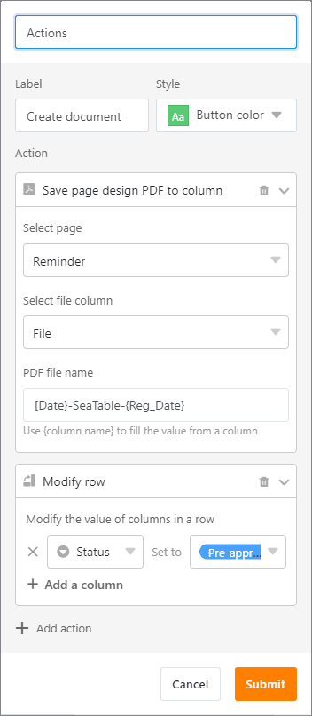
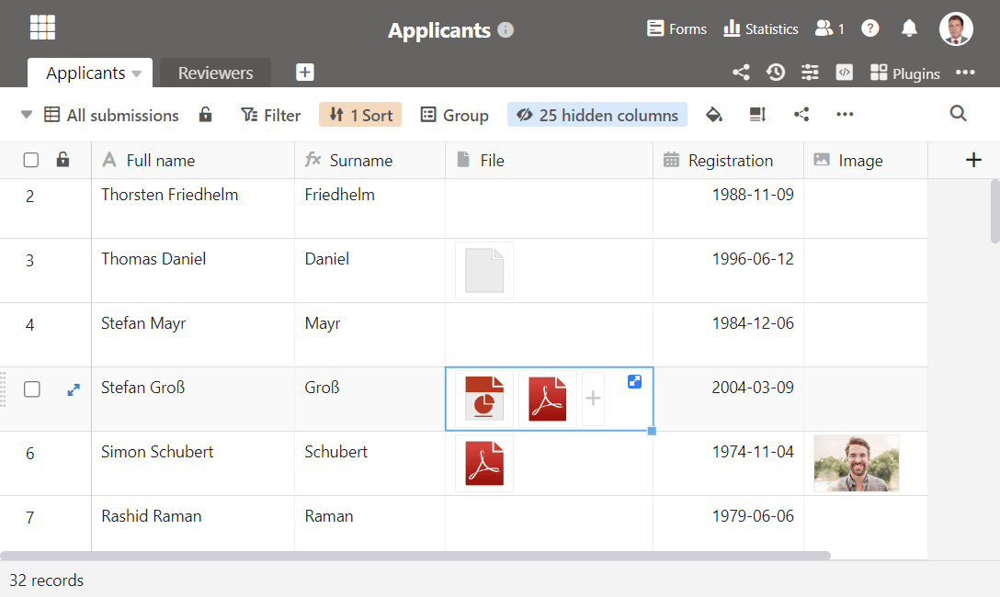
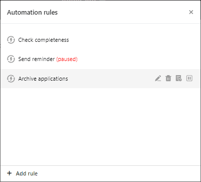

Welcome SeaTable 3.2! In the new release SeaTable's column types are in the spotlight: The formula column wizard is now interactive and offers significantly improved error correction. Buttons in the column type of the same name now allow to perform multiple actions with one click. New functions in the file column simplify the management of files and the selection columns also offer more convenient use. But not only the column types have benefited. Enterprise users in particular can look forward to improved automations.

Since this morning the latest version is running on [SeaTable Cloud](https://cloud.seatable.io). So if you want, you can try out and use the new features now. In the coming days, we will also make the corresponding Docker image available to self-hosters via the well-known [Docker](https://hub.docker.com/r/seatable/seatable-enterprise/tags) repository.

## Interactive formula wizard

The Formula Wizard previously offered little guidance when creating complex formulas. With the new formula wizard, even interconnected formulas with various column references and multiple functions can be created quickly. It provides interactive support during input and, if something does go wrong, offers meaningful error messages for quick troubleshooting.

Where previously there was only gray text, there is now a clear color language: formulas are displayed in blue font, column references are purple, numbers are green and text appears in red. Brackets - round as well as curly ones - are automatically closed when typing and a fine shadow marks connected brackets. Single and double quotation marks for plain text are also automatically doubled to speed up typing. Of course, the new wizard works not only for new formulas, but also for existing ones.

## Versatile button

Until now, the rule was "1 button - 1 action". This rule goes overboard with SeaTable 3.2. The new rule is "1 button - you choose the number of actions". For example, in SeaTable 3.2 you create a PDF document with the page design plugin with one click and then send it by email. Also, the row can be locked afterwards or cell values can be changed automatically (e.g. a status change). The available actions can be combined in any way. Existing buttons can, of course, also be assigned additional actions, making tables leaner and simpler.

Also new in SeaTable 3.2 is the execution of data processing options via a button. The specification of the operation is done in the menu of data processing operations itself, then in the configuration of the button the existing data processing operation is simply selected.

And individual operations have been improved as well! The previously static subject line in the "Send e-mail" action now shows its dynamic side. Like the other fields for quite some time, the subject line now supports referencing of columns in the format {column name}. This way, an ID, a project name, a user or a status from the row can easily be inserted in the email subject. All columns referenced in the "Send Email" action, be it in the "Subject", "Send to", "Send copy to" or even "Reply to (optional)" as well as the message itself, can also be hidden. The e-mail dispatch works nevertheless.

Even with these improvements, the column type button remains in active development. We still have many ideas that we will implement in the coming months.

## Convenient file management

In SeaTable 3.2 a new element decorates selected cells in columns of type File and Image. A click on the double arrow opens a pop-up that shows the files of the cell in a list view. Previously, this required a click in the white space between the file icons - not infrequently a ticklish endeavor. We have also improved the file pop-up itself. The 3-dot icon for the advanced functions can now be used to rename files. Previously, this required a download and re-upload.

Another new feature is the ability to convert image columns to file columns without losing the cell contents. This is especially relevant if you want to use the former for e-mail attachments. The action "Send e-mail" currently supports only the column type File. (The lossless conversion only works if the images are stored in SeaTable. It does not work for images that are embedded via a link).

## More convenient selection columns

Options in single and multiple selection columns that contain a longer string are displayed abbreviated in the table view. To display the string in its entirety, SeaTable 3.2 now provides a tooltip. Drag the mouse on the option in the table view and the text of the option appears in full length - an effect that has existed in the rows file view for some time.

The use of single select fields in the page design plugin previously suffered from the static size of the bubble. Consequently, a responsive design required the surrounding text to be adjusted. This limitation is also a thing of the past with the new SeaTable version. With the update of the page design plugin, single-selection options can now be displayed as plain text whose font size, weight and color can be customized as desired.

## More powerful automations

The possibilities for managing automations are extended in SeaTable 3.2 in two places. First, warnings are now also displayed in the automation execution log. For example, a warning is logged if an automation rule applies to a large number of rows and triggers a correspondingly large number of actions. Warnings are thus used to provide indications of problems in the configuration of an automation. The possibility to pause an automation is the second added feature in SeaTable 3.2. A click on the corresponding icon stops the execution of the automation until further notice. A corresponding hint marks paused automations.

Of course, the automatically executed action "Send e-mail" must not be inferior to the action of the same name triggered by a button. Therefore, automatically sent e-mails in SeaTable 3.2 now also support file attachments and column references for the subject line.

Furthermore, the possibility to send messages and e-mails conditionally periodically was eagerly awaited by some users. In this way, for example, specific groups of people can be contacted automatically on a monthly basis. Use cases are the renewal of subscriptions/memberships, reminders of documentation requirements or the assignment of recurring tasks.

## And much more

Of course, we cannot present all the new features in detail in these release notes without going into excessive detail. The complete list of changes can be found in the [changelog](). In this last section, we present other new features very briefly:

This version catches up for sorting and grouping what filters have already allowed for some time: changing their order. More extensive filtering, sorting and grouping rules can thus be effortlessly adapted afterwards to changing requirements.

Shared datasets now also support hourly synchronization. Automatic synchronization was only possible daily up to and including SeaTable 3.1.

A new data processing operation 'Transfer user name' reads a column of the type creator, last editor or employee and copies the name of the referenced user into a text column. If two or more users are named in an employee column, then they are inserted comma-separated in the text column.

When a new column is added to a table, SeaTable checks if there are hidden columns in other views. If this is the case, then the newly created column will be hidden in these views as well.

In addition to the improved display of single-selection fields, the page design gets another improvement: Multiple elements can now be aligned collectively, as known from PowerPoint, for example.  

Last but not least, the Timeline plugin is happy about an improvement: Groupings in a view can now also be displayed in the plugin. Specifically: The entries in a grouping are displayed separated from each other by swimlanes.
