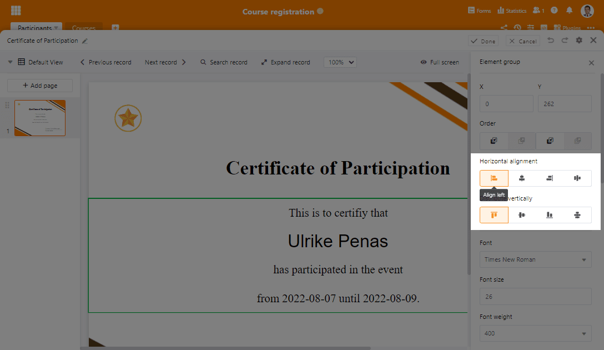

Bienvenue dans SeaTable 3.2 ! Dans cette nouvelle version, les types de colonnes de SeaTable sont sous les feux de la rampe : l'assistant de la colonne de formules est désormais interactif et offre une correction d'erreurs nettement améliorée. Les boutons du type de colonne du même nom permettent désormais d'effectuer plusieurs actions en un seul clic. De nouvelles fonctions dans la colonne des fichiers simplifient la gestion des fichiers et les colonnes de sélection offrent également une utilisation plus confortable. Mais les types de colonnes ne sont pas les seuls à en profiter. Les utilisateurs d'Enterprise, en particulier, peuvent se réjouir de l'amélioration des automatisations.

Depuis ce matin, la dernière version fonctionne sur [SeaTable Cloud](https://cloud.seatable.io). Ceux qui le souhaitent peuvent donc dès à présent tester et utiliser les nouvelles fonctionnalités. Dans les jours à venir, nous mettrons également à disposition des auto-hébergeurs l'image Docker via le célèbre [dépôtDocker](https://hub.docker.com/r/seatable/seatable-enterprise/tags) .

## Assistant de formule interactif

Jusqu'à présent, l'assistant de formules n'offrait que peu d'orientation lors de la création de formules complexes. Le nouvel assistant de formules permet de créer rapidement des formules combinées avec diverses références de colonnes et plusieurs fonctions. Il apporte une aide interactive lors de la saisie et propose, en cas d'erreur, des messages d'erreur pertinents pour un dépannage rapide.

Là où il n'y avait que du texte gris, il y a maintenant un langage des couleurs clair : les formules sont affichées en bleu, les références aux colonnes sont violettes, les chiffres sont verts et le texte apparaît en rouge. Les parenthèses - qu'elles soient rondes ou entrecroisées - sont automatiquement fermées lors de la saisie et une ombre fine marque les parenthèses jointes. Les apostrophes simples et doubles pour le texte simple sont également automatiquement doublées afin d'accélérer la saisie. Bien entendu, le nouvel assistant ne fonctionne pas seulement pour les nouvelles formules, mais aussi pour les formules existantes.

## Bouton polyvalent

Jusqu'à présent, la règle "1 bouton - 1 action" s'appliquait. Cette règle est abandonnée avec SeaTable 3.2. La nouvelle règle est "1 bouton - vous choisissez le nombre d'actions". Dans SeaTable 3.2, vous pouvez par exemple créer un document PDF en un seul clic à l'aide du plug-in de conception de pages, puis l'envoyer par e-mail. Il est également possible de verrouiller ensuite la ligne ou de modifier automatiquement les valeurs des cellules (par ex. un changement d'état). Les actions disponibles peuvent être combinées à volonté. Il est bien entendu possible d'attribuer d'autres actions aux boutons existants, ce qui permet d'alléger et de simplifier les tableaux.

Une autre nouveauté de SeaTable 3.2 est l'exécution d'options de traitement des données via un bouton. La spécification de l'opération se fait dans le menu des opérations de traitement des données lui-même, il suffit ensuite de sélectionner l'opération de traitement des données existante dans la configuration du bouton.

Et certaines opérations ont également été améliorées ! La ligne d'objet jusqu'à présent statique dans l'action "Envoyer un e-mail" montre désormais son côté dynamique. Comme les autres champs depuis un certain temps déjà, la ligne d'objet supporte désormais le référencement de colonnes au format {nom de la colonne}. De cette manière, il est très facile d'insérer un ID, un nom de projet, un utilisateur ou un statut de la ligne dans le sujet de l'e-mail. Toutes les colonnes référencées dans l'action "Envoyer un e-mail", que ce soit dans "Objet", "Envoyer à", "Envoyer en copie à" ou encore "Répondre à (facultatif)" ainsi que dans le message lui-même, peuvent également être masquées. L'envoi d'un e-mail fonctionne tout de même.

Même avec ces améliorations, le bouton de type colonne reste en développement actif. Nous avons encore de nombreuses idées que nous mettrons en œuvre dans les mois à venir.

## Gestion confortable des fichiers

Dans SeaTable 3.2, un nouvel élément orne les cellules sélectionnées dans les colonnes de type Fichier et Image. Un clic sur la double flèche ouvre un pop-up qui affiche les fichiers de la cellule dans une vue en liste. Jusqu'à présent, il fallait cliquer dans l'espace blanc entre les icônes des fichiers, ce qui était souvent une tâche difficile. Nous avons également amélioré le pop-up de fichier lui-même. L'icône à trois points pour les fonctions avancées permet désormais de renommer les fichiers. Jusqu'à présent, il fallait pour cela télécharger et recharger le fichier.

Une autre nouveauté est la possibilité de convertir les colonnes d'images en colonnes de fichiers sans perdre le contenu des cellules. Ceci est particulièrement important si l'on veut utiliser les premières pour des pièces jointes à des e-mails. L'action "Envoyer un e-mail" ne supporte actuellement que le type de colonne Fichier. (La conversion sans perte ne fonctionne que si les images sont placées dans SeaTable. Cela ne fonctionne pas pour les images qui sont intégrées via un lien).

## Des colonnes de sélection plus pratiques

Les options des colonnes à sélection unique ou multiple qui contiennent une chaîne de caractères plus longue sont affichées de manière abrégée dans la vue du tableau. Pour afficher la chaîne de caractères dans son intégralité, SeaTable 3.2 propose désormais une info-bulle. Il suffit de faire glisser la souris sur l'option dans la vue tableau pour que le texte de l'option s'affiche en entier - un effet qui existait déjà depuis longtemps dans la vue partielle des lignes.

L'utilisation de champs de sélection simples dans le plug-in de conception de page souffrait jusqu'à présent de la taille statique de la bulle. Pour obtenir un design attrayant, il fallait donc adapter le texte environnant. Cette limitation est également révolue avec la nouvelle version de SeaTable. Avec la mise à jour du plugin de conception de page, les options de sélection simple peuvent désormais être affichées sous forme de texte simple dont la taille, le poids et la couleur de la police peuvent être adaptés à volonté.

## Des automatismes plus performants

Les possibilités de gestion des automations ont été étendues à deux endroits dans SeaTable 3.2. D'une part, les avertissements sont désormais affichés dans le journal d'exécution des automatisations. Un avertissement est par exemple consigné lorsqu'une règle d'automatisation s'applique à un grand nombre de lignes et déclenche un nombre correspondant d'actions. Les avertissements fournissent donc des indications sur les problèmes rencontrés lors de la configuration d'une automatisation. La possibilité de mettre en pause une automatisation est la deuxième fonction ajoutée dans SeaTable 3.2. Un clic sur l'icône correspondante empêche l'exécution de l'automatisation jusqu'à nouvel ordre. Une remarque correspondante signale les automations mises en pause.

L'action automatisée "Envoyer un e-mail" ne doit évidemment pas être inférieure à l'action du même nom déclenchée par un bouton. C'est pourquoi les e-mails envoyés automatiquement dans SeaTable 3.2 prennent désormais en charge les pièces jointes et les références de colonne pour la ligne d'objet.

Certains utilisateurs attendaient en outre avec impatience la possibilité d'envoyer des messages et des e-mails de manière périodique et conditionnelle. De cette manière, il est possible de contacter automatiquement certains groupes de personnes chaque mois, par exemple. Les cas d'application sont le renouvellement d'abonnements/d'adhésions, le rappel des exigences en matière de documentation ou l'attribution de tâches récurrentes.

## Et bien plus encore

Bien entendu, nous ne pouvons pas, sans être excessivement prolixe, présenter en détail toutes les nouvelles fonctionnalités dans ces notes de version. La liste complète des changements se trouve dans le [changelog](). Dans cette dernière section, nous présentons brièvement d'autres nouveautés :

Avec cette version, les tris et les regroupements bénéficient de ce que les filtres permettent déjà depuis un certain temps : la modification de leur ordre. Des règles de filtrage, de tri et de regroupement plus étendues peuvent donc être facilement adaptées a posteriori à des exigences changeantes.

Les ensembles de données partagés prennent désormais en charge la synchronisation horaire. Jusqu'à SeaTable 3.1 inclus, la synchronisation automatique n'était possible que quotidiennement.

Une nouvelle opération de traitement des données 'Transférer nom d'utilisateur' lit une colonne de type Créateur, Dernier collaborateur ou Employé et copie le nom de l'utilisateur référencé dans une colonne de texte. Si deux utilisateurs ou plus sont mentionnés dans une colonne de collaborateurs, ils sont alors insérés dans la colonne de texte, séparés par une virgule.

Lorsqu'une nouvelle colonne est ajoutée dans un tableau, SeaTable vérifie s'il y a des colonnes masquées dans d'autres vues. Si c'est le cas, la colonne nouvellement créée est également masquée dans ces vues.

Outre l'amélioration de l'affichage des champs de sélection simples, la conception des pages bénéficie d'une autre amélioration : il est désormais possible d'aligner collectivement plusieurs éléments, comme on le fait par exemple dans PowerPoint.  

Last but not least, le plugin Timeline se réjouit également d'une amélioration : les regroupements dans une vue peuvent désormais être représentés dans le plugin. Concrètement, les entrées d'un regroupement sont séparées les unes des autres par des swimlanes.
