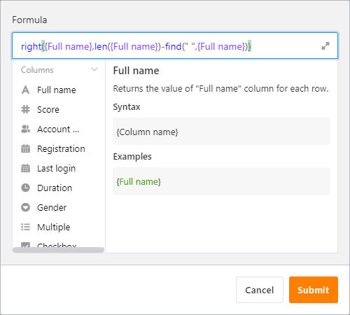
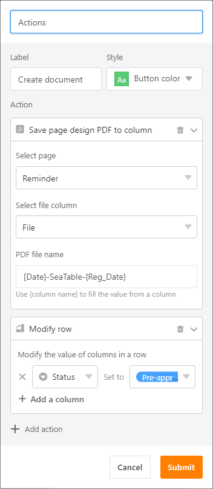
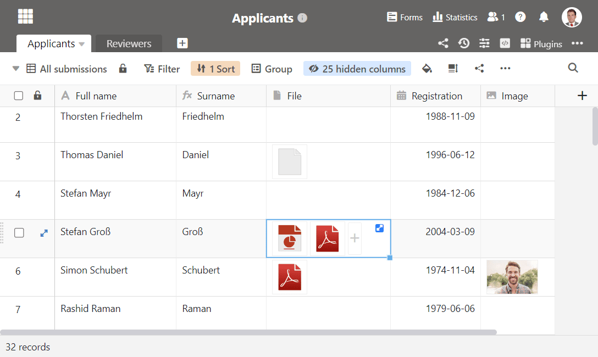
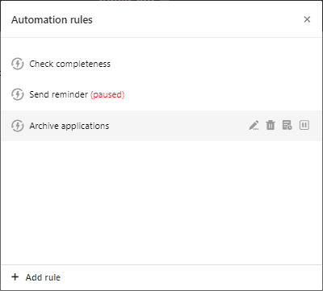
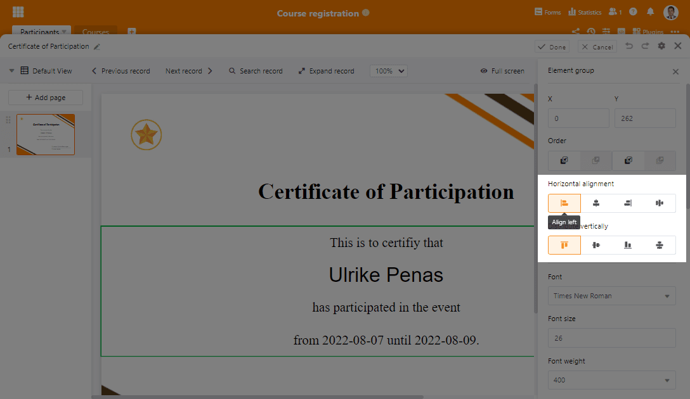

Добро пожаловать в SeaTable 3.2! В новом выпуске в центре внимания находятся типы столбцов SeaTable: мастер создания столбцов формул теперь интерактивен и предлагает значительно улучшенную коррекцию ошибок. Кнопки в одноименном типе столбца теперь позволяют выполнять несколько действий одним щелчком. Новые функции в колонке файлов упрощают управление файлами, а колонки выбора также обеспечивают более удобное использование. Но не только типы колонн получили выгоду. Корпоративные пользователи, в частности, могут рассчитывать на улучшенную автоматизацию.

Последняя версия работает на [SeaTable Cloud](https://cloud.seatable.io) с сегодняшнего утра. Теперь любой желающий может опробовать и использовать новые функции. В ближайшие дни мы также сделаем соответствующий образ Docker доступным для самостоятельных хостеров через известный [репозиторийDocker](https://hub.docker.com/r/seatable/seatable-enterprise/tags) .

## Интерактивный мастер формул

До сих пор мастер формул предоставлял мало рекомендаций при создании сложных формул. С помощью нового мастера формул можно быстро создавать даже взаимосвязанные формулы с различными ссылками на столбцы и несколькими функциями. Он обеспечивает интерактивную поддержку во время ввода и, если что-то пойдет не так, предлагает содержательные сообщения об ошибках для быстрого устранения неполадок.

Там, где раньше был только серый текст, теперь есть четкий цветовой язык: формулы отображаются синим шрифтом, ссылки на столбцы - фиолетовым, числа - зеленым, а текст - красным. Скобки - как круглые, так и фигурные - автоматически закрываются при вводе, а тонкая тень отмечает соединенные скобки. Одинарные и двойные инвертированные запятые для обычного текста также автоматически удваиваются для ускорения набора текста. Конечно, новый мастер работает не только для новых формул, но и для существующих.

## Универсальная кнопка

До сих пор действовало правило "1 кнопка - 1 действие". В SeaTable 3.2 это правило перестало действовать. Новое правило - "1 кнопка - вы сами выбираете количество действий". Например, в SeaTable 3.2 вы одним щелчком мыши создаете PDF-документ с помощью плагина оформления страниц, а затем отправляете его по электронной почте. Кроме того, можно заблокировать строку или автоматически изменить значения ячеек (например, изменить статус). Доступные действия можно комбинировать любым образом. Существующим кнопкам, разумеется, можно назначить дополнительные действия, что позволяет уменьшить и упростить таблицы.

Также новым в SeaTable 3.2 является выполнение опций обработки данных с помощью кнопки. Спецификация операции выполняется в самом меню операций обработки данных, затем в конфигурации кнопки просто выбирается существующая операция обработки данных.

Улучшены и отдельные операции! Ранее статичная строка темы в действии "Отправить письмо" теперь демонстрирует свою динамическую сторону. Как и другие поля, строка темы теперь поддерживает ссылки на столбцы в формате {имя столбца}. Таким образом, из строки в тему письма можно легко вставить идентификатор, название проекта, пользователя или статус. Все колонки, на которые ссылается действие "Отправить письмо", будь то "Тема", "Отправить на", "Отправить копию на" или даже "Ответить на (опционально)", а также само сообщение, также могут быть скрыты. При этом отправка письма по-прежнему работает.

Даже с этими улучшениями кнопка типа колонки остается в активной разработке. У нас еще много идей, которые мы будем реализовывать в ближайшие месяцы.

## Удобное управление файлами

В SeaTable 3.2 новый элемент украшает выделенные ячейки в столбцах типа Файл и Картинка. Щелчок по двойной стрелке открывает всплывающее окно, отображающее файлы ячейки в виде списка. До сих пор для этого требовалось щелкнуть мышью в белом пространстве между значками файлов, что нередко становилось непростой задачей. Мы также улучшили само всплывающее окно файла. С помощью значка с тремя точками для расширенных функций теперь можно переименовывать файлы. Раньше для этого требовалось загрузить и снова загрузить.

Еще одной новой функцией является возможность преобразования колонок изображений в колонки файлов без потери содержимого ячеек. Это особенно актуально, если вы хотите использовать первые для вложений в электронные письма. В настоящее время действие "Отправить по электронной почте" поддерживает только тип столбца file. (Преобразование без потерь работает только в том случае, если изображения хранятся в SeaTable. Это не работает для изображений, интегрированных по ссылке).

## Более удобные колонки выбора

Параметры в столбцах одиночного и множественного выбора, содержащие более длинную строку, отображаются в табличном представлении в сокращенном виде. Чтобы отобразить строку полностью, SeaTable 3.2 теперь предлагает всплывающую подсказку. Перетащите мышь на опцию в представлении таблицы, и текст опции появится во весь рост - эффект, который уже некоторое время существует в представлении файла строк.

Использование полей с одним выбором в плагине дизайна страницы ранее страдало от статичного размера пузырька. Отзывчивый дизайн, следовательно, требует адаптации окружающего текста. Это ограничение также ушло в прошлое с новой версией SeaTable. С обновлением плагина дизайна страницы, отдельные параметры выбора теперь могут отображаться в виде простого текста, размер, вес и цвет шрифта которого можно настроить по своему усмотрению.

## Более мощные автоматизированные системы

Возможности управления автоматизацией расширены в SeaTable 3.2 в двух местах. Во-первых, предупреждения теперь также отображаются в журнале выполнения автоматизации. Предупреждение регистрируется, например, если правило автоматизации применяется к большому количеству строк и вызывает соответствующее большое количество действий. Таким образом, предупреждения предоставляют информацию о проблемах в конфигурации автоматизации. Возможность приостановить автоматизацию - вторая добавленная функция в SeaTable 3.2. Щелчок на соответствующей иконке останавливает выполнение автоматизации до дальнейшего уведомления. Соответствующим примечанием отмечаются приостановленные автоматические действия.

Автоматически выполняемое действие "Отправить письмо", разумеется, ни в чем не должно уступать одноименному действию, вызываемому кнопкой. Поэтому автоматически отправляемые письма в SeaTable 3.2 теперь поддерживают также вложения файлов и ссылки на колонки в строке темы.

Кроме того, некоторые пользователи с нетерпением ждали возможности условно периодической отправки сообщений и электронных писем. Таким образом, например, с определенными группами людей можно автоматически связываться ежемесячно. Примерами использования являются продление подписки/ членства, напоминания о требованиях к документации или назначение повторяющихся задач.

## И многое другое

Конечно, мы не можем подробно представить все новые функции в этих заметках о выпуске, не вдаваясь в излишние подробности. Полный список изменений можно найти в [журнале изменений](). В этом последнем разделе мы кратко представим дальнейшие инновации:

В этой версии для сортировки и группировки сделано то, что уже давно позволяют фильтры: изменение их порядка. Таким образом, более обширные правила фильтрации, сортировки и группировки могут быть легко адаптированы к изменяющимся требованиям.

Общие наборы данных теперь также поддерживают почасовую синхронизацию. Автоматическая синхронизация была возможна только ежедневно до версии SeaTable 3.1 включительно.

Новая операция обработки данных 'Перенести имя пользователя' считывает колонку типа создатель, последний редактор или сотрудник и копирует имя ссылающегося пользователя в текстовую колонку. Если в колонке "Сотрудники" названы два или более пользователей, то они вставляются в текстовую колонку через запятую.

Когда в таблицу добавляется новый столбец, SeaTable проверяет, существуют ли скрытые столбцы в других представлениях. В этом случае вновь созданный столбец также будет скрыт в этих представлениях.

Помимо улучшенного отображения полей одиночного выбора, дизайн страницы получил еще одно улучшение: теперь несколько элементов могут быть выровнены коллективно, как это известно, например, из PowerPoint.  

И последнее, но не менее важное улучшение: теперь группировки в представлении также могут отображаться в плагине Timeline Plugin. В частности: записи в группировке отображаются отделенными друг от друга плавающими линиями.
