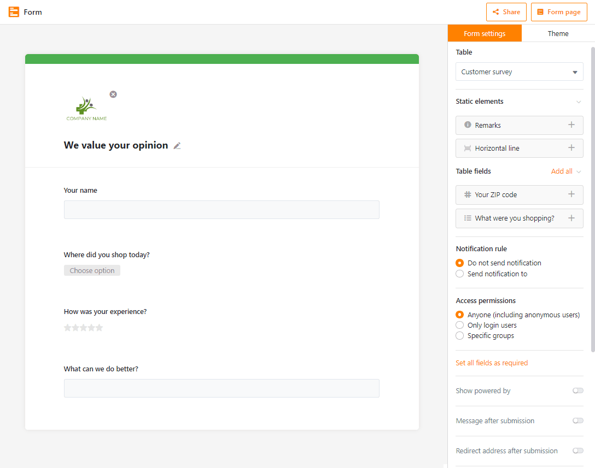
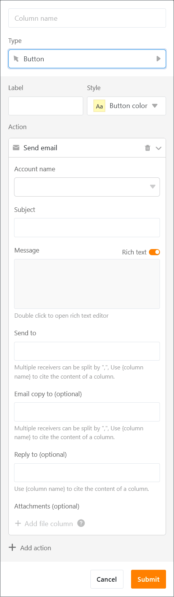
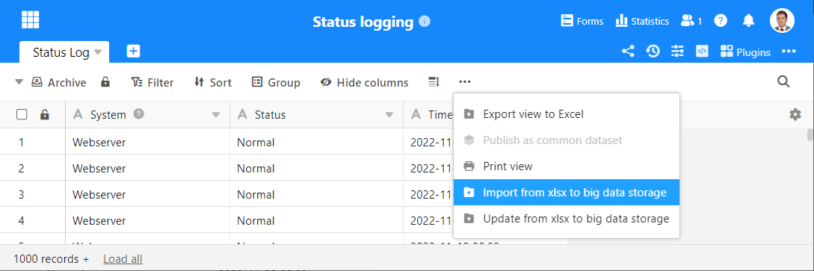
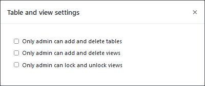

SeaTable fans will receive their Christmas present today: version 3.3 of SeaTable with its numerous improvements and new features. The completely revised form editor in block design offers new freedoms and additional functions for the design and use of web forms. In addition to text e-mails, SeaTable now also sends formatted HTML e-mails. The extended editor for formatted text makes this a breeze. And payment columns now offer automatic data validation as already known from text columns. Also users who want to manage mass data in SeaTable will get their money's worth with SeaTable 3.3. From now on SeaTable can import hundreds of thousands of rows from an XLSX file directly into the Big Data store and export them again from there. Want to know more? Then read on!

SeaTable Server 3.3 is available on SeaTable Cloud since this morning. Self-hosters can download build 3.3.7 from the well-known [Docker repository](https://hub.docker.com/r/seatable/seatable-enterprise) and install it on their own server. In the [changelog](https://seatable.io/docs/changelog/version-3-3/?lang=auto) you can find - as always - the complete list of changes.

## More flexibility with forms

In the revised editor for web forms, "blocks" replace the sliders in the settings sidebar. If such a block is dragged into the form and "dropped", then the associated element is added to the form at the current position. All settings for the block can be modified in the sidebar. This sounds familiar? That's right! The form editor thus adopts the user interface design of the page design plugin.

The numerous advantages of the block design are convincing: The fields in the form can be in any order. The order of the form fields does not have to correspond to the order of the columns in the table. Each form can have an individual field sequence. Of course, all blocks in the form can be moved later. To swap the sequence of two fields, simply drag the lower field over the upper one (or vice versa) and you have optimized the sequence. Which fields you use in forms and in which order is now entirely up to you with the new editor.

\***\*But the block design can do even more. Two blocks for static content complement the blocks for the input fields. The **Horizontal Line** block can be used to structure a form thematically; the **Annotations** block can be used to place explanatory text in the form. Since the annotation blocks\*\*** can be worked \***\*with more flexibly than the previous**web form hints\*\*, the latter disappear from the settings sidebar and make room for other things.

Three new functions complete the rebuild of the editor. In the submission message, you can now reference columns in the form's table. This can be a field that was filled in the form or a generated or calculated value from a formula. This means that nothing stands in the way of a personal thank you to the submitter or the display of a processing number. The second new feature is the "Activation required" option for checkboxes. If the option is set, then the form can only be submitted if the corresponding checkbox is checked. This is helpful when you need to obtain consent, such as for terms of use or personal data processing. Third, you can now make all fields in your form mandatory with one click.

Existing forms are automatically converted to the block design. For this purpose, among other things, the previous web form notes are converted into annotation blocks. Thus, all new functions of the block editor are also directly available in existing forms.

Some other improvements for the form editor are currently still in the works and unfortunately did not make it into the Christmas release. If you like to use SeaTable's web forms frequently, then there is every reason to look forward to SeaTable 3.4!

## Fancier emails with HTML

For many business processes, sending emails is essential. SeaTable already offers this capability since version 2. With this December update, the e-mail function is substantially upgraded: SeaTable now supports HTML e-mails. In these - unlike in plain text emails - you can insert images, tables, comments and other formatting, as you know it from email clients like Outlook, Thunderbird or Apple Mail.

To send an HTML email via button, simply click the **Formatted Text** slider in the button's settings. This will change the email to HTML format. The HTML mail is then created in SeaTable's well-known and familiar formatted text editor. On closer inspection, however, it becomes apparent that the interface of the HTML mail editor is not exactly the same as that of the editor for formatted text: there is an additional icon in the ribbon. Using this icon, column values can be inserted into a message and formatted. Every column of the table and every column type (exception: button) can be integrated into an e-mail this way.

HTML support is currently only implemented for emails sent via button. HTML emails are expected to be available in automations as of version 3.4.

## Excel bulk import and export

Thanks to the Big Data function introduced in [version 3.1,]() you can permanently store millions of rows in one base. With version 3.3 you can now also conveniently fill this storage volume by importing data. Up to 500,000 rows can be imported in the new SeaTable version from an XLSX file directly into the Big Data storage and then also updated. And also in the other direction the new release enables the exchange of large amounts of data: Up to 250,000 rows can be exported to an Excel table in one go.

The bulk import is done directly into the Big Data store (or SeaTables component dtable-db). You can edit and analyze the data with all the functions available in a Big Data view. Up to the limit of 100,000 rows you can also move imported rows into the normal storage to collaborate on them in real time.

The new import, update and export function can be accessed via the advanced functions of a Big Data view.

## Automatic data validation in columns of type number

You already use automatic input validation in text columns to avoid errors and are waiting to do the same in number columns? With SeaTable 3.3 your patience is rewarded. You can now set validity ranges in all columns with number, percentage and currency values. If the value of an entered number is outside this range, the cell will be colored red. However, validation does not only work for input. If you activate data validation in a column that already contains values, or modify the validity range, then all cell values are checked again and marked if necessary. Possible problem values can thus be visually detected in no time.

The two numbers that mark the validity range are automatically displayed with the number of decimal places that you specified in the column settings. If you have not made a corresponding specification, then you can enter the two values with freely selectable precision.

## That was not all

There are a few more improvements, which will be presented here individually, but very briefly:

Conditional formatting in columns can now also highlight duplicates. When enabled, all cells whose content appears in identical form two or more times in a column are highlighted. Together with value-based and rule-based formatting, SeaTable now offers three types of conditional formatting.

A third option has also been added to the table and view settings. Now the creation and deletion of views can be made an exclusive right of the Base owner or Base administrator(s).

The new function isempty() checks whether a cell is empty. Especially in IF or IFS formulas special cases can be caught with this function. The syntax of the new formulas is identical to the Excel formula isblank().

## Important function change

The functionality of the search() and find() formulas has been adapted to the functionality of the Excel formulas of the same name to simplify the switch from Excel. Previously, the result value for a string that was not found was "0". In the future the result value will be "#VALUE!". Please check your formulas to see if they need to be adjusted.
