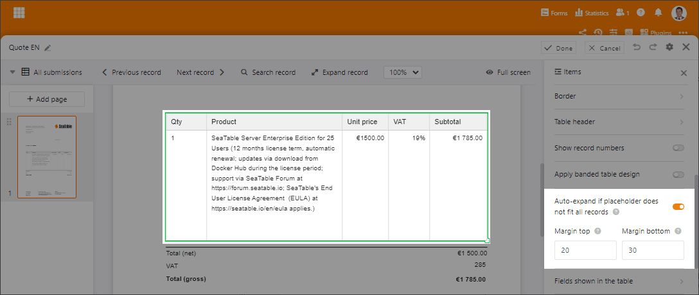
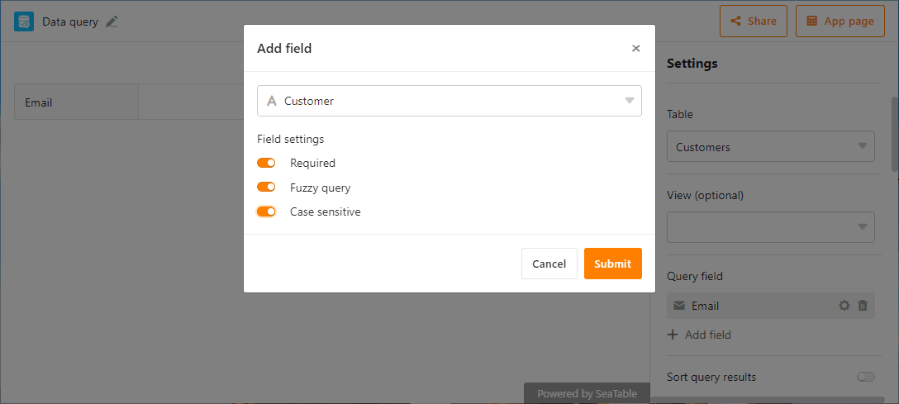
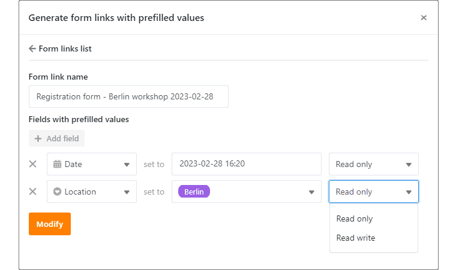
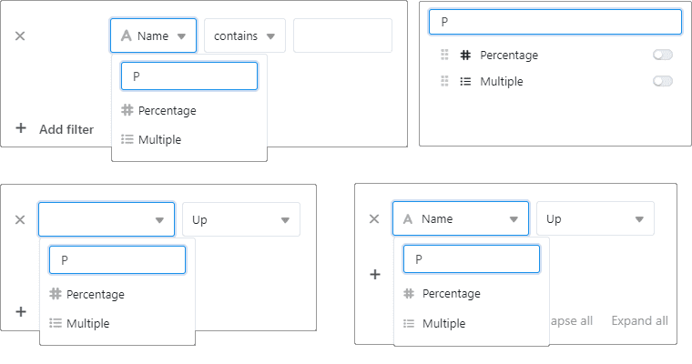
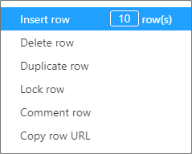

Spring awakening at SeaTable! While the first blossoms are sprouting outside, we are coming out of the winter break with SeaTable 3.4. Warm up for an improved user experience and even more design freedom! The page design plugin now unfolds its full potential, just like the editor for web forms - with enhanced functions for dynamic positioning of elements and other useful options. Discover the new search function when filtering, sorting and grouping in the view settings as well as when creating options in selection columns. Notable new features include the Data Query app, which now allows refined searching across multiple fields. The rows context menu has also been given more options and the entries in the rows log have a new look.

You want to know more? Then let's get started! This morning we updated SeaTable Cloud to version 3.4. All self-hosters can do the same - and even unleash the row limit per base. The image of SeaTable 3.4 is available for download from the [the well-known Docker repository](https://hub.docker.com/r/seatable/seatable-enterprise). As always, see the [Changelog](https://seatable.io/en/seatable-release-3-4/) for the complete list of changes.

## Dynamic positioning of elements in page design

With the page design plugin you can convert data from your bases into descriptive documents. At the push of a button, a form letter, a certificate or an inventory list is generated. Until now, the page design plugin was less suitable for creating documents with variable length content, such as quotes or invoices. We remove this limitation with SeaTable 3.4.

The page design plugin in SeaTable 3.4 enables dynamic positioning of elements on the page for the first time. Depending on the length of preceding elements, subsequent elements move down on a page. This allows you to use the same template whether a quote contains one item or a dozen. Page breaks and new pages are inserted automatically. You can set the top and bottom margins individually.

The new function "Automatically fit table to content" is available for the view element "All view entries" as well as the tabular representation of links under "Table fields". When the function is activated, the placeholder for the table element (green framed element in the screenshot) defines the minimum length of the table to be inserted. If the table is longer than the placeholder, the latter will be automatically extended.

The previous function "Add more pages if the size of the placeholder is not enough for all entries", which was introduced in [version 3.1](/en/seatable-release-3-1), no longer exists in SeaTable 3.4 and is replaced with the more powerful function. If it was enabled in a template for a table element, then the new function is automatically active.

## Search across multiple fields with the Data Query App

SeaTable's external apps provide an easy way to make table data publicly available. In particular, the Data Query App is used to quickly query datasets with many hundreds or even thousands rows (e.g. a product catalog or membership list). With SeaTable 3.4, we have eliminated the shortcoming that queries could only be made using a single field.

Now queries can be made over any number of fields. For each field, you can specify whether it is a required field or the input is optional. For text-based fields, you can also enable fuzzy search and force case sensitivity. By combining the options, you can control the search to a great extent. The menu for hiding individual columns in the search results and the sorting options remain unchanged.

In the case of multiple query fields, a Boolean AND operation always applies, i.e. all entered values must appear in the search results. Of course, the Data Query App is still unsuitable for confidential information because it does not require user authentication. With another external app, which we will introduce soon, we will close this functional gap.

## Improved web forms

In [SeaTable 3.3](/en/seatable-release-3-3/?lang=auto) we changed the form editor to block design. This made it possible to arrange fields in any order. We also introduced the static elements Annotations and Separator. There were actually some more improvements in development, but they didn't make it into the Christmas release. We are now making up for this!

The form editor of SeaTable 3.4 offers the option to specify a display name for each form element, which is then displayed in the web form instead of the column name. This way it becomes possible to name the columns in the table detached from the web form: The column names can be short and concise, while the form field names may be a bit more wordy for the sake of usability. This gives you even more freedom in designing your web forms.

Two enhancements involve SeaTable's ability to pre-populate web forms via URL parameters. While this feature has existed for some time, it lacked a user-friendly way to create and manage custom form links, as well as the option to protect a pre-filled value from modification by the form user. We have addressed and solved both of these issues in SeaTable 3.4.

The "... More" button in the form editor hides a new window for creating any number of form links. Each link can contain one or more pre-filled form values. Furthermore, you can specify for each value whether it should be overwriteable or read-only. A created link is identified by a freely selectable name. In this way, existing form links can also be easily retrieved and modified if necessary.

## Search and filter function in the view settings

For tables with many columns, the selection lists in the view settings can become quite long and confusing. To reduce the search effort to a minimum, there is now a search and filter function in all main menus of the view settings (Filter, Sort, Group, Hide and Format rows ). It is very easy to use: enter the name of the column you are looking for and only the desired column will be displayed. Of course, this also works if you enter only part of the name, for example if you are not quite sure what the column you are looking for is called. You can then select the column you need from the filtered list of results without much effort.

Since this practical search function was also missing in single and multiple selection columns with many options, we have integrated it there as well. This way, when creating new options, you never again have to laboriously check whether an option already exists or not.

## And much more

If you take a look at the changelog, you will find many more improvements that we cannot explain individually here. Only three further improvements should be pointed out here very briefly.

Using the rows context menu, which you can reach by right-clicking in tables, you can now insert multiple blank lines and also duplicate multiple selected rows .

The logs in the row details are more compact in SeaTable 3.4 than before. All changes that a user has made to a row at a certain point in time are displayed in a collective entry. Previously, a separate log entry was displayed for each change.

Previously, the line limit per base was unchanged at 100,000 rows. If the limit was exceeded, the base could only be opened in read mode. With SeaTable 3.4, self-hosters get more control over the line limit. In certain use cases, the limit can be increased via the configuration files. More information about this can be found in the [SeaTable manual](https://manual.seatable.io/config/base_rows_limit/).

## Two functional limitations

Bases and views shared to groups can no longer be moved to folders with the new version. Shared bases and views that were moved to a folder in the past are now displayed outside the folder.

The "Specific groups" access permission for web forms has been removed. If you are one of the few users who used this, then you need to reset the share permission.

## Announcement of a significant change in function

SeaTable 3.5 introduces a limit of 100,000 characters for individual cells of the Formatted Text type. 100,000 characters correspond to about 25 A4 pages of text. So the character limit should have an impact for very few users.

Image credit: weestock on Freepik
