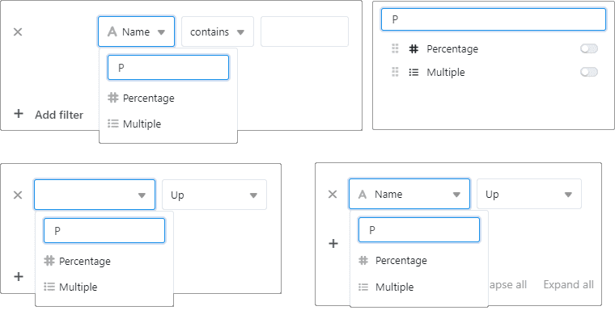

Réveil printanier chez SeaTable ! Alors que les premières fleurs poussent à l'extérieur, nous sortons brillamment de la pause hivernale avec SeaTable 3.4. Préparez-vous à une expérience utilisateur améliorée et à une plus grande liberté de création ! Le plug-in de conception de pages, tout comme l'éditeur de formulaires Web, déploie désormais tout son potentiel, avec des fonctions avancées de positionnement dynamique des éléments et d'autres options utiles. Découvrez la nouvelle fonction de recherche lors du filtrage, du tri et du regroupement dans les paramètres d'affichage, ainsi que lors de la création d'options dans les colonnes de sélection. L'application Data Query, qui permet désormais d'affiner la recherche sur plusieurs champs, présente également des nouveautés remarquables. Le menu contextuel des lignes dispose également d'options supplémentaires et les entrées du journal des lignes brillent d'un nouvel éclat.

Vous êtes curieux ? Alors, n'hésitez pas ! Ce matin, nous avons mis à jour le nuage SeaTable à la version 3.4. Tous les auto-hébergeurs peuvent faire de même - et même, depuis peu, déchaîner la limite de lignes par base. L'image de SeaTable 3.4 est disponible [au](https://hub.docker.com/r/seatable/seatable-enterprise) téléchargement [dans le célèbre dépôt Docker](https://hub.docker.com/r/seatable/seatable-enterprise) . Dans le [changelog](), vous trouverez comme toujours la liste complète des modifications.

## Positionnement dynamique des éléments dans la conception de la page

Le plug-in de conception de pages vous permet de transformer les données de vos bases en documents clairs. Il suffit d'appuyer sur un bouton pour créer une lettre en série, un document ou une liste d'inventaire. Jusqu'à présent, le plug-in de conception de pages était moins adapté à la création de documents dont le contenu était de longueur variable, comme les offres ou les factures. Nous supprimons cette restriction avec SeaTable 3.4.

Le plug-in de conception de page de SeaTable 3.4 permet pour la première fois le positionnement dynamique des éléments sur la page. En fonction de la longueur des éléments précédents, les éléments suivants se déplacent vers le bas d'une page. Il est ainsi possible d'utiliser le même modèle, qu'une offre contienne un ou une douzaine d'éléments. Les sauts de page et les nouvelles pages sont insérés automatiquement. Vous pouvez personnaliser les marges supérieure et inférieure de la page.

La nouvelle fonction "Adapter automatiquement le tableau au contenu" est disponible pour l'élément d'affichage "Toutes les entrées de la vue" ainsi que pour la représentation tabulaire des liens sous "Champs de tableau". Lorsque la fonction est activée, le caractère de remplacement pour l'élément de tableau (élément encadré en vert dans la capture d'écran) définit la longueur minimale du tableau à insérer. Si le tableau est plus long que le caractère de remplacement, celui-ci est automatiquement rallongé.

L'ancienne fonction "Ajouter d'autres pages si la taille de l'espace réservé ne suffit pas à contenir toutes les entrées", introduite dans la [version 3.1](), n'existe plus dans SeaTable 3.4 et est remplacée par une fonction plus puissante. Si elle était activée pour un modèle d'élément de tableau, la nouvelle fonction est automatiquement activée.

## Recherche sur plusieurs champs avec l'application Data Query

Les applications externes de SeaTables permettent de rendre facilement accessibles au public les données des tableaux. L'application Data Query, en particulier, permet d'interroger rapidement et de manière ciblée des ensembles de données comportant plusieurs centaines, voire plusieurs milliers de lignes (par exemple un catalogue de produits ou une liste de membres). Avec SeaTable 3.4, nous avons éliminé l'inconvénient que les requêtes ne pouvaient être effectuées que sur un seul champ.

Il est maintenant possible d'effectuer des requêtes sur un nombre quelconque de champs. Pour chaque champ, vous pouvez définir s'il s'agit d'un champ obligatoire ou si la saisie est facultative. Pour les champs basés sur du texte, vous pouvez en outre activer une recherche floue et forcer la prise en compte des majuscules et des minuscules. La combinaison des options permet de contrôler la recherche dans une large mesure. Le menu permettant de masquer des colonnes individuelles dans les résultats de recherche ainsi que les options de tri restent inchangés.

En présence de plusieurs champs de requête, un lien booléen ET s'applique toujours, c'est-à-dire que toutes les valeurs saisies doivent figurer dans les résultats de la recherche. L'appli Data Query reste bien sûr inadaptée aux informations confidentielles, car elle ne nécessite pas d'authentification de l'utilisateur. Une autre app externe, que nous présenterons prochainement, nous permettra de combler cette lacune fonctionnelle.

## Amélioration des formulaires web

Dans [SeaTable 3.3](), nous avons fait évoluer l'éditeur de formulaires vers une conception en blocs. Il est ainsi possible d'organiser les champs dans n'importe quel ordre. Nous avons également introduit les éléments statiques que sont les annotations et les séparateurs. D'autres améliorations étaient en cours de développement, mais elles n'ont pas pu être intégrées dans la version de Noël. Nous nous en chargeons maintenant !

L'éditeur de formulaires de SeaTable 3.4 offre la possibilité de définir un nom d'affichage pour chaque élément du formulaire, qui sera ensuite affiché dans le formulaire web au lieu du nom de la colonne. De cette manière, il est possible de nommer les colonnes du tableau indépendamment du formulaire Web : Les noms des colonnes peuvent être courts et concis, tandis que les noms des champs du formulaire peuvent être plus explicites pour faciliter l'utilisation. Cela vous donne encore plus de liberté dans la conception de vos formulaires web.

Deux améliorations concernent la capacité de SeaTable à pré-remplir des formulaires web via des paramètres d'URL. Cette fonction existe déjà depuis un certain temps, mais il manquait un moyen convivial de créer et de gérer des liens de formulaire personnalisés, ainsi qu'une option permettant de protéger une valeur pré-remplie contre toute modification par l'utilisateur du formulaire. Nous avons résolu ces deux problèmes dans SeaTable 3.4.

Derrière le bouton "... Plus" de l'éditeur de formulaires se cache une nouvelle fenêtre permettant de créer autant de liens de formulaire que nécessaire. Chaque lien peut contenir une ou plusieurs valeurs de formulaire pré-remplies. En outre, vous pouvez définir pour chaque valeur si elle doit être réinscriptible ou protégée en écriture. Un lien créé est identifié par un nom que l'on peut choisir librement. Ainsi, les liens de formulaire existants peuvent être facilement rappelés et, le cas échéant, modifiés.

## Fonction de recherche et de filtrage dans les paramètres d'affichage

Dans les tableaux comportant de nombreuses colonnes, les listes de sélection dans les paramètres d'affichage peuvent devenir très longues et difficiles à gérer. Pour réduire les recherches au minimum, il existe désormais une fonction de recherche et de filtrage dans tous les menus principaux des paramètres d'affichage (Filtrer, Trier, Grouper, Masquer et Formater les lignes). Son utilisation est très simple : il suffit de saisir le nom de la colonne recherchée pour que seule la colonne souhaitée s'affiche. Bien entendu, cela fonctionne également si vous ne saisissez qu'une partie du nom, par exemple si vous n'êtes pas tout à fait sûr du nom de la colonne recherchée. Vous pouvez ensuite sélectionner sans trop d'efforts la colonne nécessaire dans la liste de résultats filtrée.

Comme cette fonction de recherche pratique manquait également dans les colonnes à choix unique et multiple avec de nombreuses options, nous l'avons également intégrée dans ces colonnes. Ainsi, lorsque vous créez de nouvelles options, vous ne devez plus jamais vérifier laborieusement si une option existe déjà ou non.

## Et bien d'autres choses encore

En jetant un coup d'œil au changelog, vous trouverez encore beaucoup d'autres améliorations que nous ne pouvons pas détailler ici. Seules trois autres améliorations seront brièvement évoquées ici.

Le menu contextuel des lignes, accessible par un clic droit dans les tableaux, permet désormais d'insérer plusieurs lignes vides et également de dupliquer plusieurs lignes sélectionnées.

Dans SeaTable 3.4, les logs dans les détails des lignes sont plus compacts qu'auparavant. Toutes les modifications qu'un utilisateur a apportées à une ligne à un moment donné sont présentées dans une entrée collective. Jusqu'à présent, chaque modification faisait l'objet d'une entrée de journal séparée.

Jusqu'à présent, la limite de lignes par base était invariablement de 100.000 lignes. Si cette limite était dépassée, la base ne pouvait être ouverte qu'en mode lecture. Avec SeaTable 3.4, les auto-hébergeurs ont davantage de contrôle sur la limite de lignes. Dans certains cas d'utilisation, la limite peut être augmentée via les fichiers de configuration. Vous trouverez plus d'informations à ce sujet dans le [manuel SeaTable](https://manual.seatable.io/config/base_rows_limit/).

## Deux limitations fonctionnelles

Les bases et les vues partagées avec des groupes ne peuvent plus être déplacées dans des dossiers avec la nouvelle version. Les bases et les vues partagées qui ont été déplacées dans un dossier par le passé sont désormais affichées en dehors du dossier.

L'autorisation d'accès "Groupes spécifiques" pour les formulaires web a été supprimée. Si vous faites partie des quelques utilisateurs qui l'utilisaient, vous devez redéfinir l'autorisation de partage.

## Annonce d'un changement fonctionnel important

SeaTable 3.5 introduit une limite de 100.000 caractères pour les cellules individuelles de type Texte formaté. 100.000 caractères correspondent à environ 25 pages A4 de texte. La limite de caractères devrait donc avoir un impact sur très peu d'utilisateurs.

Crédit photo : wirestock sur Freepik
