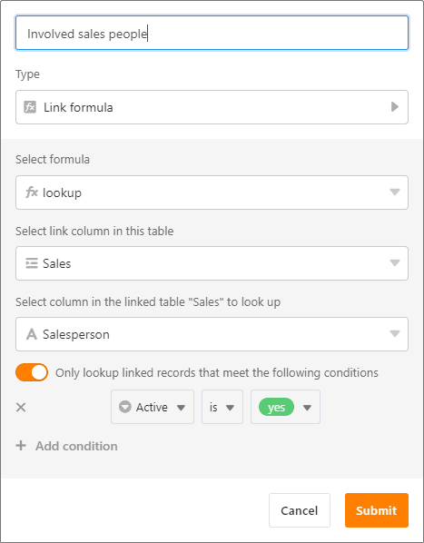

Der April macht, was er will – aber SeaTable macht, was Sie wollen! Mit der Version 3.5 gehen einige lang gehegte Wünsche unserer Nutzer in Erfüllung: Die erste Spalte unterstützt nun auch [Formeln]() und per [Automation]() können Sie zwei zusätzliche Aktionen periodisch ausführen lassen. Mehr Flexibilität für anspruchsvollere Anwendungsfälle gewinnen Sie durch die bedingte Ausführung von [Schaltflächen]()\-Aktionen und die bedingten [Lookups](). Im Folgenden stellen wir Ihnen diese Verbesserungen im Detail vor.

Mit diesem Release veröffentlichen wir auch einen neuen App Builder als Beta. Mit dem Universal App Builder lassen sich ganz ohne Programmierkenntnisse Applikationen für die unterschiedlichsten Anwendungsfälle und Benutzergruppen bauen. Derzeit arbeitet unser Entwicklungsteam noch am Feinschliff, aber bereits der Vorgeschmack macht Lust auf mehr. Wir freuen uns auf Ihr Feedback!

Heute Morgen haben wir die SeaTable Cloud auf Version 3.5 aktualisiert. Alle Selbsthoster können das ebenfalls tun: Das Image von SeaTable 3.5 ist im bekannten [Docker Repository](https://hub.docker.com/r/seatable/seatable-enterprise) zum Download verfügbar. Im [Changelog]() finden Sie wie immer die vollständige Liste der Änderungen.

## Formeln in der ersten Spalte

SeaTable 3.5 sorgt für mehr Flexibilität in der ersten Tabellenspalte: Bisher waren dort nur die [Spaltentypen]() Text, Zahl, Datum, Einfachauswahl und Automatische Nummer erlaubt. Der nun ebenfalls unterstützte [Formel-Spaltentyp]() macht es möglich, eine eigene Zeilenreferenz zu „berechnen“. Da [die erste Spalte]() in einer Tabelle nicht ausgeblendet werden kann und auch im Verknüpfungsdialog immer angezeigt wird, bietet sie sich dafür ganz besonders an.

Geben Sie im Formeleditor einfach die zu referenzierende Spalte in geschweiften Klammern ein. **{Produktnummer}** beispielsweise holt sich den Wert aus der Spalte “Produktnummer”. Mehrere Spaltenwerte können Sie mit **&** verketten. Natürlich können Sie auch Textfunktionen wie **left()** verwenden, um Werte zu kürzen. Wenn Sie beispielsweise Rechnungen in einer Tabelle verwalten, dann könnte eine Zeilenreferenz bestehend aus Rechnungsdatum, Kundenname und Rechnungsnummer wie folgt aussehen: _20230412-CustomerZ-INV202302347_.

## Zwei zusätzliche Aktionen für periodische Automationen

Die [Automationen]() in SeaTable erleichtern Ihnen das Leben, indem sie Ihnen viele manuelle Klicks abnehmen. Mithilfe von Automationen können Sie folglich nicht nur Zeit sparen, sondern auch die Anzahl menschlicher Fehler minimieren. SeaTable kennt vier [Automations-Trigger](), mit denen Sie verschiedene [Automations-Aktionen]() ereignisbasiert (z. B. ein neuer Eintrag wird hinzugefügt) oder periodisch (z. B. jeden Montag um 10 Uhr) ausführen lassen können. SeaTable 3.5 macht durch zwei weitere Aktionen die periodischen Automationen deutlich leistungsfähiger.

Die Aktionen „Links hinzufügen“ und „Datenverarbeitungsoperation ausführen“ können Sie beim periodischen Trigger nun zusätzlich zu den Aktionen „Benachrichtigung versenden“, „E-Mail versenden“, „Zeile hinzufügen“ und „Python-Skript ausführen“ auswählen. Über diese beiden Aktionen lassen sich alle Datenverarbeitungsoperationen automatisiert durchführen, die Sie bisher nur manuell ausführen konnten.

Überzeugen Sie sich selbst, was mit [Datenverarbeitungsoperationen in SeaTable]() alles möglich ist.

## Bedingte Ausführung von Schaltflächen-Aktionen

Mit einer [Schaltfläche]() können Sie eine oder mehrere Aktionen mit einem Klick ausführen, z. B. [eine E-Mail versenden]() und dann die Zeile bearbeiten. Nicht möglich war es, die Ausführung einer Aktion an eine Bedingung zu knüpfen. Diese funktionale Lücke haben wir mit SeaTable 3.5 geschlossen.

Die neue bedingte Ausführung erlaubt Ihnen für jede Schaltflächenaktion eine Regel zu definieren. Eine Regel kann aus einer oder mehreren Bedingungen bestehen. Nur wenn die Regel erfüllt ist, wird die Aktion bei Klick auf die Schaltfläche auch ausgeführt. Trifft eine Bedingung nicht zu, springt SeaTable zur nächsten Aktion und zeigt die nicht ausgeführte Aktion in einer Meldung an.

Stellen Sie sich vor, Sie möchten E-Mails in unterschiedlichen Sprachen an Ihre Kunden versenden. Die englische Version soll beispielsweise nur dann versendet werden, wenn in einer Spalte als Kundensprache Englisch festgelegt ist. Bisher benötigten Sie dafür eine eigene Schaltfläche. Dank der bedingten Ausführung reicht nun eine einzige Schaltfläche für beliebig viele Sprachen. Fügen Sie der Schaltfläche einfach so viele „E-Mail versenden“-Aktionen hinzu, wie Sie Sprachen verwenden wollen, und versehen Sie sie mit den passenden Regeln. Sind die Regeln einmal definiert, dann versendet SeaTable beim Klick auf die Schaltfläche nur die E-Mail in der Sprache des jeweiligen Kunden.

Ab Version 3.5 führt SeaTable alle definierten Aktionen strikt sequenziell aus. Solange eine Aktion nicht abgeschlossen ist, wird die nächste Aktion nicht gestartet. So ist sichergestellt, dass eine zeitaufwändige Aktion (z. B. das Erstellen eines PDFs) abgeschlossen ist, bevor eine weitere Aktion (z. B. Versand einer E-Mail, an die das PDF angehängt werden soll) startet.

## Bedingte Lookups in der Spalte Formel für Verknüpfungen

Der Spaltentyp Formel für Verknüpfungen ermöglicht die Auswertung von verknüpften Einträgen. Insgesamt stehen Ihnen fünf Auswertungsmethoden zur Verfügung: [Findmin](), [Findmax](), [Rollup](), [Countlinks]() und [Lookup](). Die Lookup-Formel ermöglicht Ihnen dabei, zusätzliche Werte aus bereits verknüpften Zeilen in Ihrer aktuellen Tabelle darzustellen. So können Sie beliebig viele Informationen aus der verlinkten Tabelle auslesen und anzeigen lassen.

In SeaTable 3.5 haben wir die Lookup-Formel verbessert und eine Funktion implementiert, die bei den anderen Formeln schon seit geraumer Zeit existierte: eine bedingte Auswertung. Ist die bedingte Auswertung bei Lookups aktiviert, dann werden nur die Werte angezeigt, welche die gesetzte Bedingung bzw. die gesetzten Bedingungen erfüllen. Dadurch erhalten Sie passgenau die Informationen aus der verlinkten Tabelle, die Sie benötigen.

## Universal App Builder (Beta)

Sie wollten schon immer Ihre eigenen Apps bauen? SeaTable macht diesen Traum nun wahr: Mit dem Universal App Builder erstellen Sie aus einer Base individuelle Apps für Nutzergruppen mit unterschiedlichen Informationsbedürfnissen (z. B. Mitarbeiter, Abteilungsleiter, Geschäftsführer). Als Backend verwenden Sie einfach die Struktur und die Daten in einer Base, auf die Sie beliebig viele Frontends für jede Nutzergruppe setzen können.

Auf der grafischen Benutzeroberfläche können Sie individuell auf die Nutzergruppen zugeschnittene Seiten, Tabellen, Webformulare, Kanban-Boards, Kalender und Galerien anlegen. Diese funktionieren wie in der Base, aber mit ein paar Besonderheiten wie z. B. voreingestellten, unveränderlichen Ansichtsoptionen.

Der Zugriff erfolgt per (Custom) URL mit oder ohne Anmeldung. Indem Sie einen offenen Zugriff einstellen, können Sie auch externen Dritten ohne SeaTable Konto (z. B. Kunden, Geschäftspartnern) Daten über die App zugänglich machen. Aktuell arbeitet unser Entwicklungsteam noch am Feinschliff der Beta-Version, aber das Grundgerüst der Universal App steht. Probieren Sie sie doch gleich aus!

## Und noch vieles mehr

Um die Datenübertragung von einer Base in eine andere zu vereinfachen, bietet SeaTable 3.5 nun die bequeme Möglichkeit, Tabellen direkt aus einer anderen Base zu importieren und damit Daten über Base-Grenzen hinweg zu übertragen.

Für Auswahloptionen, Schaltflächen und bedingte Formatierungen gibt SeaTable 24 Farben vor. Um individuellen Wünschen oder CI-Anforderungen gerecht zu werden, können Sie mit SeaTable 3.5 in jeder Base eine beliebige Anzahl weiterer Farben definieren. Selbsthoster haben zusätzlich die Option, über die Konfigurationsdatei global individuelle Farben in SeaTable festzulegen.

Das einspaltige Layout der Zeilendetails wird mit der neuen Version durch ein zweispaltiges Design abgelöst. Gerade bei Tabellen mit vielen Spalten wird die Darstellung dadurch kürzer und übersichtlicher. Auch das Base-Log, in dem Sie alle Änderungen innerhalb einer Base nachvollziehen können, bekommt einen neuen Look. Wenn Sie in der Base-Historie  auf Logs klicken, öffnet sich nun ein separates Fenster mit übersichtlichen Log-Einträgen.

Die wichtigsten Änderungen am User Interface haben wir in den Dialogen der Verknüpfungsspalte vorgenommen. Neben der Breite der Spalten lassen sich auch die Dialogfenster in ihrer Größe verändern. Wenn Sie irrelevante Spalten ausblenden möchten, so ist auch dies nun möglich. Wie in den Ansichtsoptionen gibt es im Dialog „Verknüpfte Einträge“ ab jetzt eine Option zum Ausblenden sowie zur Sortierung von Spalten.

## Zwei neue Limits

Wie in den [letzten Release Notes]() angekündigt, führt SeaTable 3.5 ein Limit von 100.000 Zeichen für einzelne Zellen vom Typ [Formatierter Text]() ein. Überschreitet der Text in einer Zelle 100.000 Zeichen (das entspricht ungefähr 25 DIN-A4-Seiten Text), wird ein Warnhinweis eingeblendet. Wenn Sie den Text daraufhin nicht kürzen und den Editor schließen, speichert SeaTable nur 100.000 Zeichen.

Mit der Version 3.5 haben wir bei SeaTable Cloud die Maximalanzahl der in einem API-Call zurückgelieferten Zeilen von 10.000 auf 1.000 reduziert. Bitte prüfen Sie, ob sich dadurch Anpassungsbedarf bei Ihren Integrationen ergibt.
