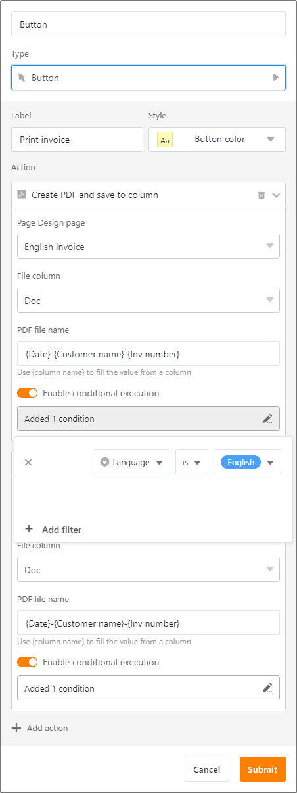
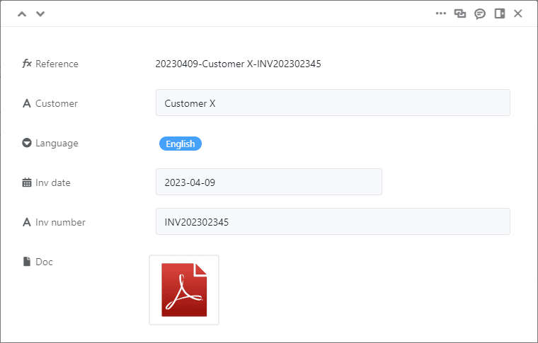

April does what it wants - but SeaTable does what you want! With version 3.5, some long-cherished wishes of our users come true: The first column now also supports [formulas]() and via [automation]() you can have two additional actions executed periodically. You gain more flexibility for demanding use cases with the conditional execution of [button actions]() and the conditional [lookups](). Below we present these improvements in detail.

With this release, we are also introducing a new App Builder as a beta. With the Universal App Builder, you can build applications for a wide range of use cases and user groups without any programming knowledge. Currently, our development team is still working on the fine-tuning, but already the foretaste makes you want more. We are looking forward to your feedback!

This morning we updated the SeaTable Cloud to version 3.5. All self-hosters can do the same: The SeaTable 3.5 image is available for download from the well-known [Docker repository](https://hub.docker.com/r/seatable/seatable-enterprise). As always, see the [changelog]() for the full list of changes.

## Formulas in the first column

SeaTable 3.5 provides more flexibility in the first column of a table: Previously, only the [column types]() Text, Number, Date, Single Select and Automatic Number were allowed there. The [Formula column type]() is now also supported and makes it possible to "calculate" your own row reference. Since [the first column]() in a table cannot be hidden and is always displayed in the link dialog, it is particularly suitable for this purpose.

In the formula editor, simply enter the column to be referenced in curly brackets. _for example, _{product number}** takes the value from the "Product number" column. You can concatenate several column values with **&**. Of course, you can also use text functions such as **left()\*\* to truncate values. For example, if you manage invoices in a table, a row reference consisting of invoice date, customer name and invoice number could look like this: _20230412-CustomerZ-INV202302347_.

## Two additional actions for periodic automations

The [automations]() in SeaTable make your life easier by relieving you of many manual clicks. Consequently, automations not only save you time, but also minimize the number of human errors. SeaTable has four [automation triggers]() that allow you to perform various [automation actions]() event-based (e.g. a new entry is added) or periodically (e.g. every Monday at 10 am). SeaTable 3.5 makes periodic automations much more powerful by adding two more actions.

You can now select the actions "Add links" and "Execute data processing operation" for the periodic trigger in addition to the actions "Send notification", "Send e-mail", " Addrow " and "Execute Python script". These two actions allow you to automate all data processing operations that you could previously only perform manually.

See for yourself what is possible with [data processing operations in SeaTable]().

## Conditional execution of button actions

With a [button]() you can execute one or more actions with one click, e.g. [send an e-mail]() and then edit the row . It was not possible to link the execution of an action to a condition. We have closed this functional gap with SeaTable 3.5.

The new conditional execution allows you to define a rule for each button action. A rule can consist of one or more conditions. Only if the rule is met, the action will be executed when the button is clicked. If a condition does not apply, SeaTable jumps to the next action and displays the unexecuted action in a message.

Imagine you want to send emails to your customers in different languages. For example, you want the English version to be sent only if English is set as the customer language in a column. Previously, you needed a separate button for this. Now, thanks to conditional execution, a single button is enough for any number of languages. Simply add as many "Send Email" actions to the button as you want to use languages, and provide them with the appropriate rules. Once the rules are defined, when the button is clicked, SeaTable will only send the email in that customer's language.

From version 3.5 SeaTable executes all defined actions strictly sequentially. As long as an action is not completed, the next action is not started. This ensures that a time-consuming action (e.g. creating a PDF) is completed before another action (e.g. sending an email to which the PDF should be attached) starts.

## Conditional lookups in the Formula column for links

The Formula column type for links allows you to evaluate linked entries. A total of five evaluation methods are available: [Findmin](), [Findmax](), [Rollup](), [Countlinks]() and [Lookup](). The Lookup formula allows you to display additional values from already linked rows in your current table. This way you can read and display as much information as you like from the linked table.

In SeaTable 3.5 we have improved the lookup formula and implemented a feature that existed in the other formulas for quite some time: a conditional evaluation. If the conditional evaluation is activated for lookups, then only the values that meet the set condition(s) are displayed. This way you get exactly the information you need from the linked table.

## Universal App Builder (Beta)

You always wanted to build your own apps? SeaTable now makes this dream come true: With the Universal App Builder you can create individual apps for user groups with different information needs (e.g. employees, department heads, managers) from one base. As a backend, you simply use the structure and the data in a base, on which you can set as many frontends as you want for each user group.

On the graphical user interface you can create customized pages, tables, web forms, kanban boards, calendars and galleries. These work just like in Base, but with a few special features such as preset, immutable view options.

Access is via (Custom) URL with or without login. By setting open access, you can also make data accessible to external third parties without a SeaTable account (e.g. customers, business partners) via the app. Currently, our development team is still fine-tuning the beta version, but the basic framework of the universal app is in place. Try it out right now!

## And much more

To simplify data transfer from one Base to another, SeaTable 3.5 now offers the convenient ability to import tables directly from another Base, allowing data to be transferred across Base boundaries.

For selection options, buttons and conditional formatting SeaTable provides 24 colors. To meet individual wishes or CI requirements, SeaTable 3.5 allows you to define any number of additional colors in each base. Self-hosters have the additional option to globally define individual colors in SeaTable via the configuration file.

The single-column layout of the row details is replaced by a two-column design with the new version. Especially for tables with many columns, this makes the display shorter and clearer. The base log, where you can track all changes within a base, also gets a new look. If you click on Logs in the base history , a separate window opens with clearly arranged log entries.

We have made the most important changes to the user interface in the link column dialogs. In addition to the width of the columns, the dialog boxes can also be resized. If you want to hide irrelevant columns, this is also possible now. As in the view options, from now on there is an option to hide as well as sort columns in the Linked Entries dialog.

## Two new limits

As announced in the [last release notes](), SeaTable 3.5 introduces a limit of 100,000 characters for single cells of the [Formatted Text]() type. If the text in a cell exceeds 100,000 characters (which corresponds to about 25 A4 pages of text), a warning message is displayed. If you do not shorten the text and close the editor, SeaTable saves only 100,000 characters.

With version 3.5, we have reduced the maximum number of rows returned in an API call from 10,000 to 1,000 for SeaTable Cloud. Please check if this requires any adjustments to your integrations.
