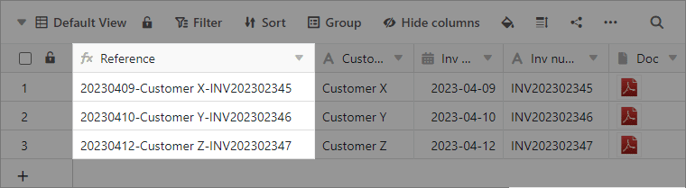
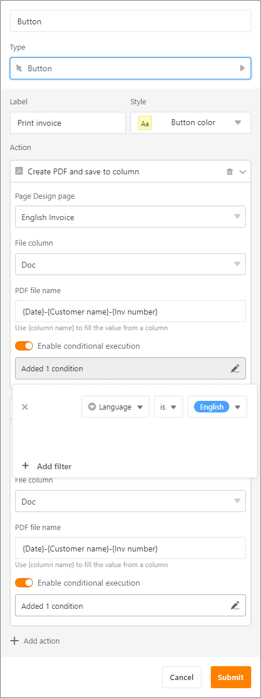
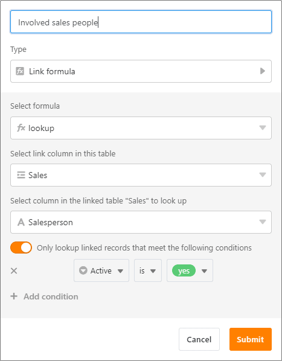
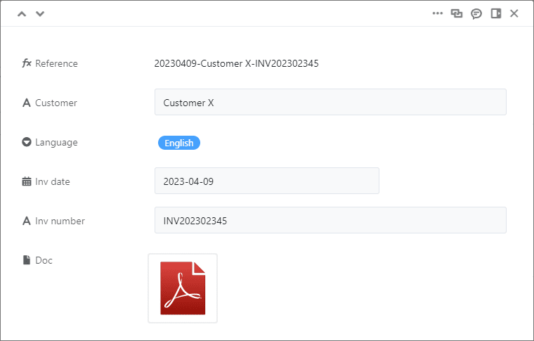

April hace lo que quiere - ¡pero SeaTable hace lo que usted quiere! La versión 3.5 cumple algunos deseos largamente acariciados por nuestros usuarios: la primera columna ahora también soporta [fórmulas]() y mediante la [automatización]() puede hacer que se ejecuten periódicamente dos acciones adicionales. Obtendrá más flexibilidad para casos de uso más exigentes con la ejecución condicional de las [acciones de los botones]() y las [búsquedas]() condicionales. A continuación presentamos estas mejoras en detalle.

Con esta versión, también publicamos un nuevo App Builder en versión beta. Con el Universal App Builder, se pueden crear aplicaciones para una gran variedad de casos de uso y grupos de usuarios sin necesidad de conocimientos de programación. Por el momento, nuestro equipo de desarrollo todavía está afinándolo, pero incluso el anticipo hace que quieras más. Esperamos sus comentarios.

Esta mañana hemos actualizado SeaTable Cloud a la versión 3.5. Todos los auto-alojadores pueden hacer lo mismo: La imagen SeaTable 3.5 está disponible para su descarga en el conocido [repositorioDocker](https://hub.docker.com/r/seatable/seatable-enterprise) . Como siempre, puede encontrar la lista completa de cambios en el [registro de cambios]().

## Fórmulas en la primera columna

SeaTable 3.5 ofrece más flexibilidad en la primera columna de la tabla: Hasta ahora, sólo se permitían en ella los [tipos de]() columna texto, número, fecha, selección única y número automático. El tipo de columna [fórmula](), que ahora también se admite, permite "calcular" su propia referencia de fila. Dado que la [primera]() columna de una tabla no se puede ocultar y, además, se muestra siempre en el diálogo de enlace, resulta especialmente adecuada para este fin.

En el editor de fórmulas, introduzca simplemente entre llaves la columna a la que desea hacer referencia. _por ejemplo, _{número de producto}** toma el valor de la columna "Número de producto". Puede concatenar varios valores de columna con **&**. Por supuesto, también puede utilizar funciones de texto como **left()\*\* para truncar valores. Por ejemplo, si gestiona facturas en una tabla, una referencia de fila formada por la fecha de la factura, el nombre del cliente y el número de factura podría tener este aspecto _20230412-CustomerZ-INV202302347_.

## Dos acciones adicionales para automatizaciones periódicas

Las [automatizaciones]() de SeaTable le facilitan la vida al liberarle de muchos clics manuales. En consecuencia, las automatizaciones no sólo le ahorran tiempo, sino que también minimizan el número de errores humanos. SeaTable tiene cuatro [disparadores de automatización]() que le permiten realizar varias [acciones de automatización en]() base a un evento (por ejemplo, se añade una nueva entrada) o periódicamente (por ejemplo, todos los lunes a las 10 de la mañana). SeaTable 3.5 hace que las automatizaciones periódicas sean mucho más potentes añadiendo dos acciones más.

Ahora puede seleccionar las acciones "Añadir enlaces" y "Ejecutar operación de tratamiento de datos" para el activador periódico, además de las acciones "Enviar notificación", "Enviar correo electrónico", "Añadir fila" y "Ejecutar script Python". Estas dos acciones pueden utilizarse para realizar automáticamente todas las operaciones de tratamiento de datos que antes sólo podía realizar manualmente.

Compruebe usted mismo lo que permiten las [operaciones de tratamiento de datos en SeaTable]().

## Ejecución condicional de las acciones de los botones

Con un [botón]() puedes ejecutar una o varias acciones con un solo clic, por ejemplo, [enviar un correo electrónico]() y luego editar la línea. No era posible vincular la ejecución de una acción a una condición. Hemos cerrado esta brecha funcional con SeaTable 3.5.

La nueva ejecución condicional permite definir una regla para cada acción del botón. Una regla puede constar de una o varias condiciones. Sólo si se cumple la regla, se ejecutará la acción al pulsar el botón. Si una condición no se cumple, SeaTable salta a la siguiente acción y muestra la acción no ejecutada en un mensaje.

Imagine que desea enviar correos electrónicos a sus clientes en diferentes idiomas. Por ejemplo, la versión en inglés sólo debe enviarse si el inglés está configurado como idioma del cliente en una columna. Hasta ahora, necesitaba un botón independiente para ello. Gracias a la ejecución condicional, ahora basta con un solo botón para cualquier número de idiomas. Basta con añadir al botón tantas acciones "Enviar correo electrónico" como idiomas desee utilizar y dotarlas de las reglas adecuadas. Una vez definidas las reglas, SeaTable sólo enviará el correo electrónico en el idioma del cliente correspondiente cuando se haga clic en el botón.

A partir de la versión 3.5, SeaTable ejecuta todas las acciones definidas de forma estrictamente secuencial. Mientras no se complete una acción, no se inicia la siguiente. Esto garantiza que una acción que requiere mucho tiempo (por ejemplo, la creación de un PDF) se complete antes de que se inicie otra acción (por ejemplo, el envío de un correo electrónico al que se va a adjuntar el PDF).

## Consultas condicionales en la columna Fórmula para los enlaces

El tipo de columna Fórmula para enlaces permite evaluar las entradas enlazadas. Se dispone de un total de cinco métodos de evaluación: [Findmin](), [Findmax](), [Rollup](), [Countlinks]() y [Lookup](). La fórmula Lookup permite mostrar valores adicionales de filas ya enlazadas en la tabla actual. De este modo, puede leer y mostrar tanta información como desee de la tabla enlazada.

En SeaTable 3.5 hemos mejorado la fórmula de búsqueda y hemos implementado una función que existe desde hace tiempo en las otras fórmulas: una evaluación condicional. Si la evaluación condicional está activada para las búsquedas, sólo se muestran los valores que cumplen la(s) condición(es) establecida(s). De este modo, obtendrá la información exacta que necesita de la tabla vinculada.

## Universal App Builder (Beta)

¿Siempre ha querido crear sus propias aplicaciones? SeaTable ahora hace este sueño realidad: con el Universal App Builder, puede crear aplicaciones individuales para grupos de usuarios con diferentes necesidades de información (por ejemplo, empleados, jefes de departamento, gerentes) a partir de una base. Como backend, sólo tiene que utilizar la estructura y los datos de una base, sobre la que puede colocar tantos frontends como desee para cada grupo de usuarios.

En la interfaz gráfica de usuario se pueden crear páginas, tablas, formularios web, tableros Kanban, calendarios y galerías adaptados individualmente a los grupos de usuarios. Funcionan como en Base, pero con algunas características especiales, como opciones de vista preestablecidas e invariables.

El acceso se realiza a través de una URL (personalizada) con o sin inicio de sesión. Al establecer el acceso abierto, también puede hacer que los datos sean accesibles a terceros externos sin una cuenta SeaTable (por ejemplo, clientes, socios comerciales) a través de la aplicación. En la actualidad, nuestro equipo de desarrollo todavía está afinando la versión beta, pero el marco básico de la aplicación universal está en su lugar. ¡Pruébela ahora mismo!

## Y mucho más

Para simplificar la transferencia de datos de una base a otra, SeaTable 3.5 ofrece ahora la cómoda opción de importar tablas directamente desde otra base y transferir así datos a través de los límites de las bases.

SeaTable proporciona 24 colores para las opciones de selección, los botones y el formato condicional. Para satisfacer deseos individuales o requisitos de IC, SeaTable 3.5 permite definir cualquier número de colores adicionales en cada base. Los autoalojadores también tienen la opción de definir globalmente colores individuales en SeaTable a través del archivo de configuración.

El diseño de una sola columna de los detalles de las filas se sustituye por un diseño de dos columnas con la nueva versión. Esto hace que la visualización sea más corta y clara, especialmente en tablas con muchas columnas. El registro de la base, en el que puedes seguir todos los cambios dentro de una base, también tiene un nuevo aspecto. Si hace clic en Registros en el historial de la base , se abrirá una ventana independiente con entradas de registro claras.

Hemos introducido los cambios más importantes en la interfaz de usuario de los cuadros de diálogo de las columnas de enlace. Además de la anchura de las columnas, también puede modificarse el tamaño de los cuadros de diálogo. Si desea ocultar columnas irrelevantes, ahora también es posible. Al igual que en las opciones de vista, ahora hay una opción en el cuadro de diálogo "Entradas enlazadas" para ocultar y ordenar las columnas.

## Dos nuevos límites

Como se anunció en [las últimas Notas de la Versión](), SeaTable 3.5 introduce un límite de 100.000 caracteres para celdas individuales del tipo [Texto Formateado](). Si el texto de una celda supera los 100.000 caracteres (lo que corresponde a unas 25 páginas A4 de texto), aparecerá un mensaje de advertencia. Si no acorta el texto y cierra el editor, SeaTable sólo guardará 100.000 caracteres.

Con la versión 3.5, hemos reducido el número máximo de líneas devueltas en una llamada API de 10.000 a 1.000 para SeaTable Cloud. Por favor, compruebe si esto provoca la necesidad de realizar ajustes en sus integraciones.
