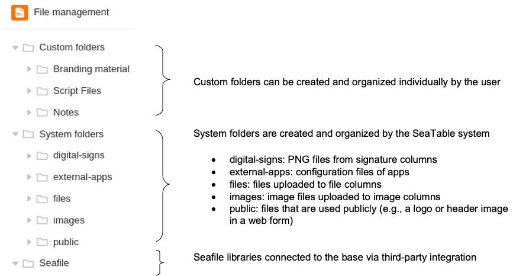
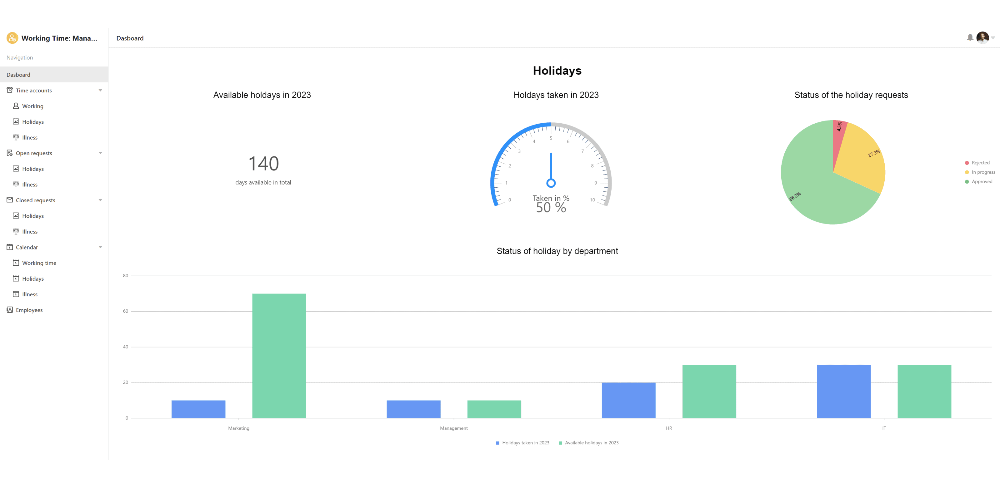

Während draußen die Sonne brennt, haben unsere Entwickler einen kühlen Kopf behalten und das vierte Major Release von SeaTable fertiggestellt. SeaTable Version 4.0 verbessert bestehende Funktionen, stillt aber auch den Durst nach neuen Features. Neu in Version 4.0: ein Spaltentyp für digitale Unterschriften, ein integrierter Datei-Manager für die einfachere Verwaltung von Anhängen und – für unsere Cloud Enterprise Kunden – eine Custom-Logo-Funktion als Branding-Option.

SeaTable 4.0 optimiert auch die Integration seiner Schwesteranwendung Seafile. Die Einbindung von Seafile Bibliotheken in SeaTable Bases ist nun nicht nur einfacher, sondern auch leistungsfähiger. Gleiches gilt für die Statistikfunktionen, die wir in SeaTable 4.0 konsolidiert haben. Der Universal App Builder (Beta) macht große Fortschritte und bietet Ihnen herausragende Möglichkeiten zur Datenaufbereitung für einzelne Nutzergruppen. Wir freuen uns, Ihnen diese Highlights und viele weitere kleinere Verbesserungen vorzustellen.

Heute Morgen haben wir die SeaTable Cloud auf Version 4.0 aktualisiert. Alle Selbsthoster können das ebenfalls tun: Das Image von SeaTable 4.0 ist im bekannten [Docker Repository](https://hub.docker.com/r/seatable/seatable-enterprise) zum Download verfügbar. Im [Changelog]() finden Sie wie immer die vollständige Liste der Änderungen.

## Neuer Spaltentyp für digitale Unterschriften

Nichts ist verbindlicher als eine Unterschrift – ob unter Verträgen, auf Urkunden oder in Briefen. In SeaTable können Sie all diese Dokumente erstellen. Was liegt also näher als handschriftliche Signaturen mit SeaTable zu digitalisieren? Die neue Signatur-Spalte macht es möglich! Speichern Sie Ihre digitale Unterschrift einfach, indem Sie in einer Zelle dieser besonderen Bild-Spalte schwungvoll mit der Maus oder auf Geräten mit Touchscreen mit einem Stift oder Finger unterschreiben.

Dies ermöglicht Workflows für Mitarbeiter- wie Kundenprozesse, die Sie in SeaTable bislang nicht abbilden konnten: Mit einem eingefügten Signatur-Feld können Sie z. B. Urlaubsanträge oder Anmeldungen zu Seminaren in [Webformularen]() und [Universal Apps]() von den Ausfüllenden unterschreiben lassen. Ebenso können Kunden einem Monteur die Ausführung von Leistungen vor Ort bestätigen. Über das [Seitendesign-Plugin]() lassen sich die Signaturen einfach in Dokumente einfügen, die dann als E-Mail-Anhang versandt werden können. Die nahtlose Integration des neuen Spaltentyps schafft viele Möglichkeiten, Prozesse verbindlicher zu gestalten.

## Leistungsstarkes Dateimanagement innerhalb der Base

Das Dateimanagement in SeaTable 4.0 revolutioniert die Arbeit mit Dateien in Ihren Bases. Mit dem neuen Dateimanager können Sie Dateien direkt in Ihren Bases einfach und bequem verwalten und die neuen eigenen Ordner bieten Ihnen noch mehr Flexibilität bei der Speicherung und Organisation von Dateien. Die bisherige Anhangsverwaltung, die nur über die erweiterten Optionen einer Base auf der Startseite erreichbar war, wird entfernt.

Der Dateimanager, der sich über das Drei-Punkte-Icon oben rechts in der Base aufrufen und der Toolbar hinzufügen lässt, präsentiert sich in einer denkbar vertrauten Form: Rechts die Dateien und Ordner, links die Navigation – Benutzer werden sich sofort zu Hause fühlen.

Bestehende Dateien lassen sich im Dateimanager umbenennen, kopieren, verschieben, herunterladen und löschen. Neue Office-Dokumente lassen sich ebenfalls erstellen und direkt über den integrierten Editor bearbeiten. Kinderleicht können Sie nun Dateien und Ordner von Ihrem Gerät hochladen oder per Drag-and-Drop in die Dateiverwaltung einfügen. Per Drag-and-Drop lassen sich auch Dateien aus dem Dateimanager in die Zellen passender Tabellenspalten ziehen und damit Datensätzen zuordnen. Um dafür maximalen Raum zu bieten, lässt sich der Dateimanager in der Größe verändern und als Seitenleiste anheften.

Die Systemordner hängen mit der Struktur der Base zusammen und enthalten Bilder, Dateien und Signaturen aus den jeweiligen Spalten sowie die Konfigurationsdateien von Apps und Webformularen. In den eigenen Ordnern können Sie Dateien unabhängig davon in individuellen Ordnern ablegen und organisieren. Die Dateien stehen dann in Python-Skripten und anderen Funktionen wie Webformularen oder dem Seitendesign-Plugin zur Verfügung; teilweise werden diese Integrationen aber erst in den kommenden Versionen abgeschlossen.

## Erleichterte Seafile Integration für große Datenmengen

Apropos Dateimanagement: Wenn Sie viele große Dateien (z. B. Bilder und Videos) in Ihren Bases speichern, werden Sie schnell das Limit von 100 MB pro Base erreichen, ab dem Sie Ihre Bases nicht mehr [exportieren]() können. Das bedeutet einen Flexibilitätsverlust. Ein weiteres Limit, das bei der Speicherung vieler Dateien in SeaTable relevant wird, ist das [Speicherlimit]() des Abonnements. Für beide Limits bietet SeaTable 4.0 mit der neuen Integrationsoption von Seafile, der Schwesteranwendung von SeaTable, eine Lösung mit Mehrwert.

[Seafile](https://de.seafile.com/) als Enterprise File-Sync-and-Share-Lösung ist dafür prädestiniert, jede Menge große Dateien zu verwalten. Außerdem bietet es dank seiner Clients die bestmögliche Integration in die individuelle Arbeitsumgebung inklusive Offline-Unterstützung. Über die neue Integration können Sie die in Seafile gespeicherten Dateien direkt in SeaTable nutzen. Sie verbinden die beiden Produkte zu einer Lösung aus einem Guss und kombinieren die Stärken von Seafile mit denen von SeaTable.

Die Integration von Seafile in SeaTable könnte kaum einfacher sein: Generieren Sie über das Seafile Webinterface einen API-Token für eine Seafile Bibliothek, legen Sie ein neues Drittanbieterkonto in SeaTable an und fügen Sie den Token dort ein (siehe Abbildung). Nach erfolgreicher Verknüpfung erscheint die Seafile Bibliothek in der Dateiverwaltung.

Verbinden lassen sich grundsätzlich gehostete wie selbstgehostete Seafile Server. [Wenden Sie sich gern an unser Sales Team](), wenn Sie einen Seafile Server selbst hosten wollen. Für SeaTable Dedicated Kunden bieten wir ein Seafile Co-Hosting an.

## Statistik-Plugin und Statistik-Modul verschmelzen zu einem Tool

SeaTable bietet Ihnen vielfältige Möglichkeiten zur [statistischen Datenanalyse]() und deren grafischer Aufbereitung. Bisher hatten Sie dafür sowohl ein Statistik-Modul mit Basisfunktionen als auch das Erweiterte-Statistiken-Plugin zur Hand. Letzteres rückt in SeaTable 4.0 an die Stelle, wo vorher das Basis-Modul war, sodass Sie kein Plugin mehr einrichten müssen. Die gesamte Statistik-Power von SeaTable ist nun in einem starken Tool gebündelt, das Sie über die Schaltfläche „Statistiken“ im Base-Header mit einem Klick erreichen.

Alle von Ihnen bereits erstellten Grafiken und Diagramme – egal ob im Statistik-Modul oder im Erweiterte-Statistiken-Plugin – bleiben natürlich erhalten und werden automatisch auf das neue Dashboard verschoben.

## Fortschritte beim Universal App Builder

Der [Universal App Builder]() (Beta) erfreut sich großer Beliebtheit, unser Entwicklungsteam arbeitet auf Hochtouren am Feinschliff und die Ergebnisse können sich sehen lassen! Alle [Seitentypen]() haben nun ein einheitliches Layout und bieten in den Dateneinstellungen die Spaltensuchfunktion, die man schon aus den Bases kennt. Außerdem unterstützen nun alle Seitentypen den [Filter „Ist ID des angemeldeten Benutzers“](). Ein Schwerpunkt der Entwicklungsarbeit lag auf der individuellen Seite, deren Bedienung wir deutlich verbessert haben. Fehler in Diagrammen haben wir ebenfalls behoben. Die anderen Seitentypen kamen indes nicht zu kurz. Für die Webformular-, Kanban- und Timeline-Seite wurde die Spaltenunterstützung optimiert. Ein Highlight des Universal App Builders in SeaTable 4.0 ist der neue Seitentyp „Abfrage“, der die Funktionalität der [Datenabfrage-App]() in die Universal App integriert.

In den Versionen 4.1 und 4.2 werden noch weitere Funktionen ergänzt, die in den Bases bereits etabliert sind. Dazu gehören beispielsweise die bedingte Formatierung und die variable Zeilenhöhe. Dann wird auch die Beta-Phase des Universal App Builders enden.

## Und noch vieles mehr

Auch die kleinen Errungenschaften in SeaTable machen das Leben schöner: Die Ordner auf der Startseite öffnen sich neuerdings in einem separaten Fenster, wodurch Sie einen besseren Überblick über die dort einsortierten Bases gewinnen.

Eine Zeile sperren – mit einer Automatisierungsregel oder manuell über das Zeilen-Kontextmenü war dies bereits seit Längerem für Enterprise-Nutzer möglich. Nun erhält auch die [Schaltflächen-Spalte]() „Zeile sperren“ als neue Aktion. Nutzen Sie diese in Kombination mit den anderen sieben Aktionen, um komplexe Abläufe einfach per Mausklick zu erledigen. Darüber hinaus haben wir die Aktion „Zeile bearbeiten“ um dynamische Datumswerte ergänzt und die Anzeige von Auswahloptionen dort verbessert.

Wenn Sie in die Zelle einer [Verknüpfungsspalte]() klicken, öffnet sich ab SeaTable 4.0 ein erweiterter Dialog: Sie können entweder bestehende Einträge verlinken oder – und das ist neu – eine Zeile hinzufügen. Dies ermöglicht es, eine neue Zeile in der verknüpften Tabelle und gleichzeitig einen verknüpften Eintrag in der geöffneten Tabelle zu erstellen, was Ihnen einigen Aufwand erspart: Früher mussten Sie zuerst in die verknüpfte Tabelle wechseln, um eine neue Zeile hinzuzufügen, die Sie dann in der anderen Tabelle verlinken konnten. In den Einstellungen der Verknüpfungsspalte können Sie zudem festlegen, dass ausschließlich neue Einträge erstellt und verlinkt werden können, indem Sie die Option auswählen, die Schaltfläche „Bestehende Einträge verknüpfen“ nicht anzuzeigen.

Mit einem Enterprise-Abonnement können Sie auf der Startseite Ihr eigenes Firmenlogo anstelle des SeaTable Logos verwenden und damit Ihr Corporate Design verankern. Wenn Sie sowohl auf Ästhetik als auch auf Leistung Wert legen, wird Ihnen Folgendes gefallen: Wir haben die PDF-Erstellung im [Seitendesign-Plugin]() optimiert und beschleunigt, damit Sie keine Zeit mehr mit Warten verschwenden.

## Neues Limit

Im Base-Log speichert SeaTable Änderungen, die Sie und Ihre Teammitglieder in einer Base vornehmen. Bisher konnten Sie hier ohne Limit in die Vergangenheit zurückscrollen und die Historie einsehen. Mit SeaTable 4.0 führen wir ein Limit von maximal 1.000 Einträgen im Base-Log ein. Die Dokumentation von noch weiter zurückliegenden Änderungen wird gelöscht und üblicherweise auch nicht mehr benötigt. Zusätzliche Informationen zur Historie in SeaTable finden Sie [hier]().

## Preisanpassung

Seit Version 1.0 haben wir den Funktionsumfang von SeaTable Schritt für Schritt erweitert. Außerdem haben wir signifikante Investitionen in einfachere und leistungsfähigere Integrationen, verbesserte Dokumentationen und erhöhte Sicherheit getätigt. Zusammen mit der allgemein hohen Preisdynamik erfordert dies eine Anpassung unserer Preise für [SeaTable Server Lizenzen]().

| Benutzeranzahl | Preis bisher | Preis neu | Veränderung |
| -------------- | ------------ | --------- | ----------- |
| 3              | 0 €          | 0 €       | \--         |
| 10             | 400 €        | 500 €     | \+ 25,0 %   |
| 25             | 1.500 €      | 1.250 €   | \- 16,7 %   |
| 50             | 3.500 €      | 4.500 €   | \+ 28,6 %   |

Für Neukunden gelten die neuen Lizenzpreise ab dem 1. August 2023. SeaTable Server Bestandskunden erhalten noch bis zum 31. Dezember 2023 Lizenzverlängerungen zu den alten Preisen.

**Die Preisanpassung gilt ausdrücklich nur für Selbsthoster. Die Preise für die SeaTable Cloud ändern sich nicht.**
