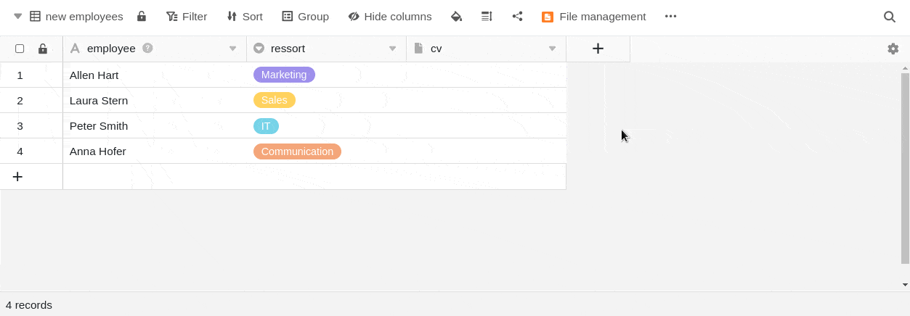

While the sun is blazing outside, our developers have kept a cool head and finished the fourth major release of SeaTable. SeaTable version 4.0 improves existing features, but also quenches the thirst for new features. New in version 4.0: a column type for digital signatures, an integrated file manager for easier attachment management and - for our Cloud Enterprise customers - a custom logo feature as a branding option.

SeaTable 4.0 also optimizes the integration of its sister application Seafile. The integration of Seafile libraries into SeaTable Bases is now not only easier, but also more powerful. The same goes for the statistics functions, which we have consolidated in SeaTable 4.0. The Universal App Builder (Beta) is making great strides, giving you outstanding data preparation capabilities for individual user groups. We are pleased to present these highlights and many other minor improvements.

This morning we updated the SeaTable Cloud to version 4.0. All self-hosters can do the same: The SeaTable 4.0 image is available for download from the well-known [Docker repository](https://hub.docker.com/r/seatable/seatable-enterprise). As always, see the [changelog](https://seatable.io/en/docs/changelog/version-4/) for the full list of changes.

## New column type for digital signatures

Nothing is more binding than a signature - whether under contracts, on documents or in letters. In SeaTable you can create all these documents. So what could be more obvious than digitizing handwritten signatures with SeaTable? The new signature column makes it possible! Save your digital signature simply by signing in a cell of this special image column sweeping with the mouse or on devices with touch screen with a pen or finger.

This enables workflows for employee and customer processes that you were previously unable to map in SeaTable: With an inserted signature field, you can, for example, have vacation requests or registrations for seminars in [web forms](https://seatable.io/en/docs/webformulare/webformulare/) and [universal apps](https://seatable.io/en/docs/apps/universelle-app/) signed by the person filling them out. Likewise, customers can confirm to a fitter that services have been performed on site. Using the [page design plugin](https://seatable.io/en/docs/seitendesign-plugin/anleitung-zum-seitendesign-plugin/), signatures can be easily inserted into documents, which can then be sent as email attachments. The seamless integration of the new column type creates many opportunities to make processes more binding.

## Powerful file management within Base

The file management in SeaTable 4.0 revolutionizes the way you work with files in your bases. With the new file manager, you can easily manage files directly in your Bases, and the new custom folders give you even more flexibility in storing and organizing files. The previous attachment management, which was only accessible via the advanced options of a Base on the start page, is removed.

The file manager, which can be called up via the three-dot icon in the top right of Base and added to the toolbar, presents itself in a very familiar form: Files and folders on the right, navigation on the left - users will immediately feel at home.

Existing files can be renamed, copied, moved, downloaded and deleted in the file manager. New Office documents can also be created and edited directly via the integrated editor. You can now easily upload files and folders from your device or add them to the file manager via drag-and-drop. Files can also be dragged and dropped from the file manager into the cells of matching table columns and thus assigned to data records. To provide maximum space for this, the file manager can be resized and pinned as a sidebar.

The system folders are related to the Base structure and contain images, files and signatures from the respective columns as well as the configuration files of apps and web forms. In the custom folders, you can store and organize files independently in individual folders. The files are then available in Python scripts and other functions such as web forms or the page design plugin; however, some of these integrations will be completed in future versions.

## Facilitated Seafile integration for large data sets

Speaking of file management, if you store a lot of large files (e.g. images and videos) in your bases, you will quickly reach the limit of 100 MB per base, above which you will no longer be able to [export](https://seatable.io/en/docs/import-von-daten/speichern-einer-base-als-dtable-datei/) your bases. This means a loss of flexibility. Another limit that becomes relevant when storing many files in SeaTable is the subscription [storage limit](https://seatable.io/en/preise/). For both limits, SeaTable 4.0 offers a value-added solution with the new integration option of Seafile, SeaTable's sister application.

[Seafile](https://de.seafile.com/) as an enterprise file sync-and-share solution is predestined to manage any amount of large files. Moreover, thanks to its clients, it offers the best possible integration into the individual working environment, including offline support. The new integration allows you to use files stored in Seafile directly in SeaTable. You combine the two products into a single solution, combining the strengths of Seafile with those of SeaTable.

Integrating Seafile with SeaTable could hardly be easier: Generate an API token for a Seafile library via the Seafile web interface, create a new third-party account in SeaTable and paste the token there (see figure). After successful linking, the Seafile library will appear in the file manager.

In principle, both hosted and self-hosted Seafile servers can be connected. [Feel free to contact our sales team]() if you want to self-host a Seafile server. For SeaTable Dedicated customers we offer Seafile co-hosting.

## Statistics plugin and statistics module merge into one tool

SeaTable offers you a wide range of options for [statistical data analysis](https://seatable.io/en/docs/seatable-nutzen/statistiken/) and its graphical presentation. Until now, you had both a statistics module with basic functions and the advanced statistics plugin at hand. The latter moves in SeaTable 4.0 to the place where the basic module was before, so you don't need to set up a plugin anymore. All of SeaTable's statistics power is now bundled into one powerful tool, which you can access with one click via the Statistics button in the Base header.

All graphs and charts you have already created - whether in the Statistics module or in the Advanced Statistics plugin - will of course be preserved and automatically moved to the new dashboard.

## Universal App Builder Progress

The [Universal App Builder](https://seatable.io/en/docs/apps/universelle-app/) (Beta) enjoys great popularity, our development team is working at full speed on the finishing touches and the results are impressive! All [page types](https://seatable.io/en/docs/apps/seitentypen-in-der-universellen-app/) now have a uniform layout and offer the column search function in the data settings, which you already know from the bases. In addition, all page types now support the [filter "Actual ID of the logged in user"](https://seatable.io/en/docs/ansichtsoptionen/was-ist-die-id-des-users-und-warum-kann-man-danach-filtern/). One focus of the development work was on the individual page, whose operation we have significantly improved. We also fixed bugs in diagrams. Meanwhile, the other page types were not neglected. Column support was optimized for the web form, Kanban and Timeline pages. A highlight of the Universal App Builder in SeaTable 4.0 is the new page type "Query", which integrates the functionality of the [data query app](https://seatable.io/en/docs/apps/datenabfrage-app/) into the Universal App.

In versions 4.1 and 4.2, even more functions will be added that are already established in the bases. These include conditional formatting and variable line height, for example. The beta phase of the Universal App Builder will also end then.

## And much more

Also the small achievements in SeaTable make life nicer: The folders on the start page now open in a separate window, which gives you a better overview of the bases sorted there.

Locking a row - with an automation rule or manually via the rows context menu, this has been possible for Enterprise users for quite some time. Now the [button column](https://seatable.io/en/docs/andere-spalten/die-schaltflaeche/) "row lock" also gets as a new action. Use it in combination with the other seven actions to perform complex operations simply with a mouse click. In addition, we have added dynamic date values to the " Editrow " action and improved the display of selection options there.

If you click into the cell of a [link column](https://seatable.io/en/docs/verknuepfungen/wie-man-tabellen-in-seatable-miteinander-verknuepft/), an extended dialog opens from SeaTable 4.0: You can either link existing entries or - and this is new - add a row . This allows you to create a new row in the linked table and a linked entry in the open table at the same time, which saves you some effort: Previously, you had to switch to the linked table first to add a new row , which you could then link in the other table. In the settings of the link column you can also specify that only new entries can be created and linked by selecting the option not to show the "Link existing entries" button.

With an Enterprise subscription, you can use your own company logo on the home page instead of the SeaTable logo, anchoring your corporate design. If you value both aesthetics and performance, you'll like the following: We've optimized and sped up PDF creation in the [Page Design plugin](https://seatable.io/en/docs/seitendesign-plugin/anleitung-zum-seitendesign-plugin/), so you won't waste time waiting.

## New limit

In the Base Log, SeaTable stores changes that you and your team members make in a Base. Previously, you could scroll back in time and view the history here without limit. With SeaTable 4.0 we introduce a limit of maximum 1,000 entries in the base log. Documentation of changes made even further back in time will be deleted and usually no longer needed. Additional information about history in SeaTable can be found [here](https://seatable.io/en/docs/historie-und-versionen/historie-und-logs/).

## Price adjustment

Since version 1.0, we have expanded the functionality of SeaTable step by step. We have also made significant investments in simpler and more powerful integrations, improved documentation and increased security. Together with the generally high price dynamics, this requires an adjustment of our prices for [SeaTable Server licenses](https://seatable.io/en/on-premises/).

| Number of users | Price so far | Price new | Change    |
| --------------- | ------------ | --------- | --------- |
| 3               | 0 €          | 0 €       | \--       |
| 10              | 400 €        | 500 €     | \+ 25,0 % |
| 25              | 1.500 €      | 1.250 €   | \- 16,7 % |
| 50              | 3.500 €      | 4.500 €   | \+ 28,6 % |

For new customers, the new license prices will apply starting August 1, 2023. SeaTable Server existing customers will continue to receive license renewals at the old prices until December 31, 2023.

**The price adjustment explicitly applies to self-hosters only. The price for the SeaTable Cloud does not change.**
