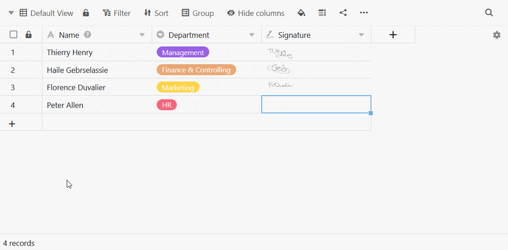
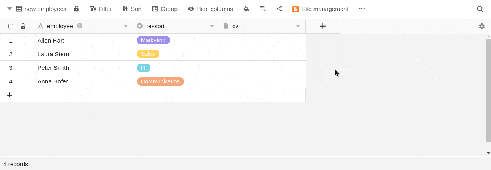
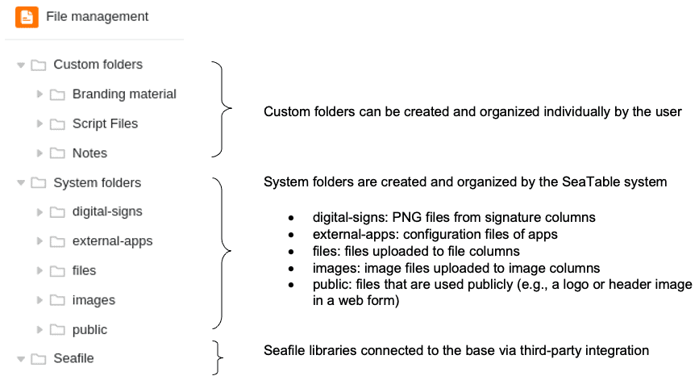
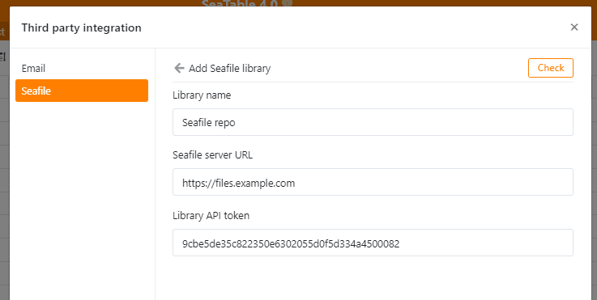
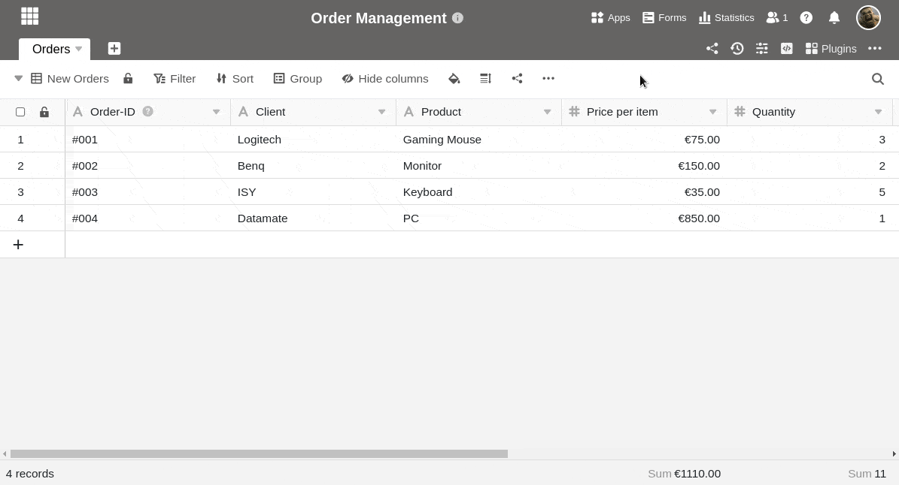
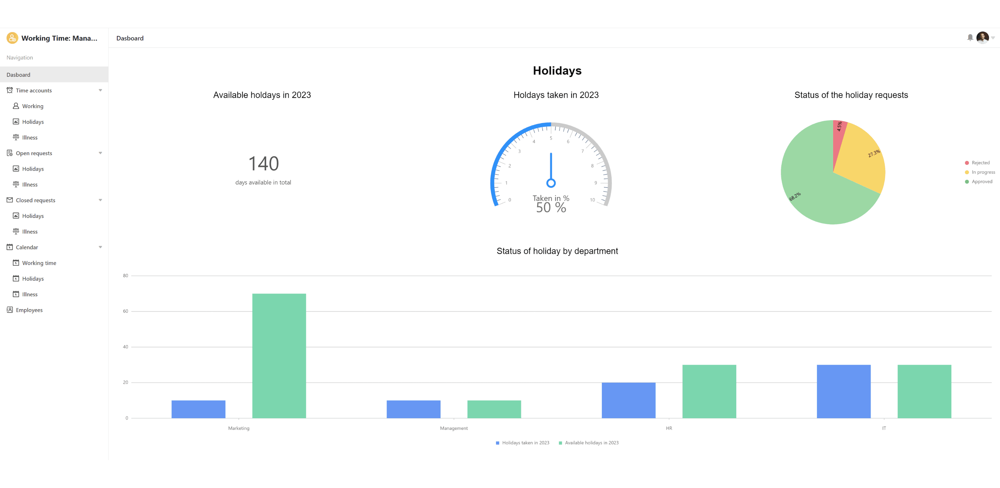
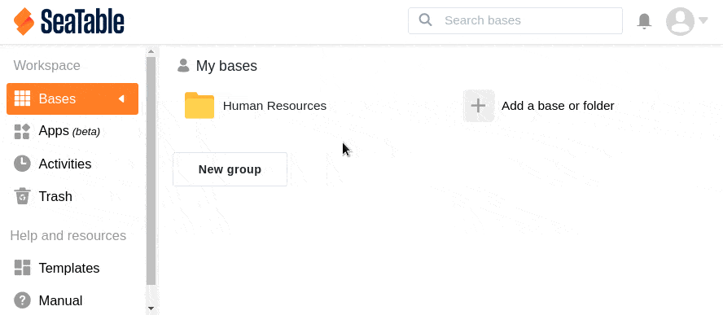

Alors que le soleil brûle dehors, nos développeurs ont gardé la tête froide et ont terminé la quatrième version majeure de SeaTable. La version 4.0 de SeaTable améliore les fonctions existantes, mais étanche également la soif de nouvelles fonctionnalités. Nouveautés de la version 4.0 : un type de colonne pour les signatures numériques, un gestionnaire de fichiers intégré pour faciliter la gestion des pièces jointes et - pour nos clients Cloud Enterprise - une fonction de logo personnalisé comme option de branding.

SeaTable 4.0 optimise également l'intégration de son application sœur Seafile. L'intégration des bibliothèques Seafile dans les bases SeaTable est désormais non seulement plus simple, mais aussi plus puissante. Il en va de même pour les fonctions statistiques, que nous avons consolidées dans SeaTable 4.0. L'Universal App Builder (bêta) fait de grands progrès et vous offre des possibilités exceptionnelles de préparation des données pour des groupes d'utilisateurs individuels. Nous sommes heureux de vous présenter ces points forts et de nombreuses autres améliorations mineures.

Ce matin, nous avons mis à jour le nuage SeaTable à la version 4.0. Tous les auto-hébergeurs peuvent faire de même : L'image de SeaTable 4.0 est disponible en téléchargement dans le célèbre [dépôtDocker](https://hub.docker.com/r/seatable/seatable-enterprise) . Comme toujours, vous trouverez dans le [changelog](https://seatable.io/fr/docs/changelog/version-4/) la liste complète des modifications.

## Nouveau type de colonne pour les signatures numériques

Rien n'est plus contraignant qu'une signature, qu'il s'agisse d'une signature de contrat, d'un document ou d'une lettre. SeaTable vous permet de créer tous ces documents. Quoi de plus naturel donc que de numériser les signatures manuscrites avec SeaTable ? C'est possible grâce à la nouvelle colonne Signature ! Enregistrez simplement votre signature numérique en signant dans une cellule de cette colonne d'images spéciale à l'aide de la souris ou, sur les appareils à écran tactile, avec un stylo ou un doigt.

Cela permet de créer des flux de travail pour les processus des employés et des clients que vous ne pouviez pas reproduire dans SeaTable jusqu'à présent : Grâce à l'ajout d'un champ de signature, vous pouvez par exemple faire signer les demandes de congé ou les inscriptions à des séminaires par les personnes qui les remplissent dans [les formulaires Web]() et les [applications universelles](). De même, les clients peuvent confirmer à un monteur l'exécution de prestations sur place. Grâce au [plug-in de conception de page](), les signatures peuvent être facilement insérées dans des documents qui peuvent ensuite être envoyés en tant que pièces jointes à un e-mail. L'intégration transparente du nouveau type de colonne crée de nombreuses possibilités pour rendre les processus plus contraignants.

## Gestion performante des fichiers au sein de la base

La gestion des fichiers dans SeaTable 4.0 révolutionne le travail avec les fichiers dans vos bases. Le nouveau gestionnaire de fichiers vous permet de gérer facilement les fichiers directement dans vos bases, et les nouveaux dossiers personnalisés vous offrent encore plus de flexibilité pour le stockage et l'organisation des fichiers. L'ancien gestionnaire de pièces jointes, qui n'était accessible que via les options avancées d'une base sur la page d'accueil, est supprimé.

Le gestionnaire de fichiers, qui peut être appelé via l'icône à trois points en haut à droite de la base et ajouté à la barre d'outils, se présente sous une forme aussi familière que possible : Les fichiers et les dossiers à droite, la navigation à gauche - les utilisateurs se sentiront immédiatement chez eux.

Les fichiers existants peuvent être renommés, copiés, déplacés, téléchargés et supprimés dans le gestionnaire de fichiers. Il est également possible de créer de nouveaux documents Office et de les modifier directement via l'éditeur intégré. Il est désormais très facile de télécharger des fichiers et des dossiers depuis votre appareil ou de les insérer dans le gestionnaire de fichiers par glisser-déposer. Il est également possible de glisser-déposer des fichiers depuis le gestionnaire de fichiers dans les cellules des colonnes de tableau correspondantes et de les associer ainsi à des enregistrements. Pour offrir un maximum d'espace à cet effet, le gestionnaire de fichiers peut être redimensionné et épinglé en tant que barre latérale.

Les dossiers système sont liés à la structure de la base et contiennent les images, les fichiers et les signatures des colonnes respectives ainsi que les fichiers de configuration des apps et des formulaires web. Dans les dossiers personnels, il est possible de déposer et d'organiser des fichiers indépendamment dans des dossiers individuels. Les fichiers sont ensuite disponibles dans les scripts Python et dans d'autres fonctions telles que les formulaires web ou le plug-in de conception de pages ; certaines de ces intégrations ne seront toutefois achevées que dans les prochaines versions.

## Intégration facilitée de Seafile pour les gros volumes de données

À propos de la gestion des fichiers : si vous stockez beaucoup de fichiers volumineux (par exemple des images et des vidéos) dans vos bases, vous atteindrez rapidement la limite de 100 Mo par base, au-delà de laquelle vous ne pourrez plus [exporter](https://seatable.io/fr/docs/import-von-daten/speichern-einer-base-als-dtable-datei/) vos bases. Cela signifie une perte de flexibilité. Une autre limite qui devient pertinente lorsque vous stockez de nombreux fichiers dans SeaTable est la [limite de stockage de](https://seatable.io/fr/prix/) votre abonnement. Pour ces deux limites, SeaTable 4.0 offre une solution à valeur ajoutée avec la nouvelle option d'intégration de Seafile, l'application sœur de SeaTable.

[Seafile](https://de.seafile.com/), en tant que solution de synchronisation et de partage de fichiers d'entreprise, est prédestinée à la gestion de fichiers volumineux. De plus, grâce à ses clients, elle offre la meilleure intégration possible dans l'environnement de travail individuel, y compris le support hors ligne. Grâce à la nouvelle intégration, vous pouvez utiliser les fichiers stockés dans Seafile directement dans SeaTable. Elles combinent les deux produits en une solution unique et allient les points forts de Seafile à ceux de SeaTable.

L'intégration de Seafile dans SeaTable ne pourrait pas être plus simple : Générez un jeton API pour une bibliothèque Seafile via l'interface web de Seafile, créez un nouveau compte tiers dans SeaTable et collez-y le jeton (voir illustration). Une fois le lien établi avec succès, la bibliothèque Seafile apparaît dans le gestionnaire de fichiers.

En principe, les serveurs Seafile hébergés et auto-hébergés peuvent être connectés. N ['hésitez pas à contacter notre équipe de vente](https://seatable.io/fr/contact/) si vous souhaitez héberger vous-même un serveur Seafile. Pour les clients SeaTable dédiés, nous proposons un co-hébergement Seafile.

## Le plug-in de statistiques et le module de statistiques fusionnent en un seul outil

SeaTable vous offre de nombreuses possibilités pour l'[analyse statistique des données]() et leur présentation graphique. Jusqu'à présent, vous disposiez à la fois d'un module statistique de base et d'un plug-in de statistiques avancées. Dans SeaTable 4.0, ce dernier prend la place du module de base, ce qui vous évite de devoir installer un plug-in. Toute la puissance statistique de SeaTable est désormais concentrée dans un outil puissant, accessible en un clic via le bouton "Statistiques" dans l'en-tête de base.

Tous les graphiques et diagrammes que vous avez déjà créés - que ce soit dans le module Statistiques ou dans le plug-in Statistiques avancées - sont bien sûr conservés et automatiquement déplacés vers le nouveau tableau de bord.

## Progrès de l'Universal App Builder

L'[Universal App Builder]() (bêta) jouit d'une grande popularité, notre équipe de développement travaille à plein régime pour le peaufiner et les résultats sont impressionnants ! Tous les [types de pages](https://seatable.io/fr/docs/apps/seitentypen-in-der-universellen-app/) ont désormais une mise en page uniforme et proposent dans les paramètres de données la fonction de recherche par colonne que l'on connaît déjà dans les bases. De plus, tous les types de pages supportent désormais le [filtre "ID réel de l'utilisateur connecté".](was-ist-die-id-des-users-und-warum-kann-man-danach-filtern/) L'un des points forts du travail de développement a été la page individuelle, dont nous avons nettement amélioré l'utilisation. Nous avons également corrigé des erreurs dans les diagrammes. Les autres types de pages n'ont pas été négligés pour autant. Le support des colonnes a été optimisé pour le formulaire web, la page Kanban et la page Timeline. L'un des points forts de l'Universal App Builder dans SeaTable 4.0 est le nouveau type de page "Requête", qui intègre la fonctionnalité de l'[application de requête de données](https://seatable.io/fr/docs/apps/datenabfrage-app/) dans l'application universelle.

Dans les versions 4.1 et 4.2, d'autres fonctions déjà bien établies dans les bases seront ajoutées. Il s'agit par exemple de la mise en forme conditionnelle et de la hauteur de ligne variable. La phase bêta de l'Universal App Builder prendra alors fin.

## Et bien d'autres choses encore

Les petites réalisations de SeaTable rendent également la vie plus agréable : les dossiers de la page d'accueil s'ouvrent depuis peu dans une fenêtre séparée, ce qui vous donne une meilleure vue d'ensemble des bases qui y sont classées.

Verrouiller une ligne - cela était déjà possible depuis longtemps pour les utilisateurs d'Enterprise à l'aide d'une règle d'automatisation ou manuellement via le menu contextuel de la ligne. Désormais, la [colonne de boutons]() "Verrouiller la ligne" est également une nouvelle action. Utilisez-la en combinaison avec les sept autres actions pour effectuer des opérations complexes d'un simple clic de souris. En outre, nous avons ajouté des valeurs de date dynamiques à l'action "Modifier la ligne" et amélioré l'affichage des options de sélection.

À partir de SeaTable 4.0, un clic dans la cellule d'une [colonne de liaison]() ouvre une boîte de dialogue étendue : Vous pouvez soit lier des entrées existantes, soit - et c'est nouveau - ajouter une ligne. Cela permet de créer une nouvelle ligne dans le tableau lié et en même temps une entrée liée dans le tableau ouvert, ce qui vous épargne quelques efforts : auparavant, vous deviez d'abord passer dans le tableau lié pour ajouter une nouvelle ligne que vous pouviez ensuite lier dans l'autre tableau. Dans les paramètres de la colonne de liaison, vous pouvez en outre décider que seules les nouvelles entrées peuvent être créées et liées en sélectionnant l'option de ne pas afficher le bouton "Lier les entrées existantes".

Avec un abonnement Enterprise, vous pouvez utiliser votre propre logo d'entreprise sur la page d'accueil au lieu du logo SeaTable et ancrer ainsi votre identité visuelle. Si vous êtes à la fois sensible à l'esthétique et à la performance, voici ce qui vous plaira : Nous avons optimisé et accéléré la création de PDF dans le [plug-in de conception de pages]() afin que vous ne perdiez plus de temps à attendre.

## Nouvelle limite

Dans le journal de base, SeaTable enregistre les modifications que vous et les membres de votre équipe effectuez dans une base. Jusqu'à présent, vous pouviez remonter dans le temps et consulter l'historique sans limite. Avec SeaTable 4.0, nous introduisons une limite de 1 000 entrées maximum dans le journal de base. La documentation des modifications encore plus anciennes sera supprimée et ne sera généralement plus nécessaire. Pour plus d'informations sur l'historique dans SeaTable, [cliquez ici]().

## Ajustement des prix

Depuis la version 1.0, nous avons progressivement étendu les fonctionnalités de SeaTable. Nous avons également réalisé des investissements significatifs dans des intégrations plus simples et plus puissantes, une documentation améliorée et une sécurité accrue. Ces changements, associés à la dynamique générale des prix, nécessitent un ajustement de nos prix pour les [licences SeaTable Server]().

| Nombre d'utilisateurs | Prix jusqu'à présent | Prix nouveau | Variation |
| --------------------- | -------------------- | ------------ | --------- |
| 3                     | 0 €                  | 0 €          | \--       |
| 10                    | 400 €                | 500 €        | \+ 25,0 % |
| 25                    | 1.500 €              | 1.250 €      | \- 16,7 % |
| 50                    | 3.500 €              | 4.500 €      | \+ 28,6 % |

Pour les nouveaux clients, les nouveaux prix des licences s'appliqueront à partir du 1er août 2023. Les clients existants de SeaTable Server pourront obtenir des extensions de licence aux anciens prix jusqu'au 31 décembre 2023.

**L'ajustement des prix ne s'applique expressément qu'aux auto-hébergeurs. Les prix pour le cloud de SeaTable ne changent pas.**
