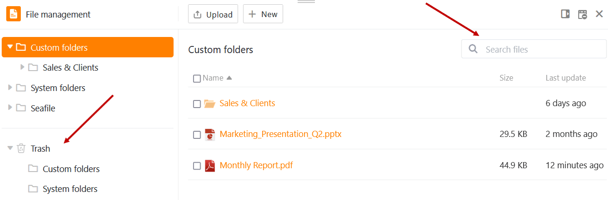
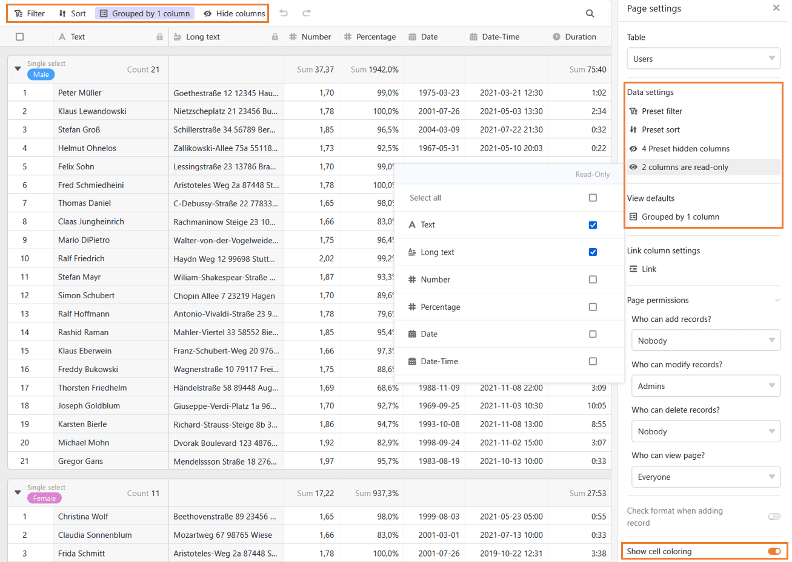
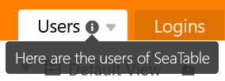
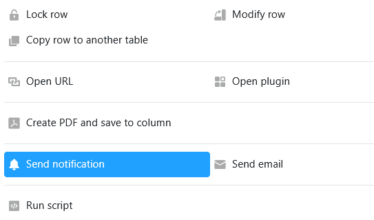

Las vacaciones de verano están llegando a su fin y esperamos que haya disfrutado del tiempo libre. Mientras otros se tiraban a la piscina o descansaban, nuestros desarrolladores trabajaban duro para crear **la versión 4.1 de SeaTable**.

¿Utiliza ya procesos automatizados en sus bases para ahorrar tiempo y clics? Entonces le gustará que hayamos refinado las opciones y mejorado el rendimiento de las [automatizaciones](). Los usuarios intensivos de SeaTable estarán especialmente satisfechos con el mayor límite de ejecución. La [gestión de archivos]() introducida en la versión 4.0 le ofrece ahora dos funciones más que simplifican el trabajo con archivos.

El desarrollo del [Universal App Builder]() avanza a pasos agigantados: SeaTable 4.1 incorpora nuevas funciones para que pueda diferenciar con mayor precisión los permisos de usuario y la visualización de datos en las aplicaciones. Además, hemos mejorado o añadido muchas funciones menores en SeaTable 4.1. Compruébelo usted mismo: ¡la lista es larga y muy agradable!

Esta mañana hemos actualizado SeaTable Cloud a la versión 4.1. Todos los auto-alojadores pueden hacer lo mismo: La imagen de SeaTable 4.1 está disponible para su descarga en el conocido [repositorioDocker](https://hub.docker.com/r/seatable/seatable-enterprise) . Como siempre, puede encontrar la lista completa de cambios en el [registro de cambios](https://seatable.io/es/docs/changelog/version-4/).

## Automatizaciones más potentes

Para las automatizaciones con el [disparador]() "Las entradas cumplen ciertas condiciones después de la modificación", usted define las columnas que SeaTable supervisa. Se llevará a cabo una acción automáticamente cuando se edite un valor en las columnas definidas. SeaTable 4.1 amplía la lista de columnas supervisables: ahora también se pueden supervisar **las columnas de enlace**. Esto permite simplificar las automatizaciones existentes e implementar nuevos casos de uso.

Además, hemos mejorado el rendimiento de algunas [acciones]() y ampliado sus funciones. Por ejemplo, la acción "Editar entrada" ahora también ofrece la opción de establecer el valor de una columna de fecha en**"Vacío**".



Cada automatización está sujeta a un límite [de ejecución]() que define la frecuencia máxima de ejecución de las automatizaciones. Dicho límite es necesario para garantizar una buena experiencia de usuario para todos los usuarios de SeaTable Cloud. Anteriormente, SeaTable Cloud tenía un límite de 10 ejecuciones por minuto para cada automatización. Este límite se incrementó a 50 ejecuciones **por** minuto con el cambio de versión. Este nuevo límite no debería ser una restricción relevante para muchos casos de uso. Esto es diferente para las automatizaciones con el tipo de evento **Entradas añadidas**. Allí, el límite aumentado también puede tener efecto rápidamente. Por ejemplo, si copia filas de una tabla Excel y las pega en SeaTable, el límite restringirá la ejecución a las primeras 50 filas insertadas.



## Papelera de reciclaje y función de búsqueda en el gestor de archivos

La [gestión de]() archivos introducida en SeaTable 4.0 ha revolucionado el manejo de archivos en SeaTable. En la versión 4.1 se añadieron dos funciones más: una **papelera de reciclaje** y una **búsqueda**.

Gracias a la papelera de reciclaje, los archivos borrados por error no se pierden permanentemente, sino que pueden restaurarse. Los archivos borrados permanecen en la papelera de reciclaje durante **60 días** antes de ser eliminados definitivamente del sistema. Si se desea que los archivos desaparezcan de la papelera de reciclaje más rápidamente, ésta también se puede vaciar manualmente.

También es nueva la función de búsqueda con la que puedes buscar tus propias carpetas en la gestión de archivos. Basta con introducir un término de búsqueda en el campo de búsqueda. SeaTable muestra todos los archivos que contienen el término de búsqueda en el nombre del archivo. Si un archivo no está donde esperaba, podrá encontrarlo rápidamente.

## Puesta a punto de Universal App Builder

El desarrollo del Universal App Builder se encuentra en la recta final y nuestro equipo está trabajando a toda máquina para afinar los detalles. SeaTable 4.1 trae principalmente nuevas funciones para controlar los permisos de los usuarios de la Universal App de forma más fina y precisa.

Los permisos [de página](https://seatable.io/es/docs/apps/seitenberechtigungen-in-einer-universellen-app/) permiten la gestión de permisos para toda una página de una aplicación: quién tiene permiso para ver filas en una página, quién tiene permiso para crear filas, quién tiene permiso para cambiar y eliminar filas. SeaTable 4.1 introduce una lógica de permisos simple para las columnas. Ahora las columnas pueden configurarse individualmente como**"sólo lectura**" y, por lo tanto, no pueden ser editadas por los usuarios. Los nuevos permisos de columna en la Aplicación Universal se aplican además de los [permisos de columna](https://seatable.io/es/docs/arbeiten-mit-spalten/spaltenberechtigungen-festlegen/) en Base y, en combinación, permiten un control muy granular de los permisos de usuario en una página de tabla.



La **configuración** por defecto de las vistas es otra de las novedades de las páginas de tablas. Una configuración por defecto determina la visualización de los datos cuando se llama a la página. Proporciona así un determinado ángulo de visión de los datos, pero puede ser modificado por los usuarios de la aplicación y, de este modo, el ángulo de visión puede adaptarse a las necesidades de los usuarios. Su funcionamiento es, por tanto, fundamentalmente diferente del de los ajustes de datos disponibles desde hace algún tiempo. Estos últimos no pueden ser modificados por los usuarios. Los ajustes de datos sirven para restringir los datos que se muestran a los usuarios.

Aquí no acaban las mejoras en el lado de la tabla: con un solo clic puedes mostrar el formato de celda condicional de la tabla subyacente y así [colorear las celdas](einfaerben-von-zellen/).

Y los demás tipos de página tampoco se quedan con las manos vacías: Los [tipos de página](https://seatable.io/es/docs/apps/seitentypen-in-der-universellen-app/) consulta y formulario web ahora también ofrecen permisos de página. En la página individual, los elementos pueden moverse y colocarse más fácilmente.

## Y mucho más

Hasta ahora, tenías que volver a la página de [inicio](https://seatable.io/es/docs/kurzanleitungen/die-startseite-von-seatable/) cada vez que querías cerrar sesión o cambiar tu configuración personal. Esto resulta mucho más práctico con la siguiente mejora de la interfaz de usuario: ahora puedes acceder a tu [configuración]() personal en todas las Bases e incluso en todas las Aplicaciones Universales a través de **la imagen de** tu **avatar** en la esquina superior derecha. Si usted es un administrador de equipo, puede ser doblemente feliz: porque [la administración del equipo]() es ahora también sólo dos clics de distancia en todas partes en SeaTable.

En la página de inicio, antes sólo podías crear [carpetas]() en grupos y en el área "Mis bases". En la zona "**Compartidas conmigo**", sin embargo, no tenías la opción de agrupar las bases compartidas contigo en carpetas por temas. Para mayor claridad, ahora hemos añadido esta opción.

A menudo no resulta obvio para otros usuarios en qué has pensado al estructurar una base o tabla. También es posible que desee registrar **notas** sobre una columna, tabla o base. Hasta ahora, podía hacerlo en una [descripción de]() [columna](https://seatable.io/es/docs/arbeiten-mit-spalten/hinzufuegen-einer-spaltenbeschreibung/) o en una [descripción de]() base. Lo que faltaba era la posibilidad de explicar el contenido, las estructuras y los procesos de una tabla con un texto conciso. Por tanto, en el futuro podrá dotar a cada tabla de una descripción de [tabla]().

Otra mejora, puramente visual, afecta a los detalles de **las** filas, donde se pueden ver las entradas y editarlas según la autorización: Hemos armonizado el diseño de los detalles de las filas en las aplicaciones universales y las bases para crear un aspecto uniforme. Para que pueda reconocer directamente los campos bloqueados, ahora aparecen resaltados en gris en los detalles de la fila.

Para todos aquellos a los que les gusta iniciar procesos con un clic del ratón, hay motivos para alegrarse: La nueva acción de [botón]() "Enviar notificación" está disponible desde SeaTable 4.1. Esta acción complementa a la anteriormente disponible "Enviar correo electrónico". Dado que SeaTable ofrece ahora **nueve** acciones de botón, también hemos hecho más clara la ventana de selección:

Por último, pero no por ello menos importante, hemos corregido de nuevo algunos **errores** en SeaTable 4.1 - entre otros, que los valores con el siguiente signo % en columnas de texto y de selección única no se interpretaban como porcentajes sino como números. Esto podía dar lugar a resultados no deseados en algunas [fórmulas](). Por favor, compruebe si esta corrección afecta a sus fórmulas.
