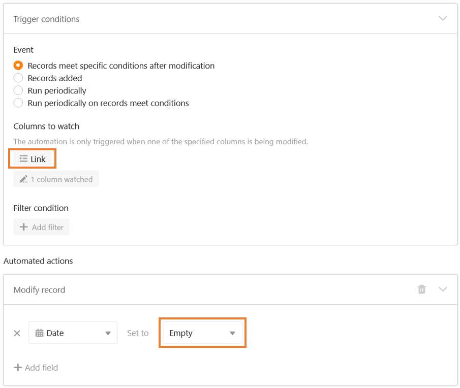
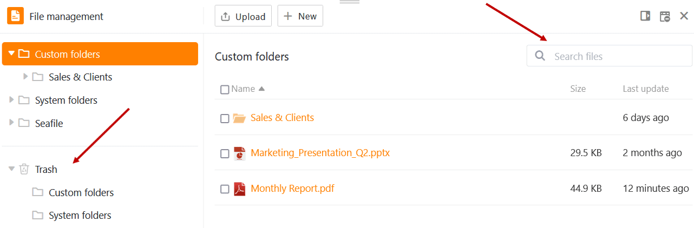
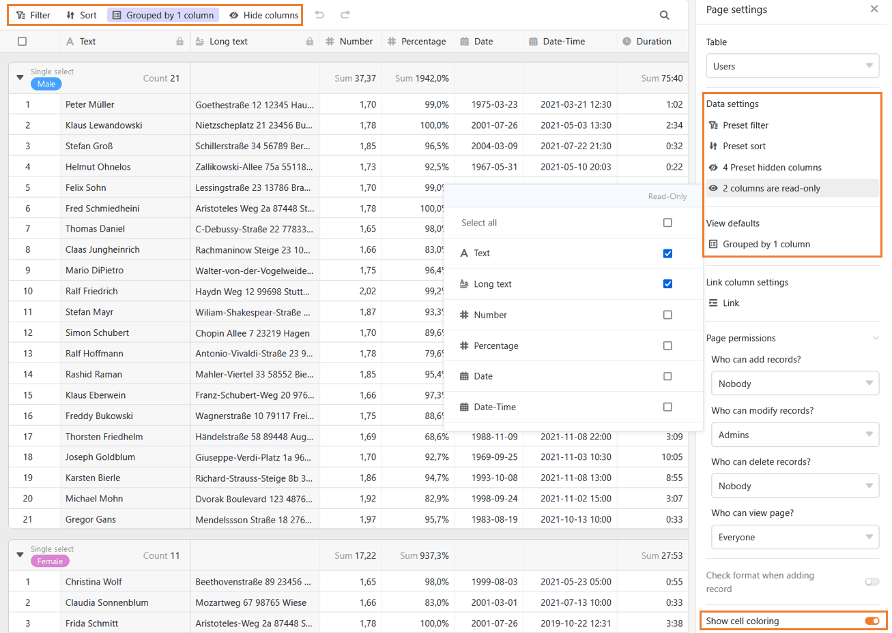

Die Sommerferien neigen sich dem Ende zu und wir hoffen, Sie haben die Urlaubszeit genossen. Während andere in den Pool sprangen oder die Füße hochlegten, haben sich unsere Entwickler mächtig ins Zeug gelegt und **SeaTable Version 4.1** hervorgezaubert.

Nutzen Sie in Ihren Bases bereits automatisierte Prozesse, um Zeit und Klicks zu sparen? Dann wird Ihnen gefallen, dass wir bei den [Automationen](https://seatable.io/docs/automationen/uebersicht-ueber-automationen/) ebenso die Optionen verfeinert, wie die Leistung verbessert haben. Über das höhere Ausführungslimit können sich die Intensivnutzer von SeaTable besonders freuen. Die in Version 4.0 eingeführte [Dateiverwaltung](https://seatable.io/docs/dateien-und-bilder/das-dateimanagement-einer-base/) bietet Ihnen nun zwei weitere Features, welche die Arbeit mit Dateien vereinfachen.

Die Entwicklung des [Universal App Builders](https://seatable.io/docs/apps/universelle-app/) schreitet in Siebenmeilenstiefeln voran: SeaTable 4.1 hält neue Funktionen für Sie bereit, um Benutzerberechtigungen und die Datenvisualisierung in Apps genauer auszudifferenzieren. Daneben haben wir in SeaTable 4.1 viele kleinere Funktionen verbessert oder neu hinzugefügt. Überzeugen Sie sich selbst – die Liste ist lang und sehr erfreulich!

Heute Morgen haben wir SeaTable Cloud auf Version 4.1 aktualisiert. Alle Selbsthoster können das ebenfalls tun: Das Image von SeaTable 4.1 ist im bekannten [Docker Repository](https://hub.docker.com/r/seatable/seatable-enterprise) zum Download verfügbar. Im [Changelog](https://seatable.io/docs/changelog/version-4/) finden Sie wie immer die vollständige Liste der Änderungen.

## Leistungsstärkere Automationen

Bei Automationen mit dem [Trigger](https://seatable.io/docs/automationen/automations-trigger/) „Einträge erfüllen nach der Änderung bestimmte Bedingungen“ legen Sie die Spalten fest, die SeaTable überwacht. Eine Aktion wird dann automatisiert ausgeführt, wenn ein Wert in den definierten Spalten bearbeitet wird. Mit SeaTable 4.1 wird die Liste der überwachbaren Spalten verlängert: Auch **Verknüpfungsspalten** können nun überwacht werden. Damit lassen sich bestehende Automationen vereinfachen und neue Anwendungsfälle umsetzen.

Darüber hinaus haben wir die Performance einiger [Aktionen](https://seatable.io/docs/automationen/automations-aktionen/) verbessert und deren Funktionen erweitert. Beispielsweise bietet die Aktion „Eintrag bearbeiten“ nun auch die Option, den Wert in einer Datum-Spalte auf „**Leer**“ zu setzen.



Jede Automation unterliegt einem [Ausführungslimit](https://seatable.io/docs/automationen/ausfuehrungslimit-bei-automationen/), das die maximale Ausführungsfrequenz von Automationen definiert. Ein solches Limit ist notwendig, um für alle Benutzer von SeaTable Cloud eine gute User Experience sicherzustellen. Bisher galt in SeaTable Cloud ein Limit von 10 Ausführungen pro Minute für jede Automation. Dieses Limit wurde mit dem Versionswechsel auf **50 Ausführungen pro Minute** erhöht. Dieses neue Limit sollte für viele Anwendungsfälle keine relevante Einschränkung darstellen. Anders bei Automationen mit dem Ereignistyp **Hinzugefügte Einträge**. Dort kann auch das erhöhte Limit schnell greifen. Wenn Sie beispielsweise Zeilen aus einer Excel Tabelle kopieren und in SeaTable einfügen, dann wird das Limit die Ausführung auf die ersten 50 eingefügten Zeilen beschränken.



## Papierkorb und Suchfunktion in der Dateiverwaltung

Die in SeaTable 4.0 eingeführte [Dateiverwaltung](https://seatable.io/docs/dateien-und-bilder/das-dateimanagement-einer-base/) hat den Umgang mit Dateien in SeaTable revolutioniert. In der Version 4.1 wurden zwei weitere Funktionen ergänzt: ein **Papierkorb** und eine **Suche**.

Dank des Papierkorbs gehen aus Versehen gelöschte Dateien nicht endgültig verloren, sondern können wiederhergestellt werden. Gelöschte Dateien verbleiben **60 Tage** im Papierkorb, bevor sie dauerhaft aus dem System entfernt werden. Sollen Dateien schneller aus dem Papierkorb verschwinden, dann lässt sich der Papierkorb auch manuell leeren.

Ebenfalls neu ist die Suchfunktion, mit der Sie die eigenen Ordner in der Dateiverwaltung durchsuchen können. Geben Sie einfach einen Suchbegriff in das Suchfeld ein. SeaTable zeigt dann alle Dateien an, die den Suchbegriff im Dateiennamen enthalten. Wenn eine Datei mal nicht dort ist, wo Sie sie erwarten, dann kommen Sie ihr so schnell auf die Spur.

## Feinschliff des Universal App Builders

Die Entwicklung des Universal App Builders ist auf der Zielgeraden und unser Team arbeitet mit Hochdruck am Feinschliff der Details. SeaTable 4.1 bringt vor allem neue Funktionen mit sich, um die Berechtigungen der Benutzer der Universal App feiner und genauer steuern.

Die [Seitenberechtigungen](https://seatable.io/docs/apps/seitenberechtigungen-in-einer-universellen-app/) erlauben die Berechtigungsverwaltung für eine ganze Seite einer App: Wer darf auf einer Seite Zeilen sehen, wer darf Zeilen anlegen, wer darf Zeilen ändern und löschen. SeaTable 4.1 führt eine einfache Berechtigungslogik für Spalten ein. Spalten können nun individuell auf „**nur lesbar**“ gesetzt und damit der Bearbeitung durch die Nutzer entzogen werden. Die neuen Spaltenberechtigungen in der Universal App gelten zusätzlich zu den [Spaltenberechtigungen](https://seatable.io/docs/arbeiten-mit-spalten/spaltenberechtigungen-festlegen/) in der Base und erlauben in Kombination eine sehr granulare Steuerung der Benutzerrechte auf einer Tabellenseite.



Die **Standardeinstellungen** für Ansichten sind eine weitere Neuerung auf Tabellenseiten. Eine Standardeinstellung bestimmt die Anzeige der Daten beim Aufruf der Seite. Sie gibt damit einen bestimmten Blickwinkel auf die Daten vor, sie kann aber von den App-Benutzern geändert und damit der Blickwinkel auf die Bedürfnisse der Benutzer angepasst werden. Die Funktionsweise ist damit grundsätzlich anders als die der schon länger verfügbaren Dateneinstellungen. Letztere können durch die Benutzer nicht geändert werden. Die Dateneinstellungen dienen dazu, die den Benutzern angezeigten Daten einzuschränken.

Damit sind die Verbesserungen auf der Tabellenseite noch nicht zu Ende: Mit einem Klick können Sie die bedingte Zellformatierung aus der zugrundeliegenden Tabelle anzeigen lassen und so die [Zellen einfärben](https://seatable.io/docs/ansichtsoptionen/einfaerben-von-zellen/).

Und auch die anderen Seitentypen gehen nicht leer aus: Die [Seitentypen](https://seatable.io/docs/apps/seitentypen-in-der-universellen-app/) Abfrage und Webformular bieten nun auch Seitenberechtigungen. Auf der individuellen Seite lassen sich Elemente nun leichter verschieben und positionieren.

## Und vieles mehr

Bisher mussten Sie jedes Mal, wenn Sie sich ausloggen oder Ihre persönlichen Einstellungen ändern wollten, auf die [Startseite](https://seatable.io/docs/kurzanleitungen/die-startseite-von-seatable/) zurückkehren. Dies wird durch die folgende Verbesserung der Benutzeroberfläche viel praktischer: Ihre [persönlichen Einstellungen](https://seatable.io/docs/persoenliche-einstellungen/persoenliche-einstellungen/) können Sie nun in jeder Base und sogar in jeder Universellen App über Ihr **Avatarbild** in der rechten oberen Ecke erreichen. Wenn Sie Teamadministrator sind, können Sie sich doppelt freuen: Denn auch die [Teamverwaltung](https://seatable.io/docs/teamverwaltung-abonnement/die-funktionen-der-teamverwaltung-in-der-uebersicht/) ist jetzt überall in SeaTable nur noch zwei Klicks entfernt.

Auf der Homepage konnten Sie [Ordner](https://seatable.io/docs/arbeiten-mit-bases/einen-ordner-anlegen/) bislang nur in Gruppen und im Bereich „Meine Bases“ erstellen. Im Bereich „**Für mich freigegeben**“ hatten Sie aber nicht die Möglichkeit, die an Sie freigegebenen Bases in Ordnern thematisch zusammenzufassen. Um die Übersichtlichkeit zu erhöhen, haben wir dies nun ergänzt.

Oftmals ist für andere Nutzer nicht ersichtlich, was Sie sich bei der Struktur einer Base oder Tabelle gedacht haben. Vielleicht möchten Sie auch **Notizen** zu einer Spalte, Tabelle oder Base festhalten. Dies können Sie bisher in einer [Spaltenbeschreibung](https://seatable.io/docs/arbeiten-mit-spalten/hinzufuegen-einer-spaltenbeschreibung/) oder in einer [Base-Beschreibung](https://seatable.io/docs/arbeiten-mit-bases/wie-man-einer-base-eine-beschreibung-hinzufuegt/) tun. Was noch fehlte, war die Option, mit einem prägnanten Text die Inhalte, Strukturen und Prozesse in einer Tabelle zu erläutern. Künftig können Sie deshalb jede Tabelle mit einer [Tabellenbeschreibung](https://seatable.io/docs/arbeiten-in-tabellen/eine-tabellenbeschreibung-hinzufuegen/) versehen.

Eine weitere, rein optische Verbesserung betrifft die **Zeilendetails**, in denen Sie Einträge ansehen und je nach Berechtigung bearbeiten können: Wir haben das Design der Zeilendetails in Universellen Apps und Bases angeglichen, um einen einheitlichen Look zu schaffen. Damit Sie gesperrte Felder direkt erkennen können, werden diese in den Zeilendetails nun einheitlich grau hinterlegt.

Für alle, die gerne Prozesse mit einem Mausklick starten, gibt es Grund zur Freude: Die neue [Schaltflächen-Aktion](https://seatable.io/docs/andere-spalten/die-schaltflaeche/) „Benachrichtigung senden“ ist ab SeaTable 4.1 verfügbar. Diese ergänzt die schon zuvor verfügbare Aktion „E-Mail senden“. Da SeaTable mittlerweile **neun** Schaltflächen-Aktionen anbietet, haben wir auch das Auswahl-Fenster übersichtlicher gestaltet:

Zu guter Letzt haben wir in SeaTable 4.1 wieder einige **Bugs** gefixt – unter anderem, dass Werte mit folgendem %-Zeichen in Text- und Einfachauswahl-Spalten nicht als Prozentwerte, sondern als Zahlen interpretiert wurden. Dies konnte bei manchen [Formeln](https://seatable.io/docs/formeln/grundlagen-von-seatable-formeln/) zu unerwünschten Ergebnissen führen. Bitte überprüfen Sie, ob sich dieser Bugfix auf Ihre Formeln auswirkt.
