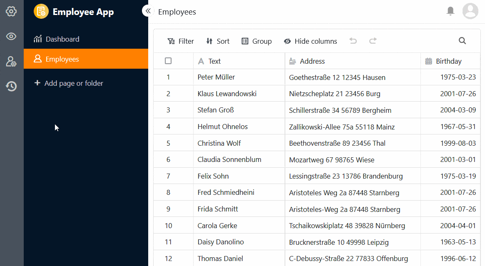
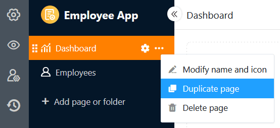
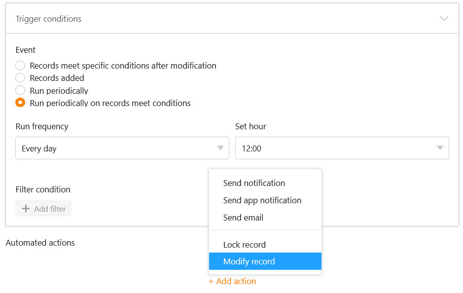

In **SeaTable 4.2** geht die Weiterentwicklung des Universal App Builders in die nächste Runde: Die neue **Versionsverwaltung** ermöglicht den Rücksprung auf frühere Versionsstände einer App. Mit der **Duplikatsprüfung** auf der Tabellen- und Formularseite können Sie wirksam die Erfassung identischer Einträge verhindern. Zudem ist es nun möglich, Seiten in der Universellen App zu duplizieren und **Apps zeitweise auszusetzen**.

SeaTable 4.2 ist aber kein reines App Builder Release. Formelfreunde können sich über die neue **iserror()-Funktion** freuen und Prozessoptimierer werden die vielseitigere Einsatzmöglichkeit der **Aktion „Eintrag bearbeiten“** zu schätzen wissen. Was sich sonst noch getan hat, erfahren Sie im folgenden Artikel.

Heute Morgen haben wir SeaTable Cloud auf Version 4.2 aktualisiert. Alle Selbsthoster können das ebenfalls tun: Das Image von SeaTable 4.2 ist im bekannten [Docker Repository](https://hub.docker.com/r/seatable/seatable-enterprise) zum Download verfügbar. Im [Changelog](https://seatable.io/docs/changelog/version-4/) finden Sie wie immer die vollständige Liste der Änderungen.

## Versionsverwaltung in Universellen Apps

Die [Snapshot](https://seatable.io/docs/historie-und-versionen/speichern-der-aktuellen-base-als-snapshot/)\-Funktionalität gehört zur DNA von SeaTable. Bereits in Version 1.0 ließen sich Momentaufnahmen vom Zustand einer Base erstellen und zu einem späteren Zeitpunkt wiederherstellen. Nur konsequent also, eine solche Funktion auch in den Universal App Builder zu integrieren.

Die neue **Versionsverwaltung** befindet sich hinter dem -Icon in der linken Einstellungsleiste. Dort können Sie Snapshots erstellen, ansehen, wiederherstellen und löschen. Für jeden Snapshot lässt sich auch eine kleine Notiz erfassen, mit der Sie schnell die richtige Version wiederfinden.



Wenn Sie einen gespeicherten Snapshot wiederherstellen, wird die App auf den früheren Stand zurückgesetzt. Alle seitdem vorgenommenen Änderungen werden verworfen. Die Snapshot-Wiederherstellung in der App funktioniert also anders als in der Base, wo der Snapshot in einer neuen Base wiederhergestellt wird.



## Duplikatsprüfung auf Tabellen- und Formularseiten

Gerade bei Universellen Apps, über die viele Benutzer neue Einträge in einer Base vornehmen können, ist es schnell passiert, dass **identische Zeilen** angelegt werden. Dies können Sie künftig unterbinden, indem Sie auf [Tabellen- und Formularseiten](https://seatable.io/docs/apps/seitentypen-in-der-universellen-app/) die Funktion aktivieren, das Hinzufügen von Duplikaten zu verhindern. Dabei legen Sie die Spalten fest, in denen die Werte übereinstimmen müssen, damit eine Zeile als **Duplikat** zählt. Wenn das Hinzufügen einer Zeile blockiert wird, erscheint eine entsprechende Fehlermeldung.

## Seiten duplizieren und Apps deaktivieren

Die Erstellung und Konfiguration von Seiten im Universal App Builder kann – insbesondere bei individuellen Seiten wie Dashboards – viel Zeit in Anspruch nehmen. Für den Fall, dass Sie bereits Seiten gebaut haben, die Sie nur leicht abwandeln möchten, bietet SeaTable 4.2 nun die Funktion, **Seiten zu duplizieren** und damit Zeit und Aufwand zu sparen. Die Kopie übernimmt alle Inhalte, Einstellungen und Berechtigungen eins zu eins von der ursprünglichen Seite.

Wenn Sie eine App gebaut haben, deren Nutzung Sie zeitweise unterbinden möchten, können Sie diese nun mit wenigen Klicks **aussetzen**, um allen Nutzergruppen den Zugriff zu entziehen. Zu einem späteren Zeitpunkt lässt sich die App auf gleichem Wege wieder **aktivieren**.

## Weitere Customizing-Optionen

Neben diesen neuen Funktionen bietet der Universal App Builder in der Version 4.2 auch einige neue Customizing-Optionen: Auf individuellen Seiten können Sie nun Statistiken und Diagramme mit einem individuellen **Titel** versehen und dessen Schriftgröße, Schriftstärke und Ausrichtung nach Belieben anpassen. Darüber hinaus können Sie **Bilder** nutzen, um Seiten der App oder externe Ressourcen zu **verlinken**, und der individuellen Seite damit ein Website-Feeling verpassen. Die **Navigationsleiste**, über die Sie die Seiten und Ordner ansteuern, haben wir ebenfalls einem kleinen Face-Lift unterzogen und Sie können nun über die Einstellungen festlegen, ob die Leiste beim Öffnen der App standardmäßig ein- oder ausgeblendet sein soll.

Die Entwicklung am Universal App Builder wird in den kommenden Versionen ungebremst weitergehen. Aus diesem Grund bleibt der Universal App Builder auch mit SeaTable 4.2 in der Beta-Phase.

## Einträge bearbeiten bei periodischen Automationen

Die [automatisierte Aktion „Eintrag bearbeiten“](https://seatable.io/docs/automationen/automations-aktionen/#6-toc-title) konnten Sie bisher nur durch das Hinzufügen neuer Zeilen oder die Änderung von Einträgen auslösen. Nun können Sie diese Automation auch **periodisch für Einträge ausführen lassen, die gewisse Bedingungen erfüllen**. Die Einträge in der Tabelle werden dann immer zu einem bestimmten Zeitpunkt gemäß den im Vorhinein definierten Einstellungen angepasst.

## Neue Funktion in der Formel-Spalte: iserror()

Für [Formel](https://seatable.io/docs/formeln/grundlagen-von-seatable-formeln/)\-Freunde ist die neue Funktion **iserror()** ein Schmankerl. Sie prüft, ob ein Argument ein **Fehlerwert** (z. B. #DIV/0!, #VALUE!) ist. Insbesondere für [Formeln mit if-Operatoren](https://seatable.io/docs/formeln/formelbeispiel-logische-if-operatoren-zum-vergleichen-von-werten/) lässt sich dank dieser Funktion eine höhere Ergebnisqualität erzielen.

## Und vieles mehr

### Verbesserte Suchfunktion auf der Startseite

In SeaTable 4.2 haben wir die Suchfunktion auf der Startseite verfeinert, sodass Sie einen noch besseren Überblick über Ihre Bases und Apps erhalten. Geben Sie einfach einen Teil des Namens in das Suchfeld ein und SeaTable wird Ihnen per Autovervollständigung eine Liste aller Treffer anzeigen. Zudem sehen Sie in einer Art Browserverlauf die **Chronik der kürzlich verwendeten Suchergebnisse**, über die Sie schnell auf die zuletzt genutzten Bases und Apps zugreifen können.

### Private in normale Ansichten unwandeln

Ab Version 4.2 können Sie [private Ansichten](https://seatable.io/docs/grundlagen-von-ansichten/unterschiede-zwischen-privaten-und-normalen-ansichten/) in nicht-private (normale) Ansichten umwandeln und damit nachträglich für alle Benutzer einer Base sichtbar machen. Bisher war es nur möglich, eine normale Ansicht als private Ansicht zu duplizieren.

### Zusätzliche Funktionen für die Datenverarbeitung

Bei der Datenverarbeitungsoperation [Rangliste berechnen](https://seatable.io/docs/datenverarbeitung/datenverarbeitung-rangliste-berechnen/) können Sie nun auswählen, in welcher **Reihenfolge** die Werte aufgelistet werden sollen. Geben Sie dafür an, ob der größte oder der kleinste Wert an erster Stelle stehen soll.



Außerdem unterstützt SeaTable 4.2 nun auch den Spaltentyp [Automatische Nummer](https://seatable.io/docs/text-und-zahlen/der-spaltentyp-automatische-nummer/) bei den Datenverarbeitungsoperationen [Vergleichen und verknüpfen](https://seatable.io/docs/datenverarbeitung/datenverarbeitung-vergleichen-und-verknuepfen/) sowie [Vergleichen und kopieren](https://seatable.io/docs/datenverarbeitung/datenverarbeitung-vergleichen-und-kopieren/).
