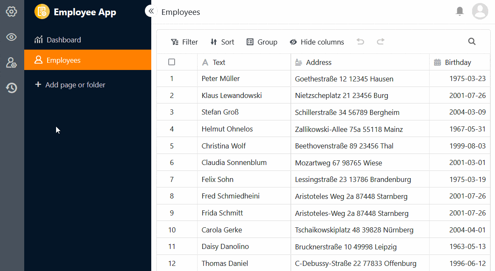

**SeaTable 4.** 2 takes the further development of the Universal App Builder to the next level: The new **version management** allows you to revert to previous versions of an app. With the **duplicate check** on the table and form page, you can effectively prevent the entry of identical records. In addition, it is now possible to duplicate pages in the universal app and **temporarily suspend apps**.

However, SeaTable 4.2 is not just an app builder release. Formula fans can look forward to the new **iserror() function** and process optimizers will appreciate the more versatile use of the **"Modify record" action**. Find out what else has changed in the following article.

This morning we updated SeaTable Cloud to version 4.2. All self-hosters can do the same: The image of SeaTable 4.2 is available for download in the well-known [Docker repository](https://hub.docker.com/r/seatable/seatable-enterprise). As always, you can find the complete list of changes in the [changelog](https://seatable.io/en/docs/changelog/version-4/).

## Version management in universal apps

The [snapshot functionality](https://seatable.io/en/docs/historie-und-versionen/speichern-der-aktuellen-base-als-snapshot/) is part of SeaTable's DNA. Even in version 1.0, snapshots of the status of a base could be created and restored at a later point in time. It is therefore only logical to integrate such a function into the Universal App Builder.

The new **version management** is located behind the  icon in the left-hand settings bar. There you can create, view, restore, and delete snapshots. A small note can also be entered for each snapshot, which allows you to quickly find the correct version again.



If you restore a saved snapshot, the app is reset to the previous status. All changes made since then are discarded. The snapshot restore in the app therefore works differently than in the base, where the snapshot is restored in a new base.



## Duplicate check on table and form pages

With universal apps in particular, which allow many users to add new records to a base, it is easy for **identical rows** to be created. You can prevent this by activating the function to prevent the addition of duplicates on [table and form pages](https://seatable.io/en/docs/apps/seitentypen-in-der-universellen-app/). In doing so, you define the columns in which the values must match for an row to count as a **duplicate**. If the addition of an row is blocked, a corresponding error message appears.

## Duplicate pages and deactivate apps

Creating and configuring pages in the Universal App Builder can take a lot of time - especially for custom pages such as dashboards. In the event that you have already built pages that you only want to modify slightly, SeaTable 4.2 now offers the function to **duplicate pages** and thus save time and effort. The copy takes over all content, settings and authorizations one-to-one from the original page.

If you have built an app that you want to temporarily prevent from being used, you can now **suspend** it with just a few clicks to revoke access for all user groups. The app can be **reactivated** later in the same way.

## Further customizing options

In addition to these new functions, Universal App Builder version 4.2 also offers some new customizing options: On custom pages, you can now add a customized **title** to statistics and charts and adjust its font size, font weight and alignment to your liking. In addition, you can use **images** to **link** pages of the app or external resources, giving the custom page a website feel. We have also given the **navigation bar**, which you use to navigate to pages and folders, a little face-lift and you can now use the settings to specify whether the bar should be shown or hidden by default when you open the app.

The development of the Universal App Builder will continue unabated in the coming versions. For this reason, the Universal App Builder will remain in the beta phase with SeaTable 4.2.

## Modify records for periodic automations

Previously, you could only trigger the [automated "Edit entry" action](https://seatable.io/en/docs/automationen/automations-aktionen/#6-toc-title) by adding new rows or changing entries. Now you can also **run** this automation **periodically for entries that meet certain conditions**. The entries in the table are then always adjusted at a specific time according to the settings defined in advance.

## New function in the formula column: iserror()

The new **iserror()** function is a treat for [formula fans](https://seatable.io/en/docs/formeln/grundlagen-von-seatable-formeln/). It checks whether an argument is an **error value** (e.g. #DIV/0!, #VALUE!). Thanks to this function, a higher quality of result can be achieved, especially for [formulas with if operators](https://seatable.io/en/docs/formeln/formelbeispiel-logische-if-operatoren-zum-vergleichen-von-werten/).

## And much more

### Improved search function on the home page

In SeaTable 4.2, we have refined the search function on the home page to give you an even better overview of your bases and apps. Simply enter part of the name in the search field and SeaTable will show you a list of all hits via auto-complete. You can also see the **history of recently used search results** in a kind of browser history, which you can use to quickly access the most recently used bases and apps.

### Convert private to normal views

From version 4.2, you can convert [private views](https://seatable.io/en/docs/grundlagen-von-ansichten/unterschiede-zwischen-privaten-und-normalen-ansichten/) into non-private (normal) views and thus subsequently make them visible to all users of a base. Previously, it was only possible to duplicate a normal view as a private view.

### Additional functions for data processing

In the [Calculate rank](https://seatable.io/en/docs/datenverarbeitung/datenverarbeitung-rangliste-berechnen/) data processing operation, you can now select the **order** in which the values are to be listed. To do this, specify whether the largest or the smallest value should come first.



In addition, SeaTable 4.2 now also supports the column type [Automatic number](https://seatable.io/en/docs/text-und-zahlen/der-spaltentyp-automatische-nummer/) for the data processing operations [Auto add link](https://seatable.io/en/docs/datenverarbeitung/datenverarbeitung-vergleichen-und-verknuepfen/) as well as [Lookup and copy](https://seatable.io/en/docs/datenverarbeitung/datenverarbeitung-vergleichen-und-kopieren/).
