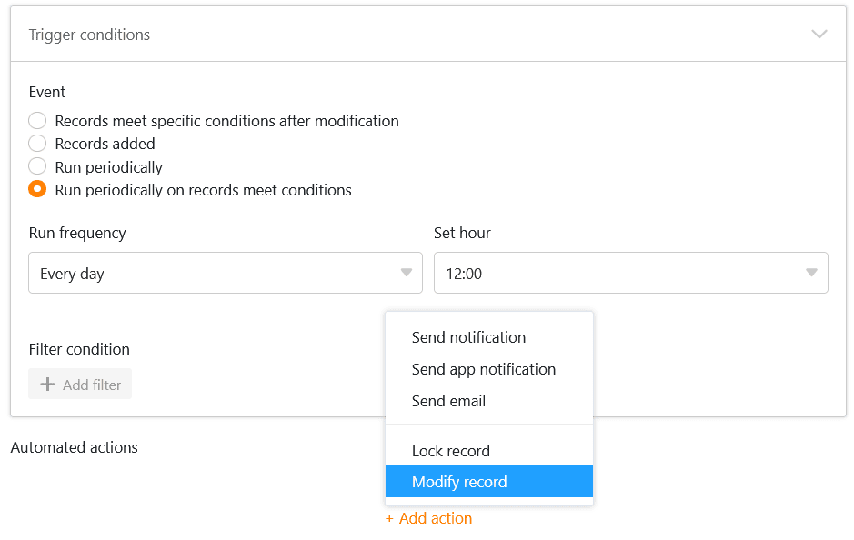
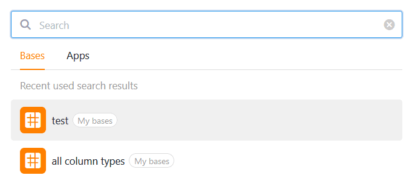

**SeaTable 4.2** выводит дальнейшее развитие универсального конструктора приложений на новый уровень: новое **управление версиями** позволяет возвращаться к предыдущим версиям приложения. **Проверка дубликатов** на странице таблицы и формы позволяет эффективно предотвратить ввод одинаковых записей. Также теперь можно дублировать страницы в универсальном приложении и **временно приостанавливать работу приложений**.

Однако SeaTable 4.2 - это не просто релиз для разработчиков приложений. Любители формул могут рассчитывать на новую **функцию iserror()**, а оптимизаторы процессов оценят более универсальное использование **действия "Редактировать запись"**. О том, что еще изменилось, читайте в следующей статье.

Сегодня утром мы обновили SeaTable Cloud до версии 4.2. То же самое могут сделать и все самостоятельные хостеры: Образ SeaTable 4.2 доступен для загрузки в известном [репозиторииDocker](https://hub.docker.com/r/seatable/seatable-enterprise) . Как всегда, полный список изменений можно найти в [журнале изменений](https://seatable.io/ru/docs/changelog/version-4/).

## Управление версиями в универсальных приложениях

[Функциональность моментальных снимков](https://seatable.io/ru/docs/historie-und-versionen/speichern-der-aktuellen-base-als-snapshot/) является частью ДНК SeaTable. Уже в версии 1.0 можно было создавать снимки состояния базы и восстанавливать их в более поздний момент времени. Поэтому вполне логично интегрировать подобную функцию в Universal App Builder.

**Управление** новыми **версиями** находится за пиктограммой  в левой панели настроек. Там можно создавать, просматривать, восстанавливать и удалять снимки. Кроме того, для каждого снимка можно ввести небольшую заметку, которая позволит быстро найти нужную версию.



При восстановлении сохраненного снимка приложение возвращается к предыдущему состоянию. Все изменения, сделанные после этого, отбрасываются. Поэтому восстановление снимка в приложении работает иначе, чем в базе, где снимок восстанавливается в новой базе.



## Проверка дублирования на страницах таблиц и форм

В частности, в универсальных приложениях, позволяющих многим пользователям вносить новые записи в базу, легко создаются **одинаковые строки**. Предотвратить это в будущем можно, активировав функцию предотвращения добавления дубликатов на [страницах таблиц и форм](https://seatable.io/ru/docs/apps/seitentypen-in-der-universellen-app/). При этом задаются столбцы, значения в которых должны совпадать, чтобы строка считалась **дубликатом**. Если добавление строки блокируется, то появляется соответствующее сообщение об ошибке.

## Дублирование страниц и деактивация приложений

Создание и настройка страниц в Universal App Builder может занимать много времени - особенно это касается пользовательских страниц, например, приборных панелей. Если у вас уже есть созданные страницы, которые вы хотите лишь слегка изменить, в SeaTable 4.2 появилась функция **дублирования страниц**, что позволяет сэкономить время и силы. При дублировании все содержимое, настройки и полномочия переносятся один к одному с исходной страницы.

Если вы создали приложение, использование которого необходимо временно запретить, то теперь вы можете **приостановить** его работу всего несколькими щелчками мыши, лишив доступа все группы пользователей. Впоследствии приложение можно **активизировать** тем же способом.

## Дополнительные возможности настройки

В дополнение к этим новым функциям в Universal App Builder версии 4.2 появились новые возможности настройки: На пользовательских страницах теперь можно добавлять пользовательский **заголовок** к статистике и диаграммам, настраивать размер шрифта, его вес и выравнивание. Кроме того, можно использовать **изображения** для **ссылок** на страницы приложения или внешние ресурсы, придавая пользовательской странице вид веб-сайта. Кроме того, мы немного изменили внешний вид **панели навигации**, которая используется для перехода по страницам и папкам. Теперь в настройках можно указать, должна ли эта панель отображаться или скрываться по умолчанию при открытии приложения.

Развитие универсального конструктора приложений будет продолжаться и в следующих версиях. По этой причине в SeaTable 4.2 Universal App Builder останется на стадии бета-версии.

## Редактирование записей для периодических автоматов

Ранее [автоматическое действие "Редактировать запись"](https://seatable.io/ru/docs/automationen/automations-aktionen/#6-toc-title) можно было вызвать только при добавлении новых строк или изменении записей. Теперь эту автоматизацию можно запускать **периодически для записей, удовлетворяющих определенным условиям**. При этом записи в таблице всегда корректируются в определенное время в соответствии с заранее заданными настройками.

## Новая функция в колонке формул: iserror()

Новая функция **iserror()** придется по душе [любителям формул](https://seatable.io/ru/docs/formeln/grundlagen-von-seatable-formeln/). Она проверяет, является ли аргумент **ошибочным значением** (например, #DIV/0!, #VALUE!). Благодаря этой функции можно добиться более высокого качества результата, особенно для [формул с операторами if](https://seatable.io/ru/docs/formeln/formelbeispiel-logische-if-operatoren-zum-vergleichen-von-werten/).

## И многое другое

### Улучшена функция поиска на стартовой странице

В SeaTable 4.2 мы усовершенствовали функцию поиска на стартовой странице, чтобы дать вам еще более удобный обзор ваших баз и приложений. Просто введите часть названия в поле поиска, и SeaTable покажет вам список всех совпадений с помощью автозаполнения. Вы также можете увидеть **историю последних результатов поиска** в виде своеобразной истории браузера, которую можно использовать для быстрого доступа к последним использованным базам и приложениям.

### Преобразование частных представлений в обычные

Начиная с версии 4.2, [приватные представления](https://seatable.io/ru/docs/grundlagen-von-ansichten/unterschiede-zwischen-privaten-und-normalen-ansichten/) можно преобразовывать в неприватные (обычные) и таким образом делать их видимыми для всех пользователей базы. Ранее можно было только дублировать обычный вид в качестве приватного.

### Дополнительные функции для обработки данных

В операции обработки данных " [Вычислить ранжированный список](https://seatable.io/ru/docs/datenverarbeitung/datenverarbeitung-rangliste-berechnen/) " теперь можно выбрать **порядок**, в котором будут перечислены значения. Для этого необходимо указать, какое значение должно быть указано первым - наибольшее или наименьшее.



Кроме того, SeaTable 4.2 теперь поддерживает тип столбца [Автоматический номер](https://seatable.io/ru/docs/text-und-zahlen/der-spaltentyp-automatische-nummer/) для операций обработки данных [Сравнить и объединить](https://seatable.io/ru/docs/datenverarbeitung/datenverarbeitung-vergleichen-und-verknuepfen/), а также [Сравнить и скопировать](https://seatable.io/ru/docs/datenverarbeitung/datenverarbeitung-vergleichen-und-kopieren/).
