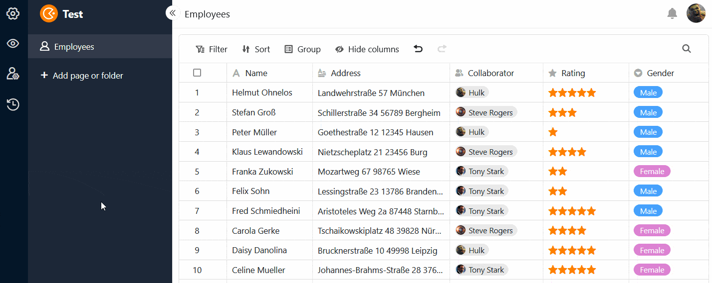
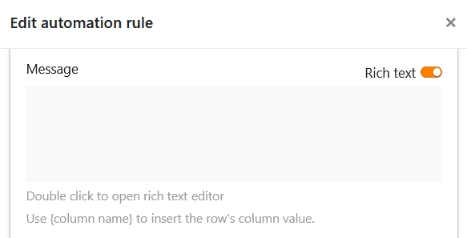

The carnival season in Germany is approaching its peak - and the confetti cannons are popping at SeaTable too! Version 4.3 brings with it some long-awaited functions and improvements.

Look forward to a new dialog for creating **form links** in which you can adapt the URLs to your personal wishes. Use two new **automations** to create documents and send notifications to app users. Or try out the new features in the **universal app**: Among other things, you can expect comments, two additional elements for the custom page and improved customizing of the app theme and colors.

This morning we updated SeaTable Cloud to version 4.3. All self-hosters can do the same: The image of SeaTable 4.3 is available for download in the well-known [Docker repository](https://hub.docker.com/r/seatable/seatable-enterprise). As always, you can find the complete list of changes in the [changelog](https://seatable.io/en/docs/changelog/version-4/).

We have also upgraded the plugins to Webpack 5 and upgraded the framework to React 17.0.2, which will ensure greater security and stability in the future and enable additional functions.

## New dialog and custom links for web forms

To share your [web forms](https://seatable.io/en/docs/webformulare/webformulare/) with other users, there were previously two different dialog boxes: one in which you could copy an **automatically generated link**; and one in which you could extend this link with [pre-filled values](https://seatable.io/en/docs/webformulare/formularfelder-per-url-vorbefuellen/). We have now combined these options into a single dialog to increase usability.

We have also added the brand new option to create **custom URLs** for web forms. You can then edit, save as a QR code, copy or delete them.



## Automated actions: Save PDF and send app notification

Attention automation fans! SeaTable 4.3 adds two new options to the [automated actions](https://seatable.io/en/docs/automationen/automations-aktionen/):

1. Firstly, you have the option of periodically saving PDFs for records that fulfill certain conditions.
2. Secondly, you can now send notifications that certain users of a universal app should receive.

Previously, you could only [create PDF documents](https://seatable.io/en/docs/andere-spalten/ein-pdf-dokument-per-schaltflaeche-in-einer-spalte-speichern/) manually in SeaTable [using a button](https://seatable.io/en/docs/andere-spalten/ein-pdf-dokument-per-schaltflaeche-in-einer-spalte-speichern/). The new option to **automatically** create documents from specific data records at a specified time saves you clicks and makes your processes even smoother.

You can use **app notifications** to inform the users of an app about changes to relevant data records, for example. This action can be [triggered](https://seatable.io/en/docs/automationen/automations-trigger/) by all four [trigger events](https://seatable.io/en/docs/automationen/automations-trigger/).

Users of the respective app can access their notifications via the  bell icon next to their avatar in the top right-hand corner.

## Cross-team collaborator column

In the collaborator [column](https://seatable.io/en/docs/datum-dauer-und-personen/die-spalte-mitarbeiter/), it was previously only possible to select people who already had access to the respective base. As of SeaTable 4.3, you can enter **all members of your team** in collaborator columns, even if they do not have access to certain bases. This makes it much easier to assign data records to your employees regardless of their access authorization.

This functionality is particularly useful in the universal app. You can activate the option for team members to be visible to all users in the drop-down list in the Universal app [settings](https://seatable.io/en/docs/universelle-apps/einstellungen-einer-universellen-app-aendern/). If you do not want users to be able to see the data records of other users, define **preset filters**: If a page is filtered by a collaborator column with the condition "includes current user", each user of the universal app only sees the records that are assigned to them in the table.

## Further improvements to the universal app

A brand new feature in the Universal app is the [comment function](https://seatable.io/en/docs/arbeiten-mit-zeilen/zeilen-kommentieren/), which you already know in the same form from your bases. Record your feedback or additional information on the data records for other app users and hold discussions on the spot.



On the [custom page](https://seatable.io/en/docs/seitentypen-in-universellen-apps/individuelle-seiten-in-universellen-apps/), you can look forward to two new elements: the **container** and the **card**. The container provides a grid with which you can arrange other elements (texts, images, statistics) more easily and group them together.

The card, which combines an image, a headline and a text into a design template, also ensures a beautiful page layout.

In addition, as of SeaTable 4.3, the **background color** of custom pages can be set as desired, and the unwanted overlapping of elements has been fixed. The overall design of the universal app is now also presented in one color theme across all pages, which you can select in the [global settings](https://seatable.io/en/docs/universelle-apps/einstellungen-einer-universellen-app-aendern/).

### Authorizations on table pages

The inheritance of [column permissions](https://seatable.io/en/docs/arbeiten-mit-spalten/spaltenberechtigungen-festlegen/) from the base is abolished with SeaTable 4.3. If you want to lock a column in the Universal App for editing, you can set it to **"read-only"** in the [table page](https://seatable.io/en/docs/seitentypen-in-universellen-apps/tabellenseiten-in-universellen-apps/) settings instead.

All restrictions for [button actions](https://seatable.io/en/docs/andere-spalten/die-schaltflaeche/) have also been removed. Every app user can now make predefined changes to the data records, even if the affected columns are otherwise locked for them and the user is not authorized to edit the page.

## Important announcement: Removal of the gallery and data query app

In version 4.4, the [gallery app](https://seatable.io/en/docs/apps/galerie-app/) and the [data query app](https://seatable.io/en/docs/apps/datenabfrage-app/) will disappear, as their functionality can now be fully mapped with the corresponding **page types** in the universal app. The Universal App Builder will therefore be the only option for creating apps in SeaTable in the future.

If you use the two expiring apps, we recommend that you rebuild your use cases with [gallery pages](https://seatable.io/en/docs/seitentypen-in-universellen-apps/galerieseiten-in-universellen-apps/) and query [pages](https://seatable.io/en/docs/seitentypen-in-universellen-apps/abfrageseiten-in-universellen-apps/) in the App Builder before the next release. Incidentally, you can now add fields to query pages that allow users to search **link columns** for specific values.



## And much more

If you [send emails via automation](https://seatable.io/en/docs/beispiel-automationen/e-mail-versand-per-automation/), you could previously only enter your message as **plain text** in the text field. As of SeaTable 4.3, it is possible to compose the messages in **rich text or HTML format** via buttons, just like when sending e-mails. To do this, simply activate the slider on the right above the text field.

If you like **column permissions** to protect values from unwanted changes, you will be able to define this even more precisely in future. In addition to _specific users_, _administrators_ and _nobody_, **specific groups** are now also available as an option.

In future, there will be an option to [export](https://seatable.io/en/docs/import-von-daten/speichern-einer-base-als-dtable-datei/) bases without the uploaded attachments in the file manager if they exceed the export limit of 100 MB per base.

In terms of API, SeaTable 4.3 supports [JOIN queries](https://developer.seatable.io/scripts/sql/reference/) for the first time, with which you can query those data records from different tables that share a common intersection of attributes. You can find out more about this in the Developer Manual.

## Simplified installation of SeaTable and additional components

Finally, we have a special treat for **on-premises customers**: to coincide with the release of version 4.3 of SeaTable Cloud, we have also revised the **installation instructions** in our [admin manual](https://admin.seatable.io).

Our main goal is to make the **installation and future updates of your own SeaTable server** even easier. For example, in future the service will start automatically when you start the associated container, and you will no longer have to initiate database updates manually. These are just a few of the many small improvements that will make your life as an administrator easier and can now be found in the admin manual.

In addition, we simplify the installation of supplementary components such as the **Python pipeline** for executing Python code in SeaTable and the **n8n automation platform**. Each of these extensions is provided by us ready to use and can be installed with just a few commands. So you can get even more out of your server.
