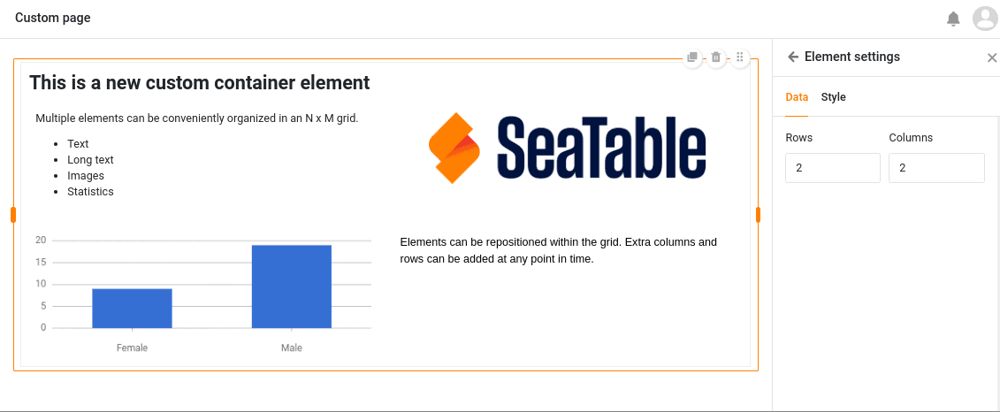

La période du carnaval en Allemagne approche de son apogée - et chez SeaTable aussi, les canons à confettis claquent ! La version 4.3 apporte quelques fonctions et améliorations attendues depuis longtemps.

Profitez d'une nouvelle boîte de dialogue pour créer des **liens vers des formulaires**, dans laquelle vous pouvez adapter les URL à vos souhaits personnels. Utilisez deux nouvelles **automatisations** pour créer des documents et envoyer des notifications aux utilisateurs de l'application. Ou essayez les nouveautés de l'**application universelle**: Des commentaires, deux éléments supplémentaires pour la page individuelle et une meilleure personnalisation des couleurs vous attendent entre autres.

Ce matin, nous avons mis à jour SeaTable Cloud à la version 4.3. Tous les auto-hébergeurs peuvent faire de même : L'image de SeaTable 4.3 est disponible en téléchargement dans le célèbre [dépôtDocker](https://hub.docker.com/r/seatable/seatable-enterprise) . Comme toujours, vous trouverez dans le [changelog]() la liste complète des modifications.

Nous avons également procédé à une mise à niveau des plug-ins vers le Webpack 5, ainsi qu'à une mise à niveau du framework vers React 17.0.2, qui garantira à l'avenir une sécurité et une stabilité accrues et permettra d'ajouter de nouvelles fonctionnalités.

## Nouveau dialogue et liens personnalisés pour les formulaires web

Pour partager vos [formulaires web]() avec d'autres utilisateurs, il existait jusqu'à présent deux boîtes de dialogue différentes : une dans laquelle vous pouviez copier un **lien généré automatiquement**; et une dans laquelle vous pouviez développer ce lien avec [des valeurs pré-remplies](). Nous avons désormais réuni ces possibilités en une seule boîte de dialogue afin d'améliorer la convivialité.

Nous avons également ajouté une toute nouvelle option permettant de créer **des URL personnalisées** pour les formulaires web. Vous pouvez ensuite les modifier, les enregistrer sous forme de code QR, les copier ou les supprimer.



## Actions automatisées : Enregistrer le PDF et envoyer une notification d'application

Avis aux amateurs d'automatisation ! Dans SeaTable 4.3, deux nouvelles options viennent s'ajouter aux [actions automatisées]():

1. Premièrement, vous avez la possibilité d'enregistrer périodiquement des PDF pour les entrées qui remplissent certaines conditions.
2. Deuxièmement, il est désormais possible d'envoyer des notifications que certains utilisateurs d'une application universelle doivent recevoir.

Auparavant, SeaTable vous permettait uniquement de [créer]() manuellement [des documents PDF en cliquant sur un bouton](). La nouvelle option permettant de créer **automatiquement** des documents à partir d'enregistrements spécifiques à un moment donné vous évite des clics et rend vos processus encore plus fluides.

Les **notifications d'application** permettent par exemple d'informer les utilisateurs d'une application des modifications apportées aux enregistrements pertinents. Cette action peut être déclenchée par les quatre [événements déclencheurs]().

Les utilisateurs de chaque application peuvent consulter leurs notifications en cliquant sur l'icône de la cloche  à côté de leur avatar dans le coin supérieur droit.

## Colonne des collaborateurs inter-équipes

Dans la [colonne des collaborateurs](), il n'était jusqu'à présent possible de sélectionner que les personnes qui avaient déjà accès à la base en question. À partir de la version 4.3 de SeaTable, vous pouvez ajouter **tous les membres de votre équipe** dans les colonnes des collaborateurs, même s'ils n'ont pas accès à certaines bases. Il est ainsi beaucoup plus pratique d'attribuer des enregistrements à vos collaborateurs, indépendamment de leur droit d'accès.

Cette fonctionnalité est particulièrement utile dans l'application universelle. Vous pouvez activer l'option permettant à tous les utilisateurs de voir les membres de l'équipe dans la liste déroulante dans les [paramètres]() de l'application universelle. Si vous ne souhaitez pas que les utilisateurs puissent voir les enregistrements des autres, définissez **des filtres prédéfinis**: si une page est filtrée par colonne de collaborateurs avec la condition "inclut l'utilisateur actuel", chaque utilisateur de l'application universelle ne verra que les enregistrements qui lui sont attribués dans le tableau.

## Autres améliorations de l'application universelle

La [fonction de commentaire](), que vous connaissez déjà sous la même forme dans la base, est une toute nouvelle fonctionnalité de l'application universelle. Consignez vos commentaires ou des informations supplémentaires sur les jeux de données pour les autres utilisateurs de l'application et menez des discussions sur place.



Sur la [page individuelle](), vous pouvez vous réjouir de deux nouveaux éléments : le **conteneur** et la **carte**. Le conteneur donne une grille qui vous permet de disposer plus facilement d'autres éléments (textes, images, statistiques) et de les regrouper.

La carte, qui réunit une image, un titre et un texte en un modèle de design, assure également une belle mise en page.

De plus, à partir de la version 4.3 de SeaTable, la **couleur d'arrière-plan** des pages individuelles peut être réglée à volonté et le chevauchement indésirable des éléments a été corrigé. De même, le design général de l'application universelle se présente désormais dans une couleur uniforme sur toutes les pages, que vous pouvez choisir dans les [paramètres globaux]().

### Autorisations sur les pages de tableaux

L'héritage des [autorisations de colonnes]() de la Base est supprimé dans SeaTable 4.3. Si vous souhaitez bloquer l'édition d'une colonne dans l'application universelle, vous pouvez à la place la définir **comme "en lecture seule"** dans les paramètres de la [page du tableau]().

De même, toutes les restrictions concernant les [actions sur les boutons]() sont levées. Tout utilisateur de l'application peut désormais effectuer des modifications prédéfinies sur les enregistrements, même si les colonnes concernées sont par ailleurs bloquées pour lui et que l'utilisateur n'est pas autorisé à modifier la page.

## Annonce importante : Suppression de l'application Galerie et de l'application de consultation des données

Dans la version 4.4, l'[application Galerie]() et l'[application de consultation de données]() disparaîtront, car il est désormais possible de reproduire entièrement leurs fonctionnalités avec les **types de pages** correspondants dans l'application universelle. L'Universal App Builder sera donc à l'avenir la seule option pour créer des applications dans SeaTable.

Si vous utilisez les deux applications en cours d'exécution, nous vous recommandons de recréer vos cas d'utilisation avec des [pages de galerie]() et [des pages de requête]() dans l'App Builder avant la prochaine version. Sur les pages de requête, vous pouvez d'ailleurs entre-temps ajouter des champs qui permettent aux utilisateurs de rechercher également **des colonnes de liens** pour certaines valeurs.



Vous connaissez également la [galerie]() et la [requête SQL]() en tant que **plugins** que vous pouvez ajouter à vos bases. Celles-ci continuent bien entendu d'exister.



## Et bien plus encore

Lorsque vous [envoyiez des e-mails par automatisation](), vous ne pouviez jusqu'à présent saisir votre message qu'en **texte brut** dans le champ de texte. À partir de SeaTable 4.3, il est possible, comme pour l'envoi d'e-mails via des boutons, de rédiger les messages au **format texte enrichi ou HTML**. Il suffit pour cela d'activer le curseur situé à droite au-dessus du champ de texte.

Si vous souhaitez utiliser **des autorisations de colonnes** pour protéger les valeurs contre des modifications non souhaitées, vous pourrez désormais les définir de manière encore plus précise. En plus des _utilisateurs spécifiques_, des _administrateurs_ et _de personne_, **certains groupes** sont désormais disponibles en option.

Il y aura à l'avenir l'option d'[exporter]() les bases sans les pièces jointes téléchargées dans la gestion des fichiers, si celles-ci dépassent la limite d'exportation de 100 Mo par base.

En ce qui concerne l'API, SeaTable 4.3 supporte pour la première fois [les requêtes JOIN](https://developer.seatable.io/scripts/sql/reference/), qui permettent d'interroger les enregistrements de différentes tables qui partagent une intersection commune d'attributs. Pour en savoir plus, consultez le manuel du développeur.

## Installation simplifiée de SeaTable et de composants supplémentaires

Enfin, pour les **clients sur site**, nous avons une petite gâterie : en même temps que la sortie de la version 4.3 de SeaTable Cloud, nous avons également revu les **instructions d'installation** dans notre [manuel d'administration](https://admin.seatable.io).

Notre objectif principal est de rendre l'**installation et les futures mises à jour de votre propre serveur SeaTable** encore plus faciles. Par exemple, le service démarrera automatiquement lorsque vous lancerez le conteneur correspondant, et vous n'aurez plus besoin de lancer manuellement les mises à jour de la base de données. Ce ne sont là que quelques-unes des nombreuses petites améliorations qui vous facilitent la vie en tant qu'administrateur et que vous trouverez dès maintenant dans le manuel d'administration.

De plus, nous simplifions l'installation de composants complémentaires tels que le **pipeline Python** pour l'exécution de code Python dans SeaTable et la **plateforme d'automatisation n8n**. Chacune de ces extensions est fournie prête à l'emploi par nos soins et s'installe en quelques commandes. Vous pouvez ainsi tirer encore plus de votre serveur.
