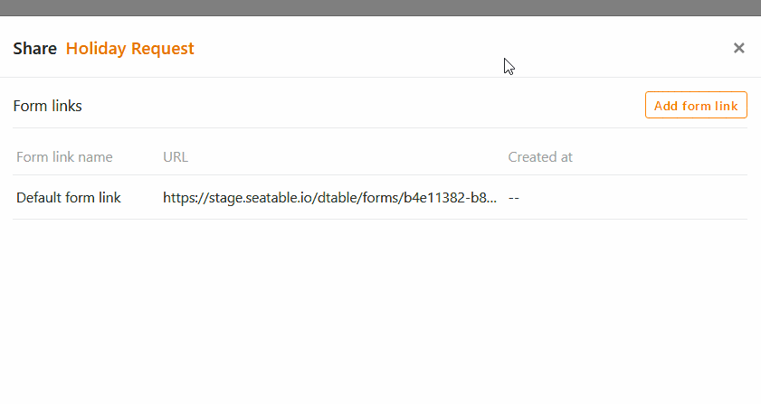
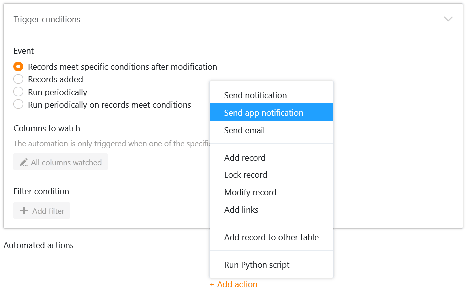
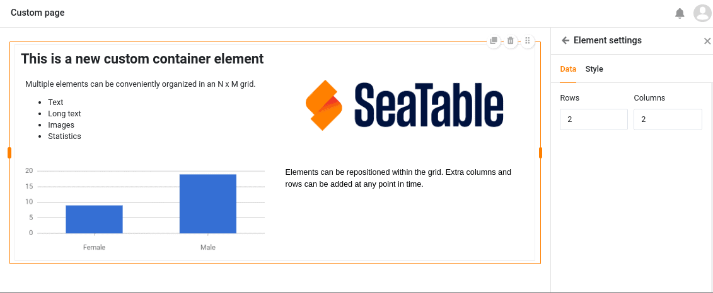
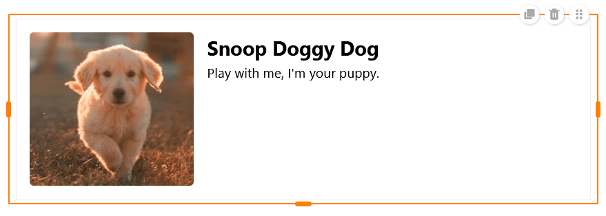

Карнавальный сезон в Германии приближается к своему пику - и пушки с конфетти тоже выстреливают в SeaTable! В версии 4.3 появились долгожданные функции и улучшения.

Предвкушайте новый диалог для создания **ссылок на формы**, в котором вы можете адаптировать URL-адреса под свои личные пожелания. Используйте две новые **автоматизации** для создания документов и отправки уведомлений пользователям приложения. Или попробуйте новые функции в **универсальном приложении**: Среди прочего, вас ждут комментарии, два дополнительных элемента для отдельной страницы и улучшенная настройка цветовой схемы.

Сегодня утром мы обновили SeaTable Cloud до версии 4.3. Все хостеры могут сделать то же самое: Образ SeaTable 4.3 доступен для загрузки в известном [репозиторииDocker](https://hub.docker.com/r/seatable/seatable-enterprise) . Как всегда, полный список изменений вы можете найти в [журнале изменений]().

Мы также обновили плагины до Webpack 5 и обновили фреймворк до React 17.0.2, что обеспечит большую безопасность и стабильность в будущем и позволит использовать дополнительные функции.

## Новые диалоги и пользовательские ссылки для веб-форм

Чтобы поделиться своими [веб-формами]() с другими пользователями, раньше было два разных диалоговых окна: одно, в котором можно было скопировать **автоматически сгенерированную ссылку**, и другое, в котором можно было расширить эту ссылку с помощью [предварительно заполненных значений](). Теперь мы объединили эти опции в одном диалоге, чтобы повысить удобство использования.

Мы также добавили новую возможность создания **пользовательских URL-адресов** для веб-форм. Их можно редактировать, сохранять в виде QR-кода, копировать или удалять.



## Автоматические действия: Сохранение PDF и отправка уведомления приложения

Вниманию любителей автоматизации! SeaTable 4.3 добавляет две новые опции к [автоматическим действиям]():

1. Во-первых, у вас есть возможность периодически сохранять PDF-файлы для записей, удовлетворяющих определенным условиям.
2. Во-вторых, теперь вы можете отправлять уведомления, которые должны получать определенные пользователи универсального приложения.

Раньше в SeaTable можно было [создавать PDF-документы]() только вручную с [помощью кнопки](). Новая возможность **автоматического** создания документов на основе определенных записей данных в заданное время экономит ваши клики и делает ваши процессы еще более плавными.

**Уведомления приложения** можно использовать, например, для информирования пользователей приложения об изменениях в соответствующих записях данных. Это действие может быть [вызвано]() всеми четырьмя [триггерными событиями]().

Пользователи соответствующего приложения могут получить доступ к своим уведомлениям через значок колокольчика  рядом со своим аватаром в правом верхнем углу.

## Межгрупповая колонна сотрудников

Раньше в [столбце]() "Сотрудник" можно было выбрать только тех, кто уже имеет доступ к соответствующей базе. Начиная с версии SeaTable 4.3, вы можете вводить в столбцы сотрудников **всех членов вашей команды**, даже если у них нет доступа к определенным базам. Это значительно упрощает назначение записей данных сотрудникам независимо от их прав доступа.

Эта функция особенно полезна в универсальном приложении. Вы можете активировать опцию, чтобы члены команды были видны всем пользователям, в выпадающем списке в [настройках]() универсального приложения. Если вы не хотите, чтобы пользователи могли видеть чужие записи, **задайте предустановленные фильтры**: если страница отфильтрована по столбцу сотрудников с условием "включает текущего пользователя", каждый пользователь универсального приложения увидит только те записи, которые закреплены за ним в таблице.

## Дальнейшие улучшения универсального приложения

Совершенно новой функцией в универсальном приложении является [функция комментариев](), которую вы уже узнали в том же виде из Base. Записывайте свои отзывы или дополнительную информацию о записях данных других пользователей приложения и проводите обсуждения прямо на месте.



На [отдельной странице]() вас ждут два новых элемента: **контейнер** и **карта**. Контейнер представляет собой сетку, с помощью которой вы можете легче расположить другие элементы (тексты, изображения, статистику) и сгруппировать их вместе.

Карточка, объединяющая изображение, заголовок и текст в шаблон дизайна, также обеспечивает привлекательный макет страницы.

Кроме того, в SeaTable 4.3 можно установить желаемый **цвет фона** отдельных страниц и исправить нежелательное наложение элементов. Общий дизайн универсального приложения теперь также представлен в едином цвете для всех страниц, который можно выбрать в [глобальных настройках]().

### Полномочия на страницах таблицы

Наследование [прав доступа к столбцам]() из базы отменено в SeaTable 4.3. Если вы хотите заблокировать колонку в универсальном приложении для редактирования, вы можете установить для нее значение **"только для чтения"** в настройках [страницы таблицы]().

Также были сняты все ограничения на [действия с кнопками](). Теперь каждый пользователь приложения может вносить предопределенные изменения в записи данных, даже если соответствующие столбцы заблокированы для него, а сам пользователь не имеет права редактировать страницу.

## Важное объявление: Удаление галереи и приложения для запроса данных

В версии 4.4 [приложение галереи]() и [приложение запроса данных]() исчезнут, так как их функциональность теперь может быть полностью сопоставлена с соответствующими **типами страниц** в универсальном приложении. Таким образом, Universal App Builder станет единственным вариантом для создания приложений в SeaTable в будущем.

Если вы используете два приложения с истекающим сроком действия, мы рекомендуем вам перестроить свои сценарии использования со [страницами галереи]() и [страницами]() запросов в App Builder до выхода следующего выпуска. Кстати, теперь вы можете добавлять поля на страницы запросов, которые позволяют пользователям искать определенные значения в **колонках ссылок**.



Вы также знаете [галерею]() и [SQL-запрос]() как **плагины**, которые можно добавить к вашим базам. Они, конечно же, останутся на своих местах.



## И многое другое

Если вы [отправляете электронные письма с помощью автоматизации](), раньше вы могли вводить сообщение только в виде **обычного текста** в текстовом поле. В SeaTable 4.3 появилась возможность составлять сообщения в **формате rich text или HTML** с помощью кнопок, как и при отправке электронных писем. Для этого просто активируйте ползунок справа над текстовым полем.

Если вы хотите использовать **права доступа к столбцам** для защиты значений от нежелательных изменений, в будущем вы сможете определить это еще более точно. В дополнение к _конкретным пользователям_, _администраторам_ и _никому_, теперь также доступны **определенные группы**.

В будущем в файловом менеджере появится возможность [экспортировать]() базы без загруженных вложений, если они превышают лимит экспорта в 100 МБ на базу.

С точки зрения API, SeaTable 4.3 впервые поддерживает [запросы JOIN](https://developer.seatable.io/scripts/sql/reference/), с помощью которых можно запрашивать записи данных из разных таблиц, имеющих общее пересечение атрибутов. Подробнее об этом можно узнать в руководстве разработчика.

## Упрощенная установка SeaTable и дополнительных компонентов

И наконец, для **локальных клиентов** у нас есть особый подарок: в связи с выходом версии 4.3 SeaTable Cloud мы также пересмотрели **инструкции по установке** в нашем [руководстве администратора](https://admin.seatable.io).

Наша главная цель - сделать **установку и последующие обновления вашего собственного сервера SeaTable** еще проще. Например, в будущем служба будет запускаться автоматически при запуске связанного с ней контейнера, и вам больше не придется инициировать обновление базы данных вручную. Это лишь некоторые из множества мелких улучшений, которые облегчат вам жизнь как администратору и которые теперь можно найти в руководстве администратора.

Мы также упрощаем установку дополнительных компонентов, таких как **конвейер Python** для выполнения Python-кода в SeaTable и **платформа автоматизации n8n**. Каждое из этих расширений предоставляется нами уже готовым к использованию и может быть установлено с помощью всего нескольких команд. Таким образом, вы сможете получить еще больше пользы от вашего сервера.
