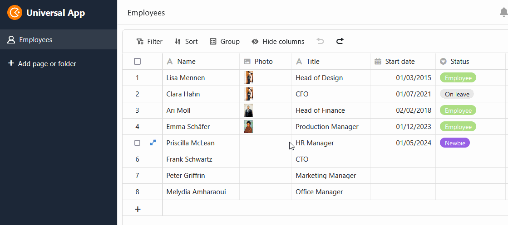
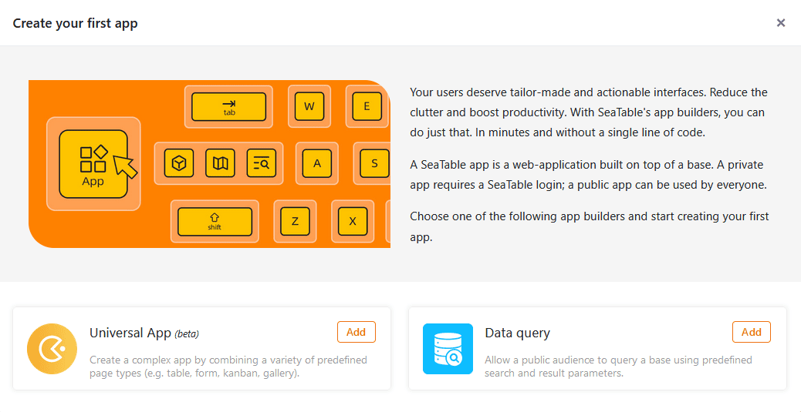
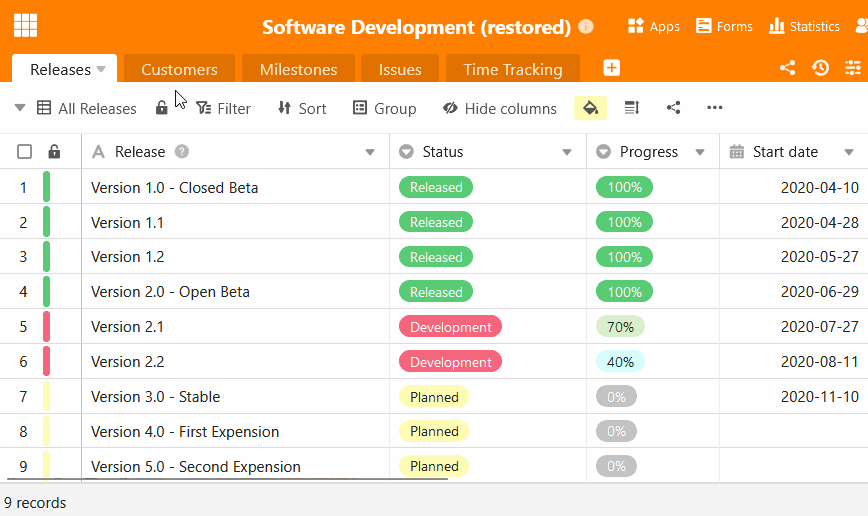

In SeaTable 4.4 setzen wir die Entwicklung des Universal App Builders mit Verve fort. Viele neue Funktionen ermöglichen noch leistungsfähigere und komfortablere Webanwendungen. Darüber hinaus haben wir die Importfunktion und die gemeinsamen Datensätze aufpoliert. Die praktischen Standardwerte greifen nun universell.

Heute Morgen haben wir SeaTable Cloud auf Version 4.4 aktualisiert. Alle Selbsthoster können das ebenfalls tun: Das Image von SeaTable 4.4 ist im bekannten [Docker Repository](https://hub.docker.com/r/seatable/seatable-enterprise) zum Download verfügbar. Im [Changelog](https://seatable.io/docs/changelog/version-4/) finden Sie wie immer die vollständige Liste der Änderungen.

## Flexiblerer, leistungsfähigerer App Builder

In SeaTable 4.4 haben wir wieder jede Menge Verbesserungen und Bugfixes an der [Universellen App](https://seatable.io/docs/apps/universelle-app/) vorgenommen, von denen fast alle [Seitentypen](https://seatable.io/docs/universelle-apps/seitentypen-in-der-universellen-app/) profitieren. Das Ende der Beta-Phase rückt damit in greifbare Nähe.

### Buttons auf Abfrageseiten

[Abfrageseiten](https://seatable.io/docs/seitentypen-in-universellen-apps/abfrageseiten-in-universellen-apps/) unterstützen nun die Ausführung von Schaltflächen-Aktionen: Nach einer erfolgreichen Datenabfrage können Sie in der angezeigten Trefferliste [Schaltflächen](https://seatable.io/docs/andere-spalten/die-schaltflaeche/) betätigen, um Aktionen auszuführen. Dies ist eine besondere Neuerung, denn bisher war in SeaTable nirgends eine Interaktion mit abgefragten Zeilen möglich.

Ein Anwendungsbeispiel ist eine interne Stellenbörse: Die Abfrageseite erlaubt die schnelle Suche nach relevanten Positionen. Ist eine interessante Stelle dabei, dann reicht ein Klick auf die Schaltfläche in den Suchergebnissen, um sich direkt für die Stelle zu bewerben.

### Drag and Drop im Kalender

Bislang war es nicht möglich, Termine auf der [Kalenderseite](https://seatable.io/docs/seitentypen-in-universellen-apps/kalenderseiten-in-universellen-apps/) zu ändern. Mit SeaTable 4.4 bekommen Sie hier mehr Flexibilität. Ab jetzt können Sie Ihre Termine im Kalender komfortabel per Drag and Drop verschieben. Zudem können Sie die Werte in den entsprechenden [Datum-Spalten](https://seatable.io/docs/datum-dauer-und-personen/die-datum-spalte/) über die Zeilendetails bearbeiten, sofern Sie die notwendige [Berechtigung](https://seatable.io/docs/universelle-apps/seitenberechtigungen-in-einer-universellen-app/) besitzen.

### Vereinfachtes Datenhandling auf der Tabellenseite

Wie in der Base können Sie nun auch auf den [Tabellenseiten](https://seatable.io/docs/seitentypen-in-universellen-apps/tabellenseiten-in-universellen-apps/) Ihrer Apps mit nur einem Klick auf den Spaltenkopf [alle Einträge in einer Spalte markieren](https://seatable.io/docs/arbeiten-in-tabellen/hinzufuegen-von-daten-per-copy-and-paste/). Auch der praktische [Füllgriff](https://seatable.io/docs/arbeiten-mit-zeilen/duplizieren-einer-zeile/) ist nun möglich: Ziehen Sie das kleine Quadrat in der unteren rechten Ecke einer Zelle nach unten, um den Wert in alle darunterliegenden Zeilen zu übertragen.

### Mitarbeiter-Spalte auf Formularseiten verfügbar

Wenn Sie eine [Mitarbeiter-Spalte](https://seatable.io/docs/datum-dauer-und-personen/die-spalte-mitarbeiter/) in Ihrer Tabelle nutzen, ist diese in [Webformularen](https://seatable.io/docs/webformulare/webformulare/) **nicht** verfügbar. Jedoch können Sie ab SeaTable 4.4 Mitarbeiter-Spalten auf [Formularseiten](https://seatable.io/docs/seitentypen-in-universellen-apps/formularseiten-in-universellen-apps/) der Universellen App hinzufügen. So können sich Ihre Teammitglieder beispielsweise bei einem Urlaubsantrag selbst auswählen und müssen ihre Namen nicht mehr manuell eintragen. Zuvor müssen Sie in den [App-Einstellungen](https://seatable.io/docs/universelle-apps/einstellungen-einer-universellen-app-aendern/) die Option aktivieren, dass die Mitarbeiterliste angezeigt werden soll.

### Mehr Customizing-Optionen für individuelle Seiten

In Version 4.4 können Sie auf der [individuellen Seite](https://seatable.io/docs/seitentypen-in-universellen-apps/individuelle-seiten-in-universellen-apps/) die **Titelleiste** ausblenden. So lassen sich optisch ansprechende Landingpages gestalten. Bei den Elementen Bild und Karte erlauben Drop-down-Menüs die schnelle **Verlinkung** von anderen Seiten der App. Bei den **Statistiken** haben wir weitere Diagrammtypen hinzugefügt und zusätzliche Konfigurationsmöglichkeiten ergänzt, welche die Erstellung von Dashboards noch komfortabler machen. Um die vielen Stiloptionen übersichtlich darzustellen, haben wir den Stil des Diagramms und den allgemeinen Stil in zwei verschiedene Reiter aufgeteilt.

## Galerie- und Datenabfrage-Apps

Wie in den letzten Release Notes angekündigt, haben wir in SeaTable 4.4 den **Galerie App Builder entfernt**. Wenn Sie eine neue App mit einer [Galerie](https://seatable.io/docs/seitentypen-in-universellen-apps/galerieseiten-in-universellen-apps/) anlegen wollen, dann steht Ihnen mit dem Universal App Builder eine funktional höherwertige Alternative zur Verfügung.



Auch bei der [Datenabfrage-App](https://seatable.io/docs/apps/datenabfrage-app/) hat sich einiges getan. Der alte App Builder für Datenabfragen wurde entfernt und durch einen neuen auf Basis des Universal App Builders ersetzt. Das heißt: Sie können natürlich weiterhin öffentliche Apps für die Abfrage Ihrer Bases anlegen, das Interface sieht nun aber aus wie im Universal App Builder. Für bestehende Abfrage-Apps gilt das Gleiche wie für Galerie-Apps: Sie müssen nichts tun und können diese weiter verwenden.



## Angenehmere User Experience beim Excel Import

Mit SeaTable 4.4 wird der [Import von Excel Tabellen](https://seatable.io/docs/import-von-daten/import-von-excel-dateien-in-seatable/) schneller, flexibler und stabiler: Tabellen mit vielen Tausend Zeilen werden nun in wenigen Augenblicken in SeaTable bereitgestellt. Im deutlich verbreiterten Vorschaufenster können Sie jetzt wählen, welche Tabellen einer Arbeitsmappe – alle oder nur einzelne – Sie aus der XLSX-Datei importieren möchten. Während Sonderzeichen in Spaltennamen und andere Spezialfälle in der Vergangenheit zu unerwünschten Ergebnissen führten, werden diese nun zuverlässig berücksichtigt. Verbesserte Fehlermeldungen geben klare Hinweise auf Konflikte, insbesondere beim [Import in den Big-Data-Speicher](https://seatable.io/docs/big-data/eine-excel-tabelle-ins-big-data-backend-importieren/).



## Mehr Funktionen für gemeinsame Datensätze

[Gemeinsame Datensätze](https://seatable.io/docs/gemeinsame-datensaetze/funktionsweise-von-gemeinsamen-datensaetzen/) sind sehr nützlich, wenn Sie und Ihre Teammitglieder bestimmte Tabellen (z. B. eine Mitarbeiterliste) über verschiedene [Gruppen](https://seatable.io/docs/arbeiten-mit-gruppen/einfuehrung-in-die-arbeit-mit-gruppen/) hinweg in Ihren Bases benötigen. Mit SeaTable 4.4 kommen zu den bestehenden Funktionen drei weitere hinzu:

1. Wenn Sie eine [Base kopieren](https://seatable.io/docs/arbeiten-mit-bases/eine-base-in-eine-gruppe-kopieren/), in die gemeinsame Datensätze eingebunden sind, können Sie entscheiden, ob Sie die Verbindung zu diesen Datensätzen beibehalten wollen. Die Gruppe, in die Sie die Base kopieren, muss dafür natürlich Zugriff auf die gemeinsamen Datensätze haben.

    

2. Nach der [Wiederherstellung von Bases aus Snapshots](https://seatable.io/docs/historie-und-versionen/wiederherstellung-eines-snapshots/) oder der [Erstellung einer Base aus einer Vorlage](https://seatable.io/docs/arbeiten-mit-bases/anlegen-einer-base-mithilfe-einer-vorlage/) können Sie bestehende Tabellen mit einem gemeinsamen Datensatz verknüpfen und dadurch die Synchronisation mit den dortigen Daten ermöglichen. Bisher ließen sich gemeinsame Datensätze nicht reimportieren, sondern nur in neue Tabellen einbinden.

    

3. Der Ersteller eines gemeinsamen Datensatzes kann neuerdings die [Synchronisation](https://seatable.io/docs/gemeinsame-datensaetze/synchronisation-eines-gemeinsamen-datensatzes/) aller abhängigen Tabellen mit dem Datensatz erzwingen und so sicherstellen, dass die anderen Benutzer in ihren Bases den aktuellen Stand der Daten verwenden. In der Vergangenheit mussten Sie darauf vertrauen, dass die Benutzer die automatische Synchronisation eingerichtet haben oder die Synchronisation manuell anstoßen.

    

## Standardwerte greifen überall

Mit Version 4.4 generalisiert SeaTable die Anwendung von [Standardwerten](https://seatable.io/docs/arbeiten-mit-spalten/standardwert-fuer-eine-spalte-festlegen/). Wenn Sie eine neue Zeile anlegen, sei es in der Tabelle einer Base oder App, per [Link-Spalte](https://seatable.io/docs/verknuepfungen/wie-man-tabellen-in-seatable-miteinander-verknuepft/), [Webformular](https://seatable.io/docs/webformulare/webformulare/), [Schaltfläche](https://seatable.io/docs/andere-spalten/zeilen-per-schaltflaeche-in-eine-andere-tabelle-kopieren/) oder [Automation](https://seatable.io/docs/automationen/automations-aktionen/), kommen die Standardwerte bei der Erstellung der Zeile überall zum Tragen. Bisher griffen die Standardwerte nur, wenn in einer Tabelle manuell eine neue Zeile angelegt wurde.

Da sich der Wirkungsbereich der Standardwerte erheblich vergrößert hat, haben wir bei den Spaltenoptionen auch einen prominenten Menüpunkt geschaffen, über den Sie die Standardwerte bequem einstellen können.



Übrigens: Sogar bei der Neuanlage von Zeilen per API können Sie die Standardwerte mit dem entsprechenden Parameter aktivieren.

## Und vieles mehr

Den **Editor für formatierten Text** kennen Sie bereits von verschiedenen Stellen in SeaTable, z. B. von der [Base-Beschreibung](https://seatable.io/docs/arbeiten-mit-bases/wie-man-einer-base-eine-beschreibung-hinzufuegt/), dem [Spaltentyp für lange Texte](https://seatable.io/docs/text-und-zahlen/die-spalten-text-und-formatierter-text/) oder [E-Mail-Nachrichten](https://seatable.io/docs/beispiel-automationen/e-mail-versand-per-automation/). Mit SeaTable 4.4 haben wir die Usability verbessert und einige Bugs behoben. Hier nur zwei: Bisher wurden mehrfache Zeilenumbrüche beim Schließen des Editors entfernt und bestehender Text beim Tippen in der Zelle überschrieben. Im neuen Editor bleiben mehrfache Zeilenumbrüche erhalten und können dazu dienen, den Text übersichtlicher zu strukturieren. Auch die Gefahr von ungewollten Löschungen haben wir beseitigt: Bei der Eingabe wird der neue Text dem bestehenden Text vorangestellt.

In der neuen Version haben wir auch die **Benachrichtigungszentrale**  auf der Startseite verbessert. Jetzt können Sie alle [Benachrichtigungen](https://seatable.io/docs/benachrichtigungen/sinn-und-zweck-von-benachrichtigungen-in-seatable/) im System an einem Ort sehen, die Quelle der Benachrichtigung nachvollziehen und mit einem Klick zur entsprechenden Seite gelangen.

Zu guter Letzt haben wir den Dialog für das **Zurücksetzen des SeaTable Passworts** optimiert. Dafür haben wir das Design vereinheitlicht und mehr Funktionen hinzugefügt. Wenn Sie in Ihren persönlichen Einstellungen das [Passwort ändern](https://seatable.io/docs/persoenliche-einstellungen/eigenes-passwort-aendern/), können Sie es sich nun per Klick auf das Augensymbol im Klartext einblenden lassen. Zudem bekommen Sie automatisch die Stärke Ihres neuen Passworts angezeigt.
