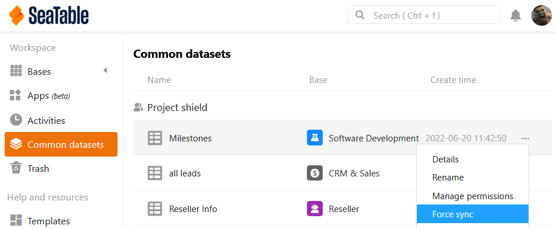

In SeaTable 4.4, we continue the development of the Universal App Builder with verve. Many new functions enable even more powerful and convenient web applications. We have also polished up the import function and the common datasets. The practical default values now apply universally.

This morning we updated SeaTable Cloud to version 4.4. All self-hosters can do the same: The image of SeaTable 4.4 is available for download in the well-known [Docker repository](https://hub.docker.com/r/seatable/seatable-enterprise). As always, you can find the complete list of changes in the [changelog]().

## More flexible, more powerful App Builder

In SeaTable 4.4 we have again made a lot of improvements and bug fixes to the [Universal App](), which benefit almost all [page types](). The end of the beta phase is now within reach.

### Buttons on query pages

[Query pages]() now support the execution of button actions: After a successful data query, you can press [buttons]() in the displayed hit list to execute actions. This is a special new feature, as it was previously not possible to interact with queried rows anywhere in SeaTable.

One application example is an internal job board: the query page allows you to quickly search for relevant positions. If an interesting position is found, a click on the button in the search results is enough to apply for the position directly.

### Drag and drop in the calendar

Until now, it was not possible to change appointments on the [calendar page](). SeaTable 4.4 gives you more flexibility here. You can now conveniently move your appointments in the calendar using drag and drop. You can also edit the values in the corresponding [date columns]() via the row details, provided you have the necessary [permission]().

### Simplified data handling on the table page

As in Base, you can now [select all entries in a column]() on the [table pages]() of your apps with just one click on the column header. The practical [fill handle]() is now also possible: drag the small square in the bottom right-hand corner of a cell downwards to transfer the value to all the rows below it.

### Collaborator column available on form pages

If you use an [employee column]() in your table, it is **not** available in [web forms](). However, as of SeaTable 4.4, you can add employee columns to [form pages]() in the Universal App. For example, your team members can select themselves for a vacation request and no longer have to enter their names manually. You must first activate the option to display the employee list in the [app settings]().

### More customizing options for custom pages

In version 4.4, you can hide the **title bar** on the [individual page](). This allows you to create visually appealing landing pages. For the image and map elements, drop-down menus allow you to quickly **link** to other pages in the app. For the **statistics**, we have added further chart types and additional configuration options to make the creation of dashboards even more convenient. In order to present the many style options clearly, we have divided the chart style and the general style into two different tabs.

## Gallery and data query apps

As announced in the last release notes, we have **removed** the **Gallery App Builder** in SeaTable 4.4. If you want to create a new app with a [gallery](), the Universal App Builder offers you an alternative with higher functionality.



There have also been some changes to the [data query app](). The old App Builder for data queries has been removed and replaced by a new one based on the Universal App Builder. This means that you can of course still create public apps for querying your bases, but the interface now looks like the Universal App Builder. The same applies to existing query apps as for gallery apps: you don't have to do anything and can continue to use them.



## More pleasant user experience when importing Excel files

SeaTable 4.4 makes the [import of Excel tables]() faster, more flexible and more stable: Tables with many thousands rows are now made available in SeaTable in just a few moments. In the significantly enlarged preview window, you can now choose which tables of a workbook – all or only some – you want to import from the XLSX file. While special characters in column names and other special cases led to undesired results in the past, these are now reliably taken into account. Improved error messages provide clear indications of conflicts, especially when [importing into the Big Data Storage]().



## More functions for common datasets

[Common datasets]() are very useful if you and your team members need certain tables (e.g. an employee list) across different [groups]() in your bases. SeaTable 4.4 adds three new functions to the existing ones:

1. If you  
   [Copy a base
   ]()to a group in which common datasets are included, you can decide whether you want to retain the connection to these datasets. The group to which you copy the base must of course have access to the common datasets.

    

2. After  
   [restoring bases from snapshots]() or  
   [creating a base from a template]() you can link existing tables to a common dataset and thus enable synchronization with the data there. Previously, common datasets could not be reimported, but only integrated into new tables.

    

3. The creator of a common dataset can now force the  
   [synchronization]() of all dependent tables with the data set and thus ensure that the other users use the current status of the data in their bases. In the past, you had to rely on users setting up automatic synchronization or triggering synchronization manually.

    

## Default values apply everywhere

With version 4.4, SeaTable generalizes the effect of [default values](). When you create a new row, whether in the table of a base or app, via a [link column](), [web form](), [button]() or [automation](), the default values are applied everywhere when creating the row. Previously, the default values only applied if a new row was created manually in a table.

As the scope of the default values has increased considerably, we have also created a prominent menu item in the column options, which you can use to conveniently set the default values.



By the way: You can even activate the default values with the corresponding parameter when creating a new rows via API.

## And much more

You already know the **editor for formatted text** from various places in SeaTable, e.g. from the [base description](), the [column type for long texts]() or [e-mail messages](). With SeaTable 4.4 we have improved usability and fixed some bugs. Here are just two: Previously, multiple line breaks were removed when closing the editor and existing text was overwritten when typing in the cell. In the new editor, multiple line breaks are retained and can be used to structure the text more clearly. We have also eliminated the risk of unintentional deletions: When typing, the new text is placed in front of the existing text.

In the new version, we have also improved the **notification center**  on the start page. Now you can see all [notifications]() in the system in one place, track the source of the notification and go to the relevant page with one click.

Last but not least, we have optimized the dialog for **resetting the SeaTable password**. To do this, we have standardized the design and added more functions. If you [change]() the [password]() in your personal settings, you can now have it displayed in plain text by clicking on the eye symbol. You are also automatically shown the strength of your new password.
