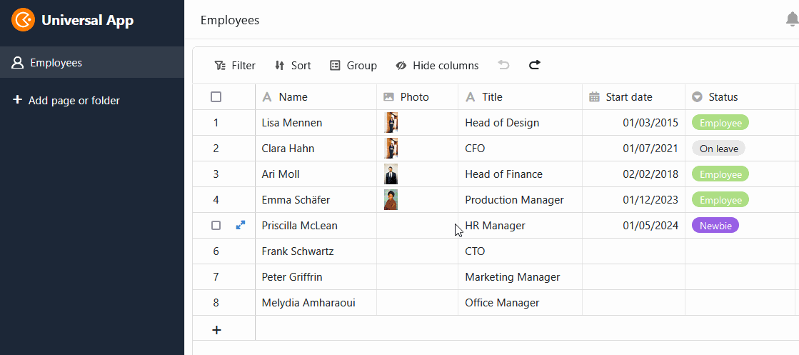
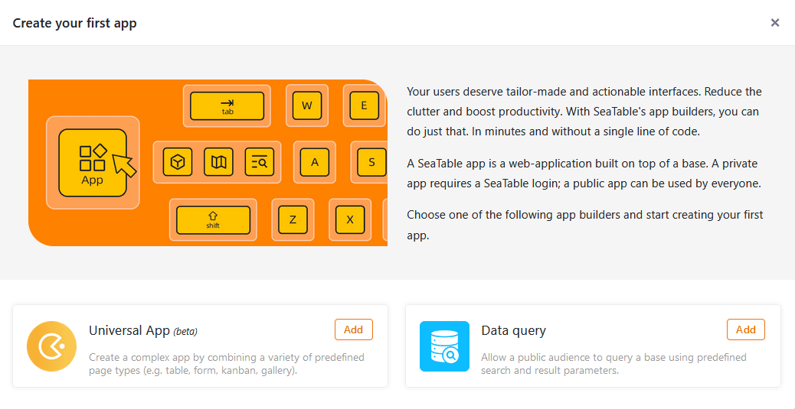

En SeaTable 4.4, continuamos con brío el desarrollo del Universal App Builder. Muchas funciones nuevas permiten aplicaciones web aún más potentes y cómodas. También hemos pulido la función de importación y los conjuntos de datos compartidos. Los prácticos valores por defecto se aplican ahora de forma universal.

Esta mañana hemos actualizado SeaTable Cloud a la versión 4.4. Todos los auto-alojadores pueden hacer lo mismo: La imagen de SeaTable 4.4 está disponible para su descarga en el conocido [repositorioDocker](https://hub.docker.com/r/seatable/seatable-enterprise) . Como siempre, puede encontrar la lista completa de cambios en el [registro de cambios](https://seatable.io/es/docs/changelog/version-4/).

## App Builder más flexible y potente

En SeaTable 4.4, una vez más hemos hecho un montón de mejoras y correcciones de errores en la [aplicación]() universal, que beneficiará a casi todos los [tipos de página](https://seatable.io/es/docs/universelle-apps/seitentypen-in-der-universellen-app/). El final de la fase beta está ya al alcance de la mano.

### Botones en las páginas de consulta

Las [páginas de consulta](https://seatable.io/es/docs/seitentypen-in-universellen-apps/abfrageseiten-in-universellen-apps/) admiten ahora la ejecución de acciones mediante botones: Tras una consulta de datos satisfactoria, puede pulsar [los botones]() de la lista de resultados mostrada para ejecutar acciones. Se trata de una nueva característica especial, ya que antes no era posible interactuar con las filas consultadas en cualquier parte de SeaTable.

Un ejemplo de aplicación es una bolsa de trabajo interna: la página de consulta permite buscar rápidamente puestos relevantes. Si se encuentra un puesto interesante, basta con hacer clic en el botón de los resultados de la búsqueda para solicitarlo directamente.

### Arrastrar y soltar en el calendario

Hasta ahora, no era posible cambiar las citas en la [página del calendario](https://seatable.io/es/docs/seitentypen-in-universellen-apps/kalenderseiten-in-universellen-apps/). SeaTable 4.4 le ofrece más flexibilidad en este aspecto. Ahora puede mover cómodamente sus citas en el calendario mediante arrastrar y soltar. También puede editar los valores de las [columnas de fechas](https://seatable.io/es/docs/datum-dauer-und-personen/die-datum-spalte/) correspondientes a través de los detalles de la fila, siempre que disponga de la [autorización](https://seatable.io/es/docs/universelle-apps/seitenberechtigungen-in-einer-universellen-app/) necesaria.

### Tratamiento simplificado de los datos en la página de tablas

Como en Base, ahora puede [seleccionar todas las entradas de una columna]() en las [páginas de tablas](https://seatable.io/es/docs/seitentypen-in-universellen-apps/tabellenseiten-in-universellen-apps/) de sus aplicaciones con un solo clic en la cabecera de la columna. Ahora también es posible el práctico [tirador de relleno](https://seatable.io/es/docs/arbeiten-mit-zeilen/duplizieren-einer-zeile/): arrastre el pequeño cuadrado de la esquina inferior derecha de una celda hacia abajo para transferir el valor a todas las filas inferiores.

### Columna de empleados disponible en las páginas de formularios

Si utiliza una columna de [empleado](https://seatable.io/es/docs/datum-dauer-und-personen/die-spalte-mitarbeiter/) en su tabla, **no** estará disponible en los formularios [web](). Sin embargo, a partir de SeaTable 4.4, puede añadir columnas de empleados a las [páginas de formularios](https://seatable.io/es/docs/seitentypen-in-universellen-apps/formularseiten-in-universellen-apps/) en la Universal App. Por ejemplo, los miembros de su equipo pueden seleccionarse a sí mismos para una solicitud de vacaciones y ya no tienen que introducir sus nombres manualmente. Primero debe activar la opción para mostrar la lista de empleados en la [configuración de](https://seatable.io/es/docs/universelle-apps/einstellungen-einer-universellen-app-aendern/) la app.

### Más opciones de personalización para páginas individuales

En la versión 4.4, puede ocultar la **barra de título** en la [página individual](https://seatable.io/es/docs/seitentypen-in-universellen-apps/individuelle-seiten-in-universellen-apps/). Esto le permite crear páginas de destino visualmente atractivas. Para los elementos de imagen y mapa, los menús desplegables permiten **enlazar** rápidamente con otras páginas de la aplicación. Para las **estadísticas**, hemos añadido más tipos de gráficos y opciones de configuración adicionales que hacen aún más cómoda la creación de cuadros de mando. Para presentar con claridad las numerosas opciones de estilo, hemos dividido el estilo de gráfico y el estilo general en dos pestañas diferentes.

## Galería y aplicaciones de consulta de datos

Como se anunció en las últimas notas de la versión, hemos **eliminado** el **Gallery App Bu**ilder en SeaTable 4.4. Si desea crear una nueva app con [galería](https://seatable.io/es/docs/seitentypen-in-universellen-apps/galerieseiten-in-universellen-apps/), el Universal App Builder le ofrece una alternativa más funcional.



También ha habido algunos cambios en la [aplicación de consulta](https://seatable.io/es/docs/apps/datenabfrage-app/) de datos. El antiguo App Builder para consultas de datos ha sido eliminado y sustituido por uno nuevo basado en el Universal App Builder. Esto significa que, por supuesto, puedes seguir creando aplicaciones públicas para consultar tus bases, pero la interfaz se parece ahora a la del Universal App Builder. Lo mismo se aplica a las aplicaciones de consulta existentes que a las aplicaciones de galería: no tienes que hacer nada y puedes seguir utilizándolas.



## Experiencia de usuario más agradable al importar Excel

SeaTable 4.4 hace que [la importación de tablas Excel]() sea más rápida, flexible y estable: Tablas con muchos miles de filas están ahora disponibles en SeaTable en sólo unos instantes. En la ventana de vista previa, significativamente ampliada, ahora puede seleccionar qué tablas de un libro -todas o sólo algunas- desea importar desde el archivo XLSX. Mientras que antes los caracteres especiales en los nombres de las columnas y otros casos especiales provocaban resultados no deseados, ahora se tienen en cuenta de forma fiable. Los mensajes de error mejorados proporcionan indicaciones claras de conflictos, especialmente al [importar al almacén de Big Data]().



## Más funciones para los registros de datos compartidos

Los [conjuntos de datos compartidos]() son muy útiles si usted y los miembros de su equipo necesitan ciertas tablas (por ejemplo, una lista de empleados) en diferentes [grupos]() de sus bases. SeaTable 4.4 añade tres nuevas funciones a las ya existentes:

1. Si tiene un [Base de copias]()Si copia una base a un grupo en el que se incluyen registros de datos compartidos, puede decidir si desea conservar la conexión con estos registros de datos. Por supuesto, el grupo en el que se copia la base debe tener acceso a los registros de datos compartidos.

    

2. Después del [Restauración de bases a partir de instantáneas]() o el [Creación de una base a partir de una plantilla]() puede vincular tablas existentes a un registro de datos compartidos y permitir así la sincronización con los datos que allí se encuentran. Antes, los registros de datos compartidos no podían reimportarse, sino sólo integrarse en tablas nuevas.

    

3. El creador de un registro de datos compartidos puede ahora seleccionar la opción [Sincronización]() de todas las tablas dependientes con el conjunto de datos y garantizar así que los demás usuarios utilicen el estado actual de los datos en sus bases. Antes, había que confiar en que los usuarios configurasen la sincronización automática o la activasen manualmente.

    

## Los valores por defecto se aplican en todas partes

Con la versión 4.4, SeaTable generaliza el uso de valores por [defecto](https://seatable.io/es/docs/arbeiten-mit-spalten/standardwert-fuer-eine-spalte-festlegen/). Cuando se crea una nueva fila, ya sea en la tabla de una base o app, a través de una [columna de enlace](), [formulario web](), [botón]() o [automatización](), los valores por defecto se aplican en todas partes cuando se crea la fila. Antes, los valores por defecto sólo se aplicaban cuando se creaba manualmente una nueva fila en una tabla.

Como el alcance de los valores por defecto ha aumentado considerablemente, también hemos creado un elemento de menú destacado en las opciones de columna, que puede utilizar para establecer cómodamente los valores por defecto.



Por cierto: incluso puede activar los valores por defecto con el parámetro correspondiente al crear nuevas filas a través de la API.

## Y mucho más

Usted ya conoce el **editor para texto formateado** de varios lugares en SeaTable, por ejemplo, de la [descripción base](), el [tipo de columna para textos largos](https://seatable.io/es/docs/text-und-zahlen/die-spalten-text-und-formatierter-text/) o [mensajes de correo electrónico](). Con SeaTable 4.4 hemos mejorado la usabilidad y corregido algunos errores. Éstos son sólo dos: Anteriormente, los saltos de línea múltiples se eliminaban al cerrar el editor y el texto existente se sobrescribía al escribir en la celda. En el nuevo editor, los saltos de línea múltiples se conservan y pueden utilizarse para estructurar el texto con mayor claridad. También hemos eliminado el riesgo de borrados involuntarios: Al escribir, el nuevo texto se coloca delante del texto existente.

En la nueva versión, también hemos mejorado el **centro de notificaciones**  en la página de inicio. Ahora puedes ver todas las [notificaciones]() del sistema en un solo lugar, rastrear el origen de la notificación e ir a la página correspondiente con un solo clic.

Por último, hemos optimizado el diálogo para **restablecer la contraseña de SeaTable**. Para ello, hemos estandarizado el diseño y añadido más funciones. Si [cambia]() la contraseña en su configuración personal, ahora puede visualizarla en texto sin formato haciendo clic en el símbolo del ojo. También se le mostrará automáticamente la fuerza de su nueva contraseña.
