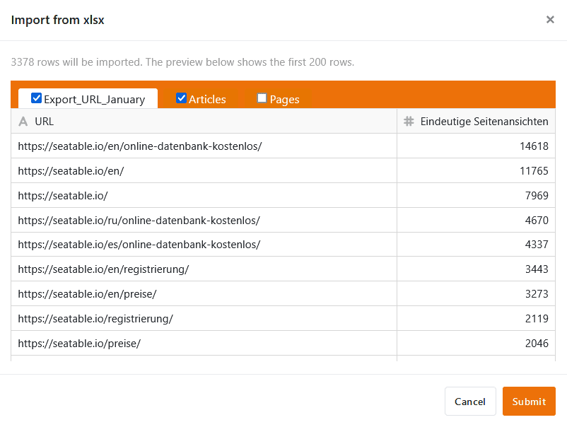

В SeaTable 4.4 мы продолжаем активное развитие универсального конструктора приложений. Множество новых функций позволяют создавать еще более мощные и удобные веб-приложения. Мы также доработали функцию импорта и общие наборы данных. Практические значения по умолчанию теперь применяются повсеместно.

Сегодня утром мы обновили SeaTable Cloud до версии 4.4. Все хостеры могут сделать то же самое: Образ SeaTable 4.4 доступен для загрузки в известном [репозиторииDocker](https://hub.docker.com/r/seatable/seatable-enterprise) . Как всегда, полный список изменений вы можете найти в [журнале изменений]().

## Более гибкий, более мощный конструктор приложений

В SeaTable 4.4 мы снова внесли множество улучшений и исправлений ошибок в [универсальное приложение](), которые будут полезны практически для всех [типов страниц](). Завершение фазы бета-тестирования уже близко.

### Кнопки на страницах запросов

[Страницы запросов]() теперь поддерживают выполнение действий с помощью кнопок: После успешного запроса данных вы можете нажимать [кнопки]() в отображаемом списке хитов для выполнения действий. Это особенная новая функция, поскольку ранее не было возможности взаимодействовать с запрашиваемыми строками в любом месте SeaTable.

Один из примеров применения - внутренняя доска объявлений: страница запросов позволяет быстро искать подходящие вакансии. Если интересная вакансия найдена, достаточно нажать на кнопку в результатах поиска, чтобы сразу подать заявку на вакансию.

### Перетаскивание в календарь

До сих пор не было возможности изменять встречи на [странице календаря](). SeaTable 4.4 предоставляет вам больше возможностей. Теперь вы можете удобно перемещать встречи в календаре с помощью перетаскивания. Вы также можете редактировать значения в соответствующих [столбцах даты]() через детали строки, если у вас есть необходимые [полномочия]().

### Упрощенная обработка данных на странице таблицы

Как и в Base, теперь вы можете [выбрать все записи в столбце]() на [страницах таблиц]() ваших приложений одним щелчком мыши на заголовке столбца. Также появилась возможность использовать практичную [ручку заполнения](): перетащите маленький квадратик в правом нижнем углу ячейки вниз, чтобы перенести значение на все строки ниже.

### Колонка сотрудника доступна на страницах форм

Если вы используете [столбец сотрудников]() в таблице, он **недоступен** в [веб-формах](). Однако, начиная с версии SeaTable 4.4, вы можете добавлять колонки сотрудников на [страницы форм]() в универсальном приложении. Например, члены вашей команды могут выбрать себя для запроса на отпуск, и больше не придется вводить их имена вручную. Сначала необходимо активировать опцию отображения списка сотрудников в [настройках приложения]().

### Больше возможностей для настройки отдельных страниц

В версии 4.4 вы можете скрыть **строку заголовка** на [отдельной странице](). Это позволяет создавать визуально привлекательные целевые страницы. Для элементов изображений и карт появились выпадающие меню, позволяющие быстро создавать **ссылки** на другие страницы приложения. Для **статистики** мы добавили новые типы диаграмм и дополнительные возможности настройки, чтобы сделать создание информационных панелей еще более удобным. Чтобы наглядно представить множество вариантов стилей, мы разделили стиль диаграммы и общий стиль на две разные вкладки.

## Приложения для работы с галереями и запросами данных

Как было объявлено в последнем выпуске, мы **удалили конструктор приложений с галереей** в SeaTable 4.4. Если вы хотите создать новое приложение с [галереей](), Universal App Builder предлагает вам более функциональную альтернативу.



В [приложении для запросов данных]() также произошли некоторые изменения. Старый конструктор приложений для запросов данных был удален и заменен новым, основанным на Universal App Builder. Это означает, что вы, конечно, по-прежнему можете создавать публичные приложения для запросов к вашим базам, но интерфейс теперь похож на Universal App Builder. К существующим приложениям запросов относится то же самое, что и к приложениям галереи: вам ничего не нужно делать и вы можете продолжать их использовать.



## Более приятный пользовательский опыт при импорте Excel

SeaTable 4.4 делает [импорт таблиц Excel]() более быстрым, гибким и стабильным: Таблицы со многими тысячами строк теперь доступны в SeaTable всего за несколько мгновений. В значительно увеличенном окне предварительного просмотра теперь можно выбрать, какие таблицы рабочей книги - все или только отдельные - вы хотите импортировать из XLSX-файла. Если раньше специальные символы в названиях столбцов и другие особые случаи приводили к нежелательным результатам, то теперь они надежно учитываются. Улучшенные сообщения об ошибках четко указывают на конфликты, особенно при [импорте в хранилище Big Data]().



## Дополнительные функции для записей общих данных

[Общие наборы данных]() очень полезны, если вам и членам вашей команды нужны определенные таблицы (например, список сотрудников) для разных [групп]() в ваших базах. SeaTable 4.4 добавляет три новые функции к уже существующим:

1. Если у вас есть [Копировальная база]()Если вы копируете базу в группу, в которую включены общие записи данных, вы можете решить, сохранять ли связь с этими записями данных. Группа, в которую вы копируете базу, конечно же, должна иметь доступ к общим записям данных.

    

2. После [Восстановление баз из моментальных снимков]() или [Создание базы из шаблона]() вы можете связать существующие таблицы с общей записью данных и тем самым обеспечить синхронизацию с данными в ней. Ранее записи с общими данными нельзя было повторно импортировать, а только интегрировать в новые таблицы.

    

3. Создатель записи общих данных теперь может выбрать [Синхронизация]() всех зависимых таблиц с набором данных и, таким образом, гарантировать, что другие пользователи используют текущее состояние данных в своих базах. Раньше приходилось полагаться на пользователей, настраивающих автоматическую синхронизацию или запускающих ее вручную.

    

## Значения по умолчанию применяются везде

В версии 4.4 SeaTable обобщает использование [значений по умолчанию](). Когда вы создаете новую строку, будь то в таблице базы или приложения, через [колонку ссылок](), [веб-форму](), [кнопку]() или [автоматизацию](), значения по умолчанию применяются везде при создании строки. Ранее значения по умолчанию применялись только при создании новой строки в таблице вручную.

Поскольку область значений по умолчанию значительно расширилась, мы также создали заметный пункт меню в опциях столбца, с помощью которого вы можете удобно устанавливать значения по умолчанию.



Кстати: Вы можете даже активировать значения по умолчанию с помощью соответствующего параметра при создании новых строк через API.

## И многое другое

Вы уже знакомы с **редактором форматированного текста** из различных мест SeaTable, например, из [описания базы](), [типа колонки для длинных текстов]() или [сообщений электронной почты](). В SeaTable 4.4 мы улучшили удобство использования и исправили некоторые ошибки. Вот только две: раньше при закрытии редактора удалялись множественные переносы строк, а при вводе текста в ячейку перезаписывался существующий текст. В новом редакторе множественные переносы строк сохраняются и могут быть использованы для более четкого структурирования текста. Мы также устранили риск непреднамеренного удаления: При вводе новый текст помещается перед существующим.

В новой версии мы также улучшили **центр уведомлений**  на стартовой странице. Теперь вы можете видеть все [уведомления]() в системе в одном месте, отслеживать источник уведомления и переходить на соответствующую страницу одним щелчком мыши.

И последнее, но не менее важное: мы оптимизировали диалог для **сброса пароля SeaTable**. Для этого мы стандартизировали дизайн и добавили больше функций. Если вы [изменили пароль]() в личных настройках, теперь его можно вывести в виде обычного текста, нажав на символ глаза. Также автоматически отображается надежность нового пароля.
