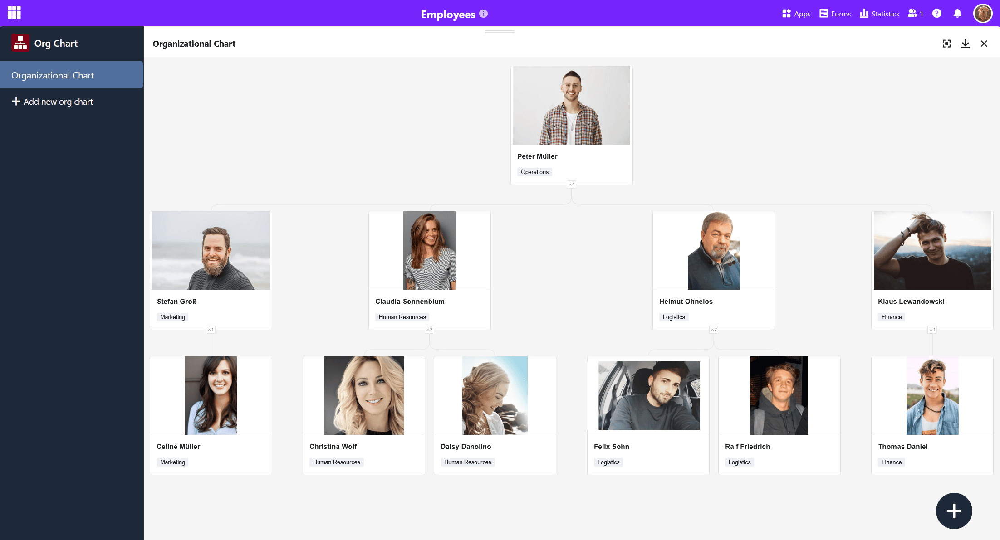
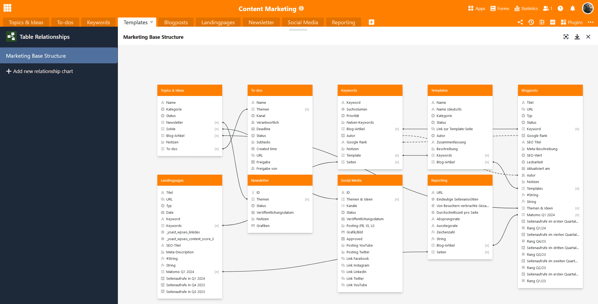
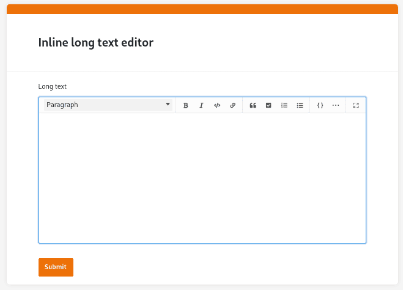

The time has come: Our app builder is officially launched! With this version of our **no-code database with integrated no-code app builder**, anyone, whether programmer or citizen developer, can now easily create their own apps! With SeaTable 5.0, we are ready to take a leading position in digital transformation and innovation on the international market.

But that's not the only big bang - SeaTable 5.0 offers you **three new plugins** for complex visualizations: Organizational Chart, Table Relationships and Whiteboard. The **improved accessibility** should make it easier for people with (visual) impairments to use SeaTable. Another highlight is the **column-accurate Excel import**.

This morning we updated SeaTable Cloud to version 5.0. All self-hosters can do the same: The image of SeaTable 5.0 is available for download in the well-known [Docker repository](https://hub.docker.com/r/seatable/seatable-enterprise). As always, you can find the complete list of changes in the [changelog](https://seatable.io/en/docs/changelog/version-5/).

## Customized business apps without a single line of code

SeaTable 5.0 marks the official launch of our no-code app builder. After our developers have implemented many new features and improvements in the app builder over the last few versions, nothing stands in the way of implementing your demanding use cases. Create individual business apps without writing a single line of code and use SeaTable as a frontend and backend in one!

### New page type: Single Record

The development of the App Builder continues unabated: With the **single data record** [page type](https://seatable.io/en/docs/universelle-apps/seitentypen-in-der-universellen-app/), you have the option of designing a page with static elements, table fields, colors, frames, etc. in order to visually prepare the data stored in a row . This page type is therefore similar to the [page design plugin](https://seatable.io/en/docs/seitendesign-plugin/anleitung-zum-seitendesign-plugin/) that you already know from Base.

Users of the app can view, search, browse, and edit each single record on this page - with the relevant [permission](https://seatable.io/en/docs/universelle-apps/seitenberechtigungen-in-einer-universellen-app/). This page type is suitable, for example, for displaying the data in an employee database as personal profiles.

### New functions of existing page types

You can now **export** all data displayed on [table pages](https://seatable.io/en/docs/seitentypen-in-universellen-apps/tabellenseiten-in-universellen-apps/) as an **Excel file**. You can also **download all attachments as a zip file** via the column header of [image](https://seatable.io/en/docs/dateien-und-bilder/die-bild-spalte/) and [file columns](https://seatable.io/en/docs/dateien-und-bilder/die-datei-spalte/). The new export functions are helpful if you want to make certain files available to other users via the app.

We have added the **settings for link columns** on [gallery pages](https://seatable.io/en/docs/seitentypen-in-universellen-apps/galerieseiten-in-universellen-apps/). For example, you can specify whether users can link existing entries via the gallery page or add entries in another table. On [query pages](https://seatable.io/en/docs/seitentypen-in-universellen-apps/abfrageseiten-in-universellen-apps/), the query results are now updated immediately when you trigger button actions that cause changes to the data.

## Three plugins for complex visualizations

Another highlight of SeaTable 5.0 are the new [plugins](https://seatable.io/en/docs/plugins/alle-plugins-in-der-uebersicht/) that allow you to visualize the dependencies, structures and processes in a base.

### Organizational Chart

The Org Chart plugin can be used to display hierarchies between the data records in a table, e.g. positions in a company or [superior and subordinate tasks in a project](https://seatable.io/en/projektstrukturplan-vorlage/). To visualize the dependencies of the data records, you need a [link column](https://seatable.io/en/docs/verknuepfungen/wie-man-tabellen-in-seatable-miteinander-verknuepft/) that refers to the same table. The entry to which you link another row of the same table is displayed as a superordinate data record.

### Table Relationships

Especially when there are many tables with thousands of rows in a base, it is easy to lose track of how they relate to each other. With the new Table Relationships plugin, you can visualize which tables are linked to each other via which columns. Not only direct links via [link columns](https://seatable.io/en/docs/verknuepfungen/wie-man-tabellen-in-seatable-miteinander-verknuepft/) are displayed, but also indirect links via link formula columns.

### Whiteboard

The Whiteboard is the first plugin that works independently of the data in a base. It gives you the freedom to graphically visualize processes and structures that you cannot display with the other plugins. You can also freely outline layouts and mockups. For the design, you have various **elements** such as squares, ellipses, and arrows as well as **tools** such as pen and eraser to choose from.



## Improved accessibility

SeaTable wants to provide all users with optimal access to its no-code digital solution. That's why we've invested heavily in improving accessibility for SeaTable 5.0. This includes the optimization of ARIA tags for improved **support of non-visual output devices**, adjustments to the color scheme for **stronger contrasts,** and the revision of the **keyboard control**.

With version 5.0, we are aiming to achieve a Lighthouse Accessibility Score of 90 and above for SeaTable's most important pages. From this score onwards, websites can be considered essentially accessible. Of course, we will continue our accessibility efforts with our partners in the future.

## Column-accurate Excel import

The import of XLSX files was already faster, more flexible and more stable in version 4.4. With SeaTable 5.0, the import wizard is even more powerful: In the significantly enhanced preview window, you can now select in detail which tables - and even **which columns of an XLSX workbook** - SeaTable should import. Simply deselect unwanted tables and columns to precisely control the data import.

## Optimization of the SeaTable Cloud API

As part of SeaTable 5.0, we have also made some changes to the SeaTable API. This only affects users who use the API to implement their own applications and workflows. These changes have no effect on work in the browser.

Here is an overview of the most important points:

- The API endpoints [Get Row](https://api.seatable.io/reference/getrowdeprecated) and [List Rows](https://api.seatable.io/reference/listrowsdeprecated) will be transferred to the new _API-Gateway_ redirected.
- The format of the return values of link and link formula columns is harmonized.
- The _API-Gateway_ will return the current API usage limit in future.

If you want to find out more, you can find all the details about the changes in this [forum post](https://forum.seatable.com/t/important-changes-to-api-and-seatable-cloud-with-version-5-0/4887).

## And much more

You will encounter the **editor for long texts** in many places. If you fill in formatted text fields in the **row details** or in [web forms](https://seatable.io/en/docs/webformulare/webformulare/), you will notice that usability has now been improved: The editor for long texts no longer opens in another pop-up window, but inline, so you can start writing straight away.

You are also familiar with the **statistics** from several places in SeaTable: from the [statistics module](https://seatable.io/en/docs/statistiken-und-datenanalyse/anleitung-zum-statistik-modul/) in the base and from [custom pages in universal apps](https://seatable.io/en/docs/seitentypen-in-universellen-apps/individuelle-seiten-in-universellen-apps/). We have now significantly upgraded and standardized the statistics with a revised diagram library.

Previously, you could not restore rows that you had moved to the [Big Data](https://seatable.io/en/docs/big-data/zeilen-ins-big-data-backend-verschieben/) storage using snapshots. To prevent unwanted data loss, there is now an option to also restore the big data storage of the previous version when [restoring snapshots](https://seatable.io/en/docs/historie-und-versionen/wiederherstellung-eines-snapshots/).
