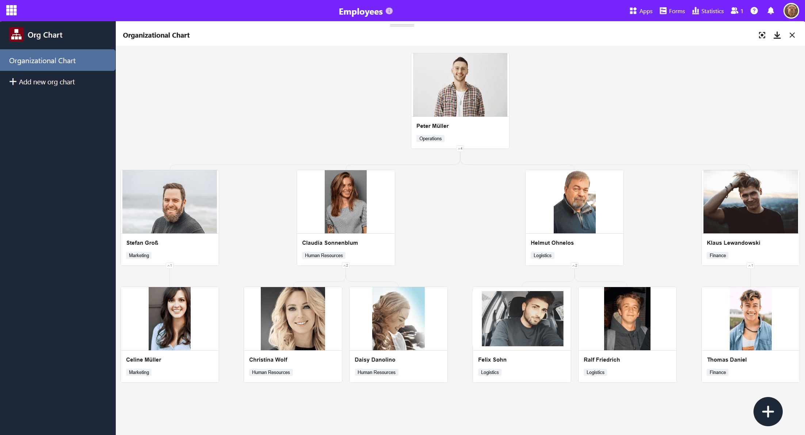
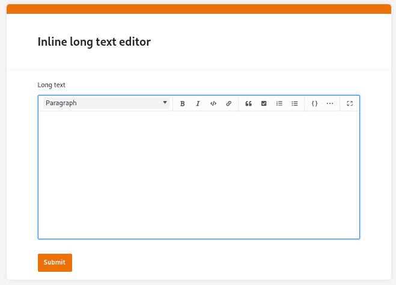

Ha llegado el momento: ¡lanzamos oficialmente nuestro creador de aplicaciones! Con esta versión de nuestra **base de datos sin código con creador de aplicaciones sin código integrado**, cualquier persona, ya sea programador o desarrollador ciudadano, podrá crear fácilmente sus propias aplicaciones. Con SeaTable 5.0, estamos preparados para asumir una posición de liderazgo en transformación digital e innovación en el mercado internacional.

Pero esa no es la única gran novedad: SeaTable 5.0 le ofrece **tres nuevos plugins** para visualizaciones complejas: Organigrama, Tabla de relaciones y Pizarra. La **accesibilidad mejorada** debería facilitar el uso de SeaTable a las personas con problemas (visuales). Otro aspecto destacado es la **importación a Excel con precisión de columnas**.

Esta mañana hemos actualizado SeaTable Cloud a la versión 5.0. Todos los auto-alojadores pueden hacer lo mismo: [Docker La imagen de SeaTable 5.0 está disponible para su descarga en el conocido](https://hub.docker.com/r/seatable/seatable-enterprise) [repositorio](https://hub.docker.com/r/seatable/seatable-enterprise). Como siempre, puede encontrar la lista completa de cambios en el [registro de cambios](https://seatable.io/es/docs/changelog/version-5/).

## Una aplicación empresarial personalizada sin código

SeaTable 5.0 marca el lanzamiento oficial de nuestro creador de aplicaciones sin código. Después de que nuestros desarrolladores hayan implementado muchas nuevas funciones y mejoras en el constructor de aplicaciones en las últimas versiones, ahora nada se interpone en el camino de la realización de sus exigentes casos de uso. Cree aplicaciones empresariales personalizadas sin escribir una sola línea de código y utilice SeaTable como frontend y backend en uno.

### Nuevo tipo de página: Registro único de datos

El desarrollo de App Builder no cesa: con el tipo [de](https://seatable.io/es/docs/universelle-apps/seitentypen-in-der-universellen-app/) página de **registro de datos único**, tiene la posibilidad de diseñar una página con elementos estáticos, campos de tabla, colores, marcos, etc. para preparar visualmente los datos almacenados en una fila. Este tipo de página es, por tanto, similar al [plugin de diseño de páginas](https://seatable.io/es/docs/seitendesign-plugin/anleitung-zum-seitendesign-plugin/) que ya conoces de Base.

Los usuarios de la aplicación pueden ver, buscar, explorar y editar los registros de datos individuales en esta página, con la [autorización](https://seatable.io/es/docs/universelle-apps/seitenberechtigungen-in-einer-universellen-app/) pertinente. Este tipo de página es adecuada, por ejemplo, para mostrar los datos de una base de datos de empleados como perfiles personales.

### Nuevas funciones de los tipos de página existentes

Ahora puede **exportar** todos los datos mostrados en [las páginas de tablas](https://seatable.io/es/docs/seitentypen-in-universellen-apps/tabellenseiten-in-universellen-apps/) como **archivo Excel**. También puede **descargar todos los archivos adjuntos** como archivo zip a través de la cabecera de [columna](https://seatable.io/es/docs/dateien-und-bilder/die-datei-spalte/) de las [columnas de](https://seatable.io/es/docs/dateien-und-bilder/die-datei-spalte/) [imágenes](https://seatable.io/es/docs/dateien-und-bilder/die-bild-spalte/) y [archivos](https://seatable.io/es/docs/dateien-und-bilder/die-datei-spalte/). Las nuevas funciones de exportación son útiles si quieres poner determinados archivos a disposición de otros usuarios a través de la app.

Hemos añadido la **configuración de las columnas de enlace** en las [páginas](https://seatable.io/es/docs/seitentypen-in-universellen-apps/galerieseiten-in-universellen-apps/) de la galería. Por ejemplo, puede especificar si los usuarios pueden vincular entradas existentes a través de la página de la galería o añadir entradas en otra tabla. En las páginas de [consulta](https://seatable.io/es/docs/seitentypen-in-universellen-apps/abfrageseiten-in-universellen-apps/), ahora los resultados de la consulta se actualizan inmediatamente cuando se activan acciones de botón que provocan cambios en los datos.

## Tres plugins para visualizaciones complejas

Otro aspecto destacado de SeaTable 5.0 son los nuevos [plugins](https://seatable.io/es/docs/plugins/alle-plugins-in-der-uebersicht/) que permiten visualizar las dependencias, estructuras y procesos de una base.

### Organigrama

El complemento de organigrama puede utilizarse para mostrar jerarquías entre los registros de datos de una tabla, por ejemplo, cargos en una empresa o [tareas superiores y subordinadas en un proyecto](https://seatable.io/es/projektstrukturplan-vorlage/). Para visualizar las dependencias de los registros de datos, se necesita una [columna de enlace](https://seatable.io/es/docs/verknuepfungen/wie-man-tabellen-in-seatable-miteinander-verknuepft/) que haga referencia a una misma tabla. La entrada a la que enlaza otra fila de la misma tabla se muestra como registro de datos superior.

### Tabla de relaciones

Especialmente cuando hay muchas tablas con miles de filas en una base, es fácil perder la pista de cómo están relacionadas entre sí. Con el nuevo plugin de relaciones entre tablas, puedes visualizar qué tablas están vinculadas entre sí a través de qué columnas. No sólo se muestran los enlaces directos a través de las columnas de [enlace](https://seatable.io/es/docs/verknuepfungen/wie-man-tabellen-in-seatable-miteinander-verknuepft/), sino también los enlaces indirectos a través de las columnas de fórmulas de enlace.

### Pizarra

La pizarra es el primer plugin que funciona independientemente de los datos de una base. Te da la libertad de visualizar gráficamente procesos y estructuras que no puedes mostrar con los plugins anteriores. También puedes esbozar libremente diseños y maquetas. Dispones de varios **elementos** como cuadrados, elipses y flechas, así como de **herramientas** como lápices y gomas de borrar para elegir el diseño.



## Mejora de la accesibilidad

SeaTable quiere proporcionar a todos los usuarios un acceso óptimo a su solución digital sin código. Por eso hemos invertido mucho en mejorar la accesibilidad de SeaTable 5.0. Esto incluye la optimización de las etiquetas ARIA para mejorar la **compatibilidad con dispositivos de salida no visuales**, ajustes en el esquema de colores para conseguir **contrastes más** fuertes y la revisión del **control del teclado**.

Con la versión 5.0, nuestro objetivo es alcanzar una puntuación de accesibilidad Lighthouse de 90 o más en las páginas más importantes de SeaTable. A partir de esta puntuación, los sitios web pueden considerarse esencialmente accesibles. Por supuesto, continuaremos nuestros esfuerzos de accesibilidad con nuestros socios en el futuro.

## Importación a Excel con precisión de columnas

La importación de archivos XLSX ya era más rápida, flexible y estable en la versión 4.4. Con SeaTable 5.0, el asistente de importación es aún más potente: En la ventana de vista previa, significativamente mejorada, ahora puede seleccionar en detalle qué tablas - e incluso **qué columnas de un libro de trabajo XL** SX - SeaTable debe importar. Simplemente desmarque las tablas y columnas no deseadas para controlar con precisión la importación de datos.

## Optimización de la API de SeaTable Cloud

Como parte de SeaTable 5.0, también hemos realizado algunos cambios en la API de SeaTable. Esto sólo afecta a los usuarios que utilizan la API para implementar sus propias aplicaciones y flujos de trabajo. Estos cambios no tienen ningún impacto en el trabajo en el navegador.

He aquí un resumen de los puntos más importantes:

- Los puntos finales de la API [Obtener fila](https://api.seatable.io/reference/getrowdeprecated) y [Lista de filas](https://api.seatable.io/reference/listrowsdeprecated) se transferirá al nuevo _API-Gateway_ redirigido.
- Se armoniza el formato de los valores de retorno de las columnas de enlace y fórmula de enlace.
- En _API-Gateway_ devolverá el límite de uso actual de la API en el futuro.

Si quieres saber más, puedes encontrar todos los detalles sobre los cambios en este [post del foro](https://forum.seatable.io/t/important-changes-to-api-and-seatable-cloud-with-version-5-0/4887).

## Y mucho más

Encontrará el **editor de textos** largos en muchos sitios. Si rellena campos de texto con formato en los **detalles de la línea** o en [formularios](https://seatable.io/es/docs/webformulare/webformulare/) web, notará que ahora se ha mejorado la usabilidad: El editor de textos largos ya no se abre en otra ventana emergente, sino en línea, para que pueda empezar a escribir directamente.

También está familiarizado con las **estadísticas** de varios lugares en SeaTable: desde el [módulo de estadísticas](https://seatable.io/es/docs/statistiken-und-datenanalyse/anleitung-zum-statistik-modul/) en la base y desde [páginas individuales en aplicaciones universales](https://seatable.io/es/docs/seitentypen-in-universellen-apps/individuelle-seiten-in-universellen-apps/). Ahora hemos mejorado y estandarizado significativamente las estadísticas con una biblioteca de diagramas revisada.

Anteriormente, no se podían restaurar las filas que se habían movido al almacenamiento de Big [Data](https://seatable.io/es/docs/big-data/zeilen-ins-big-data-backend-verschieben/) mediante instantáneas. Para evitar pérdidas de datos no deseadas, ahora existe la opción de restaurar también el almacenamiento de big data de la versión anterior al [restaurar](https://seatable.io/es/docs/historie-und-versionen/wiederherstellung-eines-snapshots/) instantáneas.
