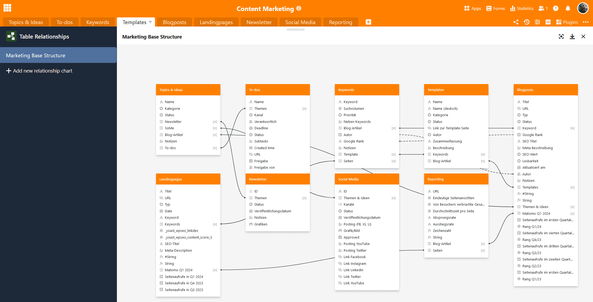

Chegou a hora: o nosso criador de aplicações foi oficialmente lançado! Com esta versão da nossa **base de dados sem código com o criador de aplicações sem código integrado**, qualquer pessoa, quer seja programador ou cidadão programador, pode agora criar facilmente as suas próprias aplicações! Com o SeaTable 5.0, estamos prontos para assumir uma posição de liderança na transformação digital e na inovação no mercado internacional.

Mas esta não é a única grande novidade - o SeaTable 5.0 fornece-lhe **três novos plugins** para visualizações complexas: Organograma, Relações de tabela e Quadro branco. A **acessibilidade melhorada** deverá facilitar a utilização do SeaTable por pessoas com deficiências (visuais). Outro destaque é a **importação de Excel com precisão de colunas**.

Esta manhã, actualizámos o SeaTable Cloud para a versão 5.0. Todos os auto-hosters podem fazer o mesmo: [Docker A imagem do SeaTable 5.0 está disponível para download no](https://hub.docker.com/r/seatable/seatable-enterprise) [repositório](https://hub.docker.com/r/seatable/seatable-enterprise) conhecido. Como sempre, pode encontrar a lista completa de alterações no [registo de alterações](/).

## Uma aplicação comercial personalizada sem código

O SeaTable 5.0 marca o lançamento oficial do nosso construtor de aplicações sem código. Depois de os nossos programadores terem implementado muitas novas funções e melhorias no construtor de aplicações nas últimas versões, agora nada impede que realize os seus casos de utilização mais exigentes. Crie aplicações empresariais personalizadas sem escrever uma única linha de código e utilize o SeaTable como frontend e backend num só!

### Novo tipo de página: Registo de dados único

O desenvolvimento do App Builder continua: com o [tipo de página]() **registo único de dados**, tem a possibilidade de conceber uma página com elementos estáticos, campos de tabela, cores, molduras, etc., para preparar visualmente os dados armazenados numa linha. Este tipo de página é, portanto, semelhante ao [plug-in de conceção de páginas]() que já conhece do Base.

Os utilizadores da aplicação podem ver, pesquisar, navegar e editar os registos de dados individuais nesta página - com a [autorização]() relevante. Este tipo de página é adequado, por exemplo, para apresentar os dados de uma base de dados de empregados como perfis pessoais.

### Novas funções de tipos de páginas existentes

Agora é possível **exportar** todos os dados apresentados nas [páginas de tabelas]() como um **ficheiro Excel**. Também pode **descarregar todos os anexos como um ficheiro zip** através do cabeçalho das [colunas]() de [imagens]() e [ficheiros](). As novas funções de exportação são úteis se pretender disponibilizar determinados ficheiros a outros utilizadores através da aplicação.

Adicionámos as **definições para as colunas de ligação** nas [páginas da galeria](). Por exemplo, pode especificar se os utilizadores podem ligar entradas existentes através da página da galeria ou adicionar entradas noutra tabela. Nas [páginas de consulta](), os resultados da consulta são agora actualizados imediatamente quando são accionadas acções de botão que causam alterações nos dados.

## Três plugins para visualizações complexas

Outro destaque do SeaTable 5.0 são os novos [plugins]() que permitem visualizar as dependências, estruturas e processos numa base.

### Organigrama

O plugin do organigrama pode ser utilizado para apresentar hierarquias entre os registos de dados de uma tabela, por exemplo, cargos numa empresa ou [tarefas superiores e subordinadas num projeto](). Para visualizar as dependências dos registos de dados, é necessária uma [coluna de ligação]() que se refira a uma mesma tabela. A entrada à qual se liga outra linha na mesma tabela é exibida como um registo de dados superordenado.

### Relações de tabela

Especialmente quando existem muitas tabelas com milhares de linhas numa base, é fácil perder a noção de como estão relacionadas umas com as outras. Com o novo plug-in de relações entre tabelas, pode visualizar as tabelas que estão ligadas entre si através de que colunas. São apresentadas não só as ligações directas através das [colunas de ligação](), mas também as ligações indirectas através das colunas de fórmula de ligação.

### Quadro branco

O quadro branco é o primeiro plugin que funciona independentemente dos dados de uma base. Dá-lhe a liberdade de visualizar graficamente processos e estruturas que não pode apresentar com os plugins anteriores. Pode também esboçar livremente esquemas e maquetas. Dispõe de vários **elementos** como quadrados, elipses e setas, bem como de **ferramentas** como lápis e borrachas para escolher para o desenho.



## Melhoria da acessibilidade

O SeaTable pretende proporcionar a todos os utilizadores o melhor acesso à sua solução digital sem código. É por isso que investimos fortemente na melhoria da acessibilidade do SeaTable 5.0. Isto inclui a otimização das etiquetas ARIA para um melhor **suporte de dispositivos de saída não visuais**, ajustes ao esquema de cores para **contrastes mais fortes** e a revisão do **controlo do teclado**.

Com a versão 5.0, o nosso objetivo é atingir uma pontuação de acessibilidade Lighthouse igual ou superior a 90 para as páginas mais importantes do SeaTable. A partir desta pontuação, os sítios Web podem ser considerados essencialmente acessíveis. Naturalmente, continuaremos os nossos esforços de acessibilidade com os nossos parceiros no futuro.

## Importação de Excel com precisão de colunas

A importação de ficheiros XLSX já era mais rápida, mais flexível e mais estável na versão 4.4. Com o SeaTable 5.0, o assistente de importação é ainda mais poderoso: na janela de pré-visualização significativamente melhorada, pode agora selecionar em detalhe quais as tabelas - e mesmo **quais as colunas de um livro de trabalho XLSX** - que o SeaTable deve importar. Basta desmarcar as tabelas e colunas não desejadas para controlar com precisão a importação de dados.

## Otimização da API SeaTable Cloud

Como parte do SeaTable 5.0, também efectuámos algumas alterações à API do SeaTable. Isto apenas afecta os utilizadores que utilizam a API para implementar as suas próprias aplicações e fluxos de trabalho. Estas alterações não têm impacto no trabalho no browser.

Segue-se uma síntese dos pontos mais importantes:

- Os pontos de extremidade da API [Obter fila](https://api.seatable.com/reference/getrowdeprecated) e [Listar linhas](https://api.seatable.com/reference/listrowsdeprecated) serão transferidos para o novo _API-Gateway_ redireccionado.
- O formato dos valores de retorno das colunas de ligação e de fórmula de ligação é harmonizado.
- O _API-Gateway_ devolverá o atual limite de utilização da API no futuro.

Se quiser saber mais, pode encontrar todos os pormenores sobre as alterações nesta [publicação do fórum](https://forum.seatable.com/t/important-changes-to-api-and-seatable-cloud-with-version-5-0/4887).

## E muito mais

Encontrará o **editor de textos longos** em muitos sítios. Se preencher campos de texto formatado nos **detalhes de linha** ou em [formulários Web](), notará que a usabilidade foi melhorada: O editor de textos longos já não abre noutra janela pop-up, mas em linha, para que possa começar a escrever imediatamente.

Também está familiarizado com as **estatísticas** de vários locais no SeaTable: do [módulo de estatísticas]() na base e de [páginas individuais em aplicações universais](). Atualmente, actualizámos e uniformizámos significativamente as estatísticas com uma biblioteca de diagramas revista.

Anteriormente, não era possível restaurar linhas que tinham sido movidas para o armazenamento de Big [Data]() utilizando instantâneos. Para evitar a perda indesejada de dados, existe agora uma opção para restaurar também o armazenamento de grandes volumes de dados da versão anterior ao [restaurar instantâneos]().
