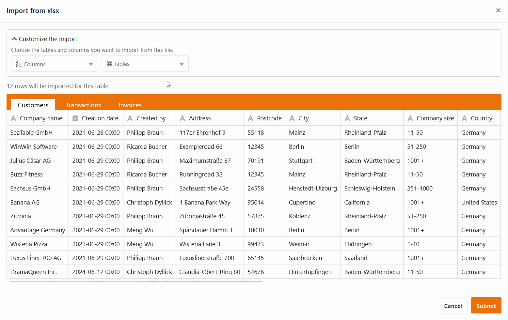

Настало время: наш конструктор приложений официально запущен! С этой версией нашей **базы данных без кода с интегрированным конструктором приложений без кода** любой человек, будь то программист или гражданский разработчик, теперь может легко создавать свои собственные приложения! С SeaTable 5.0 мы готовы занять лидирующие позиции в области цифровых преобразований и инноваций на международном рынке.

Но это не единственное большое достижение - SeaTable 5.0 предлагает вам **три новых плагина** для сложных визуализаций: Организационная диаграмма, Взаимосвязи таблиц и Белая доска. **Улучшенная доступность** должна облегчить работу с SeaTable людям с нарушениями зрения. Еще одна изюминка - **импорт в Excel с точностью до столбца**.

Сегодня утром мы обновили SeaTable Cloud до версии 5.0. Все хостеры могут сделать то же самое: [Docker Образ SeaTable 5.0 доступен для загрузки в известном](https://hub.docker.com/r/seatable/seatable-enterprise) [репозитории](https://hub.docker.com/r/seatable/seatable-enterprise). Как всегда, полный список изменений вы можете найти в [журнале изменений](/).

## Индивидуальное приложение для бизнеса без кода

SeaTable 5.0 знаменует собой официальный запуск нашего конструктора приложений без кода. После того как наши разработчики внедрили множество новых функций и улучшений в конструктор приложений за последние несколько версий, теперь ничто не мешает реализовать ваши сложные сценарии использования. Создавайте индивидуальные бизнес-приложения, не написав ни строчки кода, и используйте SeaTable как фронтенд и бэкенд в одном лице!

### Новый тип страницы: Одиночная запись данных

Развитие App Builder не останавливается: с помощью [типа страницы с]() **одной записью данных** вы можете оформить страницу со статическими элементами, полями таблицы, цветами, рамками и т. д., чтобы визуально оформить данные, хранящиеся в строке. Таким образом, этот тип страницы похож на [плагин дизайна страниц](), который вы уже знаете по Base.

Пользователи приложения могут просматривать, искать, просматривать и редактировать отдельные записи данных на этой странице - при наличии соответствующих [полномочий](). Этот тип страницы подходит, например, для отображения данных в базе данных сотрудников в виде личных профилей.

### Новые функции существующих типов страниц

Теперь вы можете **экспортировать** все данные, отображаемые на [страницах таблиц](), в **файл Excel**. Также можно **загрузить все вложения в виде zip-файла** через заголовок колонки с [изображениями]() и [файлами](). Новые функции экспорта будут полезны, если вы хотите сделать определенные файлы доступными для других пользователей через приложение.

Мы добавили **настройки для колонок ссылок** на [страницах галереи](). Например, вы можете указать, могут ли пользователи связывать существующие записи на странице галереи или добавлять записи в другую таблицу. На [страницах запросов]() результаты запросов теперь обновляются немедленно при нажатии кнопок, вызывающих изменения данных.

## Три плагина для сложных визуализаций

Еще одной изюминкой SeaTable 5.0 стали новые [плагины](), позволяющие визуализировать зависимости, структуры и процессы в базе.

### Организационная схема

Плагин организационной диаграммы можно использовать для отображения иерархии между записями данных в таблице, например, должностей в компании или [вышестоящих и нижестоящих задач в проекте](). Для визуализации зависимостей между записями данных вам нужен [столбец ссылок](), который ссылается на одну и ту же таблицу. Запись, с которой вы связываете другую строку в той же таблице, отображается как вышестоящая запись данных.

### Отношения в таблице

Особенно когда в базе много таблиц с тысячами строк, легко потерять представление о том, как они связаны друг с другом. С помощью нового плагина "Взаимосвязи таблиц" вы можете наглядно увидеть, какие таблицы связаны друг с другом через какие столбцы. Отображаются не только прямые связи через [столбцы ссылок](), но и косвенные связи через столбцы формул ссылок.

### Белая доска

Доска - это первый плагин, который работает независимо от данных в базе. Он дает вам возможность графически визуализировать процессы и структуры, которые невозможно отобразить с помощью предыдущих плагинов. Вы также можете свободно создавать макеты и эскизы. В вашем распоряжении различные **элементы**, такие как квадраты, эллипсы и стрелки, а также **инструменты**, такие как карандаши и ластики, которые вы можете выбрать для оформления.



## Улучшенная доступность

Компания SeaTable стремится предоставить всем пользователям оптимальный доступ к своему цифровому решению без кодов. Именно поэтому мы вложили значительные средства в улучшение доступности SeaTable 5.0. Это включает в себя оптимизацию тегов ARIA для улучшения **поддержки невизуальных устройств вывода**, корректировку цветовой схемы для **усиления контраста** и пересмотр **управления клавиатурой**.

В версии 5.0 мы стремимся достичь показателя Lighthouse Accessibility Score 90 и выше для наиболее важных страниц SeaTable. Начиная с этого показателя, веб-сайты можно считать практически доступными. Разумеется, мы продолжим работу по обеспечению доступности вместе с нашими партнерами и в будущем.

## Импорт в Excel с точностью до столбцов

Уже в версии 4.4 импорт файлов XLSX стал быстрее, гибче и стабильнее. В SeaTable 5.0 мастер импорта стал еще мощнее: в значительно расширенном окне предварительного просмотра вы теперь можете детально выбрать, какие таблицы и даже **столбцы рабочей книги XLSX** SeaTable должен импортировать. Просто отмените выделение ненужных таблиц и столбцов, чтобы точно контролировать импорт данных.

## Оптимизация API SeaTable Cloud

В рамках обновления SeaTable 5.0 мы также внесли некоторые изменения в API SeaTable. Это касается только тех пользователей, которые используют API для реализации собственных приложений и рабочих процессов. Эти изменения не влияют на работу в браузере.

Вот обзор наиболее важных моментов:

- Конечные точки API [Получить ряд](https://api.seatable.com/reference/getrowdeprecated) и [Список строк](https://api.seatable.com/reference/listrowsdeprecated) будет перенесен на новый _API-Gateway_ перенаправлен.
- Согласован формат возвращаемых значений столбцов "Ссылка" и "Формула ссылки".
- Сайт _API-Gateway_ в будущем будет возвращать текущий лимит использования API.

Если вы хотите узнать больше, вы можете найти все подробности об изменениях в этом [сообщении на форуме](https://forum.seatable.com/t/important-changes-to-api-and-seatable-cloud-with-version-5-0/4887).

## И многое другое

Во многих местах вы встретите **редактор длинных текстов**. Если вы заполняете поля форматированного текста в **реквизитах линии** или в [веб-формах](), вы заметите, что удобство использования теперь улучшено: Редактор для длинных текстов теперь открывается не в другом всплывающем окне, а в строке, так что вы можете сразу же начать писать.

Вы также знакомы со **статистикой** из нескольких мест в SeaTable: из [модуля статистики]() в базе и с [отдельных страниц в универсальных приложениях](). Теперь мы значительно обновили и стандартизировали статистику с помощью обновленной библиотеки диаграмм.

Ранее с помощью моментальных снимков нельзя было восстановить строки, перемещенные в хранилище больших [данных](). Чтобы предотвратить нежелательную потерю данных, теперь при [восстановлении моментальных снимков]() можно также восстановить хранилище больших данных предыдущей версии.
