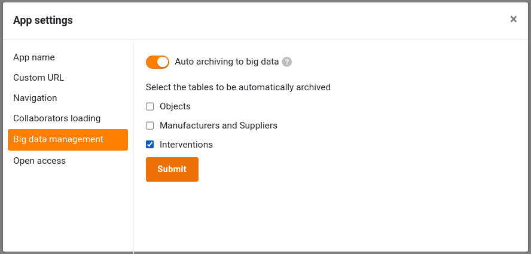
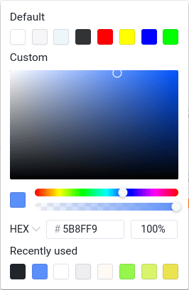

The focus of SeaTable 5.1 is on improving existing functions and optimizing them for practical use cases. In particular, the **App Builder**, which was officially launched with version 5.0, has received special attention and now enables even more powerful web applications. However, users of the **big data storage** also benefit from extensive improvements. The new **Tree plugin** offers a further visualization option for hierarchical data. We report on all the important new features in these release notes. As always, you will find the complete list of changes in the [changelog]().

SeaTable 5.1 also includes an updated Python pipeline. Two [Python packages](https://developer.seatable.io/scripts/python/common_questions/#list-of-libraries-supported-in-the-cloud-environment) for editing PDF files create new possibilities for document management. An extended Airtable converter module makes it even easier to migrate [Airtable Bases to SeaTable]() in the future.

This morning we updated SeaTable Cloud to version 5.1. We recommend all administrators of self-hosted systems to do the same in order to benefit from the new features and improvements. The SeaTable 5.1 image is available for download from the well-known [Docker repository](https://hub.docker.com/r/seatable/seatable-enterprise).

## More functions in the App Builder

Our developers have revised the [app settings]() and made them clearer. Among other things, a separate menu has been added for the branding of the app, in which the mode, the color scheme and the app icon can be selected. The 'Add page' wizard also has a new, two-page layout.

Keyword pages: With SeaTable 5.1, all page types offer a preview function for image files in [file columns](). (Previously, only [image columns]() offered such thumbnails.) PDF, Office and text files are still displayed with a file icon.

Looking at the individual page types, the [individual page]() and the [page for individual data records]() stand out with the most improvements. However, other page types can also look forward to incremental improvements.

### Page type Individual page

Thanks to the wide range of visualization options that this page type offers for statistics, it is particularly suitable for dashboards. Two new chart options now allow even more individuality: you can use the **drill-down function** to define the fields that are displayed when you click on a chart element. If this function is deactivated, the diagram does not allow any deeper insights into the underlying data. The user only sees the chart itself. The second new option relates to column, line and area charts. These now offer the option of displaying a **horizontal reference line**. This makes it easy to visualize target values as well as reference or lowest values.

The **container element** in SeaTable 5.1 is more flexible than its predecessor and now offers an additional layout option. The additional option allows you to define a different number of rows per column. This makes it easier to design visually appealing pages.

Version 5.1 also offers more flexibility when **enlarging and moving elements**. Height and width can now be changed simultaneously and elements take into account the height of their neighboring elements. If the height difference between two elements is less than 5 pixels, the height automatically adjusts to that of the neighboring element. When moving an element, you no longer have to create space yourself. An element shrinks itself if you drag it into a gap that is narrower than its current width. If you drag an element to the left or right edge of another element, this element is moved away in the other direction and the dragged element is inserted.

### Page type Single data record

In SeaTable 5.1, this page type - just like table and query pages - supports the [execution of actions via buttons](). Whether creating a PDF document, calling up a web page, changing a data record or executing a script - you can now also start all these **button actions** here. [Editing authorization for the page]() is not required for this. In this way, app admins can set the user interactions for this page type to a few predefined actions.

The toolbar offers a new **QR code generator**. The QR code contains the link to the currently displayed entry. Attached to an object or device, all data can be called up in the app via a tablet or smartphone without any keyboard input. This makes inventory management, for example, even easier.

This page type also offers more visual design options in SeaTable 5.1. If you have embedded table fields in the page, you were previously only able to configure the formatting of the field name. For all text and number-based column types, you now also have the option of setting the **font size, font weight, font color and alignment of the field values**.

### Page type Table

In version 5.0, the export functionality on [table pages]() was always activated. There was no way for app admins to **prevent the export of a table to an XLSX file**. In SeaTable 5.1, we are taking account of the desire for more control. In the new version, the export function is deactivated by default; it can be activated via the "Enable export to Excel" slider. In addition, we have fixed an important bug that caused preset filters not to take effect during export.

### Page type Timeline

The [timeline]() page type now offers a **grouping function** to give you more control over how the data is displayed. If grouping is active, the bars can also be displayed in **swimlanes**. This view option leads to a compact, clear display, especially for non-overlapping activities.

### Page type query

You can now change the **column width** in the results table to optimize the display of the queried data records.

## Big Data

The big data functionality is not quite as new as the App Builder. Based on big data project experience and valuable feedback from our users, we have made improvements to SeaTable 5.1 in terms of user-friendliness, integration and monitoring.

The most striking new feature is probably **the extended column context menus** in [big data views](). These now offer a similar range of functions to the context menus in normal views. Only functions that are irrelevant for big data are not available.

Almost as noticeable is the **yellow warning** that appears in normal views in link columns if the linked table contains rows in the big data store. The notice makes it clear that linked entries in the big data store are not visible in the cell of the link column. If you would like to display these, click on the icon to open the list of linked entries.

In response to many user requests, the **data processing operation** [Compare and join]() is now also available in big data views. This operation can link entries in the big data store with rows in any other table, regardless of whether the rows of the linked table are stored in the base or in the big data store.



To increase the traceability of changes to rows in the big data memory, SeaTable 5.1 offers a separate **big data log**. This log, which records row modifications and deletions, appears as soon as the big data memory is activated in the base.

### Interaction of big data, apps and page design plugin

Although apps can access data in the big data storage, entries created in apps could not be saved there directly. New entries were always saved in the base. We have closed this functional gap with SeaTable 5.1. The base remains the **default storage location for new entries**; however, this setting can be changed in the [app settings](). As the screenshot shows, you can specify for each table whether new rows should be written to the base or to the big data memory.

However, we have not only improved the integration with the apps, the [page design plugin]() also offers new possibilities. The plugin now has access to the big data storage and can **create documents for rows in the big data storage**.

## The new Tree plugin

After three new plugins in [version 5.0](), version 5.1 also expands the list of available SeaTable plugins: The new Tree plugin enables the compact tabular display of relationally linked data records. Regardless of whether you are evaluating financial data (as in the screenshot below), project data, usage data or other data, the new plugin provides an overview that did not previously exist in this form.

Hierarchies across up to three levels, i.e. data from three tables, can currently be displayed in the plugin. You define the dependencies using links. You can call up the details for each individual data record directly in the plugin and also add new data records.

## And much more

Once again, there is more news in this version than we can present in a manageable amount in these release notes. So here are a few more features that we think deserve a mention.

A new function has been added to the **formula editor**: **rowid()** returns the ID of row . This can then be used for button actions or automations, for example. There are new features not only in the [formula column](), but also in the formula column type for links: [Lookups]() now offer a duplicate check. If the **Do not show duplicates** option is activated, only unique values are displayed in each cell of the column.

In SeaTable 5.1, we have improved syntax highlighting in the integrated **Python editor** to make it even easier for you to keep track of [scripts](). We have also fixed a bug with automatic indentation.

A new color picker, which can be used to select colors in statistics and on some page types in the App Builder, leads more quickly to the desired color. The picker is now clearer and shows the last colors used.

SeaTable 5.1 also has something for system administrators: we have expanded the login logs to **audit logs**. In addition to user logins, group activities and file accesses are now also logged. The group log makes it transparent which user has renamed or deleted a group and when the change was made. The same applies to group bases. The log for file accesses logs accesses to files of type DOC(X), XLS(X), PPT(X) as well as TXT, CSV and MD.
