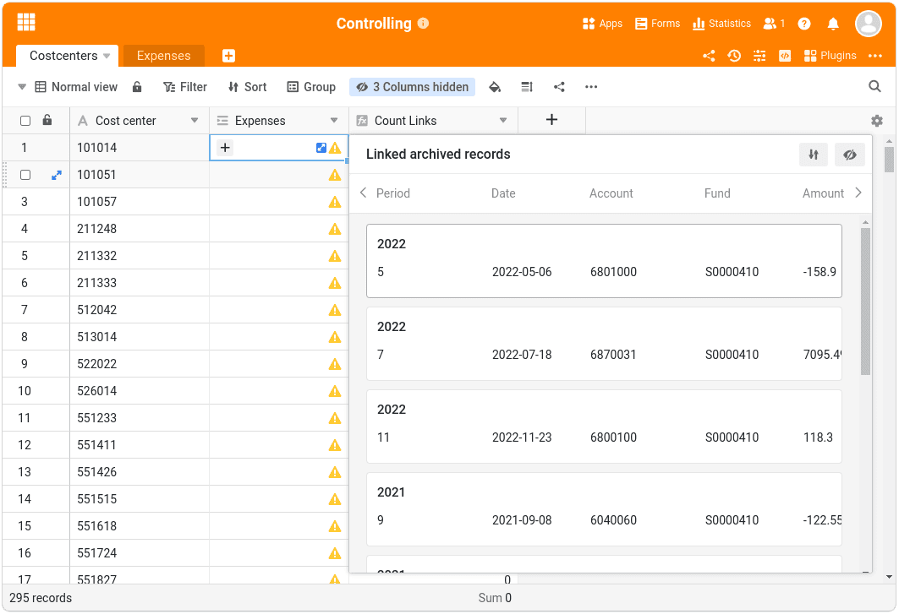

O foco do SeaTable 5.1 está em melhorar as funções existentes e optimizá-las para casos de utilização prática. Em particular, o **App Builder**, que foi oficialmente lançado com a versão 5.0, recebeu atenção especial e agora permite aplicações web ainda mais poderosas. No entanto, os utilizadores do **Big Data Store** também beneficiam de extensas melhorias. O novo **plug-in Árvore** oferece uma opção de visualização adicional para dados hierárquicos. Nas presentes notas de lançamento, apresentamos todas as novas funcionalidades importantes. Como sempre, encontrará a lista completa de alterações no [registo de alterações]().

O SeaTable 5.1 também inclui um pipeline Python atualizado. Dois [pacotes Python](https://developer.seatable.io/scripts/python/common_questions/#list-of-libraries-supported-in-the-cloud-environment) para a edição de ficheiros PDF criam novas possibilidades para a gestão de documentos. Um módulo de conversão Airtable alargado facilita ainda mais a migração de [Airtable Bases para o SeaTable]() no futuro.

Esta manhã, actualizámos o SeaTable Cloud para a versão 5.1. Recomendamos a todos os administradores de sistemas auto-hospedados que façam o mesmo, de modo a beneficiarem das novas funcionalidades e melhorias. [Docker A imagem do SeaTable 5.1 está disponível para download no](https://hub.docker.com/r/seatable/seatable-enterprise) [repositório](https://hub.docker.com/r/seatable/seatable-enterprise) conhecido.

## Mais funções no App Builder

Os nossos programadores reviram as [definições da aplicação]() e tornaram-nas mais claras. Entre outras coisas, foi adicionado um menu separado para a marca da aplicação, no qual se pode selecionar o modo, o esquema de cores e o ícone da aplicação. O assistente 'Adicionar página' também tem um novo esquema de duas páginas.

Páginas de palavras-chave: Com o SeaTable 5.1, todos os tipos de páginas oferecem uma função de pré-visualização para ficheiros de imagem nas [colunas de ficheiros](). (Anteriormente, apenas [as colunas de imagens]() ofereciam essas miniaturas.) Os ficheiros PDF, Office e de texto continuam a ser apresentados com um ícone de ficheiro.

Olhando para os tipos de páginas individuais, a [página individual]() e a [página para registos de dados individuais]() destacam-se com o maior número de melhorias. No entanto, outros tipos de páginas também podem esperar melhorias incrementais.

### Tipo de página Página personalizada

Graças à vasta gama de opções de visualização que este tipo de página oferece para as estatísticas, é particularmente adequado para painéis de controlo. Duas novas opções de gráficos permitem agora uma personalização ainda maior: pode utilizar a **função de pesquisa** para definir os campos que são apresentados quando clica num elemento do gráfico. Se a função estiver desactivada, o diagrama não permite qualquer aprofundamento dos dados subjacentes. O utilizador apenas vê o próprio gráfico. A segunda nova opção está relacionada com os gráficos de colunas, linhas e áreas. Estes oferecem agora a opção de apresentar uma **linha de referência horizontal**. Isto facilita a visualização dos valores-alvo, bem como dos valores de referência ou dos valores mais baixos.

O **elemento contentor** no SeaTable 5.1 é mais flexível do que o seu antecessor e oferece agora uma opção de apresentação adicional. A opção adicional permite-lhe definir um número diferente de linhas por coluna. Isto facilita a conceção de páginas visualmente apelativas.

A versão 5.1 também oferece mais flexibilidade na **ampliação e deslocação de elementos**. A altura e a largura podem agora ser alteradas simultaneamente e os elementos têm em conta a altura dos elementos vizinhos. Se a diferença de altura entre dois elementos for inferior a 5 píxeis, a altura ajusta-se automaticamente à do seu vizinho. Quando se desloca um elemento, já não é necessário criar espaço. Um elemento encolhe-se se o arrastar para um espaço mais estreito do que a sua largura atual. Se arrastar um elemento para a margem esquerda ou direita de outro elemento, este elemento é afastado na outra direção e o elemento arrastado é inserido.

### Tipo de página Registo de dados único

No SeaTable 5.1, este tipo de página - tal como as páginas de tabelas e consultas - suporta a [execução de acções através de botões](). Quer se trate da criação de um documento PDF, da chamada de uma página Web, da alteração de um registo de dados ou da execução de um script, agora também pode iniciar todas estas **acções** através de **botões**. Para tal, não é necessária [autorização de edição para a página](). Desta forma, os administradores de aplicações podem definir as interações do utilizador para este tipo de página para algumas acções predefinidas.

A barra de ferramentas oferece um novo **gerador de código QR**. O código QR contém a ligação para a entrada atualmente apresentada. Anexado a um objeto ou dispositivo, todos os dados podem ser chamados na aplicação através de um tablet ou smartphone sem qualquer introdução de teclado. Isto torna a gestão do inventário, por exemplo, ainda mais fácil.

Este tipo de página também oferece mais opções de design visual no SeaTable 5.1. Se tiver incorporado campos de tabela na página, anteriormente só era possível configurar a formatação do nome do campo. Para todos os tipos de colunas baseadas em texto e números, tem agora também a opção de definir o **tamanho e a espessura do tipo de letra, a cor do tipo de letra e o alinhamento dos valores do campo**.

### Tipo de página Tabela

Na versão 5.0, a funcionalidade de exportação nas [páginas de tabelas]() estava sempre activada. Não havia forma de os administradores de aplicações **impedirem a exportação de uma tabela para um ficheiro XLSX**. No SeaTable 5.1, temos em conta o desejo de um maior controlo. Na nova versão, a função de exportação está desactivada por defeito; pode ser activada através do seletor "Ativar exportação para Excel". Além disso, corrigimos um erro importante que fazia com que os filtros predefinidos não tivessem efeito durante a exportação.

### Tipo de página Linha de tempo

O tipo de página [de linha cronológica]() oferece agora uma **função de agrupamento** para lhe dar mais controlo sobre a forma como os dados são apresentados. Se o agrupamento estiver ativo, as barras também podem ser apresentadas em **raias**. Esta opção de visualização permite uma apresentação compacta e clara, especialmente para actividades que não se sobrepõem.

### Consulta de tipo de página

Agora é possível alterar a **largura da coluna** na tabela de resultados para otimizar a visualização dos registos de dados consultados.

## Grandes Dados

A funcionalidade de grandes volumes de dados não é tão nova como o App Builder. Com base na experiência de projectos de grandes volumes de dados e no valioso feedback dos nossos utilizadores, introduzimos melhorias no SeaTable 5.1 em termos de facilidade de utilização, integração e monitorização.

A nova funcionalidade mais surpreendente é provavelmente **os menus de contexto de colunas alargados** nas [visualizações de megadados](). Estes oferecem agora uma gama de funções semelhante à dos menus de contexto nas visualizações normais. Apenas as funções irrelevantes para os megadados não estão disponíveis.

Quase tão percetível é o **aviso amarelo** que aparece em visualizações normais em colunas de ligação se a tabela ligada contiver linhas no grande armazenamento de dados. O aviso deixa claro que as entradas ligadas no big data store não são visíveis na célula da coluna de ligação. Se pretender exibi-las, clique no ícone para abrir a lista de entradas ligadas.

Em resposta a muitos pedidos dos utilizadores, a **operação de processamento de dados** [comparar e juntar]() está agora também disponível nas visualizações de grandes volumes de dados. Esta operação pode ligar entradas no big data store com linhas em qualquer outra tabela, independentemente de as linhas da tabela ligada estarem armazenadas na base ou no big data store.



Para aumentar a rastreabilidade das alterações às linhas na memória de grandes volumes de dados, o SeaTable 5.1 oferece um **registo de grandes volumes de dados** separado. Este log, que regista as modificações e eliminações de linhas, aparece assim que a memória de grandes volumes de dados é activada na base.

### Interação de grandes volumes de dados, aplicações e plug-in de design de páginas

Apesar de as aplicações poderem aceder aos dados no armazenamento de grandes volumes de dados, as entradas criadas nas aplicações não podiam ser guardadas diretamente aí. As novas entradas eram sempre guardadas na base. Colmatámos esta lacuna funcional com o SeaTable 5.1. A base continua a ser o **local de armazenamento predefinido para novas entradas**; no entanto, esta definição pode ser alterada nas [definições da aplicação](). Como mostra a captura de ecrã, é possível especificar para cada tabela se as novas linhas devem ser escritas na base ou na memória de grandes volumes de dados.

No entanto, não só melhorámos a integração com as aplicações, como também o [plugin de design de páginas]() oferece novas possibilidades. O plugin tem agora acesso ao armazenamento de grandes volumes de dados e pode **criar documentos para linhas no armazenamento de grandes volumes de dados**.

## O novo plugin Árvore

Depois de três novos plugins na [versão 5.0](), a versão 5.1 também expande a lista de plugins SeaTable disponíveis: O novo plugin Árvore permite a visualização tabular compacta de registos de dados ligados por relações. Independentemente de estar a analisar dados financeiros (como na imagem abaixo), dados de projectos, dados de utilização ou outros dados, o novo plugin fornece uma visão geral que não existia anteriormente.

Atualmente, podem ser apresentadas no plugin hierarquias até três níveis, ou seja, dados de três tabelas. As dependências são definidas através de ligações. É possível chamar os detalhes de cada registo de dados individual diretamente no plugin e também adicionar novos registos de dados.

## E muito mais

Mais uma vez, há mais novidades nesta versão do que podemos apresentar numa quantidade manejável nestas notas de lançamento. Portanto, aqui estão mais algumas funcionalidades que achamos que merecem ser mencionadas.

Foi adicionada uma nova função ao **editor de fórmulas**: **rowid()** devolve o ID da linha. Esta função pode ser utilizada, por exemplo, para acções de botões ou automatizações. No entanto, existem novas funcionalidades não só na [coluna de fórmulas](), mas também no tipo de coluna de fórmulas para ligações: [As pesquisas]() oferecem agora uma verificação de duplicados. Se a opção **Não mostrar duplicados** estiver activada, apenas são apresentados valores únicos em cada célula da coluna.

No SeaTable 5.1, melhorámos o realce da sintaxe no **editor Python** integrado para facilitar ainda mais o acompanhamento dos [scripts](). Também corrigimos um erro na indentação automática.

Um novo seletor de cores, que pode ser utilizado para selecionar cores nas estatísticas e em alguns tipos de páginas no App Builder, conduz mais rapidamente à cor pretendida. O seletor é agora mais claro e mostra as últimas cores utilizadas.

E o SeaTable 5.1 também tem algo para os administradores de sistemas: expandimos os registos de início de sessão para **registos de auditoria**. Para além dos registos de início de sessão dos utilizadores, as actividades dos grupos e os acessos aos ficheiros são agora também registados. O registo de grupos torna transparente qual o utilizador que renomeou ou eliminou um grupo e quando foi feita a alteração. O mesmo se aplica às bases de grupos. O registo de acesso a ficheiros regista o acesso a ficheiros do tipo DOC(X), XLS(X), PPT(X), bem como TXT, CSV e MD.
