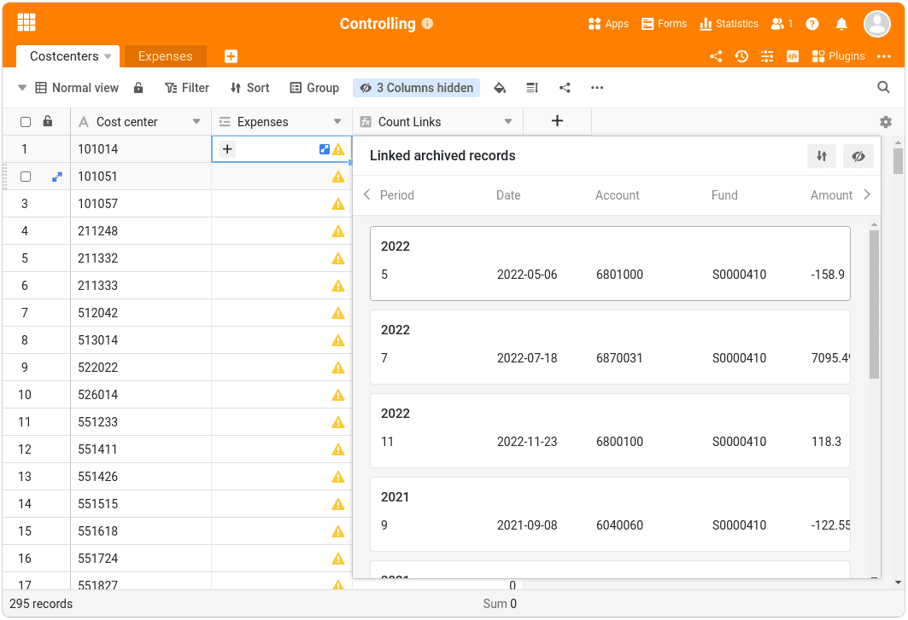
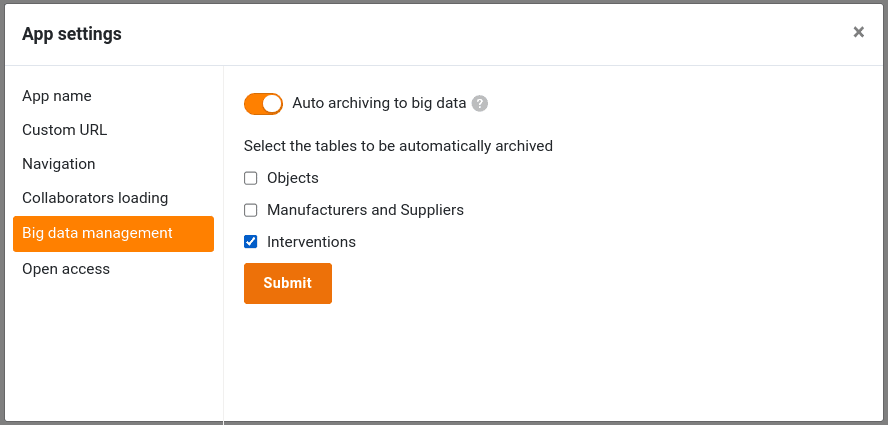
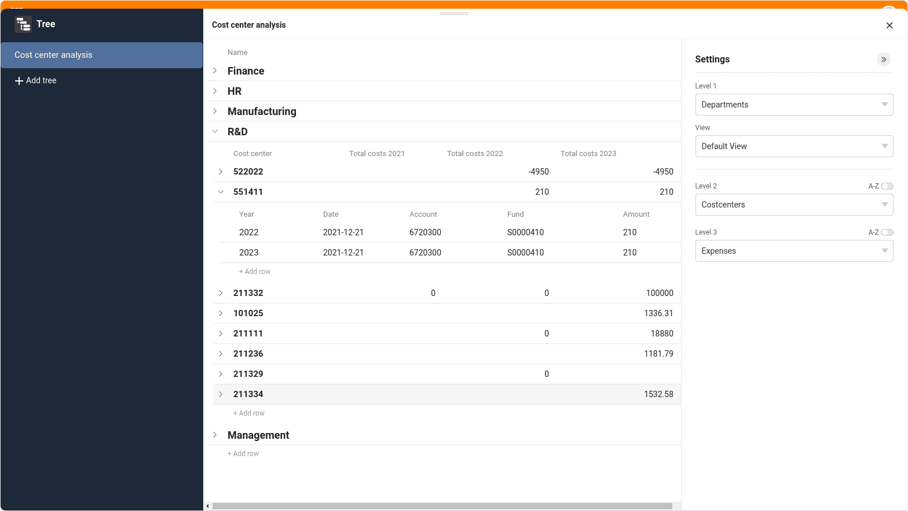
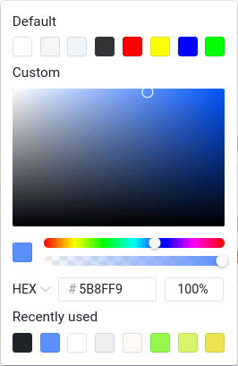

Основное внимание в SeaTable 5.1 уделено улучшению существующих функций и их оптимизации для практического использования. В частности, особое внимание было уделено **App Builder**, который был официально запущен в версии 5.0 и теперь позволяет создавать еще более мощные веб-приложения. Но и пользователи **Big Data Store** также получают значительные улучшения. Новый **плагин Дерево** предлагает дополнительные возможности визуализации иерархических данных. Мы рассказываем обо всех важных новых функциях в этих заметках о выпуске. Как всегда, полный список изменений вы найдете в [журнале изменений](https://seatable.io/ru/docs/changelog/version-5-1/).

SeaTable 5.1 также включает обновленный конвейер Python. Два [пакета Python](https://developer.seatable.io/scripts/python/common_questions/#list-of-libraries-supported-in-the-cloud-environment) для редактирования PDF-файлов создают новые возможности для управления документами. Расширенный модуль конвертера Airtable позволяет в будущем еще проще переносить [базы Airtable в SeaTable](https://seatable.io/ru/docs/import-von-daten/migration-von-airtable-bases-zu-seatable/).

Сегодня утром мы обновили SeaTable Cloud до версии 5.1. Мы рекомендуем всем администраторам самописных систем сделать то же самое, чтобы воспользоваться новыми возможностями и улучшениями. [Docker Образ SeaTable 5.1 доступен для загрузки из известного](https://hub.docker.com/r/seatable/seatable-enterprise) [репозитория](https://hub.docker.com/r/seatable/seatable-enterprise).

## Больше функций в App Builder

Наши разработчики пересмотрели [настройки приложения](https://seatable.io/ru/docs/universelle-apps/einstellungen-einer-universellen-app-aendern/) и сделали их более понятными. Среди прочего, было добавлено отдельное меню для брендирования приложения, в котором можно выбрать режим, цветовую схему и иконку приложения. Мастер "Добавить страницу" также имеет новый, двухстраничный макет.

Страницы с ключевыми словами: В SeaTable 5.1 все типы страниц предлагают функцию предварительного просмотра файлов изображений в [колонках файлов](). (Ранее такие миниатюры предлагались только [в колонках изображений]()). PDF, Office и текстовые файлы по-прежнему отображаются с помощью значка файла.

Если рассматривать отдельные типы страниц, то больше всего улучшений приходится на [индивидуальную страницу](https://seatable.io/ru/docs/seitentypen-in-universellen-apps/individuelle-seiten-in-universellen-apps/) и [страницу для отдельных записей данных](https://seatable.io/ru/docs/seitentypen-in-universellen-apps/seiten-vom-typ-einzelner-datensatz-in-universellen-apps/). Однако другие типы страниц также могут рассчитывать на постепенные улучшения.

### Тип страницы Пользовательская страница

Благодаря широкому спектру возможностей визуализации статистических данных этот тип страницы особенно подходит для приборных панелей. Две новые опции диаграммы теперь позволяют еще больше настраивать ее: вы можете использовать **функцию drill-down** для определения полей, которые отображаются при нажатии на элемент диаграммы. Если функция отключена, диаграмма не позволяет глубже проникнуть в суть данных. Пользователь видит только саму диаграмму. Вторая новая опция относится к столбцовым, линейным и площадным диаграммам. Теперь на них можно отображать **горизонтальную опорную линию**. Это позволяет легко визуализировать целевые значения, а также контрольные или минимальные значения.

**Элемент контейнера** в SeaTable 5.1 стал более гибким, чем его предшественник, и теперь предлагает дополнительный вариант компоновки. Дополнительная опция позволяет задавать различное количество строк на колонку. Это облегчает создание визуально привлекательных страниц.

Версия 5.1 также предлагает большую гибкость при **увеличении и перемещении элементов**. Теперь высоту и ширину можно изменять одновременно, а элементы учитывают высоту соседних элементов. Если разница в высоте между двумя элементами составляет менее 5 пикселей, высота элемента автоматически подстраивается под высоту соседнего элемента. При перемещении элемента больше не нужно самому создавать пространство. Элемент сжимается сам, если перетащить его в промежуток, ширина которого меньше его текущей ширины. Если перетащить элемент к левому или правому краю другого элемента, этот элемент сдвинется в другую сторону, а перетащенный элемент будет вставлен.

### Тип страницы Одиночная запись данных

В SeaTable 5.1 этот тип страницы, как и страницы таблиц и запросов, поддерживает [выполнение действий с помощью кнопок](https://seatable.io/ru/docs/andere-spalten/die-schaltflaeche/). Будь то создание PDF-документа, вызов веб-страницы, изменение записи данных или выполнение сценария - теперь все эти **действия** можно запустить с помощью **кнопок**. [Авторизация редактирования страницы](https://seatable.io/ru/docs/universelle-apps/seitenberechtigungen-in-einer-universellen-app/) для этого не требуется. Таким образом, администраторы приложений могут настроить взаимодействие пользователей с этим типом страницы на несколько предопределенных действий.

Панель инструментов предлагает новый **генератор QR-кодов**. QR-код содержит ссылку на отображаемую в данный момент запись. Прикрепив его к объекту или устройству, все данные можно вызвать в приложении с помощью планшета или смартфона без использования клавиатуры. Это еще больше упрощает, например, управление запасами.

Этот тип страницы также предлагает больше возможностей визуального оформления в SeaTable 5.1. Если на странице есть встроенные поля таблицы, то раньше можно было настроить только форматирование названия поля. Теперь для всех текстовых и числовых типов столбцов можно настроить **размер шрифта, вес шрифта, цвет шрифта и выравнивание значений поля**.

### Тип страницы Таблица

В версии 5.0 функция экспорта на [страницах таблиц](https://seatable.io/ru/docs/seitentypen-in-universellen-apps/tabellenseiten-in-universellen-apps/) была всегда активирована. У администраторов приложений не было возможности **запретить экспорт таблицы в файл XLSX**. В SeaTable 5.1 мы учли желание пользователей иметь больше контроля. В новой версии функция экспорта отключена по умолчанию; ее можно активировать с помощью ползунка "Включить экспорт в Excel". Кроме того, мы исправили важную ошибку, из-за которой заданные фильтры не действовали при экспорте.

### Тип страницы Временная шкала

Тип страницы ["Временная шкала"](https://seatable.io/ru/docs/seitentypen-in-universellen-apps/zeitstrahlseiten-in-universellen-apps/) теперь предлагает **функцию группировки**, чтобы дать вам больше контроля над отображением данных. Если группировка активна, столбцы можно также отображать в виде **плавающих линий**. Этот вариант отображения позволяет добиться компактности и четкости, особенно для непересекающихся действий.

### Запрос типа страницы

Теперь вы можете изменить **ширину столбцов** в таблице результатов, чтобы оптимизировать отображение записей запрашиваемых данных.

## Большие данные

Функциональность больших данных не такая новая, как App Builder. Основываясь на опыте проектов по работе с большими данными и ценных отзывах наших пользователей, мы внесли улучшения в SeaTable 5.1 с точки зрения удобства использования, интеграции и мониторинга.

Наиболее яркой новой функцией, вероятно, являются **расширенные контекстные меню столбцов** в [представлениях больших данных](). Теперь они предлагают такой же набор функций, как и контекстные меню в обычных представлениях. Недоступны только функции, не имеющие отношения к большим данным.

Почти так же заметно **желтое предупреждение**, которое появляется в обычных представлениях в столбцах ссылок, если связанная таблица содержит строки в хранилище больших данных. Это предупреждение дает понять, что связанные записи в хранилище больших данных не видны в ячейке столбца ссылок. Если вы хотите их отобразить, щелкните значок, чтобы открыть список связанных записей.

В ответ на многочисленные запросы пользователей **операция обработки данных** ["сравнить и соединить](https://seatable.io/ru/docs/datenverarbeitung/datenverarbeitung-vergleichen-und-verknuepfen/) " теперь доступна и в представлениях больших данных. Эта операция позволяет связать записи в хранилище больших данных со строками в любой другой таблице, независимо от того, где хранятся строки связанной таблицы - в базе или в хранилище больших данных.



Чтобы повысить степень отслеживания изменений строк в памяти больших данных, SeaTable 5.1 предлагает отдельный **журнал больших данных**. Этот журнал, в котором фиксируются изменения и удаления строк, появляется сразу после активации памяти больших данных в базе.

### Взаимодействие больших данных, приложений и плагина для дизайна страниц

Хотя приложения могут обращаться к данным в хранилище больших данных, записи, созданные в приложениях, не могли быть сохранены там напрямую. Новые записи всегда сохранялись в базе. В SeaTable 5.1 мы устранили этот функциональный пробел. База остается **местом хранения новых записей по умолчанию**, однако этот параметр можно изменить в [настройках приложения](https://seatable.io/ru/docs/universelle-apps/einstellungen-einer-universellen-app-aendern/). Как показано на скриншоте, для каждой таблицы можно указать, куда записывать новые строки - в базу или в память больших данных.

Однако мы не только улучшили интеграцию с приложениями, [плагин дизайна страниц](https://seatable.io/ru/docs/seitendesign-plugin/anleitung-zum-seitendesign-plugin/) также предлагает новые возможности. Теперь плагин имеет доступ к хранилищу больших данных и может **создавать документы для строк в хранилище больших данных**.

## Новый плагин Дерево

После трех новых плагинов в [версии 5.0](), версия 5.1 также расширяет список доступных плагинов SeaTable: новый плагин Дерево позволяет компактно отображать записи данных в виде таблиц, связанных между собой. Независимо от того, анализируете ли вы финансовые данные (как на скриншоте ниже), данные по проектам, данные об использовании или другие данные, новый плагин обеспечивает обзор, которого раньше не существовало.

В настоящее время в плагине можно отображать иерархии до трех уровней, то есть данные из трех таблиц. Зависимости задаются с помощью ссылок. Непосредственно в плагине можно вызывать детали каждой отдельной записи данных, а также добавлять новые записи данных.

## И многое другое

В этой версии снова появилось больше новостей, чем мы можем представить в заметках о выпуске. Поэтому вот еще несколько функций, которые, на наш взгляд, заслуживают упоминания.

В **редактор формул** добавлена новая функция: **rowid()** возвращает идентификатор строки. Его можно использовать, например, для действий с кнопками или автоматики. Однако новые возможности появились не только в [столбце формул](https://seatable.io/ru/docs/formeln/grundlagen-von-seatable-formeln/), но и в типе столбца формул для ссылок: [Поисковые запросы](https://seatable.io/ru/docs/verknuepfungen/die-lookup-funktion/) теперь предлагают проверку дубликатов. Если активирована опция **"Не показывать дубликаты** ", в каждой ячейке столбца будут отображаться только уникальные значения.

В SeaTable 5.1 мы улучшили подсветку синтаксиса во встроенном **редакторе Python**, чтобы вам было еще проще следить за [сценариями](https://seatable.io/ru/docs/javascript-python/anlegen-und-loeschen-eines-skriptes/). Мы также исправили ошибку с автоматическим отступом.

Новая панель выбора цвета, которую можно использовать для выбора цвета в статистике и на некоторых типах страниц в App Builder, позволяет быстрее найти нужный цвет. Теперь выборка стала более наглядной и показывает последние использованные цвета.

В SeaTable 5.1 также есть кое-что для системных администраторов: мы расширили журналы регистрации до **журналов аудита**. Помимо входа пользователей в систему, теперь также регистрируются действия групп и доступ к файлам. Журнал групп делает прозрачным, кто из пользователей переименовал или удалил группу и когда было произведено изменение. То же самое относится и к базам групп. Журнал доступа к файлам регистрирует доступ к файлам типа DOC(X), XLS(X), PPT(X), а также TXT, CSV и MD.
