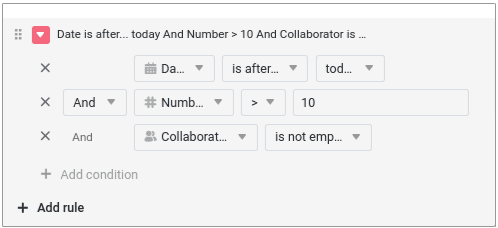

The second minor release of version 5 of SeaTable contains numerous bug fixes and detail improvements to make working with SeaTable even easier and to support your use cases even better: In Bases, the **new filter groups** enable a much more precise selection of data (records). Cross-column filters in conditional rows and cell formatting allow a previously impossible action-oriented highlighting of data. In the **App Builder**, every page type benefits from major and minor improvements of various kinds - extended authorizations, better usability and more functions. SeaTable 5.2 also includes a new **whiteboard plugin** and improvements to the page design and calendar plugins. As always, you can find the complete list of changes in the [changelog](https://seatable.io/en/docs/changelog/version-5/).

This morning at 6 am Central European Time, SeaTable Cloud was updated to version 5.2 and the new plugin was made available. We look forward to your feedback. SeaTable Server Admins can find the Docker image of SeaTable 5.2 in the known [Docker repository](https://hub.docker.com/r/seatable/seatable-enterprise) for download.

## Complex filter rules with filter groups

Version 5.2 makes SeaTable's [filter functions]() even more powerful. The new filter groups allow the **combination of filter rules with the logical operators AND and OR**. Example: Search for men born after 1979 (filter group 1) or women born after 1984 (filter group 2). Such filtering was previously not possible in SeaTable. In previous versions, all filter rules were linked with either logical AND or OR.

In future versions, we will also introduce filter groups in apps, forms and automations.

## Conditional formatting with cross-column filter

Version 5.2 also offers extended filter options in conditional [rows](farbliche-markierung-von-zeilen/) and [cell formatting](einfaerben-von-zellen/). Do you want to color a cell red based on the values in other columns to draw attention to it? With SeaTable 5.2 you can! The color coding of a row or cell can now be formatted depending on each individual column value in a data set. And that's not all: conditional formatting can also take into account values in multiple columns, regardless of the column type.

## Functional improvements in the App Builder

The [single data record](https://seatable.io/en/docs/seitentypen-in-universellen-apps/seiten-vom-typ-einzelner-datensatz-in-universellen-apps/) page type benefits from several improvements, but the form, table and dashboard pages also receive new functions and elements. We have expanded the authorization control for the timeline, calendar and query page types and improved version management and the QR code function in the app settings.

### Page type Single data record

As of SeaTable 5.2, the page settings for this page type include the **Preset read-only columns** function, which is already familiar from other page types. In combination with the [page authorization](https://seatable.io/en/docs/universelle-apps/seitenberechtigungen-in-einer-universellen-app/) "Who can edit rows ?", the app admin can precisely define which column values of a data set can be entered or changed by users and which cannot.

For [locked data records](https://seatable.io/en/docs/arbeiten-mit-zeilen/sperren-einer-zeile/), the user now also receives feedback that editing is not possible. A corresponding message is displayed when you move the mouse pointer over "Edit entry" in the toolbar.

In addition to the authorization control, the new version also contains two improvements to increase user-friendliness: fields of type [URL]() and [e-mail]() are now clickable. This makes calling up a website or writing an e-mail even faster. (Files in file columns become clickable in version 5.3.) You can set the fill mode for image elements on the page. Three modes are available: Fit, Fill and Stretch.

### Page type Form

Simple [web forms]() that can be created in Base offer a **redirect option**. Users are automatically redirected to a website after submission. We have now also added this function to the [form pages](https://seatable.io/en/docs/seitentypen-in-universellen-apps/formularseiten-in-universellen-apps/), taking into account the special features of the app. Users can either be redirected to another app page or to an external URL. The other app pages can be conveniently selected from a drop-down menu. You can also set whether the redirection takes place in a new tab or in the same tab.

### Page type Table

The **preset filters** in the data settings now allow the selection of all relevant column types including [formula]() and [link columns](). This removes an important functional limitation in the pre-filtering of data. With the implementation of filter groups in one of the upcoming versions, this page type will offer the same powerful filter options as the Base.

### Individual pages

The [individual page](https://seatable.io/en/docs/seitentypen-in-universellen-apps/individuelle-seiten-in-universellen-apps/) has a new statistics type: the **simple table** allows - similar to the [table page](https://seatable.io/en/docs/seitentypen-in-universellen-apps/tabellenseiten-in-universellen-apps/) - the tabular display of a data set that has been pre-filtered and pre-sorted by the app admin. Unlike the table page, the new statistics type makes it possible to combine two or more tables on one page. In version 5.2, app users cannot set their own filter and sorting rules. We will add this function in the future.

### Page type Calendar

SeaTable 5.2 delivers an urgently needed function for the [calendar page](https://seatable.io/en/docs/seitentypen-in-universellen-apps/kalenderseiten-in-universellen-apps/): **Adding new entries** directly to pages of this type. For this purpose, we have added the page permission "Who can add rows ?" in the page settings, which is known from other page types. Together with the existing "Who can edit rows ?" permission, the app admin can define exactly which users can change existing entries and create new ones. For existing app pages of the calendar type, the new authorization is set to "Nobody".

### Page type Timeline

This page type also benefits from an extension of the page authorizations. Thanks to the new "Who can edit rows ?" authorization, **direct changes to existing data records** are now also possible on [timeline pages](https://seatable.io/en/docs/seitentypen-in-universellen-apps/zeitstrahlseiten-in-universellen-apps/). If you drag the mouse at the beginning or end of a bar, the date value changes automatically, which extends or shortens the event. In existing apps, the new authorization is assigned to "Nobody".

### Page type query

Previously, interaction with the displayed data on [query pages](https://seatable.io/en/docs/seitentypen-in-universellen-apps/abfrageseiten-in-universellen-apps/) was only possible via buttons. As these could only perform predefined actions, individual changes were not possible. This is now changed by the option **Make query result editable**. If this is activated, the values of the data records contained in the query can be edited via the row details. However, the option has no effect in public apps that are accessed without user login.

## New whiteboard plugin

"New" whiteboard plugin - hasn't the whiteboard plugin been around since [SeaTable 5.0]()? That is correct, but the statement "new whiteboard plugin" is also correct. The new **Whiteboard** plugin **(tldraw)** is in no way inferior to the previous plugin in terms of design options, but also offers optimum **support for online collaboration**. You can work alone, in pairs or in a team on the whiteboard - all changes are updated in real time and are immediately visible to all other users.

You can install the new whiteboard plugin in addition to or as an alternative to the existing whiteboard plugin and use it in Bases. Existing whiteboards are not migrated automatically, but content can be transferred with little effort using copy and paste. We recommend switching to the new whiteboard as soon as possible. The new plugin uses a separate server component, which is provided by the [tldraw project](https://tldraw.dev/) that gives it its name. Self-hosters must install this component. The instructions can be found in the [admin manual](http://admin.seatable.io/installation/components/whiteboard/).

The replacement of the plugin had become necessary because the "old" whiteboard plugin, which is based on the open source project [excalidraw](https://github.com/excalidraw/excalidraw), proved to be prone to malfunctions when used by several users at the same time. With version 6.0 in summer 2025, we will remove the old plugin from SeaTable Cloud. All whiteboards in the old whiteboard plugin will then no longer be available.

## Important changes to the SeaTable API

With the release of version 5.2, we would like to announce an important change to the SeaTable API. This only affects users who use the API to implement their own applications and workflows. These changes have no impact on use in the web interface.

You can find details of the changes in this [forum post](https://forum.seatable.com/t/important-changes-to-api-and-seatable-cloud-with-version-5-2/6317). Here is an overview of the most important points:

- To harmonize the API structure, certain endpoints are marked as obsolete. New endpoints are already available.
- Version 6.0 deactivates the obsolete endpoints.
- We have already converted our integrations for [n8n](https://n8n.io/integrations/seatable/) and [Zapier](https://zapier.com/apps/seatable/integrations) to the new endpoints. The [Make app](https://www.make.com/en/integrations/seatable) will follow shortly.

If you use individual scripts or integrations, please check whether you are using the old endpoints. If so, you must adapt them by SeaTable version 6.0 at the latest.

## And much more

SeaTable 5.2 has other new features that deserve more than an explicit mention:

The ability to **manage hierarchical data in a table** reaches a new level in SeaTable 5.2: Parent and child relationships are recorded and displayed in separate columns. SeaTable ensures that there is a child relationship for every parent relationship. This makes it easy to analyze relationships in both directions. The illustration shows the difference between SeaTable 5.2 (left) and SeaTable 5.1 (right) for the top management of a fictitious organization.

For users, this only brings advantages without additional complexity. If a user creates a new **link column** that links entries in one and the same table, SeaTable automatically creates the second link column. The [organization chart]() and [tree]() plugins can also handle the improved data structure.

Existing links within a table are not adjusted. If you want to change, create a new link column and insert the links. You can then delete the old link column.

With the new version, SeaTable supports **logging into Google and Microsoft email accounts using OAuth**. (Microsoft calls this "modern authentication".) The use of Microsoft e-mail accounts in particular was previously only possible with major restrictions after Microsoft discontinued authentication using a user name and password. In the user manual you will find detailed instructions on how to [integrate]() a Gmail, Outlook.com or MS 365 account in a SeaTable Base as a [third-party account]().

Tables can now be hidden, as is familiar from Microsoft Excel. A **hidden worksheet** is no longer displayed as a tab and can only be accessed via the drop-down menu.

[Checkboxes](https://seatable.io/en/docs/auswahlspalten/anlegen-einer-checkbox-spalte/) offer more style options and even more color options in SeaTable 5.2. If you don't like the green tick, you can now choose from 69 other options.

In the [calendar plugin](), new entries can now also be created by double-clicking or using the new "+" button.

## Two functional changes

[Annotated rows](https://seatable.io/en/docs/arbeiten-mit-zeilen/zeilen-kommentieren/) are marked with speech bubble icons in the Base table view. Previously, the display duration for these icons was seven days. With SeaTable 5.2, this duration will be extended to 180 days. So don't be surprised if your tables have more speech bubbles. All rows with a comment in the last 180 days now have a speech bubble icon. Of course, all comments will continue to be saved in the base after the 180 days have expired.

Curly brackets in table names can provoke conflicts in formulas. For this reason, SeaTable version 5.2 and higher prevents the use of **{** and **}** in table names. Existing table names are not changed.
