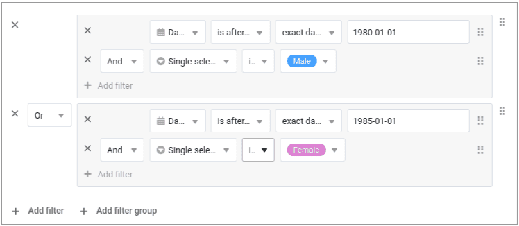
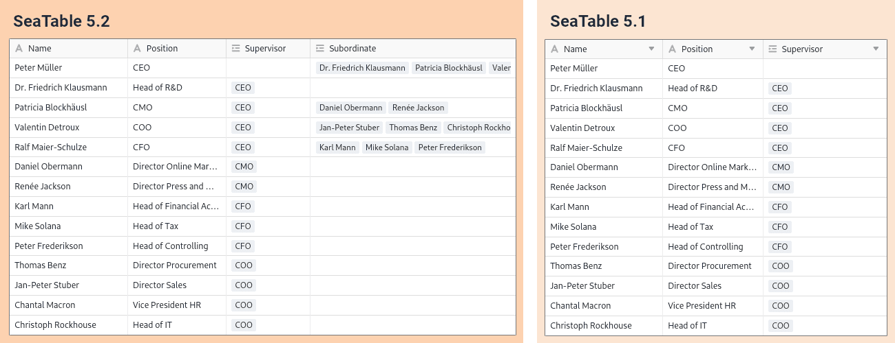

La deuxième version mineure de la version 5 de SeaTable contient de nombreuses corrections de bugs et améliorations de détails afin de rendre le travail avec SeaTable encore plus facile et de soutenir encore mieux vos cas d'application : Dans les bases, les **nouveaux groupes de filtres** permettent une sélection beaucoup plus précise des (ensembles de) données. Les filtres inter-colonnes dans le formatage conditionnel des lignes et des cellules permettent une mise en évidence des données orientée vers l'action, ce qui n'était pas possible auparavant. Dans l'**App Builder**, chaque type de page bénéficie d'améliorations majeures et mineures de différents types - autorisations étendues, meilleure ergonomie et davantage de fonctions. SeaTable 5.2 comprend également un nouveau **plug-in de tableau blanc** et des améliorations aux plug-in de conception de page et de calendrier. Comme toujours, vous trouverez la liste complète des modifications dans le [changelog](/).

Ce matin, à 6 heures, heure d'Europe centrale, SeaTable Cloud a été mis à jour en version 5.2 et le nouveau plugin a été mis à disposition. Nous sommes heureux de recevoir vos commentaires. Les administrateurs du serveur SeaTable trouveront l'image Docker de SeaTable 5.2 à télécharger dans le célèbre [référentielDocker](https://hub.docker.com/r/seatable/seatable-enterprise) .

## Règles de filtrage complexes avec groupes de filtres

La version 5.2 rend [les fonctions de filtrage]() de SeaTables encore plus puissantes. Les nouveaux groupes de filtres permettent de **combiner des règles de filtrage avec les opérateurs logiques ET et OU**. Exemple : on recherche des hommes nés après 1979 (groupe de filtres 1) ou des femmes nées après 1984 (groupe de filtres 2). Un tel filtrage n'était jusqu'à présent pas possible dans SeaTable. Dans les versions précédentes, toutes les règles de filtrage étaient liées soit à l'opérateur logique ET, soit à l'opérateur logique OU.

Dans les prochaines versions, nous introduirons également des groupes de filtres dans les apps, les formulaires et les automatisations.

## Mise en forme conditionnelle avec filtre inter-colonnes

La version 5.2 offre également des possibilités de filtrage étendues dans le [formatage]() conditionnel des [lignes]() et [des cellules](). Vous souhaitez colorer une cellule en rouge sur la base des valeurs des autres colonnes pour attirer l'attention ? C'est possible avec SeaTable 5.2 ! Il est désormais possible de formater le code couleur d'une ligne ou d'une cellule en fonction de chaque valeur de colonne dans un ensemble de données. Et ce n'est pas tout : la mise en forme conditionnelle peut aussi prendre en compte les valeurs de plusieurs colonnes, quel que soit le type de colonne.

## Améliorations fonctionnelles dans l'App Builder

Le type de page [Enregistrement individuel]() bénéficie de plusieurs améliorations, mais les pages Formulaire, Tableau et Tableau de bord reçoivent également de nouvelles fonctions ou éléments. Pour les types de pages Ligne du temps, Calendrier et Requête, nous avons étendu le contrôle des autorisations et amélioré la gestion des versions et la fonction QR Code dans les paramètres de l'application.

### Type de page Enregistrement unique

Dans les paramètres de page de ce type de page, on trouve à partir de SeaTable 5.2 la fonction **Colonnes en lecture seule par défaut**, déjà connue dans d'autres types de pages. En combinaison avec l'[autorisation de page]() "Qui peut modifier les lignes ?", l'administrateur de l'application peut définir précisément quelles valeurs de colonne d'un enregistrement peuvent être saisies ou modifiées par les utilisateurs et lesquelles ne le peuvent pas.

Dans le cas d'[enregistrements bloqués](), l'utilisateur reçoit désormais aussi un message lui indiquant que l'édition n'est pas possible. Un message correspondant s'affiche lorsque le curseur de la souris se déplace sur "Modifier l'entrée" dans la barre d'outils.

Outre le contrôle des autorisations, la nouvelle version contient encore deux améliorations pour augmenter la convivialité : les champs de type [URL]() et [e-mail]() sont désormais cliquables. L'appel d'une page web ou la rédaction d'un e-mail est ainsi encore plus rapide. (Les fichiers dans les colonnes de fichiers deviennent cliquables dans la version 5.3.) Pour les éléments d'image sur la page, vous pouvez régler le mode de remplissage. Trois modes sont à votre disposition : Ajuster, Remplir et Étirer.

### Type de page Formulaire

Les [formulaires web]() simples qui peuvent être créés dans la base offrent une **option de redirection**. Les utilisateurs sont automatiquement redirigés vers une page web après la soumission. Nous avons désormais ajouté cette fonction aux [pages de formulaire](), en tenant compte des spécificités de l'app. Une redirection peut se faire soit vers une autre page de l'app, soit vers une URL externe. Les autres pages de l'app peuvent être facilement sélectionnées dans un menu déroulant. Il est également possible de définir si la redirection s'effectue dans un nouvel onglet ou dans le même onglet.

### Type de page Tableau

Les **filtres prédéfinis** dans les paramètres de données permettent désormais de sélectionner tous les types de colonnes pertinents, y compris [les]() [colonnes]() [de formules]() et [de liens](). Cela supprime une restriction fonctionnelle importante lors du préfiltrage des données. Avec l'implémentation des groupes de filtres dans une prochaine version, ce type de page offrira les mêmes possibilités de filtrage performantes que la Base.

### Pages personnalisées

La [page individuelle]() reçoit un nouveau type de statistiques : le **tableau simple** permet - comme la [page de tableau]() - la représentation sous forme de tableau d'un ensemble de données préfiltrées et prétriées par l'administrateur de l'application. Contrairement à la page de tableau, le nouveau type de statistiques permet de réunir deux ou plusieurs tableaux sur une même page. Dans la version 5.2, les utilisateurs d'apps ne peuvent pas définir eux-mêmes leurs propres règles de filtrage et de tri. Nous ajouterons cette fonction à l'avenir.

### Type de page Calendrier

SeaTable 5.2 fournit une fonction très nécessaire pour les [pages de calendrier](): L'**ajout de nouvelles entrées** directement sur les pages de ce type. Pour cela, nous avons ajouté l'autorisation de page "Qui peut ajouter des lignes ?", bien connue des autres types de pages, dans les paramètres de la page. Avec l'autorisation déjà existante "Qui peut modifier les lignes ?", l'administrateur de l'application peut définir précisément les rôles des utilisateurs autorisés à modifier les entrées existantes et à en créer de nouvelles. Pour les pages d'app existantes de type calendrier, la nouvelle autorisation est réglée sur "Personne".

### Type de page Ligne du temps

Ce type de page bénéficie également d'une extension des autorisations de page. Grâce à la nouvelle autorisation "Qui peut modifier les lignes ?", il est désormais possible de **modifier directement les enregistrements existants** sur les [pages de la barre temporelle](). Si vous faites glisser la souris au début ou à la fin d'une barre, la valeur de la date change automatiquement, ce qui prolonge ou raccourcit l'événement. Dans les applications existantes, la nouvelle autorisation est attribuée à "Personne".

### Type de page Requête

Jusqu'à présent, les [pages d'interrogation]() ne permettaient d'interagir avec les données affichées que par le biais de boutons. Comme ceux-ci ne pouvaient effectuer que des actions prédéfinies, les modifications individuelles étaient exclues. Cela change désormais grâce à l'option **Rendre le résultat de la requête modifiable**. Si elle est activée, les valeurs des enregistrements contenus dans la requête peuvent être modifiées via les détails de la ligne. Toutefois, cette option n'a aucun effet dans les applications publiques auxquelles on accède sans connexion utilisateur.

## Nouveau plugin pour tableau blanc

"Nouveau" plugin pour tableau blanc - le plugin pour tableau blanc n'existe-t-il pas déjà depuis [SeaTable 5.0]()? C'est vrai, mais l'affirmation "nouveau plugin de tableau blanc" est également correcte. Le nouveau plugin **Whiteboard (tldraw)** n'a rien à envier au plugin précédent en termes de possibilités de création, mais il offre en outre un **soutien** optimal **pour la collaboration en ligne**. Vous pouvez travailler seul, à deux ou en équipe sur le tableau blanc - toutes les modifications sont actualisées en temps réel et sont immédiatement visibles par tous les autres utilisateurs.

Le nouveau plug-in Whiteboard peut être installé en complément ou comme alternative au plug-in Whiteboard actuel et utilisé dans les bases. Les tableaux blancs existants ne sont pas automatiquement migrés, mais les contenus peuvent être transférés avec peu d'efforts par copier-coller. Nous recommandons de passer à court terme au nouveau tableau blanc. Le nouveau plugin utilise un composant serveur séparé, fourni par le [projet tldraw](https://tldraw.dev/) qui lui a donné son nom. Les auto-hébergeurs doivent installer ce composant. Les instructions se trouvent dans le [manuel d'administration](http://admin.seatable.io/installation/components/whiteboard/).

Le remplacement du plug-in était devenu nécessaire car l'"ancien" plug-in pour tableau blanc, basé sur le projet open source [excalidraw](https://github.com/excalidraw/excalidraw), s'est avéré sujet à des dysfonctionnements lorsqu'il était utilisé par plusieurs utilisateurs en même temps. Avec la version 6.0 prévue pour l'été 2025, nous supprimerons l'ancien plugin de SeaTable Cloud. Tous les tableaux blancs de l'ancien plugin de tableau blanc ne seront alors plus disponibles.

## Changements importants dans l'API de SeaTable

Avec la sortie de la version 5.2, nous souhaitons annoncer une modification importante de l'API de SeaTable. Cela ne concerne que les utilisateurs qui mettent en œuvre leurs propres applications et flux de travail à l'aide de l'API. Ces modifications n'ont aucune influence sur l'utilisation dans l'interface web.

Dans ce [post de forum](https://forum.seatable.com/t/important-changes-to-api-and-seatable-cloud-with-version-5-2/6317), vous trouverez des détails sur les changements. Voici un aperçu des points les plus importants :

- Afin d'harmoniser la structure de l'API, certains points finaux sont marqués comme obsolètes. De nouveaux points de terminaison sont déjà disponibles.
- Avec la version 6.0, les points de terminaison obsolètes sont désactivés.
- Nous avons déjà adapté nos intégrations pour [n8n](https://n8n.io/integrations/seatable/) et [Zapier](https://zapier.com/apps/seatable/integrations) aux nouveaux points finaux. L'[application Make](https://www.make.com/en/integrations/seatable) suivra prochainement.

Si vous utilisez des scripts individuels ou des intégrations, veuillez vérifier si vous utilisez les anciens points de terminaison. Si c'est le cas, vous devez les adapter au plus tard pour la version 6.0 de SeaTable.

## Et bien plus encore

SeaTable 5.2 a d'autres nouveautés qui méritent d'être plus qu'explicitement mentionnées :

La possibilité de **gérer des données hiérarchiques dans un tableau** atteint un nouveau niveau dans SeaTable 5.2 : les relations parents et enfants sont saisies et représentées dans des colonnes séparées. SeaTable garantit que pour chaque relation parent, il existe également une relation enfant. Ainsi, les relations dans les deux sens peuvent être analysées sans problème. L'illustration montre la différence entre SeaTable 5.2 (à gauche) et SeaTable 5.1 (à droite) pour le top management d'une organisation fictive.

Pour les utilisateurs, cela ne présente que des avantages sans complexité supplémentaire. Si un utilisateur crée une nouvelle **colonne de jointure** qui relie des entrées dans le même tableau, SeaTable crée automatiquement la deuxième colonne de jointure. Les plug-ins [Organigramme]() et [Arbre]() peuvent également gérer la structure de données améliorée.

Pour les liens existants au sein d'un tableau, aucune adaptation n'a lieu. Si vous voulez changer, créez une nouvelle colonne de liens et insérez les liens. Vous pouvez ensuite supprimer l'ancienne colonne de liens.

Avec la nouvelle version, SeaTable prend en charge la **connexion aux comptes de messagerie Google et Microsoft via OAuth**. (Microsoft appelle cela "l'authentification moderne".) L'utilisation des comptes de messagerie Microsoft en particulier n'était jusqu'à présent possible qu'avec de grandes restrictions, depuis que Microsoft avait annoncé l'abandon de l'authentification par nom d'utilisateur et mot de passe. Vous trouverez dans le guide de l'utilisateur des instructions détaillées sur la manière d'[intégrer]() un compte Gmail, Outlook.com ou MS 365 dans une base SeaTable en tant que [compte tiers]().

Il est désormais possible de masquer des tableaux, comme on le fait dans Microsoft Excel. Une **feuille de calcul masquée** n'est plus affichée sous forme d'onglet et ne peut être appelée que via le menu déroulant.

[Les cases à cocher]() offrent plus d'options de style et encore plus d'options de couleur dans SeaTable 5.2. Ceux qui n'aiment pas la coche verte peuvent désormais choisir parmi 69 autres options.

Dans le [plug-in calendrier](), il est désormais possible de créer de nouvelles entrées par double-clic ou via le nouveau bouton "+".

## Deux changements fonctionnels

[Les lignes commentées]() sont signalées par des icônes en forme de bulle dans la vue tableau de la base. Jusqu'à présent, la durée d'affichage de ces icônes était de sept jours. Avec SeaTable 5.2, cette durée est portée à 180 jours. Ne vous étonnez donc pas si vos tableaux présentent davantage de bulles. Toutes les lignes avec un commentaire au cours des 180 derniers jours portent désormais une icône de bulle. Bien entendu, tous les commentaires restent enregistrés dans la base après l'expiration des 180 jours.

Les accolades dans les noms de table peuvent provoquer des conflits dans les formules. C'est pourquoi, à partir de la version 5.2, SeaTable empêche l'utilisation de **{** et **}** dans les noms de table. Les noms de table existants ne sont pas modifiés.
