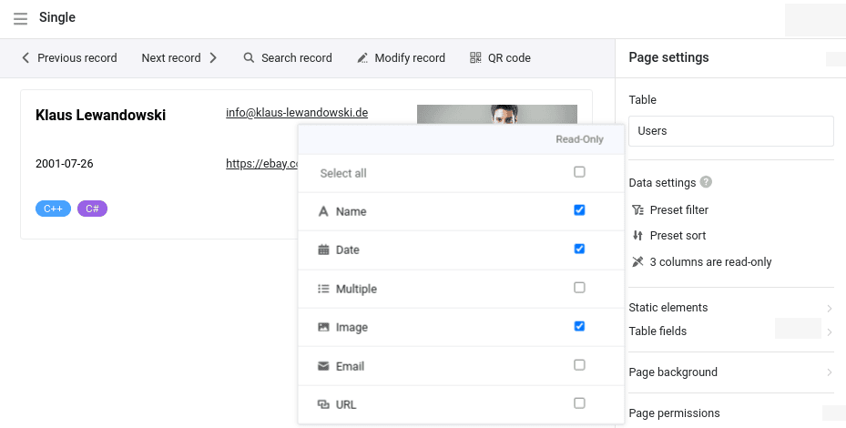

O segundo lançamento menor da versão 5 do SeaTable contém inúmeras correcções de erros e melhorias de pormenor para tornar o trabalho com o SeaTable ainda mais fácil e para apoiar ainda melhor os seus casos de utilização: Nas Bases, os **novos grupos de filtros** permitem uma seleção muito mais precisa dos dados (registos). Os filtros entre colunas na formatação condicional de linhas e células permitem destacar dados de uma forma que anteriormente não era possível. No **App Builder**, cada tipo de página beneficia de melhorias maiores e menores de vários tipos - autorizações alargadas, melhor usabilidade e mais funções. O SeaTable 5.2 também inclui um novo **plug-in de quadro branco** e melhorias nos plug-ins de design de página e de calendário. Como sempre, pode encontrar a lista completa de alterações no [registo de alterações](/).

Esta manhã, às 6h00, hora da Europa Central, o SeaTable Cloud foi atualizado para a versão 5.2 e o novo plug-in foi disponibilizado. Aguardamos com expetativa os vossos comentários. Os administradores do SeaTable Server podem descarregar a imagem Docker do SeaTable 5.2 a partir do conhecido [repositórioDocker](https://hub.docker.com/r/seatable/seatable-enterprise) .

## Regras de filtragem complexas com grupos de filtros

A versão 5.2 torna as [funções de filtragem]() do SeaTable ainda mais poderosas. Os novos grupos de filtros permitem a **combinação de regras de filtragem com os operadores lógicos E e OU**. Exemplo: Procurar homens nascidos depois de 1979 (grupo de filtros 1) ou mulheres nascidas depois de 1984 (grupo de filtros 2). Este tipo de filtragem não era possível anteriormente no SeaTable. Nas versões anteriores, todas as regras de filtragem eram associadas aos operadores lógicos AND ou OR.

Em versões futuras, introduziremos também grupos de filtros em aplicações, formulários e automatizações.

## Formatação condicional com filtro entre colunas

A versão 5.2 também oferece opções de filtro alargadas na [formatação]() condicional de [linhas]() e [células](). Quer colorir uma célula de vermelho com base nos valores de outras colunas para chamar a atenção para ela? Com o SeaTable 5.2 é possível! O código de cores de uma linha ou célula pode agora ser formatado em função do valor de cada coluna individual num conjunto de dados. E não é tudo: a formatação condicional também pode ter em conta os valores em várias colunas, independentemente do tipo de coluna.

## Melhorias funcionais no App Builder

O tipo de página de [registo de dados único]() beneficia de várias melhorias, mas as páginas de formulário, tabela e painel também recebem novas funções e elementos. Expandimos o controlo de autorização para os tipos de página de linha cronológica, calendário e consulta e melhorámos a gestão de versões e a função de código QR nas definições da aplicação.

### Tipo de página Registo de dados único

A partir do SeaTable 5.2, as definições de página para este tipo de página incluem a função **Colunas só de leitura por defeito**, que já é conhecida de outros tipos de página. Em combinação com a [autorização de página]() "Quem pode editar linhas?", o administrador da aplicação pode definir com precisão que valores de coluna de um registo de dados podem ser introduzidos ou alterados pelos utilizadores e quais não podem.

Para os [registos de dados bloqueados](), o utilizador recebe agora também um feedback de que a edição não é possível. É apresentada uma mensagem correspondente quando se move o ponteiro do rato sobre "Editar entrada" na barra de ferramentas.

Para além do controlo de autorização, a nova versão contém também duas melhorias para aumentar a facilidade de utilização: os campos do tipo [URL]() e [e-mail]() são agora clicáveis. Isto torna ainda mais rápido aceder a um sítio Web ou escrever uma mensagem de correio eletrónico. (Os ficheiros nas colunas de ficheiros tornam-se clicáveis na versão 5.3.) Pode definir o modo de preenchimento dos elementos de imagem na página. Estão disponíveis três modos: Personalizar, Preencher e Esticar.

### Tipo de página Formulário

[Os formulários Web]() simples que podem ser criados no Base oferecem uma **opção de redireccionamento**. Os utilizadores são automaticamente redireccionados para um sítio Web após a submissão. Agora também adicionámos esta função às [páginas de formulários](), tendo em conta as caraterísticas especiais da aplicação. Os utilizadores podem ser redireccionados para outra página da aplicação ou para um URL externo. As outras páginas da aplicação podem ser convenientemente selecionadas a partir de um menu pendente. Também é possível definir se o redireccionamento ocorre num novo separador ou no mesmo separador.

### Tipo de página Tabela

**Os filtros predefinidos** nas definições de dados permitem agora a seleção de todos os tipos de colunas relevantes, incluindo [colunas]() [de fórmula]() e [de ligação](). Isto elimina uma importante restrição funcional na pré-filtragem de dados. Com a implementação de grupos de filtros numa das próximas versões, este tipo de página oferecerá as mesmas opções de filtro poderosas que a base.

### Páginas personalizadas

A [página individual]() foi dotada de um novo tipo de estatísticas: semelhante à [página de tabela](), a **tabela simples** permite a apresentação tabular de um conjunto de dados que foi pré-filtrado e pré-classificado pelo administrador da aplicação. Ao contrário da página de tabela, o novo tipo de estatísticas permite combinar duas ou mais tabelas numa página. Na versão 5.2, os utilizadores da aplicação não podem definir as suas próprias regras de filtragem e ordenação. Iremos adicionar esta função no futuro.

### Tipo de página Calendário

O SeaTable 5.2 fornece uma função urgentemente necessária para a [página de calendário](): **Adicionar novas entradas** diretamente às páginas deste tipo. Para este efeito, adicionámos a autorização de página "Quem pode adicionar linhas?" nas definições da página, que é familiar de outros tipos de página. Juntamente com a autorização existente "Quem pode editar linhas?", o administrador da aplicação pode definir exatamente quais os utilizadores que podem alterar as entradas existentes e criar novas entradas. Para páginas de aplicações existentes do tipo calendário, a nova autorização é definida como "Ninguém".

### Tipo de página Linha de tempo

Este tipo de página também beneficia de uma extensão das autorizações de página. Graças à nova autorização "Quem pode editar linhas?", **as alterações diretas aos registos de dados existentes** são agora também possíveis nas [páginas de cronologia](). Se arrastar o rato no início ou no fim de uma barra, o valor da data muda automaticamente, o que prolonga ou encurta o evento. Nas aplicações existentes, a nova autorização é atribuída a "Ninguém".

### Consulta de tipo de página

Anteriormente, a interação com os dados apresentados nas [páginas de consulta]() só era possível através de botões. Como estes só podiam executar acções predefinidas, não era possível efetuar alterações individuais. Esta situação é agora alterada pela opção **Tornar o resultado da consulta editável**. Se esta opção estiver activada, os valores dos registos de dados contidos na consulta podem ser editados através dos detalhes da linha. No entanto, a opção não tem efeito nas aplicações públicas que são acedidas sem o início de sessão do utilizador.

## Novo plugin de quadro branco

"Novo" plug-in do quadro branco - o plug-in do quadro branco não existe desde o [SeaTable 5.0]()? Isso está correto, mas a afirmação "novo plug-in de quadro branco" também está correta. O novo plug-in **do quadro branco (tldraw)** não é de modo algum inferior ao plug-in anterior em termos de opções de design, mas também oferece um **suporte** ótimo **para a colaboração em linha**. Pode trabalhar sozinho, em pares ou em equipa no quadro branco - todas as alterações são actualizadas em tempo real e ficam imediatamente visíveis para todos os outros utilizadores.

Pode instalar o novo plugin de quadro branco em complemento ou como alternativa ao plugin de quadro branco existente e utilizá-lo no Bases. Os quadros brancos existentes não são migrados automaticamente, mas o conteúdo pode ser transferido com pouco esforço usando copiar e colar. Recomendamos a mudança para o novo quadro branco o mais rapidamente possível. O novo plugin usa um componente de servidor separado que é fornecido pelo [projeto](https://tldraw.dev/) homónimo [tldraw](https://tldraw.dev/). Os auto-hospedadores têm de instalar este componente. As instruções podem ser encontradas no [manual de administração](http://admin.seatable.io/installation/components/whiteboard/).

A substituição do plugin tornou-se necessária porque o "antigo" plugin do quadro branco, que se baseia no projeto de código aberto [excalidraw](https://github.com/excalidraw/excalidraw), revelou-se propenso a falhas de funcionamento quando utilizado por vários utilizadores ao mesmo tempo. Com a versão 6.0 no verão de 2025, iremos remover o antigo plugin do SeaTable Cloud. Todos os quadros brancos do antigo plugin de quadros brancos deixarão de estar disponíveis.

## Alterações importantes na API do SeaTable

Com o lançamento da versão 5.2, gostaríamos de anunciar uma alteração importante na API do SeaTable. Esta alteração afecta apenas os utilizadores que utilizam a API para implementar as suas próprias aplicações e fluxos de trabalho. Estas alterações não têm qualquer impacto na utilização da interface Web.

Pode encontrar pormenores sobre as alterações nesta [publicação do fórum](https://forum.seatable.com/t/important-changes-to-api-and-seatable-cloud-with-version-5-2/6317). Eis um resumo dos pontos mais importantes:

- Para harmonizar a estrutura da API, alguns pontos finais estão marcados como obsoletos. Já estão disponíveis novos endpoints.
- A versão 6.0 desactiva os pontos finais obsoletos.
- Já convertemos as nossas integrações para [n8n](https://n8n.io/integrations/seatable/) e [Zapier](https://zapier.com/apps/seatable/integrations) para os novos pontos finais. A [aplicação Make](https://www.make.com/en/integrations/seatable) seguir-se-á em breve.

Se utilizar scripts ou integrações personalizados, verifique se está a utilizar os pontos finais antigos. Em caso afirmativo, tem de os adaptar à versão 6.0 do SeaTable, o mais tardar.

## E muito mais

O SeaTable 5.2 tem outras novas funcionalidades que merecem mais do que uma menção explícita:

A capacidade de **gerir dados hierárquicos numa tabela** atinge um novo nível no SeaTable 5.2: As relações entre pais e filhos são registadas e apresentadas em colunas separadas. O SeaTable assegura que cada relação pai tem também uma relação filho. Isto facilita a análise das relações em ambas as direcções. A ilustração mostra a diferença entre o SeaTable 5.2 (esquerda) e o SeaTable 5.1 (direita) para a gestão de topo de uma organização fictícia.

Para os utilizadores, isto só traz vantagens sem complexidade adicional. Se um utilizador criar uma nova **coluna de ligação** que ligue entradas de uma mesma tabela, o SeaTable cria automaticamente a segunda coluna de ligação. Os plugins [do organigrama]() e [da árvore]() também podem lidar com a estrutura de dados melhorada.

As ligações existentes numa tabela não são ajustadas. Se pretender alterar, crie uma nova coluna de ligações e insira as ligações. De seguida, pode eliminar a coluna de ligações antiga.

A nova versão do SeaTable suporta o **início** de **sessão em contas de correio eletrónico do Google e da Microsoft utilizando o OAuth**. (A Microsoft chama-lhe "autenticação moderna".) A utilização de contas de e-mail da Microsoft, em particular, só era possível anteriormente com grandes restrições, depois de a Microsoft ter descontinuado a autenticação utilizando um nome de utilizador e uma palavra-passe. No manual do utilizador, encontrará instruções detalhadas sobre como [integrar]() uma conta Gmail, Outlook.com ou MS 365 num SeaTable Base como uma [conta de terceiros]().

As tabelas podem agora ser ocultadas, como é familiar no Microsoft Excel. Uma **folha de cálculo oculta** já não é apresentada como um separador e só pode ser acedida através do menu pendente.

[As caixas de verificação]() oferecem mais opções de estilo e ainda mais opções de cor no SeaTable 5.2. Se não gostar da marca verde, pode agora escolher entre 69 outras opções.

No [plugin do calendário](), agora também é possível criar novas entradas fazendo duplo clique ou utilizando o novo botão "+".

## Duas alterações funcionais

[As linhas anotadas]() são identificadas com ícones de balão de diálogo na vista de tabela Base. Anteriormente, estes ícones eram apresentados durante sete dias. Com o SeaTable 5.2, esta duração será alargada para 180 dias. Por isso, não se surpreenda se as suas tabelas tiverem mais balões de diálogo. Todas as linhas com um comentário nos últimos 180 dias têm agora um ícone de balão de diálogo. Naturalmente, todos os comentários continuarão a ser guardados na base após os 180 dias terem expirado.

Os parênteses rectos nos nomes das tabelas podem provocar conflitos nas fórmulas. Por este motivo, a versão 5.2 e superior do SeaTable impede a utilização de **{** e **}** nos nomes das tabelas. Os nomes de tabelas existentes não são alterados.
