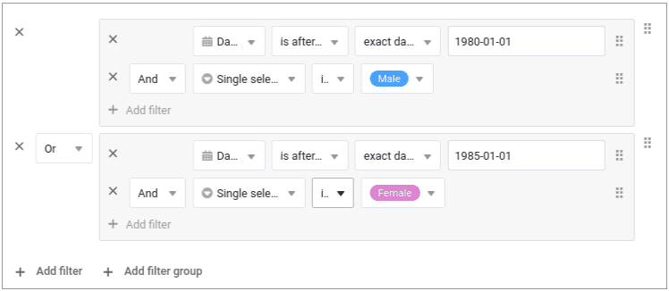
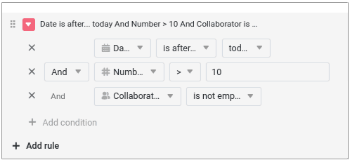
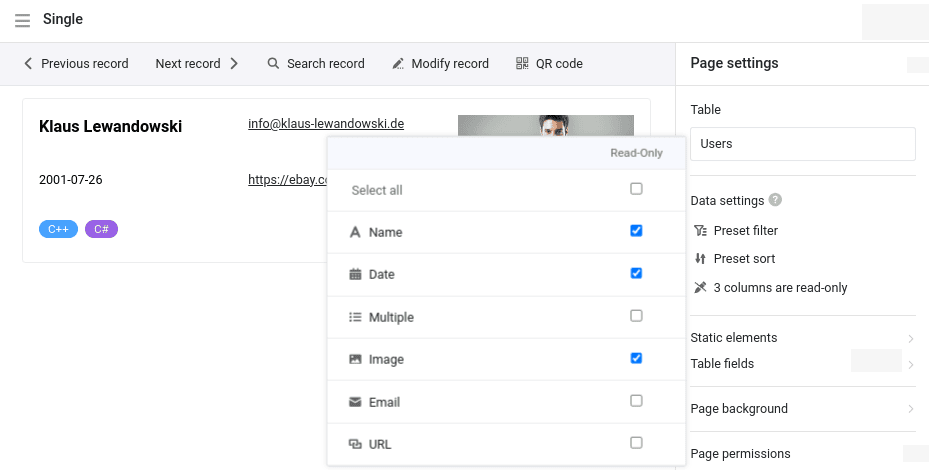
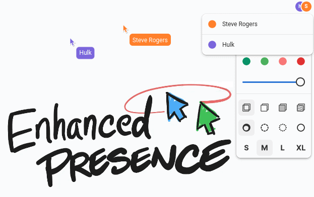
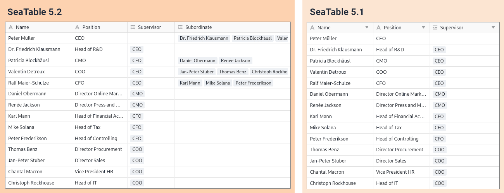

Второй минорный релиз пятой версии SeaTable содержит многочисленные исправления ошибок и детальные улучшения, чтобы сделать работу с SeaTable еще проще и еще лучше поддерживать ваши сценарии использования: В Базах **новые группы фильтров** позволяют гораздо точнее выбирать данные (записи). Перекрестные фильтры столбцов в условном форматировании строк и ячеек позволяют выделять данные таким образом, который ранее был невозможен. В **App Builder** каждый тип страницы получает значительные и незначительные улучшения различного рода - расширенные полномочия, лучшее удобство использования и больше функций. SeaTable 5.2 также включает в себя новый **плагин для белой доски** и улучшения в плагинах для дизайна страниц и календаря. Как всегда, полный список изменений вы можете найти в [журнале изменений](/).

Сегодня в 6 утра по центрально-европейскому времени SeaTable Cloud был обновлен до версии 5.2 и стал доступен новый плагин. Мы с нетерпением ждем ваших отзывов. Администраторы сервера SeaTable могут загрузить Docker SeaTable 5.2 из известного [репозиторияDocker](https://hub.docker.com/r/seatable/seatable-enterprise) .

## Сложные правила фильтрации с группами фильтров

В версии 5.2 [функции фильтрации]() SeaTable стали еще более мощными. Новые группы фильтров позволяют **комбинировать правила фильтрации с логическими операторами AND и OR**. Пример: поиск мужчин, родившихся после 1979 года (группа фильтров 1), или женщин, родившихся после 1984 года (группа фильтров 2). Ранее такая фильтрация была невозможна в SeaTable. В предыдущих версиях все правила фильтрации были связаны либо логическим оператором AND, либо OR.

В будущих версиях мы также введем группы фильтров в приложениях, формах и автоматизациях.

## Условное форматирование с фильтром по столбцам

Версия 5.2 также предлагает расширенные возможности фильтрации при условном [форматировании]() [строк]() и [ячеек](). Хотите окрасить ячейку в красный цвет на основе значений в других столбцах, чтобы привлечь к ней внимание? В SeaTable 5.2 это возможно! Теперь цветовое кодирование строки или ячейки может быть отформатировано в зависимости от каждого отдельного значения столбца в наборе данных. И это еще не все: условное форматирование также может учитывать значения в нескольких столбцах, независимо от типа столбца.

## Функциональные улучшения в App Builder

Тип страницы с [одной записью данных]() получил ряд улучшений, а страницы с формами, таблицами и приборными панелями - новые функции и элементы. Мы расширили контроль авторизации для типов страниц "Временная шкала", "Календарь" и "Запрос", а также улучшили управление версиями и функцию QR-кода в настройках приложения.

### Тип страницы Одиночная запись данных

Начиная с SeaTable 5.2, в настройках страниц этого типа появилась функция **"Колонки по умолчанию только для чтения"**, которая уже знакома по другим типам страниц. В сочетании с [авторизацией страницы]() "Кто может редактировать строки?" администратор приложения может точно определить, какие значения столбцов набора данных могут вводиться или изменяться пользователями, а какие - нет.

Для [заблокированных записей данных]() пользователь теперь также получает сообщение о невозможности редактирования. Соответствующее сообщение отображается при наведении указателя мыши на "Редактировать запись" на панели инструментов.

Помимо контроля авторизации, новая версия содержит два улучшения, повышающих удобство работы: поля типа [URL]() и [e-mail]() теперь кликабельны. Благодаря этому вызов веб-сайта или написание электронного письма стало еще быстрее. (Файлы в колонках файлов стали кликабельными в версии 5.3.) Вы можете установить режим заливки для элементов изображения на странице. Доступны три режима: Настроить, Залить и Растянуть.

### Тип страницы Форма

Простые [веб-формы](), которые можно создать в Base, предлагают **возможность перенаправления**. После отправки формы пользователи автоматически перенаправляются на веб-сайт. Теперь мы добавили эту функцию и на [страницы форм](), учитывая особенности приложения. Пользователи могут быть перенаправлены либо на другую страницу приложения, либо на внешний URL. Другие страницы приложения можно удобно выбрать из выпадающего меню. Вы также можете установить, будет ли перенаправление происходить в новой вкладке или в той же вкладке.

### Тип страницы Таблица

**Предустановленные фильтры** в настройках данных теперь позволяют выбирать все соответствующие типы столбцов, включая [столбцы]() [с формулами]() и [ссылками](). Это устраняет важное функциональное ограничение в предварительной фильтрации данных. С внедрением групп фильтров в одной из следующих версий этот тип страницы будет предлагать такие же мощные возможности фильтрации, как и базовый.

### Индивидуальные страницы

[Индивидуальная страница]() получила новый тип статистики: подобно [странице таблицы](), **простая таблица** позволяет отображать в табличном виде набор данных, предварительно отфильтрованных и отсортированных администратором приложения. В отличие от страницы таблицы, новый тип статистики позволяет объединить две или более таблиц на одной странице. В версии 5.2 пользователи приложения не могут устанавливать собственные правила фильтрации и сортировки. Мы добавим эту функцию в будущем.

### Тип страницы Календарь

В SeaTable 5.2 появилась крайне необходимая функция для [страницы календаря](): **Добавление новых записей** непосредственно на страницы этого типа. Для этого мы добавили в настройки страницы авторизацию "Кто может добавлять строки?", которая знакома по другим типам страниц. Вместе с существующей авторизацией "Кто может редактировать строки?" администратор приложения может определить, кто именно из пользователей может изменять существующие и создавать новые записи. Для существующих страниц приложения типа "Календарь" новая авторизация устанавливается на "Никто".

### Тип страницы Временная шкала

Этот тип страницы также выиграл от расширения полномочий страницы. Благодаря новой авторизации "Кто может редактировать строки?" **прямые изменения существующих записей данных** теперь возможны и на [страницах временной шкалы](). Если перетащить мышь в начало или конец строки, значение даты автоматически изменится, что удлинит или сократит событие. В существующих приложениях новые полномочия назначаются "Никто".

### Запрос типа страницы

Ранее взаимодействие с отображаемыми данными на [страницах запросов]() было возможно только с помощью кнопок. Поскольку они могли выполнять только предопределенные действия, индивидуальные изменения были невозможны. Теперь ситуация изменилась благодаря опции **"Сделать результат запроса редактируемым**". Если она активирована, значения записей данных, содержащихся в запросе, можно редактировать через сведения о строке. Однако эта опция не действует в общедоступных приложениях, доступ к которым осуществляется без входа пользователя.

## Новый плагин для белых досок

"Новый" плагин для белой доски - разве плагин для белой доски не существует со времен [SeaTable 5.0]()? Это верно, но утверждение "новый плагин для белой доски" также верно. Новый плагин для **белой доски (tldraw)** ни в чем не уступает предыдущему плагину в плане возможностей оформления, но при этом предлагает оптимальную **поддержку совместной работы в режиме онлайн**. Вы можете работать на доске в одиночку, в паре или в команде - все изменения обновляются в режиме реального времени и сразу видны всем остальным пользователям.

Вы можете установить новый плагин для досок в дополнение или в качестве альтернативы существующему плагину для досок и использовать его в Bases. Существующие доски не переносятся автоматически, но содержимое можно перенести без особых усилий, используя копирование и вставку. Мы рекомендуем перейти на новую доску как можно скорее. Новый плагин использует отдельный серверный компонент, который предоставляется одноименным [проектом tldraw](https://tldraw.dev/). Автохостеры должны установить этот компонент. Инструкции можно найти в [руководстве администратора](http://admin.seatable.com/installation/components/whiteboard/).

Замена плагина была необходима, поскольку "старый" плагин для белых досок, основанный на проекте с открытым исходным кодом [excalidraw](https://github.com/excalidraw/excalidraw), оказался подвержен сбоям при одновременном использовании несколькими пользователями. В версии 6.0, которая выйдет летом 2025 года, мы удалим старый плагин из SeaTable Cloud. Все доски в старом плагине больше не будут доступны.

## Важные изменения в API SeaTable

С выходом версии 5.2 мы хотели бы объявить о важном изменении в API SeaTable. Это касается только тех пользователей, которые используют API для реализации собственных приложений и рабочих процессов. Эти изменения не влияют на использование веб-интерфейса.

Подробности изменений вы можете найти в этом [сообщении на форуме](https://forum.seatable.com/t/important-changes-to-api-and-seatable-cloud-with-version-5-2/6317). Здесь представлен обзор наиболее важных моментов:

- Для гармонизации структуры API некоторые конечные точки помечены как устаревшие. Новые конечные точки уже доступны.
- Версия 6.0 деактивирует устаревшие конечные точки.
- Мы уже перевели наши интеграции для [n8n](https://n8n.io/integrations/seatable/) и [Zapier](https://zapier.com/apps/seatable/integrations) на новые конечные точки. [Приложение Make](https://www.make.com/en/integrations/seatable) будет переведено в ближайшее время.

Если вы используете кастомизированные скрипты или интеграции, проверьте, не используете ли вы старые конечные точки. Если да, то вы должны адаптировать их не позднее версии 6.0 SeaTable.

## И многое другое

В SeaTable 5.2 есть и другие новые возможности, которые заслуживают отдельного упоминания:

Возможность **управления иерархическими данными в таблице** выходит на новый уровень в SeaTable 5.2: родительские и дочерние отношения записываются и отображаются в отдельных столбцах. SeaTable гарантирует, что каждое родительское отношение также имеет дочернее отношение. Это позволяет легко анализировать отношения в обоих направлениях. На иллюстрации показана разница между SeaTable 5.2 (слева) и SeaTable 5.1 (справа) для высшего руководства вымышленной организации.

Для пользователей это дает только преимущества без дополнительных сложностей. Если пользователь создает новый **столбец ссылок**, который связывает записи в одной и той же таблице, SeaTable автоматически создает второй столбец ссылок. Плагины [организационной диаграммы]() и [дерева]() также могут работать с улучшенной структурой данных.

Существующие ссылки в таблице не корректируются. Если вы хотите внести изменения, создайте новый столбец ссылок и вставьте ссылки. Затем можно удалить старый столбец ссылок.

Новая версия SeaTable поддерживает **вход в учетные записи электронной почты Google и Microsoft с помощью OAuth**. (Microsoft называет это "современной аутентификацией".) Использование учетных записей электронной почты Microsoft, в частности, ранее было возможно только с большими ограничениями после того, как Microsoft отказалась от аутентификации с использованием имени пользователя и пароля. В руководстве пользователя вы найдете подробные инструкции о том, как [интегрировать]() учетную запись Gmail, Outlook.com или MS 365 в SeaTable Base в качестве [сторонней учетной записи]().

Таблицы теперь можно скрывать, как это знакомо по Microsoft Excel. **Скрытый рабочий лист** больше не отображается в виде вкладки и доступен только через выпадающее меню.

В SeaTable 5.2 у [флажков]() появилось больше вариантов стиля и еще больше вариантов цвета. Если вам не нравится зеленая галочка, теперь вы можете выбрать один из 69 других вариантов.

В [плагине календаря]() новые записи теперь можно создавать двойным щелчком мыши или с помощью новой кнопки "+".

## Два функциональных изменения

[Аннотированные строки]() помечены значками речевых пузырьков в представлении таблицы Base. Ранее эти значки отображались в течение семи дней. В SeaTable 5.2 этот срок будет увеличен до 180 дней. Поэтому не удивляйтесь, если в ваших таблицах появится больше речевых пузырьков. Все строки с комментариями за последние 180 дней теперь имеют значок речевого пузыря. Разумеется, все комментарии будут сохраняться в базе и после истечения 180 дней.

Фигурные скобки в именах таблиц могут вызывать конфликты в формулах. По этой причине SeaTable версии 5.2 и выше не допускает использования **{** и **}** в именах таблиц. Существующие имена таблиц не изменяются.
