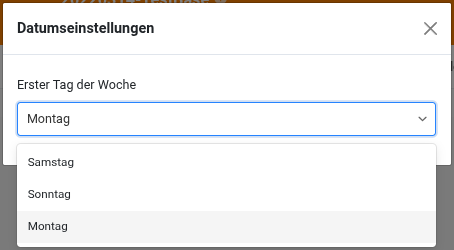
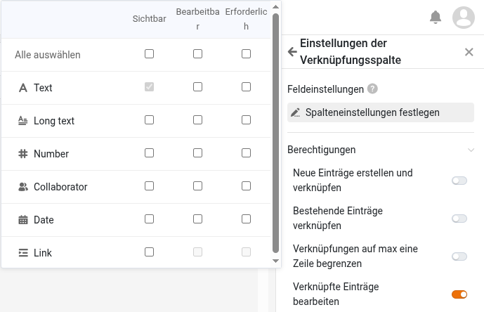
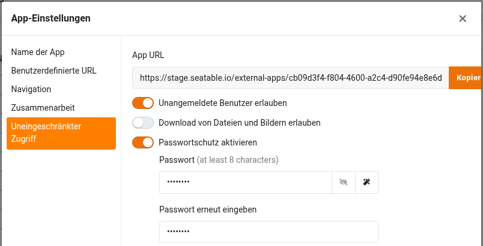
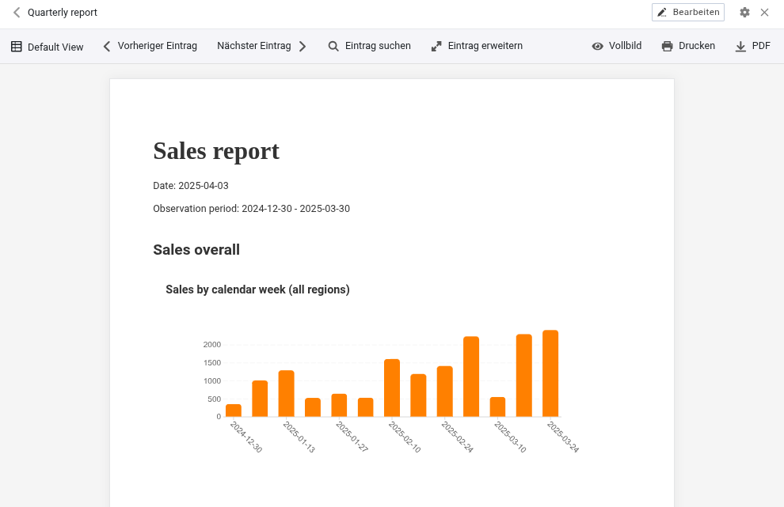

In Version 5.3, dem letzten Minor Release vor der für Sommer 2026 geplanten Version 6.0, stehen Verbesserungen der zentralen Komponenten im Vordergrund. Base Editor, App Builder, Webformulare, Automationen und Plugins erhalten neue Funktionen und bestehende Funktionen werden optimiert. Die wichtigste Änderung: Version 5.3 macht den ersten Tag der Woche konfigurierbar. Die meisten Neuigkeiten finden sich, wie auch schon bei den letzten Releases, im App Builder. Tabellenseiten erlauben eine variable Zeilenhöhe und die Anpassung der fixierten Spalten. Seiten vom Typ einzelner Datensatz bieten eine bessere Integration von Verknüpfungs- und Dateispalten. Formularseiten erlauben die Erstellung mehrstufiger Links. Öffentliche Apps lassen sich mit einem Passwort vor unbefugtem Zugriff schützen und der Download von Dateien kann deaktiviert werden. In Webformularen können Felder mit Werten vorbelegt und – und das ist neu – ausgeblendet werden. Und ein neues Plugin gibt es auch.

Auch im für Benutzer unsichtbaren Bereich hat sich einiges getan: React wurde auf die Version 18 aktualisiert. Außerdem wurde die Systemkonfiguration vereinfacht und flexibilisiert. Jede SeaTable Komponente verfügt mit SeaTable 5.3 über eine eigene Konfigurationsdatei und Konfigurationsoptionen mittels Umgebungsvariablen wurden ausgebaut. Dies schafft Transparenz und ermöglicht ein einfacheres, skalierbareres Deployment.

Im [Changelog]() finden Sie – wie immer – die vollständige Liste der Änderungen. Seit heute Morgen läuft SeaTable Cloud auf der neuen Version. Das Docker Image für SeaTable 5.3 steht im bekannten [Docker Repository](https://hub.docker.com/r/seatable/seatable-enterprise) zum Download zur Verfügung.

Insbesondere für Benutzer von SeaTable Cloud, aber auch von SeaTable Server und SeaTable Dedicated, bringt der Versionswechsel Änderungen an der API mit sich. Der Artikel [Umstellung auf das SeaTable API-Gateway: Was sich mit Version 5.3 ändert]() enthält Details und Hintergründe. All denjenigen, die SeaTables API mittels Python-Skripten, Integrationsplattformen oder eigenen Entwicklungen nutzen, ist die Lektüre dringend empfohlen.

## Bessere Lokalisierung: konfigurierbarer 1. Tag der Woche

Andere Länder, andere Sitten: Je nach Weltregion wird Samstag, Sonntag oder Montag als der erste Tag der Woche betrachtet. Diesen regionalen Gegebenheiten kann man ab sofort in SeaTable Rechnung tragen. In den neuen Datumseinstellungen lässt sich der 1. Wochentag für jede Base individuell einstellen.

Den Nutzungsgewohnheiten in Europa, Australien und großen Teilen von Afrika und Asien sowie dem ISO Standard 8601 folgend, nutzt SeaTable standardmäßig Montag als ersten Tag der Woche. (Bisher war Sonntag einheitlich der 1. Tag der Woche.) Eine Anpassung in den Datumseinstellungen führt dazu, dass im Kalendersteuerelement der gewählte Tag in die erste Spalte rückt. Dies gilt für die Base wie für alle darauf basierenden Apps. Im Kalender-Plugin sowie auf der Kalenderseite in der App kann der Wochentag weiterhin individuell und unabhängig von der Einstellung in der Base konfiguriert werden.

## Mehr Flexibilität beim App Builder

Feature Requests für den App Builder werden nicht knapp. Wir freuen uns, einige davon in SeaTable 5.3 umzusetzen. Weitere werden in den kommenden Versionen folgen.

SeaTable 5.3 flexibilisiert die Kommentarfunktion. Bisher wurden Kommentare in Base und App separat gespeichert und auch nur in Base oder App angezeigt. So waren Kommentare, die in der Base gemacht wurden, nicht in der App sichtbar – und anders herum. SeaTable 5.3 hebt diese Separierung auf. Neu werden in der Base alle Kommentare angezeigt. In der App besteht Wahlfreiheit: Anzeige aller Kommentare oder nur der in der App gemachten Kommentare. Standard ist die Anzeige der App-Kommentare; das Laden aller Kommentare kann in den App-Einstellungen aktiviert werden. Darüber hinaus wird mit dem Update eine weitere Beschränkung der Kommentarfunktion aufgehoben: Die Kommentarspalte ist in SeaTable 5.3 nicht mehr nur auf Tabellenseiten, sondern auch auf Galerie-, Kanban-, Kalender- und Zeitstrahlseiten zu finden.

Eine weitere Änderung, die alle Seitentypen betrifft, ist die Anpassung der Standardseitenberechtigungen. Neue Seiten gewähren allen Benutzern alle verfügbaren Rechte. Sollen Benutzer reduzierte Rechte haben, ist die Anpassung der Seitenberechtigungen notwendig. Mit dieser Änderung wird die Berechtigungsverwaltung in App und Base harmonisiert. (Auf bestehenden Seiten werden durch das Update keine Änderungen an den Berechtigungen vorgenommen.)

### Seitentyp Tabelle

Mit SeaTable 5.3 setzen wir einen vielfach geäußerten Wunsch für diesen Seitentyp um: Die Zeilenhöhe lässt sich – wie schon aus dem Base Editor bekannt – in vier Stufen einstellen. Die einfache Zeilenhöhe erlaubt eine kompakte Darstellung. Mehr Raum für die Präsentation von formatiertem Text und Bildern bieten die anderen Optionen. Und auch bei den fixierten Spalten zeigt sich SeaTable 5.3 von der flexiblen Seite. Die Spaltenfixierung in der App wird mit der neuen Version unabhängig von der Base. (Bisher war die Spaltensperrung in der Base maßgeblich für alle darauf basierenden Apps.)

Auf den ersten Blick werden auch Änderungen in den Seiteneinstellungen sichtbar. Zahlreiche Einstellungen wurden in einen neuen Abschnitt "Weitere Einstellungen" verschoben, der standardmäßig zusammengeklappt ist. Mit den ebenfalls von nun an standardmäßig minimierten Seitenberechtigungen wirken die Einstellungen aufgeräumter und übersichtlicher.

Bei genauerer Betrachtung zeigen sich in den Seiteneinstellungen neben den optischen, auch funktionale Änderungen. Die "Einstellungen der Verknüpfungsspalte" wurden überarbeitet, um Platz zu machen für die neue Berechtigung "Verknüpfte Einträge bearbeiten". Ist die Berechtigung erteilt, haben die App-Benutzer Schreibrechte für die Einträge in der verknüpften Tabelle. Welche Spalten der verknüpften Einträge bearbeitbar sind, lässt sich in den ebenfalls neu gestalteten Feldeinstellungen konfigurieren. Ist die Berechtigung nicht aktiviert, kann der Benutzer nur die bestehendenden Verknüpfungen ansehen sowie neue Verknüfungen hinzufügen und bestehende entfernen, nicht aber die verknüpften Datensätze ändern.

### Seitentyp Einzelner Datensatz

Bei Datei- und Verknüpfungsspalten blieb dieser Seitentyp bisher deutlich hinter seinen Möglichkeiten zurück. Diese Defizite beseitigt das neue Release.

Die Icons einer eingefügten Dateispalte sind in SeaTable 5.3 nicht nur hübsch anzuschauen, sondern auch funktional. Ein Klick auf ein Datei-Icon öffnet die Datei in einem geeigneten Viewer in einem neuen Tab. Auch Office-Dokumente können, sofern – wie bei SeaTable Cloud und SeaTable Dedicated – ein Online Office Editor konfiguriert ist, direkt im Browser geöffnet und bearbeitet werden.

Auch Verknüpfungsspalten profitieren von einem Funktionalitätsboost! Die mit dem auf der Seite dargestellten Datensatz verknüpften Einträge lassen sich in einer Tabelle übersichtlich darstellen. Über deren Einstellungen lassen sich Spalten ausblenden, so dass nur die wesentlichen Informationen der verknüpften Einträge angezeigt werden.

### Seitentyp Formular

Bei der Neuanlage von Einträgen über eine Formularseite lassen sich nun zweistufige, tabellenübergreifende Verknüpfungen anlegen. Konkret: Über ein Formular können Sie nun nicht nur in einer verknüpften Tabelle neue Einträge anlegen, sondern die neu angelegten Einträge können Sie auch gleich mit bestehenden Einträgen in einer dritten Tabelle verknüpfen – zum Beispiel Auftragspositionen in einer verknüpften Tabelle mit Produkten in einer dritten Tabelle. Um von der neuen Funktion zu profitieren, muss einerseits die Berechtigung "Neue Einträge erstellen und verknüpfen" aktiviert und andererseits die relevante Verknüpfungsspalte den sichtbaren Spalten in den Feldeinstellungen hinzugefügt werden.

### Seitentyp Abfrage

In SeaTable 5.2 wurden die Ergebnisse auf der Abfrageseite bearbeitbar gemacht. In SeaTable 5.3 wird diese Berechtigung optimiert. Wie auch auf anderen Seitentypen können einzelne Spalten über die Funktion "Voreingestellt schreibgeschützte Spalten" in den Dateneinstellungen von der Bearbeitung ausgenommen werden.

### Öffentliche Apps

Die Aktivierung des unbeschränkten Zugriffs macht eine SeaTable App zu einer öffentlichen Anwendung. Jeder kann über die App-URL (lesend) auf die App zugreifen; eine Benutzeranmeldung ist nicht nötig und einen weiteren Zugriffsschutz gab es nicht. Zumindest nicht bis heute. SeaTable 5.3 erweitert den unbeschränkten Zugriff um einen optionalen Passwortschutz. Wenn aktiviert, kann die App erst nach Eingabe des App-Passworts genutzt werden. Der unbeschränkte, passwortgeschützte Zugriff ist damit eine interessante Option für Vereine oder Arbeitsgruppen, die Daten mit geringem Schutzniveau mit einer großen Personenanzahl teilen, aber einen uneingeschränkten, öffentlichen Zugriff vermeiden wollen.

## Neues Plugin Berichtsdesign (beta)

Sie wünschen sich, dass Sie mit SeaTable Berichte erstellen können, deren Tabellen, Diagramme und Bilder sich dynamisch mit Daten aus SeaTable befüllen? Traum erfüllt! Wir stellen vor: Das Plugin Berichtsdesign. Das neue Plugin ermöglicht die Erstellung von vielseitigen Dokumenten mit diversen graphischen Auswertungen, deren Inhalte bei der Dokumentenerstellung dynamisch erzeugt werden.

Das neue Berichtsdesign-Plugin und das bestehende Seitendesign-Plugin ähneln sich in einigen Aspekten. Beide erstellen PDF-Dokumente auf Basis von Dokumentenvorlagen, die statische und dynamische Elemente beinhalten. Das Berichtsdesign-Plugin ist aber nicht einfach ein verbessertes Seitendesign-Plugin. Beide Plugins haben aufgrund ihrer individuellen Eigenschaften ihre Berechtigung und Anwendungsfälle.

Beim Seitendesign-Plugin werden Elemente pixelgenau auf der Vorlage positioniert, ihre Maße definiert und einer Ebene zugeordnet. Im Grunde genommen nutzt man es wie ein Grafikprogramm: Mit dem Design der Vorlage wird präzise das Aussehen des erzeugten Dokuments definiert. Das Berichtsdesign-Plugin erinnert in der Nutzung an Word oder Google Docs. Text und andere Elemente werden fortlaufend untereinander gesetzt. Das Plugin kümmert sich bei der Dokumentenerzeugung um das Layout der Seite inkl. Zeilen- und Seitenumbrüchen. Elemente mit variabler Länge wie z. B. Tabellen können dabei leicht berücksichtigt werden.

Das Berichtsdesign-Plugin unterstützt eine große Anzahl dynamischer Elemente: Einzelne Werte eines Datensatzes, ganze Datensätze, Tabellen und auch diverse Diagrammtypen können in einer Dokumentenvorlage verwendet werden. Bei der Gestaltung von Text gibt es die von Textverarbeitungsprogrammen bekannten Formatierungsoptionen wie Aufzählungen, Textausrichtung und Mehrspaltigkeit – und auch Formatvorlagen für die Gliederung des Dokuments sind verfügbar. Bei der Gestaltung einzelner Elemente ist jedoch das Seitendesign-Plugin mit mehr Optionen ausgestattet. Für jedes einzelne Element lassen sich Text- und Hintergrundfarbe, Rahmen und andere Formatierungsoptionen festlegen. Durch die Verwendung von Ebenen können Elemente gestapelt und Überlagerungseffekte erzeugt werden.

Das Berichtsdesign-Plugin ist aktuell noch im Betastadium. Wir freuen uns über Feedback. Mit der Version 6.0 soll das Plugin offiziell eingeführt werden.
