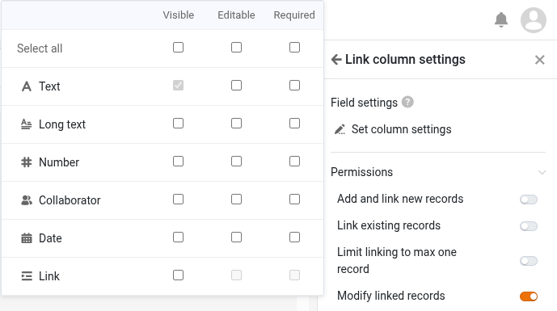

In version 5.3, the last minor release before the planned version 6.0 in summer 2026, the focus is on improvements to the core components. Base Editor, App Builder, web forms, automations, and plugins receive new features and optimizations to existing ones. The most important change: version 5.3 makes the first day of the week configurable. As with previous releases, most of the new features are found in the App Builder. Table pages now allow variable row heights and adjustment of fixed columns. Single record pages offer better integration for link and file columns. Form pages now allow the creation of multi-step links. Public apps can be protected with a password to prevent unauthorized access, and file downloads can be disabled. In web forms, fields can be pre-filled and – new in this version – hidden. There is also a new plugin.

There have also been significant changes behind the scenes: React has been updated to version 18. System configuration has been simplified and made more flexible. Each SeaTable component now has its own configuration file, and configuration options using environment variables have been expanded. This increases transparency and enables easier, more scalable deployment.

In the [Changelog](), you will – as always – find the complete list of changes. Since this morning, SeaTable Cloud has been running on the new version. The Docker image for SeaTable 5.3 is available for download in the familiar [Docker Repository](https://hub.docker.com/r/seatable/seatable-enterprise).

Especially for users of SeaTable Cloud, but also for SeaTable Server and SeaTable Dedicated, this version brings changes to the API. The article [Switch to the SeaTable API Gateway: What changes with version 5.3]() contains details and background. Anyone using SeaTable’s API via Python scripts, integration platforms, or custom developments is strongly encouraged to read it.

## Better localization: configurable first day of the week

Different countries, different customs: depending on the region, Saturday, Sunday, or Monday is considered the first day of the week. SeaTable now accommodates these regional differences. In the new date settings, the first day of the week can be set individually for each base.

Following usage habits in Europe, Australia, large parts of Africa and Asia, and the ISO 8601 standard, SeaTable uses Monday as the first day of the week. (Previously, Sunday was always the first day.) Adjusting this in the date settings moves the selected day to the first column in the calendar control. This applies to the base and all apps built on it. In the calendar plugin and the calendar page in the app, the weekday can still be set individually and independently from the base setting.

## More flexibility in the App Builder

Feature requests for the App Builder are plentiful. We are pleased to implement some of them in SeaTable 5.3, with more to come in future versions.

SeaTable 5.3 makes the comment function more flexible. Previously, comments in the base and app were stored separately and only displayed in their respective places. Comments made in the base were not visible in the app and vice versa. SeaTable 5.3 removes this separation. Now, all comments are displayed in the base. In the app, you can choose to display all comments or only those made in the app. By default, only app comments are shown; loading all comments can be enabled in the app settings. Additionally, another restriction is lifted: the comment column is now available not only on table pages but also on gallery, kanban, calendar, and timeline pages.

Another change affecting all page types is the adjustment of default page permissions. New pages grant all users all available rights. If users should have reduced rights, page permissions must be adjusted. This change harmonizes permission management in app and base. (Existing pages are not affected by this update.)...

### Table page type

With SeaTable 5.3, we fulfill a frequently requested feature for this page type: row height can now be set in four levels, as already known from the Base Editor. The simple row height allows a compact display, while other options provide more space for formatted text and images. Fixed columns are now also more flexible. Column locking in the app is now independent from the base. (Previously, column locking in the base applied to all related apps.)

At first glance, changes in page settings are also visible. Many settings have been moved to a new "More settings" section, which is collapsed by default. With page permissions also minimized by default, settings appear tidier and clearer.

Upon closer inspection, there are also functional changes in the page settings. The "Link column settings" have been revised to make room for the new "Edit linked entries" permission. If granted, app users have write access to entries in the linked table. Which columns of the linked entries are editable can be configured in the newly designed field settings. If the permission is not enabled, users can only view existing links and add or remove links, but not modify the linked records.

### Single record page type

For file and link columns, this page type previously lagged behind its potential. The new release addresses these shortcomings.

Icons in a file column are now not only visually appealing but also functional. Clicking on a file icon opens the file in a suitable viewer in a new tab. Office documents can also be opened and edited directly in the browser, provided an online office editor is configured (as with SeaTable Cloud and SeaTable Dedicated).

Link columns also benefit from a functionality boost! Entries linked to the displayed record can be clearly shown in a table. Columns can be hidden in the settings so that only the essential information of the linked entries is displayed.

### Form page type

When creating new entries via a form page, it is now possible to create two-step, cross-table links. Specifically: you can now use a form to not only create new entries in a linked table, but also immediately link these new entries to existing entries in a third table. For example, order items in a linked table can be linked to products in a third table. To use this new feature, the "Create and link new entries" permission must be enabled, and the relevant link column must be added to the visible columns in the field settings.

### Query page type

In SeaTable 5.2, results on the query page became editable. In SeaTable 5.3, this permission is optimized. As with other page types, individual columns can be excluded from editing via the "Preset read-only columns" function in the data settings.

### Public apps

Enabling unrestricted access makes a SeaTable app a public application. Anyone can access the app via the app URL (read-only); no user login is required and there is no further access protection. At least, not until now. SeaTable 5.3 adds optional password protection to unrestricted access. When enabled, the app can only be used after entering the app password. Unrestricted, password-protected access is an interesting option for clubs or working groups that want to share low-sensitivity data with a large number of people but avoid unrestricted public access.... 

## New report design plugin (beta)

Do you wish you could create reports in SeaTable where tables, charts, and images are dynamically filled with data? Wish granted! Introducing: the report design plugin. This new plugin enables the creation of versatile documents with various graphical evaluations, whose content is dynamically generated during document creation.

The new report design plugin and the existing page design plugin are similar in some aspects. Both create PDF documents based on templates containing static and dynamic elements. However, the report design plugin is not just an improved page design plugin. Both plugins have their own unique features and use cases.

With the page design plugin, elements are positioned pixel-perfectly on the template, their dimensions defined, and assigned to a layer. Essentially, you use it like a graphics program: the template design precisely defines the appearance of the generated document. The report design plugin is reminiscent of Word or Google Docs. Text and other elements are placed continuously one after another. The plugin handles the page layout, including line and page breaks, during document creation. Elements with variable length, such as tables, are easily accommodated.

The report design plugin supports a wide range of dynamic elements: individual record values, entire records, tables, and various types of charts can be used in a document template. For text formatting, you have options known from word processors, such as bullet points, text alignment, and multi-column layouts. Document outline styles are also available. However, for designing individual elements, the page design plugin offers more options. For each element, you can set text and background color, borders, and other formatting options. Using layers, elements can be stacked and overlapping effects created.

The report design plugin is currently still in beta. We welcome feedback. The plugin should be officially released with version 6.0.
